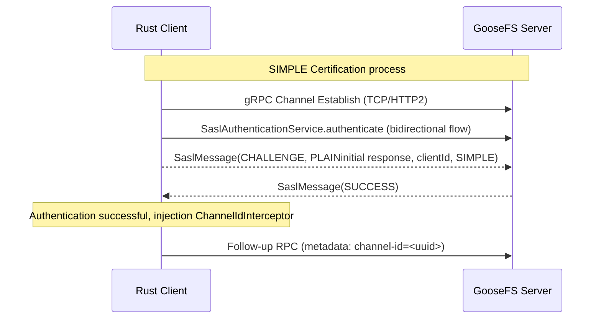

# GooseFS gRPC Integration Implementation Plan

> **Technical route**:Lance ObjectStore → OpenDAL → GooseFS Rust Client (gRPC) → GooseFS gRPC Service  
> **Version**: 0.2.0 | **date**: 2026-04-24

---

## Table of contents

1. [Program overview](#1-Program overview)
2. [overall architecture](#2-overall architecture)
3. [GooseFS gRPC Protocol Technical Reference](#3-goosefs-grpc-protocol-technical-reference)
4. [WriteType Complete Support Design](#4-writetype-complete-support-design)
5. [Detailed implementation design](#5-Detailed implementation design)
6. [ObjectStore operate → gRPC call mapping](#6-objectstore-operate--grpc-call mapping)
7. [Code change list and workload](#7-Code change list and workload)
8. [Configuration and usage guide](#8-Configuration and usage guide)
9. [test plan](#9-test plan)
10. [Performance optimization and risks](#10-Performance optimization and risks)
11. [OpenDAL GooseFS Service Implementation Plan](#11-opendal-goosefs-service-implementation-plan)
12. [Lance GooseFS Provider Detailed Design](#12-lance-goosefs-provider-detailed-designphase-2c)
13. [Authentication Support Design](#13-authentication-support-design)
14. [Write Pipeline Refactoring: Aligning with Java GooseFSFileOutStream](#14-write-pipeline-reconstruction-alignment-java-goosefsfileoutstream)
15. [Multi-Master Address Support Implementation Plan](#15-many-master-address-support-implementation-plan)
16. [file reading stream,FileSystem abstraction layer and FileSystemContext](#16-file reading streamfilesystem-abstraction layer and-filesystemcontext)

---

## 1. Program overview

### 1.1 background

- **Lance**: for ML/AI columnar data format, via pluggable `ObjectStoreProvider` Supports multiple storage backends
- **GooseFS**:Tencent is based on Alluxio Distributed cache file system, currently (2.1.0)**Not included Proxy module**, only supports gRPC / S3 API / FUSE Three ways to access
- **OpenDAL**:Apache Unified data access layer, existing `services-alluxio` based on REST API but `read: false` Not available

### 1.2 Core idea

exist OpenDAL Added in `services-goosefs` service, through independent **GooseFS Rust gRPC Client** Direct docking GooseFS Master/Worker of gRPC interface.

**Key advantages**:
- not dependent on Proxy: Go directly gRPC,solve GooseFS none Proxy module problem
- gRPC Binary transfer, performance better than REST API
- conform to PR #5740 Standard mode (OpenDAL + OpendalStore),and COS provider Consistent architecture
- GooseFS Rust Client as independent crate Can be reused and contributed back Apache OpenDAL Community

---

## 2. overall architecture

### 2.1 complete link

```
Lance ObjectStore API
        │
        ▼
Lance ObjectStoreProvider (GooseFsStoreProvider)            ← Hierarchy 1:Lance Provider(~150 OK)
        │
        ▼
OpenDAL GooseFS Service (services-goosefs)                 ← Hierarchy 2:OpenDAL Service(impl Access)
        │  impl opendal::Access trait
        ▼
GooseFS Rust Client (gRPC)                                 ← Hierarchy 3:independent crate:goosefs-sdk
        │  tonic gRPC (protobuf)
        ▼
GooseFS gRPC Service
├── Master:9200                                            → metadata + manage
│   ├── FileSystemMasterClientServiceHandler               → ★ File system metadata (core)
│   ├── WorkerManagerMasterClientServiceHandler             → Worker manage/capacity/Current limiting
│   ├── MetaMasterClientServiceHandler                      → Cluster meta information/backup
│   ├── MetricsMasterClientServiceHandler                   → Monitoring indicators
│   ├── JournalMasterClientServiceHandler                   → Journal Raft manage
│   ├── TableMasterClientServiceHandler                     → sheet/Lance Namespace
│   ├── JobMasterClientServiceHandler                       → Distributed task management
│   └── ServiceVersionClientServiceHandler                  → Service version negotiation
├── Worker:9203                                            → Data reading and writing
│   └── BlockWorkerImpl                                     → ★ Block Streaming reading and writing (core)
│       ├── readBlock / writeBlock                          → Two-way streaming
│       ├── openLocalBlock / createLocalBlock               → short circuit read and write
│       └── asyncCache / syncCache / removeBlock / ...       → Management operations
        │
        ▼
UFS (COS / S3 / HDFS)
```

### 2.2 Three-tier architecture

```
┌─────────────────────────────────────────────────────────────────────┐
│ Hierarchy 1: Lance Provider(Lightweight adaptation layer,~150 OK)                         │
│   GooseFsStoreProvider                                              │
│   - accept goosefs:// URL                                             │
│   - Build OpenDAL Operator → OpendalStore → Lance ObjectStore         │
├─────────────────────────────────────────────────────────────────────┤
│ Hierarchy 2: OpenDAL GooseFS Service(impl Access trait)                 │
│   opendal/services-goosefs/                                         │
│   - GooseFsBackend: impl Access (read/write/stat/delete/list/rename)│
│   - GooseFsReader / GooseFsWriter / GooseFsLister                   │
├─────────────────────────────────────────────────────────────────────┤
│ Hierarchy 3: GooseFS Rust Client (gRPC)(independent crate)                     │
│   goosefs-sdk/                                                │
│   - FileSystem trait + BaseFileSystem — High-level file system abstraction             │
│   - FileSystemContext — Three-layer shared connection architecture                             │
│   - GooseFsFileInStream — Dual-path addressable file input stream                     │
│   - GooseFsFileWriter / GooseFsFileReader — End-to-end read and write pipeline           │
│   - MasterClient / WorkerClient / BlockMapper / WorkerRouter         │
│   - GooseFsConfig — 30+ Configuration items (properties/YAML/Hot loading)             │
│   - Proto definition: GooseFS gRPC protobuf (tonic-build)                  │
└─────────────────────────────────────────────────────────────────────┘
```

### 2.3 with existing `services-alluxio` contrast

| Contrast Dimensions | `services-alluxio` (existing) | `services-goosefs` (New) |
|----------|--------------------------|---------------------------|
| transport protocol | HTTP REST API | gRPC (tonic/protobuf) |
| Read support | ❌ Not supported | ✅ Streaming read + range read |
| Dependent components | Alluxio Proxy | GooseFS Master + Worker(No need Proxy) |
| GooseFS compatible | ❌ need Proxy | ✅ Direct docking |
| performance | lower (HTTP overhead) | higher (gRPC binary transfer) |

---

## 3. GooseFS gRPC Protocol Technical Reference

> based on GooseFS In-depth source code analysis and disassembly `goosefs-sdk` need to be realized **6 core modules**.

### 3.1 GooseFS gRPC Service entrance overview

GooseFS share **8 indivual gRPC ServiceHandler**(7 indivual Master end + 1 indivual Worker end), registered on different ports:

#### Master end(port 9200)

| # | Handler kind | Inherited from (gRPC ImplBase) | Register module | Main responsibilities | Lance need? |
|---|-----------|----------------------|---------|---------|------------|
| 1 | **`FileSystemMasterClientServiceHandler`** | `FileSystemMasterClientServiceGrpc.ImplBase` | `DefaultFileSystemMaster` | file system CRUD, mount,ACL,Namespace | **★ core** |
| 2 | **`WorkerManagerMasterClientServiceHandler`** | `WorkerManagerMasterClientServiceGrpc.ImplBase` | `DefaultWorkerManagerMaster` | Worker list/capacity/Current limiting/manage | **★ need**(Worker Discover) |
| 3 | `MetaMasterClientServiceHandler` | `MetaMasterClientServiceGrpc.ImplBase` | `DefaultMetaMaster` | Cluster meta information, backup/recover,checkpoint | Optional |
| 4 | `MetricsMasterClientServiceHandler` | `MetricsMasterClientServiceGrpc.ImplBase` | `DefaultMetricsMaster` | Indicator reporting/Query | Optional |
| 5 | `JournalMasterClientServiceHandler` | `JournalMasterClientServiceGrpc.ImplBase` | `DefaultJournalMaster` | Raft quorum manage | no |
| 6 | `TableMasterClientServiceHandler` | `TableMasterClientServiceGrpc.ImplBase` | `DefaultTableMaster` | table metadata / Lance Namespace | Phase 1 Completed |
| 7 | `JobMasterClientServiceHandler` | `JobMasterClientServiceGrpc.ImplBase` | `JobMaster` | Distributed task scheduling (Job Server) | no |
| 8 | `ServiceVersionClientServiceHandler` | `ServiceVersionClientServiceGrpc.ImplBase` | `GrpcServerBuilder` | Service version negotiation | **need**(Connection handshake) |

> **Note**:remove `ClientServiceHandler` outside,Master Also registered `*WorkerServiceHandler`(Master and Worker internal communications) and `*MasterServiceHandler`(Master HA election), these belong to server-side internal communication,Rust Client No need to implement.

#### Worker end(port 9203)

| # | Handler kind | Inherited from | main method | Lance need? |
|---|-----------|--------|---------|------------|
| 1 | **`BlockWorkerImpl`** | `BlockWorkerGrpc.BlockWorkerImplBase` | `readBlock`(streaming reading),`writeBlock`(Streaming writing),`openLocalBlock`(short circuit read),`createLocalBlock`(short circuit write),`asyncCache`,`syncCache`,`removeBlock`,`moveBlock`,`checkBlocks` | **★ core** |

#### Lance Minimum required for integration gRPC Service subset

```
Lance Rust Client Need to connect 3 core Service:
┌─────────────────────────────────────────────────────────────────────┐
│ Master:9200                                                         │
│   ① FileSystemMasterClientService  → File metadata CRUD               │
│   ② WorkerManagerMasterClientService → Worker list discovery              │
│   ③ ServiceVersionClientService     → version handshake                     │
├─────────────────────────────────────────────────────────────────────┤
│ Worker:9203                                                         │
│   ④ BlockWorker Service             → Block Streaming read and write (core data path)│
└─────────────────────────────────────────────────────────────────────┘
```

#### each Handler of gRPC method list

**① FileSystemMasterClientServiceHandler** (`DefaultFileSystemMaster.getServices()`register,38+ method):

| method | Function | Lance use |
|------|------|-----------|
| `getStatus` | Get file/directory status | ★ head/stat |
| `listStatus` | List subpaths (server-streaming) | ★ list |
| `createFile` | Create file | ★ put |
| `completeFile` | Mark file completed | ★ put ending |
| `remove` | Delete files/Table of contents | ★ delete |
| `rename` | Rename | ★ rename/manifest |
| `createDirectory` | Create directory | ★ Implicitly created |
| `checkAccess` | Check access rights | Optional |
| `createSymlink` / `getLinkTarget` | symbolic link | no |
| `free` | free cache | Optional |
| `mount` / `unmount` / `updateMount` | UFS Mount management | no |
| `setAttribute` / `setAcl` | property/Permission settings | Optional |
| `startSync` / `stopSync` | UFS synchronous | no |
| `createNamespace` / `deleteNamespace` / `listNamespace` / `statNamespace` / `updateNamespace` / `setNamespaceAttribute` | Namespace manage | Phase 1 |
| `getDelegationToken` / `cancelDelegationToken` / `renewDelegationToken` | Kerberos Token | Optional |
| `checkConsistency` / `scheduleAsyncPersistence` / `reverseResolve` / `getFilePath` / `removeBlocks` / ... | Other management | no |

**② WorkerManagerMasterClientServiceHandler** (`DefaultWorkerManagerMaster.getServices()`register):

| method | Function | Lance use |
|------|------|-----------|
| `getWorkerInfoList` | **Get all Worker list** | ★ Worker routing |
| `getWorkerReport` | Get Worker Details | Optional |
| `getCapacityBytes` | Total cluster capacity | no |
| `getUsedBytes` | Used capacity | no |
| `getWorkerManagerMasterInfo` | Block Master information | no |
| `getWorkerLostStorage` | Lost storage | no |
| `manageWorker` | Worker Management (online and offline) | no |
| `updateClusterRateLimit` / `getClusterRateLimit` | Cluster current limiting | no |

**③ BlockWorkerImpl** (`GrpcDataServer`register):

| method | type | Function | Lance use |
|------|------|------|-----------|
| `readBlock` | **Two-way streaming** | Block Data reading | ★ core |
| `writeBlock` | **Two-way streaming** | Block Data writing | ★ core |
| `openLocalBlock` | Two-way streaming | Short-circuit read (zero copy of the same node) | Optional optimization |
| `createLocalBlock` | Two-way streaming | Short-circuit write (zero copy of the same node) | Optional optimization |
| `asyncCache` | one yuan RPC | Asynchronous cache warm-up | Optional |
| `syncCache` | one yuan RPC | Sync cache | Optional |
| `removeBlock` | one yuan RPC | delete Block | no |
| `moveBlock` | one yuan RPC | move Block | no |
| `checkBlocks` | one yuan RPC | check Block | no |
| `clearMetrics` | one yuan RPC | clear indicator | no |
| `avoidBlockDeadLock` | one yuan RPC | Deadlock avoidance | no |

### 3.2 Overview of core implementation modules

| # | module | Java Corresponding source code | Rust need to be realized | state |
|---|------|-------------|------------|------|
| 1 | **Master metadata client** | `RetryHandlingFileSystemMasterClient` | `MasterClient` | ✅ Completed |
| 2 | **Worker Manage client** | `RetryHandlingWorkerManagerMasterClient` | `WorkerManagerClient` | ✅ Completed |
| 3 | **Worker data client** | `DefaultBlockWorkerClient` | `WorkerClient` | ✅ Completed |
| 4 | **Block Mapping calculation** | `GooseFSFileInStream.updateStream()` | `BlockMapper` | ✅ Completed |
| 5 | **Worker Routing** | `ClientWorkerManager` / `GooseFSBlockStore` | `WorkerRouter` | ✅ Completed |
| 6 | **gRPC streaming reading** | `GrpcDataReader` + `GrpcBlockingStream` | `GrpcBlockReader` | ✅ Completed |
| 7 | **gRPC Streaming writing** | `GrpcDataWriter` + `BlockOutStream` | `GrpcBlockWriter` | ✅ Completed |
| 8 | **★ High level file reader** | `GooseFSFileInStream` | `GooseFsFileReader` | ✅ Completed |
| 9 | **★ High level file writer** | `GooseFSFileOutStream` | `GooseFsFileWriter` | ✅ Completed |
| 10 | **★ Addressable file input stream** | `GooseFSFileInStream` (seek + positioned read) | `GooseFsFileInStream` | ✅ Completed |
| 11 | **★ FileSystem trait** | `FileSystem` interface | `FileSystem` trait + `BaseFileSystem` | ✅ Completed |
| 12 | **★ Shared connection context** | `FileSystemContext` | `FileSystemContext` | ✅ Completed |
| 13 | **Configure system enhancements** | `Configuration` + `goosefs-site.properties` | `GooseFsConfig` (properties/YAML/hot-reload) | ✅ Completed |
| 14 | **Master Singleflight** | `MasterInquireClient` (concurrent dedup) | `PollingMasterInquireClient` (watch channel) | ✅ Completed |
| 15 | **local Worker Priority routing** | `LocalFirstPolicy` | `WorkerRouter` (local worker preference) | ✅ Completed |

### 3.3 gRPC Detailed explanation of the agreement

**ReadRequest Key fields**:

```protobuf
message ReadRequest {
  optional int64 block_id = 1;
  optional int64 offset = 2;          // range read start offset
  optional int64 length = 3;          // range read length
  optional int64 chunk_size = 4;
  optional OpenUfsBlockOptions open_ufs_block_options = 5;
  optional int64 offset_received = 6; // flow control ACK
  optional int32 prefetch_window = 11;
}
```

**WriteRequest Key fields**:

```protobuf
message WriteRequest {
  oneof value {
    WriteRequestCommand command = 1;  // First message
    Chunk chunk = 2;                  // Follow-up data
  }
}
message WriteRequestCommand {
  optional RequestType type = 1;      // GOOSEFS_BLOCK / UFS_FILE / UFS_FALLBACK_BLOCK
  optional int64 id = 2;             // Block ID
  optional int64 offset = 3;
  optional bool flush = 4;
  optional CreateUfsFileOptions create_ufs_file_options = 5;  // THROUGH Pattern required
  optional int64 space_to_reserve = 6;
}
// RequestType Decide Worker End data writing target:
//   GOOSEFS_BLOCK(0) — write GooseFS cache block
//   UFS_FILE(1)      — write directly UFS document(THROUGH model)
//   UFS_FALLBACK_BLOCK(2) — Cache full downgrade write UFS
```

### 3.4 module 1:Master metadata client

```rust
pub struct GooseFsMasterClient {
    channel: FileSystemMasterClientServiceClient<Channel>,
    master_addr: String,
    retry_policy: RetryPolicy,
}

impl GooseFsMasterClient {
    pub async fn get_status(&self, path: &str) -> Result<FileInfo> { /* GetStatus RPC */ }
    pub async fn list_status(&self, path: &str, recursive: bool) -> Result<Vec<FileInfo>> { /* server-streaming */ }
    pub async fn create_file(&self, path: &str, options: CreateFileOptions) -> Result<FileInfo> { /* ... */ }
    pub async fn complete_file(&self, path: &str, inode_id: i64) -> Result<()> { /* ... */ }
    pub async fn delete(&self, path: &str, recursive: bool) -> Result<()> { /* ... */ }
    pub async fn rename(&self, src: &str, dst: &str) -> Result<()> { /* ... */ }
}
```

**Key difficulties**:
- Master HA:✅ Realized `PollingMasterInquireClient` Leader Discover(`from_addresses()` unified entrance)
- `ListStatus` yes server-streaming RPC,use tonic `Streaming<T>` deal with
- Certification:Kerberos/LDAP need to be realized gRPC Interceptor

### 3.5 module 2:Worker data client

Java End maintenance**two independent gRPC Channel**:
- **Streaming Channel**:`ReadBlock`/`WriteBlock`, disable connection pooling, pursue throughput
- **RPC Channel**:`RemoveBlock`/`CheckBlocks` and other management operations, use connection pooling

```rust
pub struct GooseFsWorkerClient {
    streaming_client: BlockWorkerClient<Channel>,  // High throughput
    rpc_client: BlockWorkerClient<Channel>,        // Management operations
    worker_addr: WorkerNetAddress,
}
```

### 3.6 module 3:Block Mapping calculation

**Mapping rules**(from `GooseFSFileInStream` extract):

```
given file offset file_offset:
  block_index  = file_offset / blockSizeBytes
  block_id     = blockIds[block_index]
  block_offset = file_offset % blockSizeBytes
  read_length  = min(requested_length, blockSizeBytes - block_offset)

across Block read: split into multiple ReadBlock RPC
```

```rust
pub struct BlockMapper {
    block_size: i64,
    block_ids: Vec<i64>,
    file_length: i64,
    block_locations: Vec<FileBlockInfo>,
}

impl BlockMapper {
    pub fn plan_read(&self, file_offset: i64, length: i64) -> Vec<BlockReadSegment> {
        // File level range read Split into Block level read plan
    }
}
```

### 3.7 module 4:Worker Routing

GooseFS use**consistent hashing**mapping Block ID → Worker:

```rust
pub struct WorkerRouter {
    workers: Arc<RwLock<Vec<WorkerInfo>>>,
    hash_ring: ConsistentHashRing,
    failed_workers: DashMap<String, Instant>,
}

impl WorkerRouter {
    pub fn select_worker(&self, block_id: i64) -> Result<WorkerInfo> {
        // consistent hashing + Failed node filtering
    }
}
```

### 3.8 module 5:gRPC Streaming reading (the most complex)

**ReadProtocol(5 step)**:
```
Client                                    Worker
  │  1. ReadRequest(block_id, offset,        │
  │     length, chunk_size)                  │
  ├─────────────────────────────────────────→│
  │  2. ReadResponse(chunk.data)             │
  │←─────────────────────────────────────────┤
  │  3. ReadRequest(offset_received=N)       │ ← flow control ACK
  ├─────────────────────────────────────────→│
  │  4. ReadResponse(chunk.data) ...         │
  │←─────────────────────────────────────────┤
  │  5. close/cancel                         │
  ├──────────────────────────────────────────→│
```

**Java flow control mechanism**(`GrpcDataReader.readChunk()`):
- First time: send complete ReadRequest(Including block_id, offset, length, chunk_size)
- Follow-up: Send `offset_received` Acknowledge offset received (flow control ACK)
- take over ReadResponse in Chunk data

**Read strategy layering**(`BlockInStream.create()`):
1. Short-circuit reading (directly reading local files on the same node)
2. SharedGrpcDataReader(shared read, reduced seek overhead)
3. ChunkCachingGrpcDataReader(Chunk cached reads)
4. GrpcDataReader(standard gRPC read)

```rust
pub struct GrpcBlockReader {
    block_id: i64,
    offset: i64,
    length: i64,
    pos_to_read: i64,
    request_tx: mpsc::Sender<ReadRequest>,
    response_rx: Streaming<ReadResponse>,
}

impl GrpcBlockReader {
    pub async fn open(client: &GooseFsWorkerClient, block_id: i64, 
                      offset: i64, length: i64, chunk_size: i64) -> Result<Self> {
        // Create a two-way flow RPC, send initial ReadRequest
    }
    
    pub async fn read_chunk(&mut self) -> Result<Option<Bytes>> {
        // send offset_received ACK → take over ReadResponse
    }
    
    pub async fn read_all(&mut self) -> Result<Bytes> {
        // cycle read_chunk until finished reading
    }
}
```

### 3.9 module 6:gRPC Streaming writing

**Complete writing process**:
```
1. Master: CreateFile(path, blockSizeBytes, writeType) → FileInfo
2. for each Block:
   a. Worker choose: ConsistentHash(blockId)
   b. WriteBlock Streaming writing:
      - First message: WriteRequestCommand { id, type, spaceToReserve }
      - Follow-up message: Chunk { data }
      - flush: WriteRequestCommand { flush=true } → wait WriteResponse confirm
3. Master: CompleteFile(path, inodeId)
```

### 3.10 ★ High-level encapsulation: end-to-end file reading and writing API(implemented)

Low-level modules (MasterClient,WorkerClient,BlockMapper,WorkerRouter,GrpcBlockReader/Writer) independently,
Developers need to manually arrange it when using it.**High level packaging** Wrap the complete pipeline into two simple API,similar Java decent
`GooseFSFileInStream` / `GooseFSFileOutStream`.

#### 3.10.1 GooseFsFileWriter — End-to-end write pipeline

```text
Write process:
GooseFsFileWriter::create(path)
  → MasterClient.create_file()           Create file metadata (including writeType)
  → resolve_write_strategy()             according to writeType + FileInfo Derivation of write strategies
  → WorkerManagerClient.get_worker_info_list()  Discover Worker
  → WorkerRouter.update_workers()        Build a consistent hash ring
  → WorkerClientPool::new_shared()       Create a connection pool (reuse gRPC channel)

GooseFsFileWriter::write(data)           Can be called multiple times,chunk Streaming
  → if current_block_writer is None or full:
      → open_next_block(block_size)      open next Block
        → compute_block_id(file_id, block_index)  calculate Block ID
        → WorkerRouter.select_worker()   Consistent Hash Routing (automatic exclusion fails Worker)
        → WorkerClientPool.acquire()     Get from connection pool/Reuse Worker connect
        → GrpcBlockWriter.open(WriteBlockOptions)  Start bidirectional flow by policy
          ├─ MUST_CACHE/ASYNC_THROUGH: GoosefsBlock
          └─ CACHE_THROUGH/THROUGH: UfsFile + CreateUfsFileOptions
  → for each chunk (chunk_size bytes):
      → GrpcBlockWriter.write_chunk()    Stream a single chunk(without buffering block)
  → if block full:
      → close_current_block()            flush + close + Record committed_block_id

GooseFsFileWriter::close()
  → close_current_block()               flush the last one block
  → MasterClient.complete_file()         Mark file writing completed
  → if ASYNC_THROUGH:
      → MasterClient.schedule_async_persistence()  Scheduling asynchronous persistence

GooseFsFileWriter::cancel()              Cancel writing + rollback
  → cancel current_block_writer          Cancel current block stream
  → MasterClient.delete(path)            delete incomplete file(trigger block cleanup)
```

**Usage**:

```rust
use goosefs_sdk::io::GooseFsFileWriter;
use goosefs_sdk::config::GooseFsConfig;

let config = GooseFsConfig::new("127.0.0.1:9200");

// Way 1: Done in one line
GooseFsFileWriter::write_file(&config, "/data/file.txt", b"Hello!").await?;

// Way 2: Streaming multisegment writing
let mut writer = GooseFsFileWriter::create(&config, "/data/file.txt").await?;
writer.write(b"part 1 ").await?;
writer.write(b"part 2 ").await?;
writer.close().await?;
```

#### 3.10.2 GooseFsFileReader — End-to-end read pipeline

```text
Reading process:
GooseFsFileReader::open(path) / open_range(path, offset, length)
  → MasterClient.get_status()            Get file metadata (including blockIds, blockSize)
  → WorkerManagerClient.get_worker_info_list()  Discover Worker
  → WorkerRouter.update_workers()        Build a consistent hash ring
  → BlockMapper.plan_read()              file range → Block level read plan

GooseFsFileReader::read_next_block()     Block-by-block streaming read
  → resolve_block_id()                   priority use FileBlockInfo reality in Block ID
  → WorkerRouter.select_worker()         Consistent Hash Routing
  → WorkerClient.connect()              connect Worker(failure auto-marking)
  → GrpcBlockReader.open()              Start bidirectional flow
  → GrpcBlockReader.read_all()          read the entire Block segment data

GooseFsFileReader::read_all()            read all Block and splice
```

**Usage**:

```rust
use goosefs_sdk::io::GooseFsFileReader;
use goosefs_sdk::config::GooseFsConfig;

let config = GooseFsConfig::new("127.0.0.1:9200");

// Way 1: Read the entire file in one line
let data = GooseFsFileReader::read_file(&config, "/data/file.txt").await?;

// Way 2: range read
let range = GooseFsFileReader::read_range(&config, "/data/file.txt", 100, 500).await?;

// Way 3: Block-by-block streaming read
let mut reader = GooseFsFileReader::open(&config, "/data/file.txt").await?;
while let Some(chunk) = reader.read_next_block().await? {
    process(chunk);
}
```

#### 3.10.3 high-rise API with lower level API relationship

```text
┌─────────────────────────────────────────────────────────────────────┐
│  FileSystem Abstraction layer (recommended entrance, highest level)                                  │
│                                                                     │
│  FileSystem trait    ← Unified File System Interface (get_status/open_file/...)   │
│  BaseFileSystem      ← Production realization (including xattr inheritance, connection sharing)            │
│  FileSystemContext   ← Three-tier shared connectivity architecture (eliminates duplication TCP+SASL shake hands)      │
├─────────────────────────────────────────────────────────────────────┤
│  high-rise API(Recommended, suitable for most scenarios)                                   │
│                                                                     │
│  GooseFsFileInStream ← Addressable dual-path file input stream (seek + read_at)       │
│  GooseFsFileWriter   ← Write files in one line and automatically arrange the entire process                     │
│  GooseFsFileReader   ← Read file line by line/Range reading, automatically orchestrating the entire process               │
├─────────────────────────────────────────────────────────────────────┤
│  Lower floor API(Suitable for scenes requiring fine control)                                     │
│                                                                     │
│  MasterClient        ← File metadata CRUD(Including idempotent FsOpPId)            │
│  WorkerManagerClient ← Worker Discover                                  │
│  WorkerClient        ← Block two-way flow RPC(Including positioned read)      │
│  WorkerClientPool    ← Worker Connection pool (reuse gRPC channel)            │
│  BlockMapper         ← file range → Block plan                        │
│  WorkerRouter        ← Consistent Hash Routing (TTL refresh + local Worker priority) │
│  GrpcBlockReader     ← one Block Streaming reading (with flow control) ACK + positioned)    │
│  GrpcBlockWriter     ← one Block Streaming writing (with flush/close/cancel)      │
├─────────────────────────────────────────────────────────────────────┤
│  Configuration and errors                                                          │
│                                                                     │
│  GooseFsConfig       ← 30+ Configuration items (properties/YAML/Hot loading)          │
│  URIStatus           ← immutable files/Directory metadata snapshot                      │
│  Error               ← Domain specific errors (FileIncomplete/AuthFailed/...) │
└─────────────────────────────────────────────────────────────────────┘
```

high-rise API All low-level components are called internally, the user does not need to care:
- Worker Discovery and routing
- Block Split and map
- gRPC Bidirectional flow management
- File completed (CompleteFile)ending

### 3.11 gRPC Call assembly example

The following shows how each module works together to complete Range Read(Lance The most core operation):

```rust
async fn get_range(&self, location: &Path, range: Range<usize>) -> Result<Bytes> {
    // 1. Get file metadata (including blockIds, blockSizeBytes)
    let info = self.master_client.get_status(location.as_ref()).await?;
    
    // 2. Block Mapping: file level range → Block level read plan
    let mapper = BlockMapper::new(&info);
    let segments = mapper.plan_read(range.start as i64, (range.end - range.start) as i64);
    
    // 3. for each Block segment implement gRPC ReadBlock
    let mut result = BytesMut::with_capacity(range.end - range.start);
    for seg in segments {
        let worker = self.worker_router.select_worker(seg.block_id)?;
        let client = self.get_worker_client(&worker).await?;
        let mut reader = GrpcBlockReader::open(
            &client, seg.block_id, seg.block_offset, seg.length, self.config.chunk_size,
        ).await?;
        result.extend_from_slice(&reader.read_all().await?);
    }
    Ok(result.freeze())
}
```

---

## 4. WriteType Complete design support

>except online MUST_CACHE outside,THROUGH,CACHE_THROUGH,ASYNC_THROUGH All customers are using it.4 kind WriteType All need support.

### 4.1 Background and needs

GooseFS support 6 kind `WritePType`,in 4 Kinds of active use online:

| WriteType | enumeration value | data flow | Use online |
|-----------|--------|---------|---------|
| **MUST_CACHE** | 1 | write only GooseFS Cached, not persisted to UFS | ✅ |
| **TRY_CACHE** | 2 | Try caching, and when the cache is full, downgrade to THROUGH | ⚠️ A small amount |
| **CACHE_THROUGH** | 3 | write cache + Synchronize persistence to UFS | ✅ |
| **THROUGH** | 4 | direct writing UFS, skip caching | ✅ |
| **ASYNC_THROUGH** | 5 | Write cache, asynchronous scheduling persists to UFS | ✅ |
| **NONE** | 6 | Use server default | — |

### 4.2 Support status

| WriteType | state | illustrate |
|-----------|------|------|
| **MUST_CACHE** | ✅ Completed | No changes required |
| **THROUGH** | ✅ Completed | use UfsFile model |
| **CACHE_THROUGH** | ✅ Completed | use UfsFile model |
| **ASYNC_THROUGH** | ✅ Completed | Moderate changes |

**Core differences**:
- **MUST_CACHE**:Worker terminal use `RequestType::GoosefsBlock`, data is only written to the cache
- **CACHE_THROUGH / THROUGH**:Worker terminal use `RequestType::UfsFile`, need to be passed in `CreateUfsFileOptions`(Including `ufs_path`,`owner`,`group`,`mode`,`mount_id`), data is written directly to UFS(CACHE_THROUGH hour Worker Also cache data)
- **ASYNC_THROUGH**: Data is written to the cache (same as MUST_CACHE),but `close()` Need to be called later `scheduleAsyncPersistence` RPC

> ⚠️ **Important note**:CACHE_THROUGH use `UfsFile` pattern rather than `GoosefsBlock` model. The reason is **Master exist `CompleteFile` When only marking metadata as `PERSISTED`, does not actually copy the data to UFS**. therefore CACHE_THROUGH Must be with THROUGH Use the same `UfsFile` pattern, consisting of Worker write directly UFS,Worker Side caches data blocks simultaneously.

### 4.3 Modify the architectural panorama

```text
Modification involves 4 Layers of code (bottom to top):

Layer 1 — WorkerClient::write_block()      ← New WriteBlockOptions(RequestType + CreateUfsFileOptions)
  ↑
Layer 2 — GrpcBlockWriter::open()           ← pass-through WriteBlockOptions, add cancel() support
  ↑
Layer 3 — GooseFsFileWriter::write()        ← chunk Level streaming writing (no longer buffering the entire block)
  ↑                         ::open_next_block()  ← Connection pool reuse + fail Worker exclude
  ↑                         ::close()       ← ASYNC_THROUGH Called when schedule_async_persistence
  ↑                         ::cancel()      ← Cancel writing + Rollback committed block
Layer 4 — MasterClient::complete_file()     ← Add optional async_persist_options parameter
```

### 4.4 WriteBlockOptions — Write request parameter encapsulation

```rust
use crate::proto::grpc::block::RequestType;
use crate::proto::proto::dataserver::CreateUfsFileOptions;

/// Block Write request parameters, encapsulate RequestType and optional UFS File creation options.
pub struct WriteBlockOptions {
    /// Request type:
    /// - GoosefsBlock(0) — write GooseFS cache block (MUST_CACHE/ASYNC_THROUGH)
    /// - UfsFile(1) — write directly UFS document(CACHE_THROUGH/THROUGH)
    /// - UfsFallbackBlock(2) — Degrade writes when cache is full UFS(TRY_CACHE fallback)
    pub request_type: RequestType,

    /// CACHE_THROUGH / THROUGH Mode needs to be passed in UFS File creation parameters.
    /// Include:ufs_path, owner, group, mode, mount_id, acl.
    /// from Master.CreateFile returned FileInfo extracted from.
    pub create_ufs_file_options: Option<CreateUfsFileOptions>,
}

impl Default for WriteBlockOptions {
    fn default() -> Self {
        Self {
            request_type: RequestType::GoosefsBlock,
            create_ufs_file_options: None,
        }
    }
}
```

### 4.5 WriteStrategy — Write policy decisions

according to `WritePType` Derive the Worker behavior and close Post-processing:

```rust
/// Writing strategy: according to WritePType Decide Worker End behavior and post-processing.
struct WriteStrategy {
    /// Worker written RequestType
    request_type: RequestType,
    /// THROUGH Required in mode UFS File creation options (from FileInfo extract)
    create_ufs_file_options: Option<CreateUfsFileOptions>,
    /// Is it necessary to close() call after schedule_async_persistence
    need_async_persist: bool,
}
```

**decision logic**:

```rust
fn resolve_write_strategy(
    write_type: Option<i32>,
    file_info: &FileInfo,
) -> WriteStrategy {
    match write_type {
        // CACHE_THROUGH (3) / THROUGH (4): Write UFS via Worker.
        // CACHE_THROUGH: Worker Write UFS Also cache data blocks;
        // THROUGH: Worker Write directly UFS, not cached.
        //
        // ⚠️ Notice: CACHE_THROUGH use GoosefsBlock write cache,
        // rely Master exist CompleteFile Synchronous persistence. Verified Master mark only
        // The metadata is PERSISTED, without actually copying the data. Therefore changed to UfsFile model.
        Some(3) | Some(4) => WriteStrategy {
            request_type: RequestType::UfsFile,
            create_ufs_file_options: Some(CreateUfsFileOptions {
                ufs_path: file_info.ufs_path.clone(),
                owner: file_info.owner.clone(),
                group: file_info.group.clone(),
                mode: file_info.mode,
                mount_id: file_info.mount_id,
                acl: None,
            }),
            need_async_persist: false,
        },

        // ASYNC_THROUGH: write cache,close() Post-asynchronous dispatch persistence
        Some(5) => WriteStrategy {
            request_type: RequestType::GoosefsBlock,
            create_ufs_file_options: None,
            need_async_persist: true,
        },

        // MUST_CACHE (1), TRY_CACHE (2), NONE (6), not set:
        // write only GooseFS Cache block, not involved UFS Persistence.
        _ => WriteStrategy {
            request_type: RequestType::GoosefsBlock,
            create_ufs_file_options: None,
            need_async_persist: false,
        },
    }
}
```

### 4.6 four kinds WriteType Complete data flow comparison

```text
┌─────────────────────────────────────────────────────────────────────────┐
│ MUST_CACHE (1)                                                          │
│                                                                         │
│ CreateFile(writeType=1) → Worker[GoosefsBlock] → CompleteFile           │
│                                     ↓                                   │
│                              Worker caching layer ✅                           │
│                              UFS ❌                                      │
├─────────────────────────────────────────────────────────────────────────┤
│ CACHE_THROUGH (3)    ← use UfsFile                       │
│                                                                         │
│ CreateFile(writeType=3) → Worker[UfsFile + CreateUfsFileOptions]        │
│                                     ↓                                   │
│                              Worker caching layer ✅ (Worker Cache simultaneously)         │
│                              UFS(COS/S3/HDFS) ✅ (Worker write directly)      │
│                          → CompleteFile                                  │
├─────────────────────────────────────────────────────────────────────────┤
│ THROUGH (4)                                                              │
│                                                                         │
│ CreateFile(writeType=4) → Worker[UfsFile + CreateUfsFileOptions]        │
│                                     ↓                                   │
│                              Worker caching layer ❌                           │
│                              UFS(COS/S3/HDFS) ✅ (write directly)             │
│                          → CompleteFile                                  │
├─────────────────────────────────────────────────────────────────────────┤
│ ASYNC_THROUGH (5)                                                        │
│                                                                         │
│ CreateFile(writeType=5) → Worker[GoosefsBlock] → CompleteFile           │
│                                     ↓              → scheduleAsyncPersistence
│                              Worker caching layer ✅                           │
│                              ↓ Background asynchronous                                 │
│                              UFS(COS/S3/HDFS) ✅ (eventually)           │
└─────────────────────────────────────────────────────────────────────────┘
```

### 4.7 Details of changes at each level

#### 4.7.1 Layer 1: `WorkerClient::write_block()` — support WriteBlockOptions

**before change**(hardcoded `GoosefsBlock`):

```rust
pub async fn write_block(
    &self,
    block_id: i64,
    space_to_reserve: i64,
) -> Result<(mpsc::Sender<WriteRequest>, Streaming<WriteResponse>)> {
    // ...
    WriteRequestCommand {
        r#type: Some(RequestType::GoosefsBlock as i32),  // ← hardcoded
        create_ufs_file_options: None,                    // ← forever None
        // ...
    }
}
```

**After changes**(accept `WriteBlockOptions`):

```rust
pub async fn write_block(
    &self,
    block_id: i64,
    space_to_reserve: i64,
    options: WriteBlockOptions,  // ← New parameters
) -> Result<(mpsc::Sender<WriteRequest>, Streaming<WriteResponse>)> {
    // ...
    WriteRequestCommand {
        r#type: Some(options.request_type as i32),            // ← Determined by the caller
        create_ufs_file_options: options.create_ufs_file_options, // ← pass-through
        // ...
    }
}
```

#### 4.7.2 Layer 2: `GrpcBlockWriter::open()` — pass-through WriteBlockOptions

```rust
pub async fn open(
    worker: &WorkerClient,
    block_id: i64,
    space_to_reserve: i64,
    options: WriteBlockOptions,  // ← New
) -> Result<Self> {
    let (request_tx, response_rx) = worker
        .write_block(block_id, space_to_reserve, options)
        .await?;
    // ...
}
```

#### 4.7.3 Layer 3: `GooseFsFileWriter` — core decision logic

>Alignment Java `GooseFSFileOutStream`, add connection pool, failed Worker exclude,cancel/rollback,chunk Streaming writing.

**New/Modify fields**:

```rust
pub struct GooseFsFileWriter {
    // ... Existing fields ...
    /// from config.write_type + CreateFilePOptions Derived write strategy
    write_strategy: WriteStrategy,
    /// Worker Connection pool, reuse authenticated gRPC channel(match Java FileSystemContext.acquireBlockWorkerClient)
    worker_pool: Arc<WorkerClientPool>,
    /// Submitted Block ID list for cancel/rollback(match Java mPreviousCommittedBlockIds)
    committed_block_ids: Vec<i64>,
    /// currently being written Block(chunk Level streaming, no buffering block)
    current_block_writer: Option<ActiveBlockWriter>,
    /// Whether file writing has been canceled
    cancelled: bool,
}

/// currently active Block Writer status
struct ActiveBlockWriter {
    writer: GrpcBlockWriter,
    block_id: i64,
    block_size: u64,
    bytes_written: u64,
    worker_addr: String,
}
```

**`create_with_options` medium initialization strategy**:

```rust
// The derivation is effective write_type: priority use CreateFilePOptions in, otherwise use config of
let effective_write_type = create_options.write_type.or(config.write_type);
let write_strategy = resolve_write_strategy(effective_write_type, &file_info);
```

**`open_next_block` Use connection pool in + fail Worker exclude**:

```rust
async fn open_next_block(&mut self, block_size: u64) -> Result<()> {
    // Close current block if it exists
    if self.current_block_writer.is_some() {
        self.close_current_block().await?;
    }

    let block_id = compute_block_id(file_id, block_index);

    // Select worker (failed workers automatically excluded by WorkerRouter)
    let worker_info = self.router.select_worker(block_id).await?;

    // Acquire from connection pool (reuses existing channel)
    let worker = match self.worker_pool.acquire(&worker_addr).await {
        Ok(w) => w,
        Err(e) => {
            self.router.mark_failed(addr);       // Mark worker as failed
            self.worker_pool.invalidate(&worker_addr).await;  // Remove from pool
            return Err(e);
        }
    };

    let write_opts = WriteBlockOptions {
        request_type: self.write_strategy.request_type,
        create_ufs_file_options: self.write_strategy.create_ufs_file_options.clone(),
    };
    let block_writer = GrpcBlockWriter::open(&worker, block_id, block_size as i64, write_opts).await?;
    self.current_block_writer = Some(ActiveBlockWriter { writer: block_writer, ... });
    Ok(())
}
```

**`write` middle chunk Streaming (no longer buffering the entire block)**:

```rust
pub async fn write(&mut self, data: &[u8]) -> Result<()> {
    while offset < data.len() {
        // Ensure active block writer exists
        if self.current_block_writer.is_none() || writer.remaining() == 0 {
            self.open_next_block(block_size).await?;
        }
        // Stream data chunk-by-chunk (matching Java's chunk-level granularity)
        let chunk = Bytes::copy_from_slice(&data[chunk_offset..chunk_end]);
        match writer.writer.write_chunk(chunk).await {
            Ok(()) => { writer.bytes_written += chunk_len; }
            Err(e) => { return self.handle_cache_write_exception(e).await; }
        }
        // If block is full, flush and close it
        if writer.remaining() == 0 {
            self.close_current_block().await?;
        }
    }
    Ok(())
}
```

**`close()` medium processing ASYNC_THROUGH + Rollback on failure**:

```rust
pub async fn close(&mut self) -> Result<()> {
    // Close the current in-progress block (flush + commitBlock)
    if let Err(e) = self.close_current_block().await {
        // On failure, cancel the entire file write
        self.cancel().await?;
        return Err(e);
    }

    // ... CompleteFile ...
    self.master.complete_file(&self.path, ufs_length).await?;
    self.completed = true;

    // ASYNC_THROUGH: schedule async persistence
    if self.write_strategy.need_async_persist {
        debug!(path = %self.path, "scheduling async persistence for ASYNC_THROUGH");
        self.master.schedule_async_persistence(&self.path, None).await?;
    }
    // ...
}
```

**`cancel()` — Cancel writing + rollback(match Java `GooseFSFileOutStream.cancel()`)**:

```rust
pub async fn cancel(&mut self) -> Result<()> {
    if self.completed || self.cancelled { return Ok(()); }
    self.cancelled = true;

    // 1. Cancel the current block writer
    if let Some(active) = self.current_block_writer.take() {
        active.writer.cancel().await;
    }

    // 2. Delete incomplete file (triggers Master-side block cleanup)
    if !self.committed_block_ids.is_empty() {
        self.master.delete(&self.path, false).await?;
    }
    Ok(())
}
```

**`handle_cache_write_exception()` — write exception handling (matches Java method with the same name)**:

```rust
async fn handle_cache_write_exception(&mut self, err: Error) -> Result<()> {
    if let Some(active) = self.current_block_writer.take() {
        self.router.mark_failed(&addr);              // Exclude failed worker
        self.worker_pool.invalidate(&active.worker_addr).await;  // Remove from pool
        active.writer.cancel().await;                // Cancel the block stream
    }
    Err(err)
}
```

#### 4.7.4 Layer 4: MasterClient — Already `schedule_async_persistence`

`MasterClient::schedule_async_persistence()` Already implemented, no changes required.
`CompleteFilePOptions` of `async_persist_options` Field is already in proto Defined in , optional use.

### 4.8 List of files involved in modification

| # | document | Change type | Change amount | illustrate |
|---|------|---------|--------|------|
| 1 | `src/client/worker.rs` | **Major changes** | ~100 OK | `write_block()` New `WriteBlockOptions`;New `WorkerClientPool` connection pool;`WriteBlockHandle` New `cancel()` |
| 2 | `src/io/writer.rs` | **Moderate modification** | ~20 OK | `GrpcBlockWriter::open()` pass-through `WriteBlockOptions`;New `cancel()` method |
| 3 | `src/io/file_writer.rs` | **major refactoring** | ~200 OK | chunk Level streaming writing, connection pool reuse, failure Worker exclude,cancel/rollback, remove transport Try again |
| 4 | `src/client/mod.rs` | **Small modifications** | ~1 OK | Export `WorkerClientPool` |
| 5 | `src/config.rs` | ✅ **Completed** | — | `write_type` Field added |
| 6 | `src/lib.rs` | ✅ **Completed** | — | `WritePType` Re-exported |
| **total** | | | **~320 OK** | |

### 4.9 key design decisions

| decision point | choose | reason |
|--------|------|------|
| THROUGH hour `ufs_path` Where to get it? | from `FileInfo.ufs_path` | Master `CreateFile` returned `FileInfo` Contains UFS Mapping path |
| CACHE_THROUGH Does the client require additional operations? | **use UfsFile model** | originally thought Master exist CompleteFile Automatically synchronize persistence when needed, actual verification found Master Tag metadata only PERSISTED Data is not copied and must be Worker pass UfsFile Write directly UFS |
| ASYNC_THROUGH When is persistence scheduled? | `close()` middle `CompleteFile` after | follow Java `GooseFSFileOutStream.close()` Behavior |
| `WriteBlockOptions` Use structure or parameter expansion? | **Structure** | Avoid too many parameters to facilitate future expansion |
| backward compatibility | `WriteBlockOptions::default()` = current behavior | Not set `write_type` is completely equivalent to the existing MUST_CACHE |
| buffer strategy | **chunk cascade flow** | Alignment Java `BlockOutStream.write()` → `writeChunk()`, the memory usage changes from 64MB down to 1MB |
| connection pool | **`WorkerClientPool`** | Alignment Java `FileSystemContext.acquireBlockWorkerClient()`, to avoid creating a new connection every time |
| transport Try again | **Remove** | Java Not here write Made in layers transport Retry, by upper layer (such as OpenDAL retry layer)deal with |
| cancel/rollback | **`cancel()` + delete file** | Alignment Java `GooseFSFileOutStream.cancel()`, cleanup submitted blocks |

### 4.10 Usage example

#### 4.10.1 use `WritePType`(protobuf enumeration, backwards compatibility)

```rust
use goosefs_sdk::config::GooseFsConfig;
use goosefs_sdk::WritePType;
use goosefs_sdk::io::GooseFsFileWriter;

// MUST_CACHE(Default, unchanged)
let config = GooseFsConfig::new("127.0.0.1:9200");
GooseFsFileWriter::write_file(&config, "/data/file.txt", data).await?;

// CACHE_THROUGH — write cache + Synchronous persistence
let config = GooseFsConfig::new("127.0.0.1:9200")
    .with_write_type(WritePType::CacheThrough);
GooseFsFileWriter::write_file(&config, "/data/file.txt", data).await?;

// THROUGH — direct writing UFS, skip caching
let config = GooseFsConfig::new("127.0.0.1:9200")
    .with_write_type(WritePType::Through);
GooseFsFileWriter::write_file(&config, "/data/file.txt", data).await?;

// ASYNC_THROUGH — Write cache, asynchronous persistence
let config = GooseFsConfig::new("127.0.0.1:9200")
    .with_write_type(WritePType::AsyncThrough);
GooseFsFileWriter::write_file(&config, "/data/file.txt", data).await?;
// close() Internal automatic call schedule_async_persistence
```

#### 4.10.2 use `WriteType` Advanced enumeration (recommended)

`WriteType` yes protobuf `WritePType` A high-level package that provides something like Java Enumerated string conversion capabilities:

```rust
use goosefs_sdk::config::{GooseFsConfig, WriteType};
use goosefs_sdk::WritePType;

// Way 1: use WriteType Enums (type safe)
let config = GooseFsConfig::new("127.0.0.1:9200")
    .with_write_type_enum(WriteType::CacheThrough);

// Way 2: parse from string(case-insensitive,similar Java Enum.valueOf())
let config = GooseFsConfig::new("127.0.0.1:9200")
    .with_write_type_str("cache_through")
    .unwrap();

// WriteType ↔ String conversion
let wt: WriteType = "through".parse().unwrap();   // FromStr
assert_eq!(wt.to_string(), "through");            // Display
assert_eq!(wt.as_str(), "through");               // &'static str

// WriteType ↔ WritePType transfer
let pt: WritePType = WritePType::from(wt);         // WriteType → WritePType
let wt2: WriteType = WriteType::from(pt);          // WritePType → WriteType
assert_eq!(wt, wt2);

// WriteType → i32
assert_eq!(WriteType::CacheThrough.as_i32(), 3);

// Iterate through all variations
for wt in WriteType::ALL {
    println!("{} = {}", wt.as_str(), wt.as_i32());
}
```

**`WriteType` Enumeration variants and string mapping:**

| Enumeration variants | string | i32 | illustrate |
|----------|--------|-----|------|
| `WriteType::MustCache` | `must_cache` | 1 | Only write cache, no persistence |
| `WriteType::TryCache` | `try_cache` | 2 | Try caching and downgrade when full THROUGH |
| `WriteType::CacheThrough` | `cache_through` | 3 | cache + Synchronize persistence to UFS |
| `WriteType::Through` | `through` | 4 | direct writing UFS, skip caching |
| `WriteType::AsyncThrough` | `async_through` | 5 | cache + Asynchronous persistence to UFS |

#### 4.10.3 use Storage Option Constant (eliminate magic string)

`config` The module exports a set of constants for use in `storage_options` and reference the configuration key name in environment variables,
Avoid hardcoded strings littering your code:

```rust
use goosefs_sdk::{
    STORAGE_OPT_MASTER_ADDR,   // "goosefs_master_addr"
    STORAGE_OPT_WRITE_TYPE,    // "goosefs_write_type"
    STORAGE_OPT_BLOCK_SIZE,    // "goosefs_block_size"
    STORAGE_OPT_CHUNK_SIZE,    // "goosefs_chunk_size"
    ENV_MASTER_ADDR,           // "GOOSEFS_MASTER_ADDR"
    ENV_WRITE_TYPE,            // "GOOSEFS_WRITE_TYPE"
    ENV_BLOCK_SIZE,            // "GOOSEFS_BLOCK_SIZE"
    ENV_CHUNK_SIZE,            // "GOOSEFS_CHUNK_SIZE"
};
use goosefs_sdk::config::WriteType;

// exist Lance storage_options Use constants in
let dataset = lance::dataset::DatasetBuilder::from_uri("goosefs://10.0.0.1:9200/datasets/v1")
    .with_storage_option(STORAGE_OPT_WRITE_TYPE, WriteType::CacheThrough.as_str())
    .with_storage_option(STORAGE_OPT_MASTER_ADDR, "10.0.0.1:9200")
    .load()
    .await?;

// exist HashMap Use constants in
use std::collections::HashMap;
let mut options = HashMap::new();
options.insert(STORAGE_OPT_WRITE_TYPE.to_string(), WriteType::Through.to_string());
```

**Storage Option Constant list:**

| constant name | value | Corresponding environment variable constants | environment variable value | illustrate |
|--------|---|---------------|-----------|------|
| `STORAGE_OPT_MASTER_ADDR` | `goosefs_master_addr` | `ENV_MASTER_ADDR` | `GOOSEFS_MASTER_ADDR` | Master address, support HA comma separated |
| `STORAGE_OPT_WRITE_TYPE` | `goosefs_write_type` | `ENV_WRITE_TYPE` | `GOOSEFS_WRITE_TYPE` | write type |
| `STORAGE_OPT_BLOCK_SIZE` | `goosefs_block_size` | `ENV_BLOCK_SIZE` | `GOOSEFS_BLOCK_SIZE` | Block size(bytes) |
| `STORAGE_OPT_CHUNK_SIZE` | `goosefs_chunk_size` | `ENV_CHUNK_SIZE` | `GOOSEFS_CHUNK_SIZE` | Chunk size(bytes) |

---

## 5. Detailed implementation design

### 5.1 Hierarchy 3:`goosefs-sdk`

**Project structure**:

```
goosefs-sdk/
├── Cargo.toml
├── build.rs                     # tonic-build compile proto
├── proto/grpc/
│   ├── file_system_master.proto
│   ├── block_worker.proto
│   ├── block_master.proto
│   └── common.proto
├── src/
│   ├── lib.rs
│   ├── config.rs                # GooseFsConfig(Including properties/YAML Parsing, hot loading,30+ Configuration items)
│   ├── context.rs               # ★ FileSystemContext — Three-layer shared connection architecture
│   ├── error.rs                 # Error Enum (with domain-specific error variants)
│   ├── auth/
│   │   ├── mod.rs               # Auth module root
│   │   ├── authenticator.rs     # ChannelAuthenticator + AuthType
│   │   └── sasl_client.rs       # PLAIN SASL handshake handler
│   ├── client/
│   │   ├── master.rs            # MasterClient(Including idempotent FsOpPId,remove_blocks)
│   │   ├── master_inquire.rs    # MasterInquireClient(Including Singleflight Remove duplicates)
│   │   ├── worker.rs            # WorkerClient(Including positioned read)+ WorkerClientPool
│   │   └── worker_manager.rs    # WorkerManagerClient
│   ├── block/
│   │   ├── mapper.rs            # BlockMapper(document → Block plan)
│   │   └── router.rs            # WorkerRouter(Consistent hashing + TTL refresh + local Worker priority)
│   ├── fs/                      # ★ FileSystem Abstraction layer (new)
│   │   ├── mod.rs               # module root + re-exports
│   │   ├── filesystem.rs        # FileSystem trait(async_trait, Send+Sync+'static)
│   │   ├── base_filesystem.rs   # BaseFileSystem — Production realization (including xattr inherit)
│   │   ├── options.rs           # OpenFileOptions, CreateFileOptions, DeleteOptions, InStreamOptions
│   │   ├── uri_status.rs        # URIStatus — immutable files/Directory metadata snapshot
│   │   └── write_type.rs        # WriteType xattr Helper function
│   ├── io/
│   │   ├── file_in_stream.rs    # ★ GooseFsFileInStream — Dual-path addressable file input stream (new)
│   │   ├── file_reader.rs       # GooseFsFileReader — End-to-end read pipeline
│   │   ├── file_writer.rs       # GooseFsFileWriter — End-to-end write pipeline (including cancel/close state machine)
│   │   ├── reader.rs            # GrpcBlockReader(Including positioned_read)
│   │   └── writer.rs            # GrpcBlockWriter
│   └── generated/               # prost/tonic Generate code (git-ignored)
├── examples/
│   ├── highlevel_file_rw.rs     # ★ High-level file reading and writing (recommended)
│   ├── write_types.rs           # ★ WriteType contrast
│   ├── ha_multi_master.rs       # ★ many Master model
│   ├── auth_demo.rs             # ★ Certification demo
│   ├── lowlevel_block_read.rs   # Low-level block-level streaming reads
│   ├── lowlevel_create_file.rs  # Low-level file creation (metadata only)
│   ├── metadata_crud.rs         # document/Directory metadata CRUD
│   └── async_persistence.rs     # Asynchronous persistence scheduling
└── tests/
    └── connection_reuse.rs      # Connection reuse integration testing
```

**Cargo.toml**:

```toml
[package]
name = "goosefs-sdk"
version = "0.1.0"
edition = "2026"

[dependencies]
tonic = { version = "0.12", features = ["tls"] }
prost = "0.13"
prost-types = "0.13"
tokio = { version = "1", features = ["full"] }
tokio-stream = "0.1"
bytes = "1"
thiserror = "2"
tracing = "0.1"

[build-dependencies]
tonic-build = "0.12"
```

**MasterClient Complete implementation**:

```rust
// src/client/master.rs
use tonic::transport::Channel;

pub struct MasterClient {
    inner: FileSystemMasterClientServiceClient<Channel>,
}

impl MasterClient {
    pub async fn connect(addr: &str) -> Result<Self> {
        let channel = Channel::from_shared(format!("http://{}", addr))?
            .connect().await?;
        Ok(Self { inner: FileSystemMasterClientServiceClient::new(channel) })
    }

    pub async fn get_status(&self, path: &str) -> Result<FileInfo> {
        let req = GetStatusPRequest {
            path: Some(path.to_string()),
            options: Some(GetStatusPOptions::default()),
        };
        Ok(self.inner.clone().get_status(req).await?.into_inner().file_info.unwrap())
    }

    pub async fn list_status(&self, path: &str) -> Result<Vec<FileInfo>> {
        let req = ListStatusPRequest {
            path: Some(path.to_string()),
            options: Some(ListStatusPOptions::default()),
        };
        Ok(self.inner.clone().list_status(req).await?.into_inner().file_infos)
    }

    pub async fn create_file(&self, path: &str, options: CreateFilePOptions) -> Result<FileInfo> {
        let req = CreateFilePRequest { path: Some(path.to_string()), options: Some(options) };
        Ok(self.inner.clone().create_file(req).await?.into_inner().file_info.unwrap())
    }

    pub async fn complete_file(&self, path: &str) -> Result<()> {
        let req = CompleteFilePRequest {
            path: Some(path.to_string()), options: Some(CompleteFilePOptions::default()),
        };
        self.inner.clone().complete_file(req).await?;
        Ok(())
    }

    pub async fn delete(&self, path: &str, recursive: bool) -> Result<()> {
        let req = DeletePRequest {
            path: Some(path.to_string()),
            options: Some(DeletePOptions { recursive: Some(recursive), ..Default::default() }),
        };
        self.inner.clone().delete(req).await?;
        Ok(())
    }

    pub async fn rename(&self, src: &str, dst: &str) -> Result<()> {
        let req = RenamePRequest {
            path: Some(src.to_string()), dst_path: Some(dst.to_string()),
            options: Some(RenamePOptions::default()),
        };
        self.inner.clone().rename(req).await?;
        Ok(())
    }

    pub async fn create_directory(&self, path: &str) -> Result<()> {
        let req = CreateDirectoryPRequest {
            path: Some(path.to_string()),
            options: Some(CreateDirectoryPOptions { recursive: Some(true), ..Default::default() }),
        };
        self.inner.clone().create_directory(req).await?;
        Ok(())
    }
}
```

**WorkerClient Complete implementation**:

```rust
// src/client/worker.rs
pub struct WorkerClient {
    inner: BlockWorkerClient<Channel>,
}

impl WorkerClient {
    pub async fn connect(addr: &str) -> Result<Self> {
        let channel = Channel::from_shared(format!("http://{}", addr))?
            .connect().await?;
        Ok(Self { inner: BlockWorkerClient::new(channel) })
    }

    pub async fn read_block(
        &self, block_id: i64, offset: i64, length: i64,
        open_ufs_options: Option<OpenFilePOptions>,
    ) -> Result<impl Stream<Item = Result<Bytes>>> {
        let req = ReadRequest {
            block_id: Some(block_id), offset: Some(offset), length: Some(length),
            open_ufs_block_options: open_ufs_options.map(|o| OpenUfsBlockOptions {
                ufs_path: o.ufs_path, offset_in_file: Some(offset),
                block_size: Some(length), ..Default::default()
            }),
            ..Default::default()
        };
        let response = self.inner.clone().read_block(req).await?;
        Ok(response.into_inner().map(|r| r.map(|c| c.chunk.unwrap_or_default().into()).map_err(Into::into)))
    }

    pub async fn write_block(
        &self, block_id: i64, data_stream: impl Stream<Item = WriteRequest>,
    ) -> Result<()> {
        self.inner.clone().write_block(data_stream).await?;
        Ok(())
    }
}
```

**BlockMapper Complete implementation**:

```rust
// src/block/mapper.rs
pub struct BlockMapper;

impl BlockMapper {
    pub fn map_range(file_info: &FileInfo, offset: u64, length: u64) -> Vec<BlockReadPlan> {
        let block_size = file_info.block_size_bytes.unwrap_or(64 * 1024 * 1024) as u64;
        let mut plans = Vec::new();
        let (mut remaining, mut current) = (length, offset);

        while remaining > 0 {
            let idx = current / block_size;
            let off = current % block_size;
            let len = std::cmp::min(remaining, block_size - off);
            let bid = file_info.block_ids.get(idx as usize).copied().unwrap_or(-1);

            plans.push(BlockReadPlan {
                block_id: bid, block_index: idx, offset_in_block: off, length: len,
                worker_locations: file_info.file_block_infos.get(idx as usize)
                    .and_then(|bi| bi.block_info.as_ref().map(|b| b.locations.clone()))
                    .unwrap_or_default(),
            });
            current += len;
            remaining -= len;
        }
        plans
    }
}

pub struct BlockReadPlan {
    pub block_id: i64, pub block_index: u64,
    pub offset_in_block: u64, pub length: u64,
    pub worker_locations: Vec<BlockLocation>,
}
```

### 5.2 Hierarchy 2:OpenDAL `services-goosefs`

**Project structure**:

```
opendal/core/services/goosefs/src/
├── lib.rs       # scheme = "goosefs"
├── backend.rs   # GooseFsBackend (impl Access)
├── config.rs    # GooseFsConfig
├── reader.rs    # GooseFsReader (impl oio::Read)
├── writer.rs    # GooseFsWriter (impl oio::Write)
├── lister.rs    # GooseFsLister (impl oio::List)
├── deleter.rs   # GooseFsDeleter (impl oio::Delete)
└── error.rs     # gRPC error code → OpenDAL wrong mapping
```

**GooseFsBackend core**:

```rust
use goosefs_sdk::{MasterClient, WorkerClient, BlockMapper, WorkerRouter};

pub struct GooseFsBackend {
    master: Arc<MasterClient>,
    worker_router: Arc<WorkerRouter>,
    root: String,
}

impl Access for GooseFsBackend {
    type Reader = GooseFsReader;
    type Writer = GooseFsWriter;
    type Lister = GooseFsLister;
    type Deleter = GooseFsDeleter;

    fn info(&self) -> Arc<AccessorInfo> {
        // Capability: stat=true, read=true, write=true, delete=true, list=true, rename=true, copy=false
    }

    async fn stat(&self, path: &str, _: OpStat) -> Result<RpStat> {
        let info = self.master.get_status(&format!("{}/{}", self.root, path)).await?;
        Ok(RpStat::new(parse_file_info_to_metadata(&info)))
    }

    async fn read(&self, path: &str, args: OpRead) -> Result<(RpRead, Self::Reader)> {
        let info = self.master.get_status(&format!("{}/{}", self.root, path)).await?;
        let (offset, length) = args.range().into_offset_length(info.length.unwrap_or(0) as u64);
        Ok((RpRead::new(), GooseFsReader::new(info, offset, length, self.worker_router.clone())))
    }

    async fn write(&self, path: &str, _: OpWrite) -> Result<(RpWrite, Self::Writer)> {
        let full = format!("{}/{}", self.root, path);
        let info = self.master.create_file(&full, CreateFilePOptions {
            write_type: Some(WritePType::CacheThrough as i32), ..Default::default()
        }).await?;
        Ok((RpWrite::new(), GooseFsWriter::new(full, info, self.master.clone(), self.worker_router.clone())))
    }

    async fn delete(&self, path: &str, _: OpDelete) -> Result<RpDelete> {
        self.master.delete(&format!("{}/{}", self.root, path), false).await?;
        Ok(RpDelete::default())
    }

    async fn list(&self, path: &str, _: OpList) -> Result<(RpList, Self::Lister)> {
        Ok((RpList::default(), GooseFsLister::new(format!("{}/{}", self.root, path), self.master.clone())))
    }

    async fn rename(&self, from: &str, to: &str, _: OpRename) -> Result<RpRename> {
        self.master.rename(&format!("{}/{}", self.root, from), &format!("{}/{}", self.root, to)).await?;
        Ok(RpRename::default())
    }
}
```

**GooseFsReader**:

```rust
pub struct GooseFsReader {
    file_info: FileInfo, offset: u64, length: u64,
    worker_router: Arc<WorkerRouter>,
    current_block_idx: usize, block_plans: Vec<BlockReadPlan>,
}

impl oio::Read for GooseFsReader {
    async fn read(&mut self) -> Result<Buffer> {
        if self.block_plans.is_empty() {
            self.block_plans = BlockMapper::map_range(&self.file_info, self.offset, self.length);
        }
        if self.current_block_idx >= self.block_plans.len() { return Ok(Buffer::new()); }

        let plan = &self.block_plans[self.current_block_idx];
        let worker = self.worker_router.select_worker(&plan.worker_locations).await?;
        let data = worker.read_block(plan.block_id, plan.offset_in_block as i64, plan.length as i64, None).await?;
        self.current_block_idx += 1;

        let mut buf = Vec::with_capacity(plan.length as usize);
        pin_mut!(data);
        while let Some(chunk) = data.next().await { buf.extend_from_slice(&chunk?); }
        Ok(Buffer::from(buf))
    }
}
```

### 5.3 Hierarchy 1:Lance Provider

> **Notice**: The following is the early design code, see the actual implementation code [No. 12 Festival](#13-lance-goosefs-provider-detailed designphase-2c)(Adapted Lance 5.0.0-beta.1 / snafu 0.9 / Rust edition 2024).

```rust
// rust/lance-io/src/object_store/providers/goosefs.rs
// (For the actual code, see section 13.6 Festival — Landed and passed all 8 unit tests)
#[derive(Default, Debug)]
pub struct GooseFsStoreProvider;

#[async_trait::async_trait]
impl ObjectStoreProvider for GooseFsStoreProvider {
    async fn new_store(&self, base_path: Url, params: &ObjectStoreParams) -> Result<ObjectStore> {
        // For details, see Chapter 13.6 Complete implementation of
        // Key point: adaptation snafu 0.9(none location!()), new use_constant_size_upload_parts/list_is_lexically_ordered Field
        todo!()
    }
}
```

---

## 6. ObjectStore operate → gRPC call mapping

| ObjectStore operate | OpenDAL Access method | GooseFS gRPC call |
|-----------------|--------------------|--------------------|
| `head(path)` | `stat()` | `MasterClient.get_status(path)` |
| `get(path)` | `read()` | `GetStatus` → `BlockMapper` → `WorkerClient.read_block` |
| `get_range(path, range)` | `read(OpRead+range)` | Same as above, with offset/length (**core path**) |
| `put(path, data)` | `write()` | `create_file` → `write_block` → `complete_file` |
| `delete(path)` | `delete()` | `MasterClient.delete(path)` |
| `list(prefix)` | `list()` | `MasterClient.list_status(prefix)` |
| `rename(from, to)` | `rename()` | `MasterClient.rename(src, dst)` |
| `put_opts(Create)` | Custom extension | `create_file(overwrite=false)` |

---

## 7. Code change list and workload

### 7.1 Summary of changes

| components | Number of new rows | illustrate |
|------|----------|------|
| `goosefs-sdk` | ~7,500+ | independent crate,gRPC client + high-rise API + FileSystem abstraction layer |
| ↳ low level module | ~1,200 | MasterClient, WorkerClient, BlockMapper, WorkerRouter, GrpcBlockReader/Writer |
| ↳ **High level packaging** | **~700** | **GooseFsFileReader (~300OK) + GooseFsFileWriter (~400OK)** |
| ↳ **FileSystem abstraction layer** | **~1,550** | **FileSystem trait + BaseFileSystem + URIStatus + Options + WriteType xattr** |
| ↳ **GooseFsFileInStream** | **~806** | **Dual-path addressable file input stream (seek + positioned read)** |
| ↳ **FileSystemContext** | **~408** | **Three-tier shared connectivity architecture (eliminates duplication TCP+SASL shake hands)** |
| ↳ **Configure system enhancements** | **~1,356** | **Properties/YAML Parsing, hot loading,30+ New configuration item** |
| ↳ **routing/Client enhancement** | **~860** | **WorkerRouter TTL+Local priority,Singleflight,positioned read, error variant** |
| OpenDAL `services-goosefs` | ~710 | OpenDAL service Adaptation layer |
| Lance `goosefs.rs` | ~150 | Lance provider adaptation + 8 unit tests (✅ Completed) |
| Proto definition | ~500 | GooseFS gRPC protobuf |
| test code | ~420 | unit + Integration testing (including connection_reuse) |
| **total** | **~9,280+** | Across three warehouses |

### 7.2 workload assessment

| module | Estimate | risk |
|------|------|------|
| Proto compile + tonic code generation | 1 week | Low |
| Master metadata client | 2 week | middle(HA,streaming) |
| Worker Data client framework | 1 week | Low |
| gRPC streaming reading + flow control | 3 week | **high** |
| gRPC Streaming writing + point Block | 3 week | **high** |
| Block mapping + Worker routing | 1 week | middle |
| OpenDAL Access adaptation | 1 week | Low |
| Certification (Kerberos wait) | 2 week | **high** |
| test + Integrated debugging | 3 week | **high** |
| **total** | **~17 week(4+ person month)** | |

---

## 8. Configuration and usage guide

### 8.1 Rust API

```rust
use lance::Dataset;
use goosefs_sdk::{STORAGE_OPT_MASTER_ADDR, STORAGE_OPT_WRITE_TYPE};
use goosefs_sdk::config::WriteType;

// Way 1: environment variables
std::env::set_var("GOOSEFS_MASTER_ADDR", "goosefs-master:9200");
let dataset = Dataset::open("goosefs://goosefs-master:9200/lance-datasets/embeddings").await?;

// Way 2: storage_options(Recommended, use constants to avoid magic strings)
let dataset = DatasetBuilder::from_uri("goosefs://goosefs-master:9200/datasets/v1")
    .with_storage_option(STORAGE_OPT_MASTER_ADDR, "goosefs-master:9200")
    .with_storage_option(STORAGE_OPT_WRITE_TYPE, WriteType::CacheThrough.as_str())
    .load().await?;

// Way 3: Use strings directly (not recommended, backwards compatible)
let dataset = DatasetBuilder::from_uri("goosefs://goosefs-master:9200/datasets/v1")
    .with_storage_option("goosefs_master_addr", "goosefs-master:9200")
    .with_storage_option("goosefs_write_type", "cache_through")
    .load().await?;
```

### 8.2 Python API

```python
import lance, os
os.environ["GOOSEFS_MASTER_ADDR"] = "goosefs-master:9200"
ds = lance.dataset("goosefs://goosefs-master:9200/lance-datasets/embeddings")

# or storage_options
ds = lance.dataset(
    "goosefs://...",
    storage_options={
        "goosefs_master_addr": "goosefs-master:9200",
        "goosefs_write_type": "cache_through",   # Persistent writing
    }
)
```

### 8.3 Storage Option Parameter list

| Storage Option Key | environment variables | type | default value | illustrate |
|-------------------|---------|------|--------|------|
| `goosefs_master_addr` | `GOOSEFS_MASTER_ADDR` | `String` | URL authority | Master Address, supports comma separation HA |
| `goosefs_write_type` | `GOOSEFS_WRITE_TYPE` | `String` | `must_cache` | Write type (see table below) |
| `goosefs_block_size` | `GOOSEFS_BLOCK_SIZE` | `u64` | `67108864` (64MB) | Block size(bytes) |
| `goosefs_chunk_size` | `GOOSEFS_CHUNK_SIZE` | `u64` | `1048576` (1MB) | Chunk size(bytes) |
| `goosefs_auth_type` | `GOOSEFS_AUTH_TYPE` | `String` | `simple` | Certification type:`nosasl` / `simple` |
| `goosefs_auth_username` | `GOOSEFS_AUTH_USERNAME` | `String` | OS username | Authentication username |

**priority**(high → Low):`storage_options` > environment variables > URL authority > default value

### 8.4 WriteType Value at a glance

| value | data flow | persistence | Applicable scenarios |
|----|---------|--------|---------|
| `must_cache` | write cache only | ❌ `NOT_PERSISTED` | Temporary data, pure computing acceleration |
| `try_cache` | Try caching and downgrade when full | ⚠️ Depends on downgrade | When cache capacity is uncertain |
| `cache_through` | cache + Synchronous writing UFS | ✅ `PERSISTED` | **recommend**: Important data that needs to be persisted |
| `through` | direct writing UFS | ✅ `PERSISTED` | No need for caching, large batch import |
| `async_through` | cache + Asynchronous writing UFS | ✅ final `PERSISTED` | Write latency sensitive, tolerates transient inconsistencies |

---

## 9. test plan

### 9.1 Docker Compose test environment

```yaml
version: "3.8"
services:
  goosefs-master:
    image: ccr.ccs.tencentyun.com/goosefs/goosefs:latest
    command: master
    ports: ["9200:9200", "9201:9201"]
    environment:
      ALLUXIO_JAVA_OPTS: "-Dalluxio.master.hostname=goosefs-master"

  goosefs-worker:
    image: ccr.ccs.tencentyun.com/goosefs/goosefs:latest
    command: worker
    depends_on: [goosefs-master]
    ports: ["9203:9203", "9204:9204"]
    environment:
      ALLUXIO_JAVA_OPTS: >
        -Dalluxio.master.hostname=goosefs-master
        -Dalluxio.worker.ramdisk.size=1GB
```

### 9.2 test matrix

| Test type | Cover content |
|----------|----------|
| **Unit testing** | BlockMapper(one Block / across Block / boundary),WorkerRouter(failover),URL parse |
| **Integration testing** | MasterClient CRUD,WorkerClient Streaming reading and writing, end-to-end Block Reading and writing process |
| **Lance E2E** | Dataset create/read/Append/Version management/vector search via gRPC link |
| **Performance benchmark** | Lance + GooseFS gRPC vs COS Direct connection (cold/hot cache) |

---

## 10. Performance optimization and risks

### 10.1 Performance optimization

| Optimization items | describe |
|--------|------|
| Block Size Alignment | Lance block_size = GooseFS page_size Integer multiple |
| Metadata cache | GooseFsBackend cache FileInfo(Including blockIds) |
| gRPC Channel Reuse | `WorkerClientPool` Connection pool management Worker Connect, reuse authenticated channel |
| client side caching | optional overlay OpenDAL FoyerLayer |
| chunk Level streaming writing | Click as soon as the data arrives chunk_size Send without buffering block, the memory usage changes from 64MB down to 1MB |
| fail Worker exclude | Connection failed Worker automatic exclusion 60s, to avoid repeated attempts at failed nodes |

### 10.2 cache consistency

```properties
# right Lance manifest Disable caching (key!)
alluxio.user.file.metadata.sync.interval=0s
# goosefs fs setTtl --action free /lance-datasets/**/_versions/ 0
```

### 10.3 Performance expectations

| scene | COS direct connection | GooseFS gRPC(hot) |
|------|---------|-------------------|
| Single 4MB read | ~200ms | ~3ms (-98.5%) |
| vector search Top-K | ~2s | ~80ms |
| Batch training loading | ~60s/epoch | ~6s/epoch |

### 10.4 risk response

| risk | Probability | response |
|------|------|------|
| gRPC High flow control complexity | high | First implement the simplified version (no flow control) ACK), and then iteratively optimize |
| GooseFS Agreement changes | middle | Proto version locked + Compatibility testing |
| Kerberos Certification | middle | ✅ Realized NOSASL + SIMPLE;CUSTOM/Kerberos Keep TODO Implement on demand |
| cache consistency | middle | manifest path TTL=0 |

---

## 11. OpenDAL GooseFS Service Implementation plan

>based on completed `goosefs-sdk` (Layer 3) and OpenDAL Alluxio Reference implementation, detailed design `services-goosefs` (Layer 2) complete implementation plan.

### 11.1 Program overview

exist OpenDAL of `core/services/` Add to directory `goosefs` Serve crate,**Reuse existing `goosefs-sdk` Library** as gRPC Transport layer, implementation OpenDAL `Access` trait.

**and Alluxio Core differences in implementation**:

| Contrast Dimensions | `services-alluxio` | `services-goosefs` |
|----------|--------------------|--------------------|
| transport protocol | HTTP REST API(AlluxioCore pass `info.http_client()` send request) | gRPC(tonic,pass `goosefs-sdk` crate) |
| Read implementation | `open_file()` → stream_id → REST read(**The actual mark is `read: false`**) | `GooseFsFileReader` End-to-end streaming read (**fully available**) |
| Write implementation | `create_file()` → stream_id → REST write → close | `GooseFsFileWriter` end-to-end Block Level streaming writing |
| Worker routing | none(REST API Depend on Alluxio Proxy deal with) | consistent hashing Worker routing(`WorkerRouter`) |
| Connection management | HTTP Connection pool (provided by OpenDAL HttpClient manage) | gRPC Channel + `WorkerClientPool` Connection pool (reuse authenticated channel) |
| Reader type | `HttpBody`(OpenDAL built-in) | `GooseFsReader`(Customized `oio::Read` accomplish) |
| HA support | none | `PollingMasterInquireClient` autodiscover Primary Master |
| rely | `http`, `serde_json`(Lightweight) | `goosefs-sdk`(Including tonic/prost/tokio, heavyweight) |

### 11.2 File structure design

```
opendal/core/services/goosefs/
├── Cargo.toml
└── src/
    ├── lib.rs          # scheme constant + Register function + module declaration + pub use
    ├── config.rs       # GooseFsConfig (Configurator trait)
    ├── backend.rs      # GooseFsBuilder (Builder trait) + GooseFsBackend (Access trait)
    ├── core.rs         # GooseFsCore — encapsulation goosefs-sdk All interactions of
    ├── error.rs        # goosefs_sdk::Error → opendal::Error mapping
    ├── reader.rs       # GooseFsReader (oio::Read trait)
    ├── writer.rs       # GooseFsWriter (oio::Write trait)
    ├── lister.rs       # GooseFsLister (oio::PageList trait)
    ├── deleter.rs      # GooseFsDeleter (oio::OneShotDelete trait)
    └── docs.md         # Service documentation (embedded in GooseFsBuilder)
```

### 11.3 Cargo.toml

```toml
# opendal/core/services/goosefs/Cargo.toml

[package]
description = "Apache OpenDAL GooseFS service implementation via gRPC"
name = "opendal-service-goosefs"

authors = { workspace = true }
edition = { workspace = true }
homepage = { workspace = true }
license = { workspace = true }
repository = { workspace = true }
rust-version = { workspace = true }
version = { workspace = true }

[package.metadata.docs.rs]
all-features = true

[dependencies]
bytes = { workspace = true }
log = { workspace = true }
opendal-core = { path = "../../core", version = "0.55.0", default-features = false }
serde = { workspace = true, features = ["derive"] }
tokio = { workspace = true }

# GooseFS Rust gRPC Client — core dependencies
# Used during local development phase path Quote, changed to when published git or crates.io
goosefs-sdk = { path = "../../../../goosefs-client-rust" }
# In the future it can be changed to:
# goosefs-sdk = { git = "https://github.com/xxx/goosefs-client-rust.git", tag = "v0.1.0" }

[dev-dependencies]
tokio = { workspace = true, features = ["macros", "rt-multi-thread"] }
```

> **Notice**:`goosefs-sdk` Referenced by path (development phase). Officially released to Apache OpenDAL When , it needs to be published to crates.io or use git URL. path `../../../../goosefs-client-rust` Corresponding from `opendal/core/services/goosefs/` arrive `/opt/sourcecode/cos/goosefs-client-rust` relative relationship. The actual submission needs to be adjusted according to the final directory structure.

### 11.4 lib.rs — Service entrance

```rust
// opendal/core/services/goosefs/src/lib.rs

/// Default scheme for GooseFS service.
pub const GOOSEFS_SCHEME: &str = "goosefs";

/// Register this service into the given registry.
pub fn register_goosefs_service(registry: &opendal_core::OperatorRegistry) {
    registry.register::<GooseFs>(GOOSEFS_SCHEME);
}

mod backend;
mod config;
mod core;
mod deleter;
mod error;
mod lister;
mod reader;
mod writer;

pub use backend::GooseFsBuilder as GooseFs;
pub use config::GooseFsConfig;
```

### 11.5 config.rs — Configurator accomplish

```rust
// opendal/core/services/goosefs/src/config.rs

use std::fmt::Debug;

use serde::Deserialize;
use serde::Serialize;

use super::backend::GooseFsBuilder;

/// Config for GooseFS service support.
///
/// GooseFS is a distributed caching file system based on Alluxio,
/// accessing it via native gRPC protocol (not REST Proxy).
#[derive(Default, Serialize, Deserialize, Clone, PartialEq, Eq)]
#[serde(default)]
#[non_exhaustive]
pub struct GooseFsConfig {
    /// Root path of this backend.
    ///
    /// All operations will happen under this root.
    /// Default to `/` if not set.
    pub root: Option<String>,

    /// Master address(es) in `host:port` format.
    ///
    /// For single master: `"10.0.0.1:9200"`
    /// For HA (comma-separated): `"10.0.0.1:9200,10.0.0.2:9200,10.0.0.3:9200"`
    ///
    /// When multiple addresses are provided, the client uses
    /// `PollingMasterInquireClient` to discover the Primary Master automatically.
    pub master_addr: Option<String>,

    /// Block size in bytes for new files (default: 64 MiB).
    pub block_size: Option<u64>,

    /// Chunk size in bytes for streaming RPCs (default: 1 MiB).
    pub chunk_size: Option<u64>,

    /// Default write type for new files.
    ///
    /// Supported values: `"must_cache"`, `"cache_through"`, `"through"`, `"async_through"`.
    /// Default: `"must_cache"`.
    pub write_type: Option<String>,
}

impl Debug for GooseFsConfig {
    fn fmt(&self, f: &mut std::fmt::Formatter<'_>) -> std::fmt::Result {
        f.debug_struct("GooseFsConfig")
            .field("root", &self.root)
            .field("master_addr", &self.master_addr)
            .field("block_size", &self.block_size)
            .field("chunk_size", &self.chunk_size)
            .field("write_type", &self.write_type)
            .finish_non_exhaustive()
    }
}

impl opendal_core::Configurator for GooseFsConfig {
    type Builder = GooseFsBuilder;

    fn from_uri(uri: &opendal_core::OperatorUri) -> opendal_core::Result<Self> {
        let mut map = uri.options().clone();
        if let Some(authority) = uri.authority() {
            // goosefs://host:port/path → master_addr = "host:port"
            map.insert("master_addr".to_string(), authority.to_string());
        }
        if let Some(root) = uri.root() {
            if !root.is_empty() {
                map.insert("root".to_string(), root.to_string());
            }
        }
        Self::from_iter(map)
    }

    fn into_builder(self) -> Self::Builder {
        GooseFsBuilder { config: self }
    }
}

#[cfg(test)]
mod tests {
    use super::*;
    use opendal_core::Configurator;
    use opendal_core::OperatorUri;

    #[test]
    fn from_uri_sets_master_and_root() {
        let uri = OperatorUri::new(
            "goosefs://10.0.0.1:9200/data/raw",
            Vec::<(String, String)>::new(),
        )
        .unwrap();

        let cfg = GooseFsConfig::from_uri(&uri).unwrap();
        assert_eq!(cfg.master_addr.as_deref(), Some("10.0.0.1:9200"));
        assert_eq!(cfg.root.as_deref(), Some("data/raw"));
    }
}
```

### 11.6 backend.rs — Builder + Access Implementation (Core)

```rust
// opendal/core/services/goosefs/src/backend.rs

use std::fmt::Debug;
use std::sync::Arc;

use log::debug;

use super::GOOSEFS_SCHEME;
use super::config::GooseFsConfig;
use super::core::GooseFsCore;
use super::deleter::GooseFsDeleter;
use super::lister::GooseFsLister;
use super::reader::GooseFsReader;
use super::writer::GooseFsWriter;
use super::writer::GooseFsWriters;
use opendal_core::raw::*;
use opendal_core::*;

/// [GooseFS](https://cloud.tencent.com/product/goosefs) services support via native gRPC.
#[doc = include_str!("docs.md")]
#[derive(Default)]
pub struct GooseFsBuilder {
    pub(super) config: GooseFsConfig,
}

impl Debug for GooseFsBuilder {
    fn fmt(&self, f: &mut std::fmt::Formatter<'_>) -> std::fmt::Result {
        f.debug_struct("GooseFsBuilder")
            .field("config", &self.config)
            .finish_non_exhaustive()
    }
}

impl GooseFsBuilder {
    /// Set root of this backend.
    ///
    /// All operations will happen under this root.
    pub fn root(mut self, root: &str) -> Self {
        self.config.root = if root.is_empty() {
            None
        } else {
            Some(root.to_string())
        };
        self
    }

    /// Set master address(es).
    ///
    /// Single master: `"10.0.0.1:9200"`
    /// HA (comma-separated): `"10.0.0.1:9200,10.0.0.2:9200,10.0.0.3:9200"`
    pub fn master_addr(mut self, addr: &str) -> Self {
        if !addr.is_empty() {
            self.config.master_addr = Some(addr.to_string());
        }
        self
    }

    /// Set block size for new files (bytes).
    pub fn block_size(mut self, size: u64) -> Self {
        self.config.block_size = Some(size);
        self
    }

    /// Set chunk size for streaming RPCs (bytes).
    pub fn chunk_size(mut self, size: u64) -> Self {
        self.config.chunk_size = Some(size);
        self
    }

    /// Set default write type.
    ///
    /// Values: `"must_cache"`, `"cache_through"`, `"through"`, `"async_through"`
    pub fn write_type(mut self, wt: &str) -> Self {
        if !wt.is_empty() {
            self.config.write_type = Some(wt.to_string());
        }
        self
    }
}

impl Builder for GooseFsBuilder {
    type Config = GooseFsConfig;

    /// Build the backend and return a GooseFsBackend.
    fn build(self) -> Result<impl Access> {
        debug!("GooseFsBuilder::build started: {:?}", &self);

        let root = normalize_root(&self.config.root.clone().unwrap_or_default());
        debug!("GooseFsBuilder use root {}", &root);

        let master_addr = match &self.config.master_addr {
            Some(addr) => Ok(addr.clone()),
            None => Err(Error::new(ErrorKind::ConfigInvalid, "master_addr is empty")
                .with_operation("Builder::build")
                .with_context("service", GOOSEFS_SCHEME)),
        }?;
        debug!("GooseFsBuilder use master_addr {}", &master_addr);

        // Parse write_type string → goosefs_sdk::WritePType i32
        let write_type = self.config.write_type.as_deref().map(|wt| match wt {
            "must_cache" | "MUST_CACHE" => 1,
            "try_cache" | "TRY_CACHE" => 2,
            "cache_through" | "CACHE_THROUGH" => 3,
            "through" | "THROUGH" => 4,
            "async_through" | "ASYNC_THROUGH" => 5,
            _ => 1, // default to MUST_CACHE
        });

        // Build goosefs-sdk GooseFsConfig
        let mut goosefs_config = goosefs_sdk::config::GooseFsConfig {
            root: root.clone(),
            write_type,
            ..Default::default()
        };

        // Parse master addresses (support comma-separated for HA)
        let addrs: Vec<String> = master_addr
            .split(',')
            .map(|s| s.trim().to_string())
            .filter(|s| !s.is_empty())
            .collect();

        if addrs.len() == 1 {
            goosefs_config.master_addr = addrs[0].clone();
        } else {
            goosefs_config.master_addr = addrs[0].clone();
            goosefs_config.master_addrs = addrs;
        }

        if let Some(block_size) = self.config.block_size {
            goosefs_config.block_size = block_size;
        }
        if let Some(chunk_size) = self.config.chunk_size {
            goosefs_config.chunk_size = chunk_size;
        }

        Ok(GooseFsBackend {
            core: Arc::new(GooseFsCore {
                info: {
                    let am = AccessorInfo::default();
                    am.set_scheme(GOOSEFS_SCHEME)
                        .set_root(&root)
                        .set_native_capability(Capability {
                            stat: true,
                            read: true,
                            write: true,
                            write_can_multi: true,
                            create_dir: true,
                            delete: true,
                            list: true,
                            rename: true,
                            shared: true,
                            ..Default::default()
                        });
                    am.into()
                },
                root,
                config: goosefs_config,
            }),
        })
    }
}

#[derive(Debug, Clone)]
pub struct GooseFsBackend {
    core: Arc<GooseFsCore>,
}

impl Access for GooseFsBackend {
    type Reader = GooseFsReader;
    type Writer = GooseFsWriters;
    type Lister = oio::PageLister<GooseFsLister>;
    type Deleter = oio::OneShotDeleter<GooseFsDeleter>;

    fn info(&self) -> Arc<AccessorInfo> {
        self.core.info.clone()
    }

    async fn create_dir(&self, path: &str, _: OpCreateDir) -> Result<RpCreateDir> {
        self.core.create_dir(path).await?;
        Ok(RpCreateDir::default())
    }

    async fn stat(&self, path: &str, _: OpStat) -> Result<RpStat> {
        let file_info = self.core.get_status(path).await?;
        Ok(RpStat::new(self.core.file_info_to_metadata(&file_info)))
    }

    async fn read(&self, path: &str, args: OpRead) -> Result<(RpRead, Self::Reader)> {
        let reader = GooseFsReader::new(self.core.clone(), path.to_string(), args);
        Ok((RpRead::new(), reader))
    }

    async fn write(&self, path: &str, args: OpWrite) -> Result<(RpWrite, Self::Writer)> {
        let w = GooseFsWriter::new(self.core.clone(), args.clone(), path.to_string());
        Ok((RpWrite::default(), w))
    }

    async fn delete(&self) -> Result<(RpDelete, Self::Deleter)> {
        Ok((
            RpDelete::default(),
            oio::OneShotDeleter::new(GooseFsDeleter::new(self.core.clone())),
        ))
    }

    async fn list(&self, path: &str, _args: OpList) -> Result<(RpList, Self::Lister)> {
        let l = GooseFsLister::new(self.core.clone(), path);
        Ok((RpList::default(), oio::PageLister::new(l)))
    }

    async fn rename(&self, from: &str, to: &str, _: OpRename) -> Result<RpRename> {
        self.core.rename(from, to).await?;
        Ok(RpRename::default())
    }
}

#[cfg(test)]
mod tests {
    use super::*;

    #[test]
    fn test_builder_build() {
        let builder = GooseFsBuilder::default()
            .root("/data")
            .master_addr("127.0.0.1:9200")
            .build();
        assert!(builder.is_ok());
    }

    #[test]
    fn test_builder_ha() {
        let builder = GooseFsBuilder::default()
            .root("/data")
            .master_addr("10.0.0.1:9200,10.0.0.2:9200,10.0.0.3:9200")
            .build();
        assert!(builder.is_ok());
    }
}
```

### 11.7 core.rs — GooseFsCore core interaction

**This is related to Alluxio Files with the greatest differences**:Alluxio of `AlluxioCore` Direct construction HTTP ask,GooseFS of `GooseFsCore` entrusted to `goosefs-sdk` senior level API.

```rust
// opendal/core/services/goosefs/src/core.rs

use std::fmt::Debug;
use std::sync::Arc;

use goosefs_sdk::client::{MasterClient, WorkerManagerClient};
use goosefs_sdk::block::router::WorkerRouter;
use goosefs_sdk::config::GooseFsConfig as ClientConfig;
use goosefs_sdk::io::{GooseFsFileReader, GooseFsFileWriter};
use goosefs_sdk::proto::grpc::file::FileInfo;

use super::error::parse_error;
use opendal_core::raw::*;
use opendal_core::*;

/// GooseFS core that encapsulates all interactions with goosefs-sdk.
///
/// Unlike AlluxioCore which directly builds HTTP requests, GooseFsCore
/// delegates to the goosefs-sdk high-level API which handles:
/// - HA master discovery (PollingMasterInquireClient)
/// - Consistent hash worker routing (WorkerRouter)
/// - Block-level bidirectional streaming I/O (GrpcBlockReader/Writer)
/// - gRPC flow control and ACK management
#[derive(Clone)]
pub struct GooseFsCore {
    pub info: Arc<AccessorInfo>,
    /// Normalized root path (e.g. `/data/`)
    pub root: String,
    /// GooseFS client configuration
    pub config: ClientConfig,
}

impl Debug for GooseFsCore {
    fn fmt(&self, f: &mut std::fmt::Formatter<'_>) -> std::fmt::Result {
        f.debug_struct("GooseFsCore")
            .field("root", &self.root)
            .field("master_addr", &self.config.master_addr)
            .finish_non_exhaustive()
    }
}

impl GooseFsCore {
    /// Connect to GooseFS Master (with HA support).
    ///
    /// Creates a new MasterClient per call. In production, we could cache
    /// this, but MasterClient already handles connection reuse internally.
    async fn master_client(&self) -> Result<MasterClient> {
        MasterClient::connect(&self.config)
            .await
            .map_err(parse_error)
    }

    /// Build the full GooseFS path from a relative OpenDAL path.
    fn full_path(&self, path: &str) -> String {
        build_rooted_abs_path(&self.root, path)
    }

    // ── Metadata Operations ──────────────────────────────────

    pub async fn create_dir(&self, path: &str) -> Result<()> {
        let full = self.full_path(path);
        let master = self.master_client().await?;
        master.create_directory(&full, true).await.map_err(parse_error)
    }

    pub async fn get_status(&self, path: &str) -> Result<FileInfo> {
        let full = self.full_path(path);
        let master = self.master_client().await?;
        master.get_status(&full).await.map_err(parse_error)
    }

    pub async fn list_status(&self, path: &str) -> Result<Vec<FileInfo>> {
        let full = self.full_path(path);
        let master = self.master_client().await?;
        master.list_status(&full, false).await.map_err(parse_error)
    }

    pub async fn delete(&self, path: &str) -> Result<()> {
        let full = self.full_path(path);
        let master = self.master_client().await?;
        match master.delete(&full, false).await {
            Ok(()) => Ok(()),
            Err(e) => {
                // Idempotent delete: NotFound is OK
                if matches!(e, goosefs_sdk::error::Error::NotFound { .. }) {
                    Ok(())
                } else {
                    Err(parse_error(e))
                }
            }
        }
    }

    pub async fn rename(&self, from: &str, to: &str) -> Result<()> {
        let src = self.full_path(from);
        let dst = self.full_path(to);
        let master = self.master_client().await?;
        master.rename(&src, &dst).await.map_err(parse_error)
    }

    // ── Data I/O Operations ──────────────────────────────────

    /// Read file data using the high-level GooseFsFileReader.
    ///
    /// Supports range reads via offset/length.
    pub async fn read_file(
        &self,
        path: &str,
        offset: Option<u64>,
        length: Option<u64>,
    ) -> Result<bytes::Bytes> {
        let full = self.full_path(path);
        match (offset, length) {
            (Some(off), Some(len)) => GooseFsFileReader::read_range(&self.config, &full, off, len)
                .await
                .map_err(parse_error),
            _ => GooseFsFileReader::read_file(&self.config, &full)
                .await
                .map_err(parse_error),
        }
    }

    /// Write file data using the high-level GooseFsFileWriter.
    #[allow(dead_code)]
    pub async fn write_file(&self, path: &str, data: &[u8]) -> Result<()> {
        let full = self.full_path(path);
        GooseFsFileWriter::write_file(&self.config, &full, data)
            .await
            .map_err(parse_error)?;
        Ok(())
    }

    /// Create a streaming file writer (for multi-chunk writes).
    pub async fn create_writer(
        &self,
        path: &str,
    ) -> Result<GooseFsFileWriter> {
        let full = self.full_path(path);
        GooseFsFileWriter::create(&self.config, &full)
            .await
            .map_err(parse_error)
    }

    /// Create a streaming file reader (for block-by-block reads).
    pub async fn open_reader(
        &self,
        path: &str,
    ) -> Result<GooseFsFileReader> {
        let full = self.full_path(path);
        GooseFsFileReader::open(&self.config, &full)
            .await
            .map_err(parse_error)
    }

    /// Open a range reader.
    pub async fn open_range_reader(
        &self,
        path: &str,
        offset: u64,
        length: u64,
    ) -> Result<GooseFsFileReader> {
        let full = self.full_path(path);
        GooseFsFileReader::open_range(&self.config, &full, offset, length)
            .await
            .map_err(parse_error)
    }

    // ── Metadata Conversion ──────────────────────────────────

    /// Convert goosefs FileInfo to OpenDAL Metadata.
    pub fn file_info_to_metadata(&self, info: &FileInfo) -> Metadata {
        let mut metadata = if info.folder.unwrap_or(false) {
            Metadata::new(EntryMode::DIR)
        } else {
            Metadata::new(EntryMode::FILE)
        };

        if let Some(length) = info.length {
            metadata.set_content_length(length as u64);
        }
        if let Some(mtime) = info.last_modification_time_ms {
            if let Ok(ts) = Timestamp::from_millisecond(mtime) {
                metadata.set_last_modified(ts);
            }
        }
        metadata
    }

    /// Convert goosefs FileInfo to OpenDAL Metadata (for list results),
    /// also returning the relative path.
    pub fn file_info_to_entry(
        &self,
        info: &FileInfo,
    ) -> Result<(String, Metadata)> {
        let path = info.path.clone().unwrap_or_default();
        let rel_path = if info.folder.unwrap_or(false) {
            format!("{}/", path)
        } else {
            path
        };
        let rel = build_rel_path(&self.root, &rel_path);
        Ok((rel, self.file_info_to_metadata(info)))
    }
}
```

**GooseFsCore vs AlluxioCore Key differences explained**:

| AlluxioCore | GooseFsCore |
|-------------|-------------|
| `self.info.http_client().send(req)` | `MasterClient::connect(&self.config).await?` |
| HTTP POST `/api/v1/paths/{path}/get-status` | `master.get_status(&full)` (gRPC) |
| `create_file()` return `stream_id: u64` | `GooseFsFileWriter::create()` Return end-to-end Writer |
| `read()` need first `open_file()` Get stream_id | `GooseFsFileReader::read_file()` Automate the complete process |
| Manual JSON serialization/Deserialization | Protobuf automatic serialization |
| none Worker routing(Proxy deal with) | Internally consistent hash routing |

### 11.8 error.rs — wrong mapping

```rust
// opendal/core/services/goosefs/src/error.rs

use opendal_core::*;

/// Map goosefs-sdk Error to OpenDAL Error.
///
/// This is the bridge between Layer 3 (goosefs-sdk) error types
/// and Layer 2 (OpenDAL) error types.
pub(super) fn parse_error(err: goosefs_sdk::error::Error) -> Error {
    use goosefs_sdk::error::Error as GfsError;

    let (kind, message) = match &err {
        GfsError::NotFound { path } => (ErrorKind::NotFound, format!("not found: {}", path)),

        GfsError::AlreadyExists { path } => {
            (ErrorKind::AlreadyExists, format!("already exists: {}", path))
        }

        GfsError::PermissionDenied { message } => {
            (ErrorKind::PermissionDenied, message.clone())
        }

        GfsError::InvalidArgument { message } => {
            (ErrorKind::ConfigInvalid, message.clone())
        }

        GfsError::ConfigError { message } => {
            (ErrorKind::ConfigInvalid, message.clone())
        }

        GfsError::NoWorkerAvailable { message } => {
            // No worker available is a transient error
            (ErrorKind::Unexpected, format!("no worker available: {}", message))
        }

        GfsError::MasterUnavailable { message } => {
            (ErrorKind::Unexpected, format!("master unavailable: {}", message))
        }

        // For GrpcError, the goosefs_sdk::error::Error::From<tonic::Status>
        // already maps NotFound/AlreadyExists/PermissionDenied/InvalidArgument
        // to specific error variants above. GrpcError only contains codes that
        // were NOT mapped (Unavailable, DeadlineExceeded, Internal, etc.)
        GfsError::GrpcError { message, .. } => (ErrorKind::Unexpected, message.clone()),

        GfsError::TransportError { message, .. } => (ErrorKind::Unexpected, message.clone()),

        _ => (ErrorKind::Unexpected, format!("{}", err)),
    };

    Error::new(kind, message).set_source(err)
}
```

### 11.9 reader.rs — GooseFsReader (oio::Read)

```rust
// opendal/core/services/goosefs/src/reader.rs

use std::sync::Arc;

use super::core::GooseFsCore;
use super::error::parse_error;
use opendal_core::raw::*;
use opendal_core::*;

/// GooseFsReader implements `oio::Read` using goosefs-sdk
/// high-level `GooseFsFileReader`.
///
/// Unlike Alluxio which returns `HttpBody` (streaming HTTP response),
/// GooseFS uses block-level gRPC streaming. The reader lazily opens
/// a `GooseFsFileReader` on first `read()` call.
pub struct GooseFsReader {
    core: Arc<GooseFsCore>,
    path: String,
    args: OpRead,
    /// Cached file data — we read all requested data on first call.
    ///
    /// This is a simplified implementation. For very large files,
    /// a future optimization would be to stream block-by-block.
    data: Option<Buffer>,
    done: bool,
}

impl GooseFsReader {
    pub fn new(core: Arc<GooseFsCore>, path: String, args: OpRead) -> Self {
        GooseFsReader {
            core,
            path,
            args,
            data: None,
            done: false,
        }
    }
}

impl oio::Read for GooseFsReader {
    async fn read(&mut self) -> Result<Buffer> {
        if self.done {
            return Ok(Buffer::new());
        }

        // If we already have cached data, return it and mark done
        if let Some(data) = self.data.take() {
            self.done = true;
            return Ok(data);
        }

        // Lazy initialization: read from GooseFS on first call
        let range = self.args.range();
        let offset = range.offset();
        let size = range.size();

        let bytes = if offset > 0 || size.is_some() {
            // Range read
            let len = match size {
                Some(s) => s,
                None => {
                    // Need file length first
                    let info = self.core.get_status(&self.path).await?;
                    let file_len = info.length.unwrap_or(0) as u64;
                    file_len.saturating_sub(offset)
                }
            };
            self.core
                .read_file(&self.path, Some(offset), Some(len))
                .await?
        } else {
            // Full file read
            self.core.read_file(&self.path, None, None).await?
        };

        self.done = true;
        Ok(Buffer::from(bytes))
    }
}
```

> **Optimization notes**: The current implementation reads all requested data at once. For very large files, subsequent optimization can be done one by one Block Streaming returns, utilizing `GooseFsFileReader::open()` + `read_next_block()` Implement incremental reading.

### 11.10 writer.rs — GooseFsWriter (oio::Write)

```rust
// opendal/core/services/goosefs/src/writer.rs

use std::sync::Arc;

use goosefs_sdk::io::GooseFsFileWriter as ClientWriter;

use super::core::GooseFsCore;
use super::error::parse_error;
use opendal_core::raw::*;
use opendal_core::*;

pub type GooseFsWriters = GooseFsWriter;

/// GooseFsWriter implements `oio::Write` using goosefs-sdk
/// high-level `GooseFsFileWriter`.
///
/// Key differences from AlluxioWriter:
/// - Alluxio uses stream_id based REST write: `create_file() → write(stream_id, data) → close(stream_id)`
/// - GooseFS uses block-level gRPC streaming: `GooseFsFileWriter::create() → write() → close()`
///   which internally handles block splitting, worker routing, and gRPC bidirectional streams.
pub struct GooseFsWriter {
    core: Arc<GooseFsCore>,
    _op: OpWrite,
    path: String,
    /// Lazily initialized GooseFsFileWriter from goosefs-sdk.
    ///
    /// Created on first `write()` call, closed in `close()`.
    writer: Option<ClientWriter>,
}

impl GooseFsWriter {
    pub fn new(core: Arc<GooseFsCore>, _op: OpWrite, path: String) -> Self {
        GooseFsWriter {
            core,
            _op,
            path,
            writer: None,
        }
    }
}

impl oio::Write for GooseFsWriter {
    async fn write(&mut self, bs: Buffer) -> Result<()> {
        let writer = match &mut self.writer {
            Some(w) => w,
            None => {
                // Lazy init: create GooseFsFileWriter on first write
                let w = self.core.create_writer(&self.path).await?;
                self.writer = Some(w);
                self.writer.as_mut().unwrap()
            }
        };

        writer
            .write(&bs.to_bytes())
            .await
            .map_err(parse_error)?;

        Ok(())
    }

    async fn close(&mut self) -> Result<Metadata> {
        let Some(mut writer) = self.writer.take() else {
            // No data was written, nothing to close
            return Ok(Metadata::default());
        };

        writer.close().await.map_err(parse_error)?;

        Ok(Metadata::default())
    }

    async fn abort(&mut self) -> Result<()> {
        // GooseFsFileWriter supports cancel() natively.
        // Cancel the write, cleaning up committed blocks and in-progress streams.
        if let Some(ref mut writer) = self.writer {
            writer.cancel().await.map_err(parse_error)?;
        }
        self.writer.take();
        Ok(())
    }
}
```

### 11.11 lister.rs — GooseFsLister (oio::PageList)

```rust
// opendal/core/services/goosefs/src/lister.rs

use std::sync::Arc;

use super::core::GooseFsCore;
use opendal_core::ErrorKind;
use opendal_core::Result;
use opendal_core::raw::oio::Entry;
use opendal_core::raw::*;

pub struct GooseFsLister {
    core: Arc<GooseFsCore>,
    path: String,
}

impl GooseFsLister {
    pub(super) fn new(core: Arc<GooseFsCore>, path: &str) -> Self {
        GooseFsLister {
            core,
            path: path.to_string(),
        }
    }
}

impl oio::PageList for GooseFsLister {
    async fn next_page(&self, ctx: &mut oio::PageContext) -> Result<()> {
        let result = self.core.list_status(&self.path).await;

        match result {
            Ok(file_infos) => {
                ctx.done = true;

                for file_info in file_infos {
                    let (rel_path, metadata) = self.core.file_info_to_entry(&file_info)?;
                    ctx.entries.push_back(Entry::new(&rel_path, metadata));
                }

                Ok(())
            }
            Err(e) => {
                if e.kind() == ErrorKind::NotFound {
                    ctx.done = true;
                    return Ok(());
                }
                Err(e)
            }
        }
    }
}
```

### 11.12 deleter.rs — GooseFsDeleter (oio::OneShotDelete)

```rust
// opendal/core/services/goosefs/src/deleter.rs

use std::sync::Arc;

use super::core::GooseFsCore;
use opendal_core::raw::*;
use opendal_core::*;

pub struct GooseFsDeleter {
    core: Arc<GooseFsCore>,
}

impl GooseFsDeleter {
    pub fn new(core: Arc<GooseFsCore>) -> Self {
        GooseFsDeleter { core }
    }
}

impl oio::OneShotDelete for GooseFsDeleter {
    async fn delete_once(&self, path: String, _: OpDelete) -> Result<()> {
        self.core.delete(&path).await
    }
}
```

### 11.13 docs.md — Service documentation

```markdown
## Capabilities

This service can be used to:

- [x] create_dir
- [x] stat
- [x] read
- [x] write
- [x] delete
- [x] list
- [ ] copy
- [x] rename
- [ ] presign

## Notes

GooseFS service uses native gRPC protocol (not REST API like Alluxio),
which means it connects directly to GooseFS Master (port 9200) and
Worker (port 9203) without requiring a Proxy component.

Features:
- **HA support**: Comma-separated master addresses for automatic Primary Master discovery.
- **Block-level I/O**: Data reads/writes go through block-level gRPC bidirectional streaming.
- **Consistent hash routing**: Worker selection uses consistent hashing on block IDs.
- **All WriteTypes**: Supports MUST_CACHE, CACHE_THROUGH, THROUGH, and ASYNC_THROUGH.

## Configuration

- `root`: Set the work directory for backend
- `master_addr`: GooseFS Master address (`host:port`), supports comma-separated for HA
- `block_size`: Block size for new files (default: 64 MiB)
- `chunk_size`: Chunk size for streaming RPCs (default: 1 MiB)
- `write_type`: Default write type (`must_cache`, `cache_through`, `through`, `async_through`)

You can refer to [`GooseFsBuilder`]'s docs for more information

## Example

### Via Builder

```rust,no_run
use opendal_core::Operator;
use opendal_core::Result;
use opendal_service_goosefs::GooseFs;

#[tokio::main]
async fn main() -> Result<()> {
    // Single master
    let builder = GooseFs::default()
        .root("/data")
        .master_addr("10.0.0.1:9200");

    let op: Operator = Operator::new(builder)?.finish();

    Ok(())
}
```

### Via URI

```rust,no_run
use opendal_core::Operator;
use opendal_core::Result;

#[tokio::main]
async fn main() -> Result<()> {
    let op = Operator::from_uri("goosefs://10.0.0.1:9200/data", [])?.finish();
    Ok(())
}
```

### HA Mode

```rust,no_run
use opendal_core::Operator;
use opendal_core::Result;
use opendal_service_goosefs::GooseFs;

#[tokio::main]
async fn main() -> Result<()> {
    let builder = GooseFs::default()
        .root("/data")
        .master_addr("10.0.0.1:9200,10.0.0.2:9200,10.0.0.3:9200")
        .write_type("cache_through");

    let op: Operator = Operator::new(builder)?.finish();

    Ok(())
}
```
```

### 11.14 OpenDAL Integrated registration steps

Need to modify OpenDAL in warehouse 3 file to register GooseFS Serve:

#### 11.14.1 `core/Cargo.toml` — Add to feature and dependency

```toml
# [features] Partially added:
services-goosefs = ["dep:opendal-service-goosefs"]

# [dependencies] Partially added:
opendal-service-goosefs = { path = "services/goosefs", version = "0.55.0", optional = true, default-features = false }
```

#### 11.14.2 `core/src/lib.rs` — Registering functions and type re-exports

```rust
// init_default_registry_inner() Add in (insert alphabetically in services-gcs Before):
#[cfg(feature = "services-goosefs")]
opendal_service_goosefs::register_goosefs_service(registry);

// pub mod services {} Add in:
#[cfg(feature = "services-goosefs")]
pub use opendal_service_goosefs::*;
```

#### 11.14.3 workspace `members` automatically included

because `core/Cargo.toml` of `[workspace]` Already `services/*`:
```toml
[workspace]
members = [
  # ...
  "services/*",   # ← automatically included services/goosefs
]
```

No additional modifications required workspace members.

### 11.15 GooseFS Service and goosefs-sdk The calling relationship

```text
OpenDAL Operator API
    │
    ▼
GooseFsBackend (impl Access)
    │
    ├── stat()  →  GooseFsCore::get_status()  →  MasterClient::get_status()  ──→ gRPC
    │
    ├── read()  →  GooseFsReader::read()
    │              →  GooseFsCore::read_file()
    │                 →  GooseFsFileReader::read_file() / read_range()
    │                    ├→  MasterClient::get_status()          ──→ gRPC (File metadata)
    │                    ├→  WorkerManagerClient::get_worker_info_list() ──→ gRPC
    │                    ├→  BlockMapper::plan_read()            (pure calculation)
    │                    └→  for each block:
    │                        ├→  WorkerRouter::select_worker()   (consistent hashing)
    │                        ├→  WorkerClient::connect()         ──→ gRPC Channel
    │                        └→  GrpcBlockReader::open/read_all  ──→ gRPC bidirectional flow
    │
    ├── write() →  GooseFsWriter::write() / close()
    │              →  GooseFsCore::create_writer()
    │                 →  GooseFsFileWriter::create() / write() / close()
    │                    ├→  MasterClient::create_file()         ──→ gRPC
    │                    ├→  resolve_write_strategy()            (pure logic)
    │                    ├→  for each block:
    │                    │   ├→  WorkerRouter::select_worker()
    │                    │   ├→  WorkerClient::connect()
    │                    │   └→  GrpcBlockWriter::open/write/flush/close ──→ gRPC bidirectional flow
    │                    └→  MasterClient::complete_file()       ──→ gRPC
    │
    ├── delete() → GooseFsCore::delete() → MasterClient::delete()     ──→ gRPC
    ├── list()   → GooseFsLister → GooseFsCore::list_status() → MasterClient::list_status() ──→ gRPC
    ├── rename() → GooseFsCore::rename() → MasterClient::rename()     ──→ gRPC
    └── create_dir() → GooseFsCore::create_dir() → MasterClient::create_directory() ──→ gRPC
```

### 11.16 Summary of design decisions

| decision point | choose | reason |
|--------|------|------|
| Reader type | Customize `GooseFsReader`(No HttpBody) | gRPC Agreement, don’t leave HTTP |
| Writer type | Customize `GooseFsWriter`(Package ClientWriter) | Block Level streaming writing, not REST stream_id |
| Lister Strategy | `oio::PageLister<GooseFsLister>` | and Alluxio consistent,`list_status` Return all at once |
| Deleter Strategy | `oio::OneShotDeleter<GooseFsDeleter>` | and Alluxio consistent, single delete |
| Core design | entrust goosefs-sdk high-rise API | Avoid duplication of implementation Block mapping/Worker routing/gRPC Stream management |
| Connection management | Each operation creates MasterClient(There is connection reuse inside) | Simplify lifecycle management,MasterClient Already internal Channel cache |
| HA support | comma separated `master_addr` | URI Friendly style, automatically converted to `GooseFsConfig::from_addresses()` |
| read accomplish | Read all requested data at once | The initial implementation is simple and can be optimized to streaming in the future. |
| write_type Configuration | String form (`"cache_through"`) | OpenDAL Config style,`from_iter()` friendly |

### 11.17 Implement workload assessment

| document | Estimated number of rows | complexity | illustrate |
|------|----------|--------|------|
| `lib.rs` | ~30 | Low | template code |
| `config.rs` | ~90 | Low | Configurator accomplish |
| `backend.rs` | ~200 | middle | Builder + Access trait accomplish |
| `core.rs` | ~200 | middle | core interaction layer |
| `error.rs` | ~60 | Low | wrong mapping |
| `reader.rs` | ~80 | middle | oio::Read accomplish |
| `writer.rs` | ~80 | middle | oio::Write accomplish |
| `lister.rs` | ~50 | Low | oio::PageList accomplish |
| `deleter.rs` | ~30 | Low | oio::OneShotDelete accomplish |
| `docs.md` | ~80 | Low | Service documentation |
| `Cargo.toml` | ~25 | Low | Package configuration |
| **total** | **~925** | — | Does not contain goosefs-sdk(completed) |

### 11.18 Follow-up optimization direction

1. **streaming Reader**:current `GooseFsReader` Reading all data at once is not friendly to very large files. Later, it can be changed to Block return `Buffer`,use `GooseFsFileReader::read_next_block()` Incremental reading.

2. **MasterClient connection pool**: Currently each operation creates a new `MasterClient`. Follow-up can be found at `GooseFsCore` Cache one in `Arc<Mutex<MasterClient>>`, or use `OnceCell` Lazy initialization.

3. **Worker connection cache**:`GooseFsFileReader/Writer` Already have it inside Worker Connection caching mechanism. But in OpenDAL level, cross-operational Worker Connections can be reused further.

4. **Batch Delete**:current Deleter use `OneShotDelete`(Delete one by one).GooseFS support `recursive: true` Batch deletion can be realized in the future `oio::BatchDelete`.

5. **Metadata cache**: Frequent `stat()` path (such as Lance manifest), available at `GooseFsCore` layer by layer LRU cache, match TTL Strategy.

6. **copy support**:GooseFS No native `copy` RPC, but can be passed `read` + `write` simulation.

---

### 11.19 Implement revision records

> The following is the 11 The differences in the design plan were discovered and corrected during the actual compilation and implementation process, and the code in the document has been updated simultaneously.

| # | document | question | Correction |
|---|------|------|------|
| 1 | `error.rs` | direct quote `tonic::Code`,but `tonic` no service crate direct dependence on | `goosefs_sdk::error::Error::From<tonic::Status>` Already NotFound/AlreadyExists etc. common gRPC code Map to the corresponding error variant,`GrpcError` Contains only uncaught code, so it is simplified to `GfsError::GrpcError { message, .. } => Unexpected` |
| 2 | `core.rs` | `create_directory(&full)` Lack `recursive: bool` parameter | Change to `create_directory(&full, true)` |
| 3 | `core.rs` | `GooseFsFileWriter::write_file()` return `Result<u64>` rather than `Result<()>` | add `?` Ignore the number of bytes returned and return `Ok(())` |
| 4 | `reader.rs` | `BytesRange::into_offset_length()` method does not exist | Use instead `range.offset()` + `range.size()` |
| 5 | `backend.rs` | Clippy `field_reassign_with_default` warn | Change to structure initialization syntax `GooseFsConfig { root, write_type, ..Default::default() }` |

---

## 12. Lance GooseFS Provider detailed design — ✅ Completed

> based on completed `goosefs-sdk` (Layer 3) and OpenDAL GooseFS Service (Layer 2),Lance `GooseFsStoreProvider` (Layer 1) **Already in `/opt/sourcecode/lance` warehouse `feature/goosefs-provider` Completely implemented on the branch and passed all tests**.
>
> **Based on version**:Lance 5.0.0-beta.1 / Rust edition 2024 / snafu 0.9
>
> **refer to PR**:[lance-format/lance#5740](https://github.com/lance-format/lance/pull/5740/)(COS provider)

### 12.1 Program overview

exist Lance of `lance-io` crate Added in `goosefs` feature and `GooseFsStoreProvider`,pass OpenDAL `services-goosefs` + `object_store_opendal::OpendalStore` bridging Lance of `ObjectStore` system.

**This is the top layer of the three-tier architecture**, the least amount of code (~150 OK), the core work is URL parsing, configuration passing and ObjectStore Instance assembly.

#### 12.1.1 Lance Provider Position in the three-tier architecture

```
┌─────────────────────────────────────────────────────────────────────┐
│ ★ Phase 2c: Lance GooseFS Provider(Design of this chapter)✅ Completed              │
│   GooseFsStoreProvider implements ObjectStoreProvider               │
│   - accept goosefs://host:port/path URL                              │
│   - parse storage_options + environment variables                                  │
│   - Build OpenDAL Operator<GooseFs> → OpendalStore → Lance ObjectStore│
├─────────────────────────────────────────────────────────────────────┤
│ Phase 2b: OpenDAL GooseFS Service(No. 11 Festival)✅ Completed               │
│   opendal-service-goosefs: GooseFsBuilder (impl Access)             │
│   - GooseFsCore → goosefs-sdk high-rise API                        │
├─────────────────────────────────────────────────────────────────────┤
│ Phase 2a: GooseFS Rust Client (gRPC)(No. 3-5 Festival)✅ Completed           │
│   goosefs-sdk: MasterClient / WorkerClient / BlockMapper      │
│   - gRPC Bidirectional streaming reading and writing / Consistent Hash Routing / HA Master Discover              │
└─────────────────────────────────────────────────────────────────────┘
```

#### 12.1.2 with existing Provider contrast

| Contrast Dimensions | OSS Provider (Reference template) | GooseFS Provider (New) |
|----------|------------------------|------------------------|
| transport protocol | HTTP REST (OpenDAL `services-oss`) | gRPC (OpenDAL `services-goosefs`) |
| URL scheme | `oss://bucket/path` | `goosefs://host:port/path` |
| authority Semantics | bucket name | Master address `host:port` |
| path Semantics | bucket object path within | GooseFS File system absolute path |
| Configuration method | `oss_endpoint`, `oss_access_key_id` wait | `goosefs_master_addr`, `goosefs_write_type` wait |
| environment variables | `OSS_*`, `AWS_*` | `GOOSEFS_*` |
| root set up | from URL path extract | from URL path extract |
| HA support | none | comma separated master Automatic address discovery |
| OpenDAL rely | `opendal/services-oss` | `opendal/services-goosefs` |

### 12.2 URL design

#### 12.2.1 URL Format

```
goosefs://[master_host:master_port]/path/to/dataset

Example:
  goosefs://10.0.0.1:9200/lance-datasets/embeddings.lance
  goosefs://goosefs-master:9200/data/v1/train.lance
```

- **scheme**: `goosefs`
- **authority** (`host:port`): GooseFS Master address, default port `9200`
- **path**: GooseFS path in file system

#### 12.2.2 HA model URL

single URL can only contain one authority,HA pass `storage_options` transfer:

```python
# Python
ds = lance.dataset(
    "goosefs://10.0.0.1:9200/data/embeddings.lance",
    storage_options={
        "goosefs_master_addr": "10.0.0.1:9200,10.0.0.2:9200,10.0.0.3:9200"
    }
)
```

```rust
// Rust
let mut params = ObjectStoreParams::default();
params.set_storage_option("goosefs_master_addr", "10.0.0.1:9200,10.0.0.2:9200,10.0.0.3:9200");
let dataset = DatasetBuilder::from_uri("goosefs://10.0.0.1:9200/data/embeddings.lance")
    .with_params(params)
    .load().await?;
```

#### 12.2.3 environment variables

| environment variables | Corresponding configuration | illustrate |
|----------|---------|------|
| `GOOSEFS_MASTER_ADDR` | `goosefs_master_addr` | Master Addresses (supports comma separated HA) |
| `GOOSEFS_WRITE_TYPE` | `goosefs_write_type` | Default write type |
| `GOOSEFS_BLOCK_SIZE` | `goosefs_block_size` | Block Size (bytes) |
| `GOOSEFS_CHUNK_SIZE` | `goosefs_chunk_size` | Chunk Size (bytes) |

**priority**(high → Low):`storage_options` > environment variables > URL authority > default value

### 12.3 File structure design

exist Lance Needs modification in warehouse/Newly added files (reference [COS PR #5740](https://github.com/lance-format/lance/pull/5740/) Full coverage):

```
lance/
├── Cargo.toml                                        # workspace: Add to [patch.crates-io] Point to local opendal
└── rust/
    ├── lance/
    │   └── Cargo.toml                                # Add to goosefs feature + join in default features
    ├── lance-io/
    │   ├── Cargo.toml                                # Add to goosefs feature
    │   └── src/
    │       └── object_store/
    │           ├── providers.rs                       # register GooseFsStoreProvider
    │           └── providers/
    │               └── goosefs.rs                     # ★ New:GooseFsStoreProvider (~252 Line contains test)
    ├── lance-table/
    │   └── src/
    │       └── io/
    │           └── commit.rs                          # goosefs scheme Register to ConditionalPutCommitHandler
    └── examples/
        └── Cargo.toml                                # features list join goosefs
```

### 12.4 Cargo.toml Revise

#### 12.4.1 workspace `Cargo.toml` — Add to patch.crates-io

because `opendal/services-goosefs` Not yet published to crates.io, need to be in workspace `Cargo.toml` Add at the end patch Point to local opendal:

```toml
# lance/Cargo.toml Add at the end:
# Development patch: Use local opendal with services-goosefs support
# Remove this patch after opendal services-goosefs is published to crates.io
[patch.crates-io]
opendal = { path = "/opt/sourcecode/opendal-src/core" }
```

#### 12.4.2 `lance-io/Cargo.toml` — Add to goosefs feature

```toml
# rust/lance-io/Cargo.toml [features] Partially added:
goosefs = ["dep:opendal", "opendal/services-goosefs", "dep:object_store_opendal"]
```

**illustrate**:
- and `oss` and `huggingface` feature The pattern is exactly the same
- `opendal/services-goosefs` activation OpenDAL of GooseFS service(i.e. No. 11 in section `opendal-service-goosefs`)
- `object_store_opendal` supply `OpendalStore`,Will OpenDAL `Operator` bridge to `object_store::ObjectStore` trait

#### 12.4.3 `lance/Cargo.toml` — Add to goosefs feature and join default(★ COS PR Benchmarking)

```toml
# rust/lance/Cargo.toml [features] part:

# exist default features Add in goosefs:
default = ["aws", "azure", "gcp", "oss", "huggingface", "tencent", "goosefs", "geo"]

# exist feature added to the definition (with oss/tencent tied):
goosefs = ["lance-io/goosefs"]
```

#### 12.4.4 `examples/Cargo.toml` — Add to goosefs feature

```toml
# rust/examples/Cargo.toml [dependencies] part:
lance = { workspace = true, features = ["aws", "azure", "gcp", "oss", "huggingface", "tencent", "goosefs"] }
```

### 12.5 providers.rs — register GooseFsStoreProvider

exist `rust/lance-io/src/object_store/providers.rs` Add module declaration and registration code:

```rust
// Module declaration section (insert alphabetically in gcp after,huggingface Before):
#[cfg(feature = "goosefs")]
pub mod goosefs;

// ObjectStoreRegistry::default() Add registration in (insert alphabetically in gcp after):
#[cfg(feature = "goosefs")]
providers.insert("goosefs".into(), Arc::new(goosefs::GooseFsStoreProvider));
```

### 12.5.1 lance-table/src/io/commit.rs — ConditionalPutCommitHandler register(★ COS PR Benchmarking)

exist `commit_handler_from_url()` Functional scheme Add to match `"goosefs"`:

```rust
// rust/lance-table/src/io/commit.rs
// exist match url.scheme() of pattern Add in "goosefs":
"s3" | "gs" | "az" | "abfss" | "memory" | "oss" | "cos" | "goosefs" => {
    Ok(Arc::new(ConditionalPutCommitHandler))
}
```

**effect**:make sure `goosefs://` URL use `ConditionalPutCommitHandler` Handling concurrent commits, this is useful for Lance The transactional correctness of the data set is critical.

### 12.6 goosefs.rs — GooseFsStoreProvider Complete implementation (✅ has landed)

> **storehouse**:`/opt/sourcecode/lance`, branch `feature/goosefs-provider`
> **document**:`rust/lance-io/src/object_store/providers/goosefs.rs`
> **adaptation**:Lance 5.0.0-beta.1 / Rust edition 2024 / snafu 0.9(none `location!()` parameter)

```rust
// rust/lance-io/src/object_store/providers/goosefs.rs

// SPDX-License-Identifier: Apache-2.0
// SPDX-FileCopyrightText: Copyright The Lance Authors

use std::collections::HashMap;
use std::sync::Arc;

use object_store::path::Path;
use object_store_opendal::OpendalStore;
use opendal::{Operator, services::GooseFs};
use url::Url;

use crate::object_store::{
    DEFAULT_CLOUD_BLOCK_SIZE, DEFAULT_CLOUD_IO_PARALLELISM, DEFAULT_MAX_IOP_SIZE, ObjectStore,
    ObjectStoreParams, ObjectStoreProvider, StorageOptions,
};
use lance_core::error::{Error, Result};

/// Default GooseFS Master gRPC port.
const DEFAULT_GOOSEFS_PORT: u16 = 9200;

/// GooseFS object store provider.
///
/// Uses OpenDAL's GooseFs service to access GooseFS via gRPC.
/// URL format: `goosefs://host:port/path`
///
/// Where:
/// - `host:port` is the GooseFS Master address (default port: 9200)
/// - `/path` is the filesystem path within GooseFS
///
/// Configuration priority: storage_options > environment variables > URL authority > defaults
#[derive(Default, Debug)]
pub struct GooseFsStoreProvider;

impl GooseFsStoreProvider {
    /// Resolve the GooseFS Master address from storage_options, environment, or URL.
    ///
    /// Priority:
    /// 1. `storage_options["goosefs_master_addr"]` (supports HA: "addr1:port,addr2:port")
    /// 2. `GOOSEFS_MASTER_ADDR` environment variable
    /// 3. URL authority (host:port from the URL)
    fn resolve_master_addr(url: &Url, storage_options: &StorageOptions) -> Result<String> {
        // 1. storage_options
        if let Some(addr) = storage_options
            .0
            .get("goosefs_master_addr")
            .filter(|v| !v.is_empty())
        {
            return Ok(addr.clone());
        }

        // 2. Environment variable
        if let Ok(addr) = std::env::var("GOOSEFS_MASTER_ADDR") {
            if !addr.is_empty() {
                return Ok(addr);
            }
        }

        // 3. URL authority
        let host = url.host_str().ok_or_else(|| {
            Error::invalid_input(
                "GooseFS URL must contain a master address (host), e.g. goosefs://host:port/path",
            )
        })?;

        let port = url.port().unwrap_or(DEFAULT_GOOSEFS_PORT);
        Ok(format!("{}:{}", host, port))
    }

    /// Resolve a storage option from storage_options or environment variable.
    fn resolve_option(
        storage_options: &StorageOptions,
        option_key: &str,
        env_key: &str,
    ) -> Option<String> {
        storage_options
            .0
            .get(option_key)
            .cloned()
            .or_else(|| std::env::var(env_key).ok())
            .filter(|v| !v.is_empty())
    }
}

#[async_trait::async_trait]
impl ObjectStoreProvider for GooseFsStoreProvider {
    async fn new_store(&self, base_path: Url, params: &ObjectStoreParams) -> Result<ObjectStore> {
        let block_size = params.block_size.unwrap_or(DEFAULT_CLOUD_BLOCK_SIZE);
        let storage_options = StorageOptions(params.storage_options().cloned().unwrap_or_default());

        // Resolve master address
        let master_addr = Self::resolve_master_addr(&base_path, &storage_options)?;

        // Extract root path from URL
        let root = base_path.path().to_string();

        // Build OpenDAL config map
        let mut config_map: HashMap<String, String> = HashMap::new();
        config_map.insert("master_addr".to_string(), master_addr);

        if !root.is_empty() && root != "/" {
            config_map.insert("root".to_string(), root);
        }

        // Optional: write_type
        if let Some(wt) =
            Self::resolve_option(&storage_options, "goosefs_write_type", "GOOSEFS_WRITE_TYPE")
        {
            config_map.insert("write_type".to_string(), wt);
        }

        // Optional: block_size (for GooseFS, not Lance block_size)
        if let Some(bs) =
            Self::resolve_option(&storage_options, "goosefs_block_size", "GOOSEFS_BLOCK_SIZE")
        {
            config_map.insert("block_size".to_string(), bs);
        }

        // Optional: chunk_size
        if let Some(cs) =
            Self::resolve_option(&storage_options, "goosefs_chunk_size", "GOOSEFS_CHUNK_SIZE")
        {
            config_map.insert("chunk_size".to_string(), cs);
        }

        // Create OpenDAL Operator with GooseFS service
        let operator = Operator::from_iter::<GooseFs>(config_map)
            .map_err(|e| {
                Error::invalid_input(format!("Failed to create GooseFS operator: {:?}", e))
            })?
            .finish();

        // Wrap as object_store::ObjectStore via OpendalStore bridge
        let opendal_store = Arc::new(OpendalStore::new(operator));

        Ok(ObjectStore {
            scheme: "goosefs".to_string(),
            inner: opendal_store,
            block_size,
            max_iop_size: *DEFAULT_MAX_IOP_SIZE,
            use_constant_size_upload_parts: params.use_constant_size_upload_parts,
            list_is_lexically_ordered: params.list_is_lexically_ordered.unwrap_or(true),
            io_parallelism: DEFAULT_CLOUD_IO_PARALLELISM,
            download_retry_count: storage_options.download_retry_count(),
            io_tracker: Default::default(),
            store_prefix: self
                .calculate_object_store_prefix(&base_path, params.storage_options())?,
        })
    }

    /// Extract the path relative to the root of the GooseFS filesystem.
    ///
    /// For GooseFS, the path in the URL IS the filesystem path.
    /// `goosefs://host:port/data/file.lance` → `data/file.lance`
    fn extract_path(&self, url: &Url) -> Result<Path> {
        let path = url.path().trim_start_matches('/');
        Path::parse(path).map_err(|_| {
            Error::invalid_input(format!("Invalid path in GooseFS URL: {}", url.path()))
        })
    }

    /// Calculate the object store prefix for caching.
    ///
    /// Format: `goosefs$host:port`
    /// This ensures different GooseFS clusters get separate caches.
    fn calculate_object_store_prefix(
        &self,
        url: &Url,
        _storage_options: Option<&HashMap<String, String>>,
    ) -> Result<String> {
        Ok(format!("{}${}", url.scheme(), url.authority()))
    }
}

#[cfg(test)]
mod tests {
    use super::*;

    #[test]
    fn test_goosefs_store_path() {
        let provider = GooseFsStoreProvider;
        let url = Url::parse("goosefs://10.0.0.1:9200/data/embeddings.lance").unwrap();
        let path = provider.extract_path(&url).unwrap();
        let expected_path = Path::from("data/embeddings.lance");
        assert_eq!(path, expected_path);
    }

    #[test]
    fn test_goosefs_store_root_path() {
        let provider = GooseFsStoreProvider;
        let url = Url::parse("goosefs://10.0.0.1:9200/").unwrap();
        let path = provider.extract_path(&url).unwrap();
        assert_eq!(path.to_string(), "");
    }

    #[test]
    fn test_goosefs_store_deep_path() {
        let provider = GooseFsStoreProvider;
        let url = Url::parse("goosefs://master:9200/a/b/c/d.lance").unwrap();
        let path = provider.extract_path(&url).unwrap();
        let expected_path = Path::from("a/b/c/d.lance");
        assert_eq!(path, expected_path);
    }

    #[test]
    fn test_calculate_object_store_prefix() {
        let provider = GooseFsStoreProvider;
        let url = Url::parse("goosefs://10.0.0.1:9200/data").unwrap();
        let prefix = provider.calculate_object_store_prefix(&url, None).unwrap();
        assert_eq!(prefix, "goosefs$10.0.0.1:9200");
    }

    #[test]
    fn test_calculate_object_store_prefix_with_hostname() {
        let provider = GooseFsStoreProvider;
        let url = Url::parse("goosefs://myhost:9200/data").unwrap();
        let prefix = provider.calculate_object_store_prefix(&url, None).unwrap();
        assert_eq!(prefix, "goosefs$myhost:9200");
    }

    #[test]
    fn test_resolve_master_addr_from_url() {
        let url = Url::parse("goosefs://10.0.0.1:9200/data").unwrap();
        let storage_options = StorageOptions(HashMap::new());
        let addr = GooseFsStoreProvider::resolve_master_addr(&url, &storage_options).unwrap();
        assert_eq!(addr, "10.0.0.1:9200");
    }

    #[test]
    fn test_resolve_master_addr_default_port() {
        let url = Url::parse("goosefs://10.0.0.1/data").unwrap();
        let storage_options = StorageOptions(HashMap::new());
        let addr = GooseFsStoreProvider::resolve_master_addr(&url, &storage_options).unwrap();
        assert_eq!(addr, "10.0.0.1:9200");
    }

    #[test]
    fn test_resolve_master_addr_from_storage_options() {
        let url = Url::parse("goosefs://10.0.0.1:9200/data").unwrap();
        let storage_options = StorageOptions(HashMap::from([(
            "goosefs_master_addr".to_string(),
            "10.0.0.2:9200,10.0.0.3:9200".to_string(),
        )]));
        let addr = GooseFsStoreProvider::resolve_master_addr(&url, &storage_options).unwrap();
        assert_eq!(addr, "10.0.0.2:9200,10.0.0.3:9200");
    }
}
```

#### 12.6.1 Differences from the design draft (snafu 0.9 adaptation)

| Difference | Design draft | Actual implementation |
|--------|--------------|----------------|
| `Error::invalid_input` | accept `(message, location!())` two parameters | only accept `(message)` a parameter (snafu 0.9) |
| `ObjectStore` structure | `use_constant_size_upload_parts: false` | `params.use_constant_size_upload_parts`(from params Get) |
| `ObjectStore` structure | `list_is_lexically_ordered: true` | `params.list_is_lexically_ordered.unwrap_or(true)`(from params Get, default true) |
| `ObjectStore` structure | `download_retry_count` Field does not exist | New `download_retry_count: storage_options.download_retry_count()` |
| import | Include `snafu::location` | Remove `snafu::location` import |
| `DEFAULT_GOOSEFS_PORT` | No constant definition | New `const DEFAULT_GOOSEFS_PORT: u16 = 9200;` |

### 12.7 Data flow complete link

by Lance The core `get_range()` Take the operation as an example to show how the request traverses the three layers:

```text
Lance: Dataset::open("goosefs://master:9200/embeddings.lance")
  │
  ▼ URL scheme = "goosefs"
ObjectStoreRegistry::get_store()
  → GooseFsStoreProvider::new_store()
    → Operator::from_iter::<GooseFs>(config_map)         ← Build OpenDAL Operator
    → OpendalStore::new(operator)                         ← bridge to object_store trait
    → ObjectStore { inner: opendal_store, ... }           ← Lance ObjectStore Example
  │
  ▼ Lance internal I/O Scheduling
ObjectStore::open(path) → CloudObjectReader
  → inner.get_range(path, range)
    │
    ▼ object_store_opendal bridging layer
    OpendalStore::get_range()
      → Operator::read_with(path).range(offset..offset+len)
        │
        ▼ OpenDAL GooseFS Service (Layer 2)
        GooseFsBackend::read()
          → GooseFsReader::read()
            → GooseFsCore::read_file(path, offset, length)
              │
              ▼ goosefs-sdk high-rise API (Layer 3)
              GooseFsFileReader::read_range(&config, &full, offset, length)
                ├→ MasterClient::get_status()        ──→ gRPC FileSystemMasterClientService
                ├→ WorkerManagerClient::get_workers() ──→ gRPC WorkerManagerMasterClientService
                ├→ BlockMapper::plan_read()           (pure calculation: file_offset → block segments)
                └→ for each block segment:
                   ├→ WorkerRouter::select_worker()   (consistent hashing)
                   ├→ WorkerClient::connect()         ──→ gRPC Channel to Worker:9203
                   └→ GrpcBlockReader::open/read_all  ──→ gRPC BlockWorker::readBlock (bidirectional flow)
                      │
                      ▼
                   GooseFS Worker → UFS (COS/S3/HDFS) or local cache
```

### 12.8 key design decisions

| decision point | choose | reason |
|--------|------|------|
| Provider model | pure OpenDAL(picture OSS/HuggingFace) | GooseFS No `object_store` Native implementation, no need to switch between dual implementations |
| URL scheme | `goosefs` | and `s3`, `gs`, `az`, `oss`, `hf` Same level, clearly marked GooseFS |
| authority meaning | Master address `host:port` | different from S3/OSS of bucket name;GooseFS No bucket concept |
| Default port | 9200(`DEFAULT_GOOSEFS_PORT` constant) | GooseFS Master gRPC Standard port |
| HA Delivery method | `storage_options["goosefs_master_addr"]` | URL authority There can only be one value,HA Multiple addresses need to pass options |
| `extract_path` | URL path directly as GooseFS path | GooseFS is the file system semantics,path Right now FS path |
| `calculate_object_store_prefix` | `goosefs$host:port` | different GooseFS The cluster requires independent caching |
| `list_is_lexically_ordered` | `params.list_is_lexically_ordered.unwrap_or(true)` | from params Get user configuration, default true |
| `use_constant_size_upload_parts` | `params.use_constant_size_upload_parts` | from params Get, and other Provider Be consistent |
| `io_parallelism` | `DEFAULT_CLOUD_IO_PARALLELISM` (64) | Consistent with cloud storage,GooseFS The cluster can withstand high concurrency |
| Commit Handler | `ConditionalPutCommitHandler` | and s3/gs/az/oss/cos Same level to ensure the correctness of concurrent submissions |

### 12.9 Configuration and usage guide

#### 12.9.1 Rust API

```rust
use lance::Dataset;
use goosefs_sdk::{STORAGE_OPT_MASTER_ADDR, STORAGE_OPT_WRITE_TYPE};
use goosefs_sdk::config::WriteType;

// Way 1: environment variables
std::env::set_var("GOOSEFS_MASTER_ADDR", "goosefs-master:9200");
let dataset = Dataset::open("goosefs://goosefs-master:9200/lance-datasets/embeddings.lance").await?;

// Way 2: storage_options(Recommended, use constants to avoid magic strings)
let dataset = lance::dataset::DatasetBuilder::from_uri(
    "goosefs://10.0.0.1:9200/datasets/v1"
)
.with_storage_option(STORAGE_OPT_WRITE_TYPE, WriteType::CacheThrough.as_str())
.load().await?;

// Way 3: HA model
let dataset = lance::dataset::DatasetBuilder::from_uri(
    "goosefs://10.0.0.1:9200/datasets/v1"
)
.with_storage_option(STORAGE_OPT_MASTER_ADDR, "10.0.0.1:9200,10.0.0.2:9200,10.0.0.3:9200")
.with_storage_option(STORAGE_OPT_WRITE_TYPE, WriteType::CacheThrough.as_str())
.load().await?;

// Way 4: Dynamic registration Provider(Do not use feature flag)
use lance_io::object_store::{ObjectStoreRegistry, GooseFsStoreProvider};
let registry = ObjectStoreRegistry::default();
registry.insert("goosefs", Arc::new(GooseFsStoreProvider));
```

> **hint**:use `STORAGE_OPT_*` constant sum `WriteType` Enumerations avoid hardcoding magic strings,
> Get compile-time checksum IDE Autocomplete. See details [4.10.2](#4102-use-writetype-Advanced enumeration recommendationsv12-New) and [4.10.3](#4103-use-storage-option-Constant elimination magic string).

#### 12.9.2 Python API

```python
import lance, os

# Way 1: environment variables
os.environ["GOOSEFS_MASTER_ADDR"] = "goosefs-master:9200"
ds = lance.dataset("goosefs://goosefs-master:9200/lance-datasets/embeddings.lance")

# Way 2: storage_options(Python Just use the string directly)
ds = lance.dataset(
    "goosefs://10.0.0.1:9200/datasets/v1",
    storage_options={
        "goosefs_master_addr": "10.0.0.1:9200",
        "goosefs_write_type": "cache_through",
    }
)

# Way 3: create Dataset
lance.write_dataset(
    data,
    "goosefs://10.0.0.1:9200/datasets/my_embeddings.lance",
    storage_options={
        "goosefs_master_addr": "10.0.0.1:9200",
        "goosefs_write_type": "cache_through",
    }
)
```

#### 12.9.3 Storage Option Parameters and WriteType Value at a glance

**Storage Option parameter:**

| Storage Option Key | Rust constant | environment variables | type | default value | illustrate |
|-------------------|-----------|---------|------|--------|------|
| `goosefs_master_addr` | `STORAGE_OPT_MASTER_ADDR` | `GOOSEFS_MASTER_ADDR` | `String` | URL authority | Master Address, supports comma separation HA |
| `goosefs_write_type` | `STORAGE_OPT_WRITE_TYPE` | `GOOSEFS_WRITE_TYPE` | `String` | `must_cache` | write type |
| `goosefs_block_size` | `STORAGE_OPT_BLOCK_SIZE` | `GOOSEFS_BLOCK_SIZE` | `u64` | `67108864` (64MB) | Block size(bytes) |
| `goosefs_chunk_size` | `STORAGE_OPT_CHUNK_SIZE` | `GOOSEFS_CHUNK_SIZE` | `u64` | `1048576` (1MB) | Chunk size(bytes) |

**WriteType value(`goosefs_write_type` Optional values):**

| value | `WriteType` enumerate | i32 | persistent state | illustrate |
|----|-----------------|-----|-----------|------|
| `must_cache` | `WriteType::MustCache` | 1 | `NOT_PERSISTED` | write cache only |
| `try_cache` | `WriteType::TryCache` | 2 | Depends on the situation | Try caching and downgrade when full |
| `cache_through` | `WriteType::CacheThrough` | 3 | `PERSISTED` | cache + Synchronous persistence (recommended) |
| `through` | `WriteType::Through` | 4 | `PERSISTED` | direct writing UFS |
| `async_through` | `WriteType::AsyncThrough` | 5 | final `PERSISTED` | cache + Asynchronous persistence |

### 12.10 test plan

#### 12.10.1 unit test (`goosefs.rs` inline)

| test case | Cover content |
|----------|----------|
| `test_goosefs_store_path` | URL path → object_store Path Convert |
| `test_goosefs_store_root_path` | Root path processing |
| `test_goosefs_store_deep_path` | Deep path processing |
| `test_calculate_object_store_prefix` | Cache prefix calculation |
| `test_resolve_master_addr_from_url` | from URL parse Master address |
| `test_resolve_master_addr_default_port` | Default port 9200 |
| `test_resolve_master_addr_from_storage_options` | storage_options priority |

#### 12.10.2 Integration testing (requires GooseFS cluster)

| test scenario | operate |
|----------|------|
| **ObjectStore Base CRUD** | `put` → `head` → `get` → `get_range` → `delete` |
| **Lance Dataset create** | `lance.write_dataset()` via goosefs:// |
| **Lance Dataset read** | `lance.dataset()` + `to_table()` |
| **Lance Dataset Append** | `dataset.append()` |
| **vector search** | `dataset.create_index()` + `dataset.search()` |
| **Multiple versions** | `dataset.versions()` + `dataset.checkout()` |

#### 12.10.3 Performance benchmark

| scene | contrast |
|------|------|
| Single 4MB read | GooseFS gRPC (hot cache) vs COS direct connection |
| vector search Top-K | GooseFS gRPC vs COS direct connection |
| Batch training data loading | GooseFS gRPC vs COS direct connection |
| Lance Dataset open time consuming | GooseFS gRPC (manifest hot) vs COS |

### 12.11 List of files involved in the modification (✅ All completed)

| # | document | Change type | Change amount | illustrate |
|---|------|---------|--------|------|
| 1 | `rust/lance-io/src/object_store/providers/goosefs.rs` | **New** | ~252 OK | GooseFsStoreProvider core implementation + 8 unit tests |
| 2 | `rust/lance-io/src/object_store/providers.rs` | Revise | +7 OK | Add to `#[cfg(feature = "goosefs")] pub mod goosefs` + Registry register |
| 3 | `rust/lance-io/Cargo.toml` | Revise | +1 OK | Add to `goosefs` feature |
| 4 | `rust/lance/Cargo.toml` | Revise | +2 OK | Add to `goosefs = ["lance-io/goosefs"]` + join in `default` features ★ |
| 5 | `rust/examples/Cargo.toml` | Revise | +1 OK | features list join `"goosefs"` ★ |
| 6 | `rust/lance-table/src/io/commit.rs` | Revise | +1 OK | `goosefs` scheme Register to ConditionalPutCommitHandler ★ |
| 7 | `Cargo.toml` (workspace) | Revise | +4 OK | Add to `[patch.crates-io]` Point to local opendal |
| **total** | | | **~268 OK** | 7 files |

> **★ mark**:refer to [COS PR #5740](https://github.com/lance-format/lance/pull/5740/) Completed files.COS PR Modified `lance/Cargo.toml`(feature + default),`examples/Cargo.toml`(feature list)and `lance-table/src/io/commit.rs`(scheme Registration), these three were missed in the initial implementation, and will be completed in subsequent benchmarking.

### 12.12 dependency chain

```text
lance-io (feature = "goosefs")
  ├── opendal (feature = "services-goosefs")
  │     └── opendal-service-goosefs
  │           └── goosefs-sdk
  │                 ├── tonic (gRPC runtime)
  │                 ├── prost (protobuf codec)
  │                 └── tokio (async runtime)
  └── object_store_opendal
        ├── opendal
        └── object_store
```

**Notice**:when `opendal/services-goosefs` feature exist opendal Before the main repository is available (PR not merged yet), need to use path Quote. currently in workspace `Cargo.toml` used in `[patch.crates-io]` cover:

```toml
# development stage patch(formally merged into opendal removed later)
[patch.crates-io]
opendal = { path = "/opt/sourcecode/opendal-src/core" }
```

> **opendal-src branch**:`goosefs-for-lance-v0.55`, confirmed to contain `services-goosefs` feature.

### 12.13 Implementation steps (✅ Completed)

```
Phase 2c — Lance GooseFS Provider [Completed 2026-03-28]

✅ Step 1: Create a branch feature/goosefs-provider(based on main 5.0.0-beta.1)
✅ Step 2: create providers/goosefs.rs — GooseFsStoreProvider accomplish
✅ Step 3: exist providers.rs Register in goosefs module + Registry
✅ Step 4: lance-io/Cargo.toml Add to goosefs feature
✅ Step 5: The unit test passes (8 passed, 0 failed)
✅ Step 6: refer to COS PR #5740 Complete:
           - rust/lance/Cargo.toml(goosefs feature + default)
           - rust/examples/Cargo.toml(features list join goosefs)
           - rust/lance-table/src/io/commit.rs(goosefs scheme)
✅ Step 7: cargo check -p lance --features goosefs Compiled and passed
✅ Step 8: submit commit cd53a79a(5 files, 530 insertions)
```

### 12.13.1 Test results

```
$ cargo test -p lance-io --features goosefs --lib object_store::providers::goosefs

running 8 tests
test object_store::providers::goosefs::tests::test_calculate_object_store_prefix ... ok
test object_store::providers::goosefs::tests::test_calculate_object_store_prefix_with_hostname ... ok
test object_store::providers::goosefs::tests::test_resolve_master_addr_from_url ... ok
test object_store::providers::goosefs::tests::test_resolve_master_addr_default_port ... ok
test object_store::providers::goosefs::tests::test_goosefs_store_root_path ... ok
test object_store::providers::goosefs::tests::test_resolve_master_addr_from_storage_options ... ok
test object_store::providers::goosefs::tests::test_goosefs_store_path ... ok
test object_store::providers::goosefs::tests::test_goosefs_store_deep_path ... ok

test result: ok. 8 passed; 0 failed; 0 ignored; 0 measured; 0 filtered out
```

### 12.13.2 Git Commit information

```
commit cd53a79a (HEAD -> feature/goosefs-provider)
Author: forward.xu <forward.xu.work@gmail.com>

feat(lance-io): add GooseFS object store provider

Add GooseFsStoreProvider that enables Lance to access GooseFS distributed
filesystem via gRPC through OpenDAL's GooseFs service.

URL format: goosefs://host:port/path

Features:
- GooseFS Master address resolution with priority: storage_options >
  env var (GOOSEFS_MASTER_ADDR) > URL authority
- Default port 9200 when not specified
- Configurable write_type, block_size, chunk_size via storage_options
  or environment variables
- HA support via comma-separated addresses in goosefs_master_addr
- Proper cache prefix (goosefs$host:port) for multi-cluster isolation
- ConditionalPut commit handler support for goosefs:// scheme
- goosefs feature propagated through lance-io -> lance -> examples

Architecture (3-layer):
  Layer 1: GooseFsStoreProvider (this PR) - Lance ObjectStoreProvider
  Layer 2: OpenDAL services-goosefs - impl Access trait
  Layer 3: goosefs-sdk - gRPC client to GooseFS Master

Changes:
- rust/lance-io/src/object_store/providers/goosefs.rs (new)
- rust/lance-io/src/object_store/providers.rs (module + registry)
- rust/lance-io/Cargo.toml (goosefs feature)
- rust/lance/Cargo.toml (goosefs feature + default)
- rust/examples/Cargo.toml (goosefs feature)
- rust/lance-table/src/io/commit.rs (goosefs scheme)
- Cargo.toml (patch.crates-io for local opendal)

 7 files changed, 530 insertions(+), 2 deletions(-)
```

### 12.14 Follow-up optimization direction

1. **Metadata cache**:GooseFS of `stat` need gRPC Call, yes Lance of manifest High-frequency file reading scenarios can be found in Provider layer plus layer TTL cache.

2. **Connection warm-up**:`new_store()` Can be pre-connected when Master and cache Worker list, reduce first I/O Delay.

3. **Short-circuit read optimization**:when Lance client with GooseFS Worker When at the same node, you can pass `openLocalBlock` Implement zero-copy reading.

4. **Python/Java bindings**:make sure `goosefs` feature exist `lance-python` / `lance-java` Passed correctly in build.

5. **COS Provider**:Similar to pure OpenDAL Patterns can be quickly reused as `cos://` scheme,pass `opendal/services-cos` Connect to Tencent Cloud COS.

---

## 13. Authentication support — ✅ NOSASL + SIMPLE Completed

>based on GooseFS Java Client of SASL certification system for Rust Client accomplish NOSASL and SIMPLE Two authentication modes.

### 13.1 GooseFS Certification system overview

GooseFS The server supports multiple authentication methods. `goosefs.security.authentication.type` Configuration:

| Hierarchy | Authentication method | configuration value | Rust Client state |
|------|---------|--------|-----------------|
| No certification | NOSASL | `goosefs.security.authentication.type=NOSASL` | ✅ Realized |
| Simple authentication | SIMPLE | `goosefs.security.authentication.type=SIMPLE`(default) | ✅ Realized |
| Custom authentication | CUSTOM | `goosefs.security.authentication.type=CUSTOM` | ⏳ TODO |
| Kerberos Certification | KERBEROS | `goosefs.security.authentication.type=KERBEROS` | ⏳ TODO |
| delegation token | DELEGATION_TOKEN | Kerberos Automatically downgrade in mode | ⏳ TODO |
| ability token | CAPABILITY_TOKEN | Kerberos mode Client→Worker automatically used | ⏳ TODO |

### 13.2 Certification process

```
NOSASL model:
  Client ──── Use directly Channel,none SASL shake hands ────→ Server
  (still injecting channel-id metadata maintain interface consistency)

SIMPLE model(PLAIN SASL):
  1. Client generate UUID as channel-id
  2. Client pass SaslAuthenticationService.authenticate Two-way streaming RPC Initiate handshake
  3. Client send SaslMessage:
     - messageType: CHALLENGE
     - message: PLAIN coding "\0<username>\0noPassword" (RFC 4616)
     - clientId: <channel-id UUID>
     - authenticationScheme: SIMPLE
     - channelRef: "rust-client-<uuidforward8Bit>"
  4. Server Return after verification SaslMessage(messageType: SUCCESS)
  5. Client All subsequent RPC exist metadata carried in "channel-id" header
```



### 13.3 Module structure

```
src/auth/
├── mod.rs              # module declaration + pub re-exports
├── authenticator.rs    # AuthType enumerate + ChannelAuthenticator + ChannelIdInterceptor
└── sasl_client.rs      # SaslClientHandler trait + PlainSaslClientHandler

proto/grpc/sasl/
└── sasl_server.proto   # SaslAuthenticationService + SaslMessage + ChannelAuthenticationScheme
```

### 13.4 core types

#### AuthType enumerate

```rust
#[derive(Debug, Clone, Copy, PartialEq, Eq, Hash, Serialize, Deserialize)]
pub enum AuthType {
    /// No certification — Not carried out SASL shake hands
    NoSasl,
    /// Simple authentication (default)— PLAIN SASL Transfer username
    Simple,
    // TODO: Custom, Kerberos
}
```

#### ChannelAuthenticator

```rust
pub struct ChannelAuthenticator {
    auth_type: AuthType,
    username: String,
    password: String,
    impersonation_user: Option<String>,
    auth_timeout: Duration,
}

impl ChannelAuthenticator {
    /// right gRPC The channel performs authentication and returns the authenticated channel.
    pub async fn authenticate(&self, channel: Channel) -> Result<AuthenticatedChannel>;
}
```

#### ChannelIdInterceptor

```rust
/// in every RPC Requested metadata Inject into channel-id
/// correspond Java decent ChannelIdInjector
pub struct ChannelIdInterceptor {
    channel_id: String,
}
impl tonic::service::Interceptor for ChannelIdInterceptor { ... }
```

#### PlainSaslClientHandler

```rust
/// PLAIN SASL client handler — used for SIMPLE Certification
/// correspond Java decent SaslClientHandlerPlain
pub struct PlainSaslClientHandler {
    auth_scheme: ChannelAuthenticationScheme,
    initial_response: Vec<u8>,  // "\0<username>\0<password>" (RFC 4616)
}
```

### 13.5 Configuration items

| Configuration fields | Storage Option Key | environment variables | type | default value | illustrate |
|---------|-------------------|---------|------|--------|------|
| `auth_type` | `goosefs_auth_type` | `GOOSEFS_AUTH_TYPE` | `AuthType` | `Simple` | Certification type |
| `auth_username` | `goosefs_auth_username` | `GOOSEFS_AUTH_USERNAME` | `String` | OS username | Login username |
| `auth_timeout` | — | — | `Duration` | 30s | SASL Handshake timeout |

### 13.6 Usage example

```rust
use goosefs_sdk::config::GooseFsConfig;
use goosefs_sdk::auth::AuthType;
use goosefs_sdk::client::MasterClient;

// Way 1: NOSASL(No certification, suitable for development/test environment)
let config = GooseFsConfig::new("127.0.0.1:9200")
    .with_auth_type(AuthType::NoSasl);
let master = MasterClient::connect(&config).await?;

// Way 2: SIMPLE(Default, suitable for production environment)
let config = GooseFsConfig::new("goosefs-master:9200")
    .with_auth_type(AuthType::Simple)
    .with_auth_username("hadoop");
let master = MasterClient::connect(&config).await?;

// Way 3: Configure from string
let config = GooseFsConfig::new("goosefs-master:9200")
    .with_auth_type_str("simple").unwrap()
    .with_auth_username("hadoop");
```

### 13.7 and Java Client The corresponding relationship

| Java kind | Rust correspond | illustrate |
|---------|----------|------|
| `AuthType` | `auth::AuthType` | Authentication type enum |
| `ChannelAuthenticator` | `auth::ChannelAuthenticator` | Channel authenticator |
| `AuthenticatedChannelClientDriver` | `ChannelAuthenticator::authenticate_simple()` | Authentication driver (inline implementation) |
| `SaslClientHandler` | `auth::SaslClientHandler` trait | SASL client processor interface |
| `SaslClientHandlerPlain` | `auth::PlainSaslClientHandler` | PLAIN SASL processor |
| `ChannelIdInjector` | `auth::ChannelIdInterceptor` | channel-id Injection interceptor |
| `PlainSaslClientCallbackHandler` | inline in `PlainSaslClientHandler::new()` | PLAIN Initial response generation |
| `UserStateFactory` | `GooseFsConfig.auth_type` + `auth_username` | User state is driven by configuration |

### 13.8 Code change list

| document | Change type | illustrate |
|------|---------|------|
| `proto/grpc/sasl/sasl_server.proto` | New | SASL Certification proto definition |
| `build.rs` | Revise | Add to sasl proto compile |
| `Cargo.toml` | Revise | Add to `uuid` rely |
| `src/auth/mod.rs` | New | Authentication module statement |
| `src/auth/authenticator.rs` | New | AuthType + ChannelAuthenticator + ChannelIdInterceptor |
| `src/auth/sasl_client.rs` | New | SaslClientHandler + PlainSaslClientHandler |
| `src/lib.rs` | Revise | Add to `auth` module + sasl proto module + re-exports |
| `src/config.rs` | Revise | Add to `auth_type` / `auth_username` / `auth_timeout` Configuration |
| `src/client/master.rs` | Revise | Integrated certification:`AuthenticatedFsClient` type alias + SASL shake hands |
| `src/client/worker.rs` | Revise | Integrated certification:`AuthenticatedBlockWorkerClient` + `connect(addr, config)` |
| `src/client/worker_manager.rs` | Revise | Integrated certification:`AuthenticatedWorkerMgrClient` + SASL shake hands |
| `src/io/file_reader.rs` | Revise | adaptation `WorkerClient::connect` new signature |
| `src/io/file_writer.rs` | Revise | adaptation `WorkerClient::connect` new signature |
| `examples/lowlevel_block_read.rs` | Revise | adaptation `WorkerClient::connect` new signature |

### 13.9 test coverage

New 9 unit tests, all passed:

| test | illustrate |
|------|------|
| `test_auth_type_from_str` | AuthType string parsing (nosasl/simple/uppercase and lowercase) |
| `test_auth_type_from_str_unsupported` | Unsupported authentication type error (custom/kerberos) |
| `test_auth_type_default` | The default authentication type is Simple |
| `test_auth_type_display` | AuthType Display trait |
| `test_channel_id_interceptor` | ChannelIdInterceptor metadata injection |
| `test_plain_sasl_initial_response_format` | PLAIN SASL Initial response format |
| `test_plain_sasl_with_impersonation_user` | With proxy user PLAIN response |
| `test_plain_sasl_initial_message` | complete initial SaslMessage structure |
| `test_plain_sasl_handle_success` | deal with SUCCESS information |

### 13.10 Follow-up TODO

- [ ] **CUSTOM Certification**:Reuse `PlainSaslClientHandler`, the server uses custom `AuthenticationProvider` verify
- [ ] **KERBEROS Certification**:need Rust GSSAPI library (such as `libgssapi` crate),accomplish `SaslClientHandlerKerberos`
- [ ] **DELEGATION_TOKEN**:Kerberos mode to automatically downgrade, use DIGEST-MD5 SASL mechanism
- [ ] **CAPABILITY_TOKEN**:Client→Worker Token authentication
- [ ] **Tencent Cloud Token**:gRPC Metadata injection `tencent-cloud-access-token`
- [ ] **short circuit write**: When the client communicates with Worker When deployed on the same node, bypass gRPC Write directly to local files (reference Java `LocalFileDataWriter`)

---

## 14. Write pipeline refactoring: alignment Java GooseFSFileOutStream

>right Rust The write pipeline was completely restructured to eliminate the Java `GooseFSFileOutStream` key differences.

### 14.1 Reconstructing background and motivations

contrast Java `GooseFSFileOutStream` and Rust `GooseFsFileWriter` The original implementation of has the following differences:

| Difference | Java accomplish | Rust Original implementation | Rust After reconstruction |
|--------|----------|------------|------------|
| **buffer strategy** | chunk cascade flow (`BlockOutStream.write()` → `updateCurrentChunk()` → `DataWriter.writeChunk()`) | all block buffer(`buffer: Vec<u8>`,Full block talent flush) | ✅ chunk cascade flow (`ActiveBlockWriter` + `write_chunk()`) |
| **connection pool** | `FileSystemContext.acquireBlockWorkerClient()` cache authenticated channel | every time `WorkerClient::connect()` New connection | ✅ `WorkerClientPool` cache reuse |
| **fail Worker exclude** | `mFailedWorkers` + `handleFailedWorkers()` | none | ✅ `WorkerRouter.mark_failed()` + 60s TTL |
| **cancel/rollback** | `cancel()` → `removeBlocks()` + delete incomplete document | none(drop i.e. discarded) | ✅ `cancel()` → cancel stream + delete file |
| **transport Try again** | None (not present) write layer retry) | 3 Second-rate transport Try again + exponential backoff | ✅ Removed |
| **Write exception handling** | `handleCacheWriteException()` — cancel block + mark failed | Return error directly | ✅ `handle_cache_write_exception()` |

### 14.2 Architecture change panorama

```text
Write process (aligned Java):
  write(data) → chunk-by-chunk streaming
    → if no active block writer:
        → open_next_block()
          → WorkerRouter.select_worker()     ← Automatic exclusion failed Worker
          → WorkerClientPool.acquire()       ← Connection pool reuse
          → GrpcBlockWriter.open()
    → for each chunk:
        → GrpcBlockWriter.write_chunk()      ← Stream a single chunk
        → on error: handle_cache_write_exception()  ← cancel + mark failed
    → if block full:
        → close_current_block()              ← flush + close + Record committed_block_id
```

### 14.3 WorkerClientPool — Connection pool design

```rust
/// Connection pool for WorkerClient instances.
///
/// Caches authenticated gRPC channels by worker address, avoiding the overhead
/// of re-establishing connections and re-authenticating for every block write.
/// Matches Java's FileSystemContext.acquireBlockWorkerClient() pattern.
pub struct WorkerClientPool {
    clients: RwLock<HashMap<String, WorkerClient>>,
    config: GooseFsConfig,
}

impl WorkerClientPool {
    pub async fn acquire(&self, addr: &str) -> Result<WorkerClient>;   // Get or create
    pub async fn invalidate(&self, addr: &str);                         // Remove on failure
    pub fn new_shared(config: GooseFsConfig) -> Arc<Self>;             // Arc wrapper
}
```

**Design points**:
- use `RwLock<HashMap>` + double-check locking mode, reading more and writing less scenarios is efficient
- tonic `Channel` support HTTP/2 Multiplexing, single cache client Can handle multiple concurrent RPC
- Called when connection fails `invalidate()` Remove, next time `acquire()` automatic rebuild
- life cycle and `GooseFsFileWriter` Binding, after the file is written pool automatic release

### 14.4 fail Worker exclusion mechanism

```text
Write failure handling process:

  GrpcBlockWriter.write_chunk() → Error
    ↓
  handle_cache_write_exception()
    ├── router.mark_failed(addr)           ← mark Worker fail(DashMap<String, Instant>)
    ├── worker_pool.invalidate(addr)       ← Remove from connection pool
    └── active.writer.cancel()             ← Cancel current block stream
    ↓
  next time open_next_block()
    └── router.select_worker()             ← Consistent hashing automatically skips failure Worker
        └── failure mark 60s Automatically expire and recover after
```

**and Java contrast**:
| mechanism | Java | Rust |
|------|------|------|
| Failure record | `mFailedWorkers: Map<WorkerNetAddress, Long>` | `WorkerRouter.failed_workers: DashMap<String, Instant>` |
| exclusion logic | `handleFailedWorkers()` Filter candidate list | `select_worker()` Internally skip failed nodes |
| recovery strategy | No automatic recovery (file level) | 60s TTL Automatic expiry recovery |

### 14.5 cancel/Rollback design

```text
cancel() process (matching Java GooseFSFileOutStream.cancel()):

  1. set up cancelled = true
  2. if current_block_writer exists:
       → active.writer.cancel()            ← drop gRPC stream, no waiting server finalize
  3. if committed_block_ids not empty:
       → master.delete(path, false)         ← delete incomplete file, trigger Master clean up blocks
```

**GrpcBlockWriter.cancel() accomplish**:
```rust
pub async fn cancel(self) {
    drop(self.handle.request_tx);    // Close client→server stream
    drop(self.handle.response_rx);   // Drop server→client stream
    // Server detects stream cancellation and cleans up temporary block data
}
```

**close() Automatic rollback on failure**:
```rust
pub async fn close(&mut self) -> Result<()> {
    if let Err(e) = self.close_current_block().await {
        // On failure, cancel the entire file write
        self.cancel().await?;
        return Err(e);
    }
    // ... CompleteFile ...
}
```

### 14.6 chunk Level streaming writing vs all block buffer

**chunk Level streaming writing**:
```text
write(64MB data)
  → open_next_block()
  → for chunk in data.chunks(1MB):
      → GrpcBlockWriter.write_chunk(1MB)  ← Streaming sending, memory only occupies 1MB
  → close_current_block()
```

**Memory usage**:
| scene | Memory usage |
|------|---------|
| write 64MB block | ~1MB(one chunk) |
| write 256MB document(4 blocks) | ~1MB(one chunk) |
| Concurrent writes 10 files | ~10MB |

### 14.7 and Java Implemented alignment table

| Java kind/method | Rust correspond | state |
|-------------|----------|------|
| `GooseFSFileOutStream` | `GooseFsFileWriter` | ✅ Aligned |
| `GooseFSFileOutStream.write()` | `GooseFsFileWriter::write()` | ✅ chunk cascade flow |
| `GooseFSFileOutStream.getNextBlock()` | `GooseFsFileWriter::open_next_block()` | ✅ connection pool + Failure elimination |
| `GooseFSFileOutStream.cancel()` | `GooseFsFileWriter::cancel()` | ✅ Realized |
| `GooseFSFileOutStream.close()` | `GooseFsFileWriter::close()` | ✅ Automatic rollback on failure |
| `GooseFSFileOutStream.handleCacheWriteException()` | `GooseFsFileWriter::handle_cache_write_exception()` | ✅ Realized |
| `GooseFSFileOutStream.mPreviousCommittedBlockIds` | `GooseFsFileWriter.committed_block_ids` | ✅ Realized |
| `GooseFSFileOutStream.mFailedWorkers` | `WorkerRouter.failed_workers` | ✅ Realized |
| `FileSystemContext.acquireBlockWorkerClient()` | `WorkerClientPool.acquire()` | ✅ Realized |
| `BlockOutStream` + `DataWriter.writeChunk()` | `ActiveBlockWriter` + `GrpcBlockWriter.write_chunk()` | ✅ Realized |
| `GrpcDataWriter.cancel()` | `GrpcBlockWriter::cancel()` | ✅ Realized |
| `GrpcBlockingStream.cancel()` | `WriteBlockHandle::cancel()` | ✅ Realized |
| `DataWriter.Factory.create()` Short circuit write judgment | — | ❌ Not yet implemented (see 15.8) |

### 14.8 Functions not yet implemented

| Function | Java accomplish | illustrate |
|------|----------|------|
| **short circuit write** | `LocalFileDataWriter`(when `CommonUtils.isLocalHost()` bypass gRPC Write directly to local file) | Rust The client is currently mainly used in remote access scenarios (such as Lance Dataset), clients usually do not interact with Worker deployed on the same node. If there are local deployment requirements, they can be added later. |
| **Dual stream writing (CACHE_THROUGH client side)** | Java Client writes cache simultaneously + UFS two streams | Currently provided by Worker Side processing (`RequestType::UfsFile` hour Worker Cache simultaneously + Write UFS), the client does not need dual streams |

### 14.9 List of files involved in modification

| # | document | Change type | Change amount | illustrate |
|---|------|---------|--------|------|
| 1 | `src/client/worker.rs` | **Major changes** | +80 OK | New `WorkerClientPool`(Connection pool),`WriteBlockHandle::cancel()` |
| 2 | `src/client/mod.rs` | **Small modifications** | +1 OK | Export `WorkerClientPool` |
| 3 | `src/io/writer.rs` | **Moderate modification** | +15 OK | New `GrpcBlockWriter::cancel()` |
| 4 | `src/io/file_writer.rs` | **major refactoring** | +220/-150 OK | chunk Level streaming writing, connection pool reuse, failure Worker exclude,cancel/rollback, remove transport Try again |
| **total** | | | **+316/-150 OK** | |


## 15. many Master Address support implementation plan


### 1. Background analysis

#### Java current implementation of

GooseFS Java Client processing more Master The core architecture of the address:

```java
// Key code snippets in screenshots
InetSocketAddress address = mFsContext.getMasterAddress();
List<InetSocketAddress> addresses = Arrays.asList(address);
PollingMasterInquireClient inquireClient = new PollingMasterInquireClient(
    addresses,
    () -> new ExponentialBackoffRetry(50, 100, 2),
    mFsContext.getClusterConf()
);
InetSocketAddress primaryAddr = inquireClient.getPrimaryRpcAddress();
```

| components | Function |
|------|------|
| `MasterInquireClient` interface | unified Master discover abstract(`getPrimaryRpcAddress()`, `getMasterRpcAddresses()`) |
| `SingleMasterInquireClient` | Single address direct connection,`getPrimaryRpcAddress()` Return directly to fixed address |
| `PollingMasterInquireClient` | Multi-address polling, traverse all addresses ping `getServiceVersion` RPC turn up Primary |
| `ExponentialTimeBoundedRetry` | Time-limited exponential backoff retries (default longest 2 minute,sleep 50ms→3s) |
| `MasterSelectionPolicy` | Primary address cache + Reset mechanism, support failover |

**Core principles**:only Primary Master Will respond `getServiceVersion` RPC,one by one ping All addresses, the successful ones are Leader.

#### Rust terminal current status

| characteristic | state |
|------|------|
| Master Address configuration | ✅ Support single address `new()` + Multiple addresses `new_ha()` + unified `from_addresses()` |
| Leader Discover | ✅ `PollingMasterInquireClient` Realized |
| Connection retry | ✅ `ExponentialTimeBoundedRetry` Realized |
| Master failover | ✅ Implemented (cache Primary + automatic rediscovery) |
| `getServiceVersion` proto | ✅ Already `version.proto` definition |

---

### 2. Implementation plan

#### Phase 1: Configuration layer transformation — Support multiple addresses

**Modify files**: `src/config.rs`

1. **Add new field** `master_addrs: Vec<String>` — many Master address list
2. **Stay backwards compatible**:`master_addr` Reserved as preferred single address (internally converted to `master_addrs` the first element of )
3. **New construction method** `GooseFsConfig::new_ha(addrs: Vec<String>)` — many Master Schema creation
4. **Added unified construction method** `GooseFsConfig::from_addresses(addrs: Vec<String>)` — automatic selection list/many Master model
5. **Added retry configuration field**:
   - `master_inquire_retry_max_duration: Duration` — Maximum total retry time (default 2 minute)
   - `master_inquire_initial_sleep: Duration` — Initial backoff time (default 50ms)
   - `master_inquire_max_sleep: Duration` — Maximum backoff time (default 3s)
   - `master_polling_timeout: Duration` — Single ping timeout (default 30s)
6. **Add helper method** `is_multi_master() -> bool` — Determine whether there are many Master model

#### Phase 2: Retry strategy — exponential backoff

**Add new file**: `src/retry.rs`

1. **`RetryPolicy` trait**:
   ```rust
   pub trait RetryPolicy {
       fn attempt(&mut self) -> bool;  // Can we continue to try again?
       fn attempt_count(&self) -> u32;
   }
   ```

2. **`ExponentialTimeBoundedRetry`** — Benchmarking Java `ExponentialTimeBoundedRetry`:
   - parameter:`max_duration`,`initial_sleep`,`max_sleep`
   - Backoff formula:`next_sleep = min(next_sleep * 2, max_sleep) + jitter(0~10%)`
   - arrive `max_duration` make one last attempt before

3. **`ExponentialBackoffRetry`** — Benchmarking Java Count-based retries:
   - parameter:`base_sleep_ms`,`max_sleep_ms`,`max_retries`

#### Phase 3: Master discover client

**Add new file**: `src/client/master_inquire.rs`

1. **`MasterInquireClient` trait**:
   ```rust
   #[async_trait]
   pub trait MasterInquireClient: Send + Sync {
       async fn get_primary_rpc_address(&self) -> Result<String>;
       fn get_master_rpc_addresses(&self) -> Vec<String>;
   }
   ```

2. **`SingleMasterInquireClient`**:
   - Single address direct connection,`get_primary_rpc_address()` Return directly to fixed address
   - Zero overhead (no network calls)

3. **`PollingMasterInquireClient`** — Core implementation:
   - hold `Vec<String>` address list + `RetryPolicy` provider
   - `get_primary_rpc_address()` process:
     ```
     create ExponentialTimeBoundedRetry
     while retry.attempt():
         for addr in addresses:
             ping_meta_service(addr)
             if success → return addr (Primary)
             if NotFound → standby, jump over
             if Unavailable / Timeout → jump over
             if Other errors → break This round
         sleep Backoff time
     Throw UnavailableException
     ```
   - `ping_meta_service(addr)` — through existing `ServiceVersionClientService` gRPC call `getServiceVersion(META_MASTER_CLIENT_SERVICE)` verify Primary

4. **factory method** `MasterInquireClient::create(config) -> Box<dyn MasterInquireClient>`:
   - `addrs.len() == 1` → `SingleMasterInquireClient`
   - `addrs.len() > 1` → `PollingMasterInquireClient`

#### Phase 4: Renovate existing Client use MasterInquireClient

**Modify files**: `src/client/master.rs`, `src/client/worker_manager.rs`

1. **`MasterClient::connect`** Transformation:
   - No longer used directly `config.master_endpoint()`
   - call `MasterInquireClient::get_primary_rpc_address()` Get Leader address
   - use Leader Address creation gRPC Channel

2. **`WorkerManagerClient::connect`** Also transformed

3. **New** Primary Address caching (benchmarking `AbstractMasterSelectionPolicy`):
   - Cache the last obtained Primary Address to avoid polling for every operation
   - when RPC failed and `is_retriable()` , reset cache and rediscover Leader

#### Phase 5: RPC level retry + Failover

**Modify files**: `src/client/master.rs`, `src/io/file_reader.rs`, `src/io/file_writer.rs`

1. **MasterClient RPC Try again**:
   - Pack each RPC method(`get_status`,`list_status` etc.) Add retry logic
   - when met `Unavailable` / `DeadlineExceeded` hour:
     - reset Primary cache
     - reacquire Leader address
     - reconstruction gRPC Channel
     - Try again RPC

2. **Worker connect failover**(Already have `mark_failed` Basic, enhanced to automatic retry):
   - `file_reader.rs` of `read_next_block()`:Worker When the connection fails,mark_failed + again select_worker + Try again
   - `file_writer.rs` Same reason

#### Phase 6: Dependencies and module registration

**Modify files**: `Cargo.toml`, `src/lib.rs`

1. **Add dependency**:
   - `async-trait` — asynchronous trait Support (for `MasterInquireClient` trait)
   - `rand` — random jitter (jitter)
2. **Register module**: `src/lib.rs` Added in `pub mod retry;`
3. **`src/client/mod.rs`** New export

#### Phase 7: Tests and Examples

1. **Unit testing**(`src/retry.rs`):
   - `ExponentialTimeBoundedRetry` Backoff time correctness
   - `ExponentialBackoffRetry` Correctness of times limit
   - Jitter within expected range

2. **Unit testing**(`src/client/master_inquire.rs`):
   - `SingleMasterInquireClient` Return directly
   - `PollingMasterInquireClient` Multi-address scenario (mock gRPC)

3. **Integration testing/Example**:
   - New `examples/ha_multi_master.rs` — Many demonstrations Master Address configuration and automatic failover

---

### 3. File change list

| document | operate | illustrate |
|------|------|------|
| `Cargo.toml` | Revise | Add to `async-trait`,`rand` rely |
| `src/lib.rs` | Revise | New `pub mod retry;` |
| `src/config.rs` | Revise | New `master_addrs`, retry parameters,`is_multi_master()` |
| `src/retry.rs` | **New** | `RetryPolicy` trait + Two exponential backoff implementations |
| `src/client/master_inquire.rs` | **New** | `MasterInquireClient` trait + Single/Polling accomplish |
| `src/client/mod.rs` | Revise | Export `master_inquire` module |
| `src/client/master.rs` | Revise | use `MasterInquireClient` Get Leader + RPC Try again |
| `src/client/worker_manager.rs` | Revise | use `MasterInquireClient` Get Leader |
| `src/io/file_reader.rs` | Revise | Worker Automatically retry connection failure |
| `src/io/file_writer.rs` | Revise | Worker Automatically retry connection failure |
| `src/error.rs` | Revise | May be added `MasterUnavailable` Variants |
| `examples/ha_multi_master.rs` | **New** | HA many Master Example |

---

### Four,Java ↔ Rust comparison relationship

| Java kind | Rust correspond |
|---------|-----------|
| `MasterInquireClient` interface | `MasterInquireClient` trait |
| `SingleMasterInquireClient` | `SingleMasterInquireClient` struct |
| `PollingMasterInquireClient` | `PollingMasterInquireClient` struct |
| `ExponentialTimeBoundedRetry` | `retry::ExponentialTimeBoundedRetry` |
| `ExponentialBackoffRetry` | `retry::ExponentialBackoffRetry` |
| `RetryPolicy` interface | `retry::RetryPolicy` trait |
| `FileSystemContext.getMasterAddress()` | `MasterClient::connect()` internal call inquire |
| `AbstractMasterSelectionPolicy.mPrimaryMasterAddress` | exist `MasterClient` cache Primary address |

---

### 5. Implement priority recommendations

| priority | Phase | Estimated workload | illustrate |
|--------|-------|-----------|------|
| **P0** | Phase 1 (Configuration) | Small | Infrastructure, everything depends on it in the future |
| **P0** | Phase 2 (Retry strategy) | Small | common infrastructure |
| **P0** | Phase 3 (Master Discover) | middle | Core functions |
| **P1** | Phase 4 (Client Transformation) | middle | Integrate into existing code |
| **P1** | Phase 5 (RPC Try again) | middle | Improve robustness |
| **P2** | Phase 6 (rely/module) | Small | Engineering |
| **P2** | Phase 7 (test) | middle | Quality assurance |

---

### 6. Remarks

- This plan**Not included ZooKeeper model**(`ZkMasterInquireClient`),Rust The client does not need it yet ZK support. It can be expanded separately if needed later.
- All timeout and retry parameters provide reasonable default values, while supporting `GooseFsConfig` Customize.


---

## 16. file reading stream,FileSystem abstraction layer and FileSystemContext

> **Commit**: `feat: add seekable file input stream, FileSystem trait, FileSystemContext, and major config/routing enhancements`  
> **date**: 2026-04-24 | **Amount of change**: 24 files, +5,708 / -104 lines

### 16.1 Overview

This iteration is `goosefs-sdk` A major enhancement to , introducing three core new modules and several key improvements:

1. **`GooseFsFileInStream`** — Dual-path addressable file input stream, aligned Java `GooseFSFileInStream`
2. **`FileSystem` trait + `BaseFileSystem`** — High-level file system abstraction, alignment Java `FileSystem` interface
3. **`FileSystemContext`** — Three-tier shared connection architecture eliminates duplication TCP+SASL shake hands
4. **The configuration system has been greatly enhanced** — Properties file parsing,YAML Automatic configuration, hot loading,30+ New configuration item
5. **routing/Client enhancement** — Worker list TTL Refresh, local Worker priority routing,Singleflight Remove duplicates,positioned read

### 16.2 New modules:GooseFsFileInStream — Dual-path addressable file input stream

#### 16.2.1 design background

existing `GooseFsFileReader` Sequential read capability (block-by-block reading) is provided but not supported `seek` and random reads.
Lance/OpenDAL need efficient range read Ability, in particular:
- `seek(SeekFrom::Start/Current/End)` — Locate anywhere in the file
- `read_at(offset, length)` — Random reading without changing current position

`GooseFsFileInStream` Alignment Java `GooseFSFileInStream`, a dual-path reading strategy is implemented.

#### 16.2.2 Dual path read architecture

```text
Sequential read (read / next-block)
  → block_in_stream   (GrpcBlockReader, streaming, prefetch)

Random read  (read_at / large seek)
  → positioned_read   (GrpcBlockReader::positioned_read, position_short=true)
    cached per block in cached_positioned_block_id
```

**Automatic switching strategy**(based on `TRANSFER_POSITIONED_READ_THRESHOLD = 8 KiB`):

| condition | use path |
|------|---------|
| sequential reading / small forward seek (< 8 KiB) | `block_in_stream`(Streaming, with prefetching) |
| Substantially seek or backward seek (≥ 8 KiB) | `positioned_read`(fixed point reading) |
| `read_at()` call | `positioned_read`(fixed point reading) |

#### 16.2.3 core API

```rust
use goosefs_sdk::io::GooseFsFileInStream;
use goosefs_sdk::context::FileSystemContext;
use goosefs_sdk::fs::{BaseFileSystem, FileSystem, OpenFileOptions};
use std::io::SeekFrom;

// pass FileSystem trait open file
let ctx = FileSystemContext::connect(config).await?;
let fs = BaseFileSystem::from_context(ctx);
let mut stream = fs.open_file("/data/file.parquet", OpenFileOptions::default()).await?;

// sequential reading
let data = stream.read(1024).await?;

// seek to designated location
stream.seek(SeekFrom::Start(4096)).await?;
let data = stream.read(512).await?;

// Random reading (does not change current position)
let data = stream.read_at(8192, 256).await?;

// Get current location and file length
let pos = stream.pos();
let len = stream.remaining();
```

#### 16.2.4 and GrpcBlockReader relationship

`GooseFsFileInStream` used internally `GrpcBlockReader` Two modes:

| model | GrpcBlockReader method | `position_short` | use |
|------|---------------------|-------------------|------|
| Streaming read | `GrpcBlockReader::open()` | `false` | Sequential reading, with prefetch window |
| Fixed point reading | `GrpcBlockReader::positioned_read()` | `true` | Read randomly, skip prefetching, return exactly the requested range |

### 16.3 New modules:FileSystem trait + BaseFileSystem

#### 16.3.1 design background

previous API Require direct user action `MasterClient`,`WorkerManagerClient` and other low-level components.
`FileSystem` trait Provides a unified high-level interface to align Java `FileSystem` interface.

#### 16.3.2 FileSystem trait

```rust
#[async_trait]
pub trait FileSystem: Send + Sync + 'static {
    async fn get_status(&self, path: &str) -> Result<URIStatus>;
    async fn list_status(&self, path: &str, recursive: bool) -> Result<Vec<URIStatus>>;
    async fn exists(&self, path: &str) -> Result<bool>;
    async fn open_file(&self, path: &str, options: OpenFileOptions) -> Result<GooseFsFileInStream>;
    async fn create_file(&self, path: &str, options: CreateFileOptions) -> Result<GooseFsFileWriter>;
    async fn mkdir(&self, path: &str, recursive: bool) -> Result<()>;
    async fn delete(&self, path: &str, options: DeleteOptions) -> Result<()>;
    async fn rename(&self, src: &str, dst: &str) -> Result<()>;
}
```

**design decisions**:
- use `async_trait` Keep stable Rust compatible
- `Send + Sync + 'static` Constraints ensure passable `Arc<dyn FileSystem>` across tokio task shared
- `exists()` follow Java Semantics:`INCOMPLETE` non-directory files → `false`(and Go SDK different)

#### 16.3.3 BaseFileSystem — production realization

```rust
// Recommended usage: connection sharing mode
let ctx = FileSystemContext::connect(GooseFsConfig::new("127.0.0.1:9200")).await?;
let fs = BaseFileSystem::from_context(ctx);

// All calls reuse the same Master connect — Zero extra handshake
let status = fs.get_status("/data/file.parquet").await?;
let entries = fs.list_status("/data", false).await?;
let exists = fs.exists("/data/file.parquet").await?;

// Compatible with old usage: every time RPC New connection
let fs = BaseFileSystem::new(GooseFsConfig::new("127.0.0.1:9200"));
```

**WriteType xattr inherit**:when `CreateFileOptions.write_type == WriteTypeXAttr::Inherit` hour,
`create_file` Will get the parent directory xattr and call `get_write_type_from_xattr` Confirmed to be effective `WriteType`.

#### 16.3.4 URIStatus — Immutable metadata snapshot

`URIStatus` from proto `FileInfo` Converted to provide type-safe accessors:

```rust
pub struct URIStatus {
    pub file_id: i64,
    pub name: String,
    pub path: String,
    pub length: i64,
    pub block_size_bytes: i64,
    pub is_folder: bool,
    pub is_completed: bool,
    pub block_ids: Vec<i64>,
    pub owner: String,
    pub group: String,
    pub mode: i32,
    pub mount_id: i64,
    pub ufs_path: String,
    pub xattr: HashMap<String, Vec<u8>>,
    // ... More fields
}
```

#### 16.3.5 Options Structure

| Structure | use | Key fields |
|--------|------|---------|
| `OpenFileOptions` | Open file for reading | `read_type` (NoCache / Cache) |
| `CreateFileOptions` | Create file to write | `write_type` (WriteTypeXAttr), `block_size`, `recursive` |
| `DeleteOptions` | Delete files/Table of contents | `recursive` |
| `InStreamOptions` | Internal stream options | `read_type`, `ufs_open_options` |
| `ReadType` | Read caching strategy | `NoCache` / `Cache` |

### 16.4 New modules:FileSystemContext — Three-layer shared connection architecture

#### 16.4.1 design background

Previously, every operation required creating a new gRPC connect + SASL Handshaking is expensive in high-frequency operation scenarios.
`FileSystemContext` Alignment Java `FileSystemContext`, to achieve connection reuse.

#### 16.4.2 Three-tier architecture

```text
Layer 3: FileSystemContext — life cycle management + Unified acquisition API
         │
         ├── Arc<MasterClient>         — lasting Master gRPC channel
         ├── Arc<WorkerManagerClient>  — lasting WorkerMgr gRPC channel
         ├── Arc<WorkerClientPool>     — shared Worker connection pool
         └── Arc<WorkerRouter>         — Shared consistent hash routing

Layer 2: WorkerClientPool / WorkerRouter — connect & Route management

Layer 1: MasterClient / WorkerManagerClient / WorkerClient — gRPC stubs
```

#### 16.4.3 Performance comparison

| operate | Before (new each time) | After (share) |
|------|-----------------|-------------|
| `BaseFileSystem::get_status()` | 1 TCP+SASL | 0(reuse) |
| `GooseFsFileInStream::open()` | 2 TCP+SASL | 0(reuse) |
| read N indivual Block | N Second-rate TCP connect | ~N_workers(connection pool) |

#### 16.4.4 Background refresh

`FileSystemContext` Start two background tasks:

| Task | interval | Alignment |
|------|------|------|
| Worker List refresh | 30s | `WorkerRouter.DEFAULT_WORKER_REFRESH_TTL` |
| Configure hot reloading | 60s | Java `NamespaceRefreshThread` |

pass `AtomicBool` The logo enables graceful closing.

### 16.5 Configure system enhancements (+1,356 OK)

#### 16.5.1 New capabilities

| ability | illustrate |
|------|------|
| **Properties File parsing** | parse Java style `goosefs-site.properties` document(`key=value`,`#` Note) |
| **YAML automatic configuration** | from GooseFS Master ConfigManager RPC load YAML Configuration |
| **ConfigRefresher trait** | Configuring hot reload interface at runtime |
| **TransparentAccelerationSwitch** | dynamic characteristics switch |
| **30+ New configuration item** | cover Master Address, authentication, literacy policy,Worker routing,UFS Options, transparent acceleration |

#### 16.5.2 New configuration items (part)

| Configuration items | illustrate | default value |
|--------|------|--------|
| `config_manager_rpc_addresses` | ConfigManager RPC address list | — |
| `config_rpc_port` | ConfigManager RPC port | 9200 |
| `login_impersonation_username` | Agent username | — |
| `authorization_permission_enabled` | Whether to enable permission checking | true |
| `worker_refresh_ttl` | Worker List refresh TTL | 30s |
| `transparent_acceleration_*` | Transparent acceleration related configurations | — |

### 16.6 Routing and client enhancements

#### 16.6.1 WorkerRouter Enhance(+321 OK)

| Enhance | illustrate | Alignment |
|------|------|------|
| **Worker list TTL** | 30s automatically marked as stale, trigger background refresh | Go SDK `WorkerRefreshPeriod = 30s` |
| **local Worker priority** | pass hostname/IP Detect local Worker, priority routing | Java `LocalFirstPolicy` |
| **`select_workers_for_block()`** | Returns the prioritized Worker list | — |

#### 16.6.2 MasterInquireClient Singleflight(+311 OK)

when cached Primary When the address expires, multiple concurrent callers call at the same time `get_primary_rpc_address()`,
only**one**Task executes expensive polling loop, other tasks pass `tokio::sync::watch` channel Wait for the results.

```text
Caller A ──┐
Caller B ──┤── watch::Receiver ──→ Leader polls all masters
Caller C ──┘                       ↓
                              watch::Sender → broadcast result
```

#### 16.6.3 MasterClient Enhance(+120 OK)

| Enhance | illustrate |
|------|------|
| `complete_file` + `FsOpPId` | Idempotent operations ID(UUID) to prevent network retries from causing repeated completions |
| `remove_blocks` RPC | Clean up failed writes Block metadata |
| `delete_with_options` | support `DeleteOptions`(recursive logo) |

> **repair Go SDK bug**:Go SDK Generated UUID but never `FsOpPId` write proto ask,
> Rust The implementation fixes this issue by always placing operation ID Incoming request.

#### 16.6.4 WorkerClient positioned read(+42 OK)

New `read_block_positioned()` method, setting `position_short = true`,
instruct Worker Skips prefetching and returns the exact requested byte range directly.

#### 16.6.5 GooseFsFileWriter Enhance(+430/-93 OK)

| Enhance | illustrate | Alignment |
|------|------|------|
| **Cancel/Close state machine** | diatomic symbol `cancelled` + `closed` | Java `mCanceled` + `mClosed` |
| **UUID FsOpPId** | Idempotent operation | Java `UUID` |
| **FileSystemContext integrated** | Shared connection | — |

#### 16.6.6 Error Enhance(+206 OK)

New 5 domain-specific error variants, ranging from Java Server-side exception mapping:

| Error variant | Java abnormal | gRPC status code | illustrate |
|----------|----------|-------------|------|
| `FileIncomplete` | `FileIncompleteException` | `FAILED_PRECONDITION` | File not completed writing |
| `DirectoryNotEmpty` | `DirectoryNotEmptyException` | `FAILED_PRECONDITION` | Directory is not empty |
| `OpenDirectory` | `IsDirectoryException` | `FAILED_PRECONDITION` | Try to open the directory |
| `InvalidPath` | `InvalidPathException` | `INVALID_ARGUMENT` | Invalid path syntax |
| `AuthenticationFailed` | — | `UNAUTHENTICATED` | Authentication failed (does not trigger Worker blacklist) |

### 16.7 List of files involved in modification

| # | document | Change type | Change amount | illustrate |
|---|------|---------|--------|------|
| 1 | `src/fs/filesystem.rs` | **New** | +124 OK | FileSystem trait definition |
| 2 | `src/fs/base_filesystem.rs` | **New** | +371 OK | BaseFileSystem production realization |
| 3 | `src/fs/uri_status.rs` | **New** | +503 OK | URIStatus metadata snapshot |
| 4 | `src/fs/options.rs` | **New** | +402 OK | Options Structure |
| 5 | `src/fs/write_type.rs` | **New** | +129 OK | WriteType xattr Auxiliary |
| 6 | `src/fs/mod.rs` | **New** | +20 OK | module root + re-exports |
| 7 | `src/io/file_in_stream.rs` | **New** | +806 OK | GooseFsFileInStream |
| 8 | `src/context.rs` | **New** | +408 OK | FileSystemContext |
| 9 | `src/config.rs` | **Major enhancements** | +1,356 OK | Comprehensive upgrade of configuration system |
| 10 | `src/block/router.rs` | **Major enhancements** | +321 OK | TTL refresh + local Worker priority |
| 11 | `src/client/master_inquire.rs` | **Major enhancements** | +311 OK | Singleflight Remove duplicates |
| 12 | `src/client/master.rs` | **Enhance** | +120 OK | Idempotent FsOpPId + remove_blocks |
| 13 | `src/io/file_writer.rs` | **Refactor** | +430/-93 OK | Cancel/Close state machine |
| 14 | `src/error.rs` | **Enhance** | +206 OK | Domain specific error variants |
| 15 | `src/io/reader.rs` | **Enhance** | +65 OK | positioned_read |
| 16 | `src/client/worker.rs` | **Enhance** | +42 OK | read_block_positioned |
| 17 | `src/io/mod.rs` | **Revise** | +11 OK | Export GooseFsFileInStream |
| 18 | `src/lib.rs` | **Revise** | +18 OK | New module export |
| 19 | `tests/connection_reuse.rs` | **New** | +121 OK | Connection reuse integration testing |
| 20 | `Cargo.toml` / `Cargo.lock` | **Revise** | +41 OK | New hostname rely |
| 21 | `examples/*.rs` | **Revise** | +4 OK | small fix |
| | **total** | | **+5,708 / -104** | **24 files** |

### 16.8 Overall architecture update

After this iteration,`goosefs-sdk` The complete structure is as follows:

```text
┌─────────────────────────────────────────────────────────────────────┐
│  FileSystem Abstraction layer (recommended entry)                                        │
│                                                                     │
│  FileSystem trait ──→ BaseFileSystem                                │
│       ↓                    ↓                                        │
│  FileSystemContext ← Layer 3 shared connection (Arc<Master/Worker/Pool/Router>)  │
├─────────────────────────────────────────────────────────────────────┤
│  high-rise I/O                                                           │
│                                                                     │
│  GooseFsFileInStream  ← seek + read_at(Dual path: streaming/fixed point)         │
│  GooseFsFileWriter    ← cancel/close state machine + FsOpPId Idempotent         │
│  GooseFsFileReader    ← Read block by block sequentially                                │
├─────────────────────────────────────────────────────────────────────┤
│  low level components                                                            │
│                                                                     │
│  MasterClient (Singleflight) ← WorkerRouter (TTL + LocalFirst)     │
│  WorkerClientPool            ← GrpcBlockReader (positioned_read)   │
│  BlockMapper                 ← GrpcBlockWriter                     │
├─────────────────────────────────────────────────────────────────────┤
│  Configuration & mistake                                                        │
│                                                                     │
│  GooseFsConfig (properties/YAML/hot-reload, 30+ keys)              │
│  Error (FileIncomplete/DirectoryNotEmpty/AuthFailed/...)            │
│  URIStatus / Options / WriteTypeXAttr                               │
└─────────────────────────────────────────────────────────────────────┘
```

---

## Version change log

| Version | date | Change content |
|------|------|---------|
| 0.2.0 | 2026-04-24 | New GooseFsFileInStream(Dual-path addressable file input stream),FileSystem trait + BaseFileSystem(high-level file system abstraction),FileSystemContext(Three-layer shared connection architecture); the configuration system is greatly enhanced (properties/YAML Parsing, hot loading,30+ new configuration item);WorkerRouter Increase TTL refresh and local Worker priority routing;MasterInquireClient Singleflight Remove weight;MasterClient Idempotent FsOpPId;GooseFsFileWriter cancel/close state machine;5 domain-specific error variants;GrpcBlockReader positioned_read;Connection reuse integration test |
| 0.1.0 | 2026-04-08 | Initial version: full implementation GooseFS gRPC Integrated three-tier architecture (goosefs-sdk + OpenDAL GooseFS Service + Lance GooseFS Provider), supports full file operations,4 kind WriteType,SASL certification,chunk Level streaming writing,HA many Master address discovery |

---

> **end of document**
