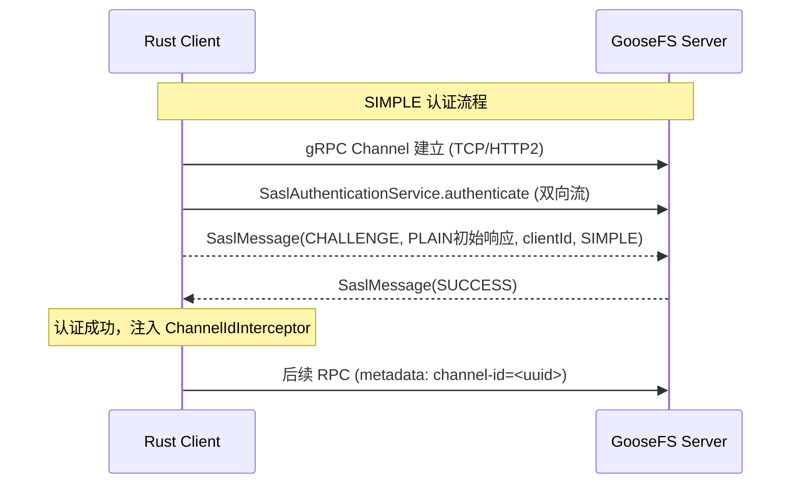

# GooseFS gRPC 集成实现方案

> **技术路线**：Lance ObjectStore → OpenDAL → GooseFS Rust Client (gRPC) → GooseFS gRPC Service  
> **版本**: v1.3 | **日期**: 2026-03-28

---

## 目录

1. [方案概述](#1-方案概述)
2. [整体架构](#2-整体架构)
3. [GooseFS gRPC 协议技术参考](#3-goosefs-grpc-协议技术参考)
4. [WriteType 完整支持设计](#4-writetype-完整支持设计) ← **v1.1 新增**
5. [详细实现设计](#5-详细实现设计)
6. [ObjectStore 操作 → gRPC 调用映射](#6-objectstore-操作--grpc-调用映射)
7. [代码变更清单与工作量](#7-代码变更清单与工作量)
8. [配置与使用指南](#8-配置与使用指南)
9. [测试计划](#9-测试计划)
10. [性能优化与风险](#10-性能优化与风险)
11. [实施路线图](#11-实施路线图)
12. [OpenDAL GooseFS Service 实现方案](#12-opendal-goosefs-service-实现方案) ← **v1.2 新增**
13. [Lance GooseFS Provider 详细设计](#13-lance-goosefs-provider-详细设计phase-2c) ← **v1.3 更新：含实际落地代码**

---

## 1. 方案概述

### 1.1 背景

- **Lance**：面向 ML/AI 的列式数据格式，通过可插拔 `ObjectStoreProvider` 支持多种存储后端
- **GooseFS**：腾讯基于 Alluxio 的分布式缓存文件系统，当前（2.1.0）**不包含 Proxy 模块**，仅支持 gRPC / S3 API / FUSE 三种访问方式
- **OpenDAL**：Apache 统一数据访问层，现有 `services-alluxio` 基于 REST API 但 `read: false` 不可用

### 1.2 核心思路

在 OpenDAL 中新增 `services-goosefs` service，通过独立的 **GooseFS Rust gRPC Client** 直接对接 GooseFS Master/Worker 的 gRPC 接口。

**关键优势**：
- 不依赖 Proxy：直接走 gRPC，解决 GooseFS 无 Proxy 模块的问题
- gRPC 二进制传输，性能优于 REST API
- 符合 PR #5740 标准模式（OpenDAL + OpendalStore），与 COS provider 架构一致
- GooseFS Rust Client 作为独立 crate 可复用，可贡献回 Apache OpenDAL 社区

---

## 2. 整体架构

### 2.1 完整链路

```
Lance ObjectStore API
        │
        ▼
Lance ObjectStoreProvider (GooseFsStoreProvider)            ← 层级 1：Lance Provider（~150 行）
        │
        ▼
OpenDAL GooseFS Service (services-goosefs)                 ← 层级 2：OpenDAL Service（impl Access）
        │  impl opendal::Access trait
        ▼
GooseFS Rust Client (gRPC)                                 ← 层级 3：独立 crate：goosefs-client-rs
        │  tonic gRPC (protobuf)
        ▼
GooseFS gRPC Service
├── Master:9200                                            → 元数据 + 管理
│   ├── FileSystemMasterClientServiceHandler               → ★ 文件系统元数据（核心）
│   ├── WorkerManagerMasterClientServiceHandler             → Worker 管理/容量/限流
│   ├── MetaMasterClientServiceHandler                      → 集群元信息/备份
│   ├── MetricsMasterClientServiceHandler                   → 监控指标
│   ├── JournalMasterClientServiceHandler                   → Journal Raft 管理
│   ├── TableMasterClientServiceHandler                     → 表格/Lance Namespace
│   ├── JobMasterClientServiceHandler                       → 分布式任务管理
│   └── ServiceVersionClientServiceHandler                  → 服务版本协商
├── Worker:9203                                            → 数据读写
│   └── BlockWorkerImpl                                     → ★ Block 流式读写（核心）
│       ├── readBlock / writeBlock                          → 双向流式
│       ├── openLocalBlock / createLocalBlock               → 短路读写
│       └── asyncCache / syncCache / removeBlock / ...       → 管理操作
        │
        ▼
UFS (COS / S3 / HDFS)
```

### 2.2 三层架构

```
┌─────────────────────────────────────────────────────────────────────┐
│ 层级 1: Lance Provider（轻量适配层，~150 行）                         │
│   GooseFsStoreProvider                                              │
│   - 接受 goosefs:// URL                                             │
│   - 构建 OpenDAL Operator → OpendalStore → Lance ObjectStore         │
├─────────────────────────────────────────────────────────────────────┤
│ 层级 2: OpenDAL GooseFS Service（impl Access trait）                 │
│   opendal/services-goosefs/                                         │
│   - GooseFsBackend: impl Access (read/write/stat/delete/list/rename)│
│   - GooseFsReader / GooseFsWriter / GooseFsLister                   │
├─────────────────────────────────────────────────────────────────────┤
│ 层级 3: GooseFS Rust Client (gRPC)（独立 crate）                     │
│   goosefs-client-rs/                                                │
│   - MasterClient / WorkerClient / BlockMapper / WorkerRouter         │
│   - Proto 定义: GooseFS gRPC protobuf (tonic-build)                  │
└─────────────────────────────────────────────────────────────────────┘
```

### 2.3 与现有 `services-alluxio` 对比

| 对比维度 | `services-alluxio` (现有) | `services-goosefs` (新增) |
|----------|--------------------------|---------------------------|
| 传输协议 | HTTP REST API | gRPC (tonic/protobuf) |
| 读取支持 | ❌ 不支持 | ✅ 流式读取 + range read |
| 依赖组件 | Alluxio Proxy | GooseFS Master + Worker（无需 Proxy） |
| GooseFS 兼容 | ❌ 需要 Proxy | ✅ 直接对接 |
| 性能 | 较低（HTTP 开销） | 较高（gRPC 二进制传输） |

---

## 3. GooseFS gRPC 协议技术参考

> 基于 GooseFS 源码深度分析，拆解 `goosefs-client-rs` 需实现的 **6 个核心模块**。

### 3.1 GooseFS gRPC 服务入口总览

GooseFS 共有 **8 个 gRPC ServiceHandler**（7 个 Master 端 + 1 个 Worker 端），注册在不同端口：

#### Master 端（端口 9200）

| # | Handler 类 | 继承自 (gRPC ImplBase) | 注册模块 | 主要职责 | Lance 需要? |
|---|-----------|----------------------|---------|---------|------------|
| 1 | **`FileSystemMasterClientServiceHandler`** | `FileSystemMasterClientServiceGrpc.ImplBase` | `DefaultFileSystemMaster` | 文件系统 CRUD、挂载、ACL、Namespace | **★ 核心** |
| 2 | **`WorkerManagerMasterClientServiceHandler`** | `WorkerManagerMasterClientServiceGrpc.ImplBase` | `DefaultWorkerManagerMaster` | Worker 列表/容量/限流/管理 | **★ 需要**（Worker 发现） |
| 3 | `MetaMasterClientServiceHandler` | `MetaMasterClientServiceGrpc.ImplBase` | `DefaultMetaMaster` | 集群元信息、备份/恢复、checkpoint | 可选 |
| 4 | `MetricsMasterClientServiceHandler` | `MetricsMasterClientServiceGrpc.ImplBase` | `DefaultMetricsMaster` | 指标上报/查询 | 可选 |
| 5 | `JournalMasterClientServiceHandler` | `JournalMasterClientServiceGrpc.ImplBase` | `DefaultJournalMaster` | Raft quorum 管理 | 否 |
| 6 | `TableMasterClientServiceHandler` | `TableMasterClientServiceGrpc.ImplBase` | `DefaultTableMaster` | 表格元数据 / Lance Namespace | Phase 1 已完成 |
| 7 | `JobMasterClientServiceHandler` | `JobMasterClientServiceGrpc.ImplBase` | `JobMaster` | 分布式任务调度（Job Server） | 否 |
| 8 | `ServiceVersionClientServiceHandler` | `ServiceVersionClientServiceGrpc.ImplBase` | `GrpcServerBuilder` | 服务版本协商 | **需要**（连接握手） |

> **注**：除 `ClientServiceHandler` 外，Master 还注册了 `*WorkerServiceHandler`（Master 与 Worker 内部通信）和 `*MasterServiceHandler`（Master HA 选举），这些属于服务端内部通信，Rust Client 无需实现。

#### Worker 端（端口 9203）

| # | Handler 类 | 继承自 | 主要方法 | Lance 需要? |
|---|-----------|--------|---------|------------|
| 1 | **`BlockWorkerImpl`** | `BlockWorkerGrpc.BlockWorkerImplBase` | `readBlock`(流式读)、`writeBlock`(流式写)、`openLocalBlock`(短路读)、`createLocalBlock`(短路写)、`asyncCache`、`syncCache`、`removeBlock`、`moveBlock`、`checkBlocks` | **★ 核心** |

#### Lance 集成所需的最小 gRPC Service 子集

```
Lance Rust Client 需要对接的 3 个核心 Service:
┌─────────────────────────────────────────────────────────────────────┐
│ Master:9200                                                         │
│   ① FileSystemMasterClientService  → 文件元数据 CRUD               │
│   ② WorkerManagerMasterClientService → Worker 列表发现              │
│   ③ ServiceVersionClientService     → 版本握手                     │
├─────────────────────────────────────────────────────────────────────┤
│ Worker:9203                                                         │
│   ④ BlockWorker Service             → Block 流式读写（核心数据路径）│
└─────────────────────────────────────────────────────────────────────┘
```

#### 各 Handler 的 gRPC 方法清单

**① FileSystemMasterClientServiceHandler** (`DefaultFileSystemMaster.getServices()`注册，38+ 方法):

| 方法 | 功能 | Lance 使用 |
|------|------|-----------|
| `getStatus` | 获取文件/目录状态 | ★ head/stat |
| `listStatus` | 列出子路径（server-streaming） | ★ list |
| `createFile` | 创建文件 | ★ put |
| `completeFile` | 标记文件写完 | ★ put 收尾 |
| `remove` | 删除文件/目录 | ★ delete |
| `rename` | 重命名 | ★ rename/manifest |
| `createDirectory` | 创建目录 | ★ 隐式创建 |
| `checkAccess` | 检查访问权限 | 可选 |
| `createSymlink` / `getLinkTarget` | 符号链接 | 否 |
| `free` | 释放缓存 | 可选 |
| `mount` / `unmount` / `updateMount` | UFS 挂载管理 | 否 |
| `setAttribute` / `setAcl` | 属性/权限设置 | 可选 |
| `startSync` / `stopSync` | UFS 同步 | 否 |
| `createNamespace` / `deleteNamespace` / `listNamespace` / `statNamespace` / `updateNamespace` / `setNamespaceAttribute` | Namespace 管理 | Phase 1 |
| `getDelegationToken` / `cancelDelegationToken` / `renewDelegationToken` | Kerberos Token | 可选 |
| `checkConsistency` / `scheduleAsyncPersistence` / `reverseResolve` / `getFilePath` / `removeBlocks` / ... | 其他管理 | 否 |

**② WorkerManagerMasterClientServiceHandler** (`DefaultWorkerManagerMaster.getServices()`注册):

| 方法 | 功能 | Lance 使用 |
|------|------|-----------|
| `getWorkerInfoList` | **获取所有 Worker 列表** | ★ Worker 路由 |
| `getWorkerReport` | 获取 Worker 详情 | 可选 |
| `getCapacityBytes` | 集群总容量 | 否 |
| `getUsedBytes` | 已用容量 | 否 |
| `getWorkerManagerMasterInfo` | Block Master 信息 | 否 |
| `getWorkerLostStorage` | 丢失存储 | 否 |
| `manageWorker` | Worker 管理（上下线） | 否 |
| `updateClusterRateLimit` / `getClusterRateLimit` | 集群限流 | 否 |

**③ BlockWorkerImpl** (`GrpcDataServer`注册):

| 方法 | 类型 | 功能 | Lance 使用 |
|------|------|------|-----------|
| `readBlock` | **双向流式** | Block 数据读取 | ★ 核心 |
| `writeBlock` | **双向流式** | Block 数据写入 | ★ 核心 |
| `openLocalBlock` | 双向流式 | 短路读（同节点零拷贝） | 可选优化 |
| `createLocalBlock` | 双向流式 | 短路写（同节点零拷贝） | 可选优化 |
| `asyncCache` | 一元 RPC | 异步缓存预热 | 可选 |
| `syncCache` | 一元 RPC | 同步缓存 | 可选 |
| `removeBlock` | 一元 RPC | 删除 Block | 否 |
| `moveBlock` | 一元 RPC | 移动 Block | 否 |
| `checkBlocks` | 一元 RPC | 校验 Block | 否 |
| `clearMetrics` | 一元 RPC | 清除指标 | 否 |
| `avoidBlockDeadLock` | 一元 RPC | 死锁避免 | 否 |

### 3.2 核心实现模块总览

| # | 模块 | Java 对应源码 | Rust 需实现 | 复杂度 | 状态 |
|---|------|-------------|------------|--------|------|
| 1 | **Master 元数据客户端** | `RetryHandlingFileSystemMasterClient` | `MasterClient` | 中 | ✅ 已完成 |
| 2 | **Worker 管理客户端** | `RetryHandlingWorkerManagerMasterClient` | `WorkerManagerClient` | 低 | ✅ 已完成 |
| 3 | **Worker 数据客户端** | `DefaultBlockWorkerClient` | `WorkerClient` | 高 | ✅ 已完成 |
| 4 | **Block 映射计算** | `GooseFSFileInStream.updateStream()` | `BlockMapper` | 中 | ✅ 已完成 |
| 5 | **Worker 路由选择** | `ClientWorkerManager` / `GooseFSBlockStore` | `WorkerRouter` | 中 | ✅ 已完成 |
| 6 | **gRPC 流式读** | `GrpcDataReader` + `GrpcBlockingStream` | `GrpcBlockReader` | 极高 | ✅ 已完成 |
| 7 | **gRPC 流式写** | `GrpcDataWriter` + `BlockOutStream` | `GrpcBlockWriter` | 极高 | ✅ 已完成 |
| 8 | **★ 高层文件读取器** | `GooseFSFileInStream` | `GooseFsFileReader` | 中 | ✅ 已完成 |
| 9 | **★ 高层文件写入器** | `GooseFSFileOutStream` | `GooseFsFileWriter` | 中 | ✅ 已完成 |

### 3.3 gRPC 协议详解

**ReadRequest 关键字段**：

```protobuf
message ReadRequest {
  optional int64 block_id = 1;
  optional int64 offset = 2;          // range read 起始偏移
  optional int64 length = 3;          // range read 长度
  optional int64 chunk_size = 4;
  optional OpenUfsBlockOptions open_ufs_block_options = 5;
  optional int64 offset_received = 6; // 流控 ACK
  optional int32 prefetch_window = 11;
}
```

**WriteRequest 关键字段**：

```protobuf
message WriteRequest {
  oneof value {
    WriteRequestCommand command = 1;  // 首条消息
    Chunk chunk = 2;                  // 后续数据
  }
}
message WriteRequestCommand {
  optional RequestType type = 1;      // GOOSEFS_BLOCK / UFS_FILE / UFS_FALLBACK_BLOCK
  optional int64 id = 2;             // Block ID
  optional int64 offset = 3;
  optional bool flush = 4;
  optional CreateUfsFileOptions create_ufs_file_options = 5;  // THROUGH 模式必填
  optional int64 space_to_reserve = 6;
}
// RequestType 决定 Worker 端数据写入目标：
//   GOOSEFS_BLOCK(0) — 写入 GooseFS 缓存块
//   UFS_FILE(1)      — 直接写入 UFS 文件（THROUGH 模式）
//   UFS_FALLBACK_BLOCK(2) — 缓存满降级写 UFS
```

### 3.4 模块 1：Master 元数据客户端

```rust
pub struct GooseFsMasterClient {
    channel: FileSystemMasterClientServiceClient<Channel>,
    master_addr: String,
    retry_policy: RetryPolicy,
}

impl GooseFsMasterClient {
    pub async fn get_status(&self, path: &str) -> Result<FileInfo> { /* GetStatus RPC */ }
    pub async fn list_status(&self, path: &str, recursive: bool) -> Result<Vec<FileInfo>> { /* server-streaming */ }
    pub async fn create_file(&self, path: &str, options: CreateFileOptions) -> Result<FileInfo> { /* ... */ }
    pub async fn complete_file(&self, path: &str, inode_id: i64) -> Result<()> { /* ... */ }
    pub async fn delete(&self, path: &str, recursive: bool) -> Result<()> { /* ... */ }
    pub async fn rename(&self, src: &str, dst: &str) -> Result<()> { /* ... */ }
}
```

**关键难点**：
- Master HA：✅ 已实现 `PollingMasterInquireClient` Leader 发现（`from_addresses()` 统一入口）
- `ListStatus` 是 server-streaming RPC，用 tonic `Streaming<T>` 处理
- 认证：Kerberos/LDAP 需实现 gRPC 拦截器

### 3.5 模块 2：Worker 数据客户端

Java 端维护**两个独立 gRPC Channel**：
- **Streaming Channel**：`ReadBlock`/`WriteBlock`，禁用连接池，追求吞吐
- **RPC Channel**：`RemoveBlock`/`CheckBlocks` 等管理操作，使用连接池

```rust
pub struct GooseFsWorkerClient {
    streaming_client: BlockWorkerClient<Channel>,  // 高吞吐
    rpc_client: BlockWorkerClient<Channel>,        // 管理操作
    worker_addr: WorkerNetAddress,
}
```

### 3.6 模块 3：Block 映射计算

**映射规则**（从 `GooseFSFileInStream` 提取）：

```
给定文件偏移 file_offset:
  block_index  = file_offset / blockSizeBytes
  block_id     = blockIds[block_index]
  block_offset = file_offset % blockSizeBytes
  read_length  = min(requested_length, blockSizeBytes - block_offset)

跨 Block 读取: 拆分为多次 ReadBlock RPC
```

```rust
pub struct BlockMapper {
    block_size: i64,
    block_ids: Vec<i64>,
    file_length: i64,
    block_locations: Vec<FileBlockInfo>,
}

impl BlockMapper {
    pub fn plan_read(&self, file_offset: i64, length: i64) -> Vec<BlockReadSegment> {
        // 将文件级 range read 拆分为 Block 级读取计划
    }
}
```

### 3.7 模块 4：Worker 路由选择

GooseFS 使用**一致性哈希**映射 Block ID → Worker：

```rust
pub struct WorkerRouter {
    workers: Arc<RwLock<Vec<WorkerInfo>>>,
    hash_ring: ConsistentHashRing,
    failed_workers: DashMap<String, Instant>,
}

impl WorkerRouter {
    pub fn select_worker(&self, block_id: i64) -> Result<WorkerInfo> {
        // 一致性哈希 + 失败节点过滤
    }
}
```

### 3.8 模块 5：gRPC 流式读（最复杂）

**读取协议（5 步）**：
```
Client                                    Worker
  │  1. ReadRequest(block_id, offset,        │
  │     length, chunk_size)                  │
  ├─────────────────────────────────────────→│
  │  2. ReadResponse(chunk.data)             │
  │←─────────────────────────────────────────┤
  │  3. ReadRequest(offset_received=N)       │ ← 流控 ACK
  ├─────────────────────────────────────────→│
  │  4. ReadResponse(chunk.data) ...         │
  │←─────────────────────────────────────────┤
  │  5. close/cancel                         │
  ├──────────────────────────────────────────→│
```

**Java 流控机制**（`GrpcDataReader.readChunk()`）：
- 首次：发送完整 ReadRequest（含 block_id, offset, length, chunk_size）
- 后续：发送 `offset_received` 确认已接收偏移（流控 ACK）
- 接收 ReadResponse 中的 Chunk 数据

**读取策略分层**（`BlockInStream.create()`）：
1. 短路读（同节点直接读本地文件）
2. SharedGrpcDataReader（共享读，减少 seek 开销）
3. ChunkCachingGrpcDataReader（Chunk 缓存读）
4. GrpcDataReader（标准 gRPC 读）

```rust
pub struct GrpcBlockReader {
    block_id: i64,
    offset: i64,
    length: i64,
    pos_to_read: i64,
    request_tx: mpsc::Sender<ReadRequest>,
    response_rx: Streaming<ReadResponse>,
}

impl GrpcBlockReader {
    pub async fn open(client: &GooseFsWorkerClient, block_id: i64, 
                      offset: i64, length: i64, chunk_size: i64) -> Result<Self> {
        // 建立双向流式 RPC，发送初始 ReadRequest
    }
    
    pub async fn read_chunk(&mut self) -> Result<Option<Bytes>> {
        // 发送 offset_received ACK → 接收 ReadResponse
    }
    
    pub async fn read_all(&mut self) -> Result<Bytes> {
        // 循环 read_chunk 直到读完
    }
}
```

### 3.9 模块 6：gRPC 流式写

**完整写入流程**：
```
1. Master: CreateFile(path, blockSizeBytes, writeType) → FileInfo
2. 对于每个 Block:
   a. Worker 选择: ConsistentHash(blockId)
   b. WriteBlock 流式写入:
      - 首条消息: WriteRequestCommand { id, type, spaceToReserve }
      - 后续消息: Chunk { data }
      - flush: WriteRequestCommand { flush=true } → 等待 WriteResponse 确认
3. Master: CompleteFile(path, inodeId)
```

### 3.10 ★ 高层封装：端到端文件读写 API（已实现）

低层模块（MasterClient、WorkerClient、BlockMapper、WorkerRouter、GrpcBlockReader/Writer）各自独立，
使用时需要开发者手动编排。**高层封装** 将完整管道包装为两个简单 API，类似 Java 端的
`GooseFSFileInStream` / `GooseFSFileOutStream`。

#### 3.10.1 GooseFsFileWriter — 端到端写入管道

```text
写入流程:
GooseFsFileWriter::create(path)
  → MasterClient.create_file()           创建文件元数据（含 writeType）
  → resolve_write_strategy()             根据 writeType + FileInfo 推导写入策略
  → WorkerManagerClient.get_worker_info_list()  发现 Worker
  → WorkerRouter.update_workers()        构建一致性哈希环

GooseFsFileWriter::write(data)           可多次调用
  → BlockMapper.plan_write()             拆分数据为 Block 段
  → for each block:
      → compute_block_id(file_id, block_index)  计算 Block ID
      → WorkerRouter.select_worker()     一致性哈希路由
      → WorkerClient.connect()           连接 Worker
      → GrpcBlockWriter.open(WriteBlockOptions)  按策略启动双向流
        ├─ MUST_CACHE/ASYNC_THROUGH: GoosefsBlock
        └─ CACHE_THROUGH/THROUGH: UfsFile + CreateUfsFileOptions
      → GrpcBlockWriter.write_all()      分 chunk 发送数据
      → GrpcBlockWriter.flush()          发送 flush 并等待 ACK
      → GrpcBlockWriter.close()          关闭写入流

GooseFsFileWriter::close()
  → MasterClient.complete_file()         标记文件写入完成
  → if ASYNC_THROUGH:
      → MasterClient.schedule_async_persistence()  调度异步持久化
```

**使用方式**：

```rust
use goosefs_client::io::GooseFsFileWriter;
use goosefs_client::config::GooseFsConfig;

let config = GooseFsConfig::new("127.0.0.1:9200");

// 方式 1: 一行搞定
GooseFsFileWriter::write_file(&config, "/data/file.txt", b"Hello!").await?;

// 方式 2: 流式多段写入
let mut writer = GooseFsFileWriter::create(&config, "/data/file.txt").await?;
writer.write(b"part 1 ").await?;
writer.write(b"part 2 ").await?;
writer.close().await?;
```

#### 3.10.2 GooseFsFileReader — 端到端读取管道

```text
读取流程:
GooseFsFileReader::open(path) / open_range(path, offset, length)
  → MasterClient.get_status()            获取文件元数据（含 blockIds, blockSize）
  → WorkerManagerClient.get_worker_info_list()  发现 Worker
  → WorkerRouter.update_workers()        构建一致性哈希环
  → BlockMapper.plan_read()              文件范围 → Block 级读取计划

GooseFsFileReader::read_next_block()     逐块流式读取
  → resolve_block_id()                   优先使用 FileBlockInfo 中的实际 Block ID
  → WorkerRouter.select_worker()         一致性哈希路由
  → WorkerClient.connect()              连接 Worker（失败自动标记）
  → GrpcBlockReader.open()              启动双向流
  → GrpcBlockReader.read_all()          读取整个 Block 段数据

GooseFsFileReader::read_all()            读取所有 Block 并拼接
```

**使用方式**：

```rust
use goosefs_client::io::GooseFsFileReader;
use goosefs_client::config::GooseFsConfig;

let config = GooseFsConfig::new("127.0.0.1:9200");

// 方式 1: 一行读取整个文件
let data = GooseFsFileReader::read_file(&config, "/data/file.txt").await?;

// 方式 2: 范围读取
let range = GooseFsFileReader::read_range(&config, "/data/file.txt", 100, 500).await?;

// 方式 3: 逐块流式读取
let mut reader = GooseFsFileReader::open(&config, "/data/file.txt").await?;
while let Some(chunk) = reader.read_next_block().await? {
    process(chunk);
}
```

#### 3.10.3 高层 API 与低层 API 的关系

```text
┌─────────────────────────────────────────────────────────────────────┐
│  高层 API（推荐使用，适合大多数场景）                                   │
│                                                                     │
│  GooseFsFileWriter   ← 一行写文件，自动编排全流程                     │
│  GooseFsFileReader   ← 一行读文件/范围读，自动编排全流程               │
├─────────────────────────────────────────────────────────────────────┤
│  低层 API（适合需要精细控制的场景）                                     │
│                                                                     │
│  MasterClient        ← 文件元数据 CRUD                              │
│  WorkerManagerClient ← Worker 发现                                  │
│  WorkerClient        ← Block 级双向流 RPC                           │
│  BlockMapper         ← 文件范围 → Block 计划                        │
│  WorkerRouter        ← 一致性哈希路由                                │
│  GrpcBlockReader     ← 单 Block 流式读（带流控 ACK）                 │
│  GrpcBlockWriter     ← 单 Block 流式写（带 flush/close）             │
└─────────────────────────────────────────────────────────────────────┘
```

高层 API 在内部调用所有低层组件，用户无需关心：
- Worker 发现与路由
- Block 拆分与映射
- gRPC 双向流管理
- 文件完成（CompleteFile）收尾

### 3.11 gRPC 调用组装示例

以下展示各模块如何协同完成 Range Read（Lance 最核心操作）：

```rust
async fn get_range(&self, location: &Path, range: Range<usize>) -> Result<Bytes> {
    // 1. 获取文件元数据（含 blockIds, blockSizeBytes）
    let info = self.master_client.get_status(location.as_ref()).await?;
    
    // 2. Block 映射：文件级 range → Block 级读取计划
    let mapper = BlockMapper::new(&info);
    let segments = mapper.plan_read(range.start as i64, (range.end - range.start) as i64);
    
    // 3. 对每个 Block segment 执行 gRPC ReadBlock
    let mut result = BytesMut::with_capacity(range.end - range.start);
    for seg in segments {
        let worker = self.worker_router.select_worker(seg.block_id)?;
        let client = self.get_worker_client(&worker).await?;
        let mut reader = GrpcBlockReader::open(
            &client, seg.block_id, seg.block_offset, seg.length, self.config.chunk_size,
        ).await?;
        result.extend_from_slice(&reader.read_all().await?);
    }
    Ok(result.freeze())
}
```

---

## 4. WriteType 完整支持设计

> **v1.1 新增**：线上除了 MUST_CACHE 以外，THROUGH、CACHE_THROUGH、ASYNC_THROUGH 都有客户在使用，4 种 WriteType 全部需要支持。

### 4.1 背景与需求

GooseFS 支持 6 种 `WritePType`，其中 4 种在线上活跃使用：

| WriteType | 枚举值 | 数据流向 | 线上使用 |
|-----------|--------|---------|---------|
| **MUST_CACHE** | 1 | 仅写 GooseFS 缓存，不持久化到 UFS | ✅ |
| **TRY_CACHE** | 2 | 尝试缓存，缓存满时降级为 THROUGH | ⚠️ 少量 |
| **CACHE_THROUGH** | 3 | 写缓存 + 同步持久化到 UFS | ✅ |
| **THROUGH** | 4 | 直写 UFS，跳过缓存 | ✅ |
| **ASYNC_THROUGH** | 5 | 写缓存，异步调度持久化到 UFS | ✅ |
| **NONE** | 6 | 使用服务端默认 | — |

### 4.2 现状分析 vs 目标状态

| WriteType | v1.0 现状 | v1.1 目标 | v1.1.1 最终状态 | 所需改动 |
|-----------|----------|----------|----------------|---------|
| **MUST_CACHE** | ✅ 可用（当前默认行为） | ✅ 保持不变 | ✅ 已完成 | 无 |
| **THROUGH** | ❌ 不可用 | ✅ 完整支持 | ✅ 已完成 | 🔴 **重大改动** |
| **CACHE_THROUGH** | ⚠️ 部分可用（config 已传 writeType） | ✅ 完整支持 | ✅ 已完成（v1.1.1 修正为 UfsFile） | 🟡→🔴 改为 UfsFile 模式 |
| **ASYNC_THROUGH** | ⚠️ 部分可用 | ✅ 完整支持 | ✅ 已完成 | 🟡 中度改动 |

**核心差异**：
- **MUST_CACHE**：Worker 端使用 `RequestType::GoosefsBlock`，数据仅写入缓存
- **CACHE_THROUGH / THROUGH**：Worker 端使用 `RequestType::UfsFile`，需传入 `CreateUfsFileOptions`（含 `ufs_path`、`owner`、`group`、`mode`、`mount_id`），数据直接写入 UFS（CACHE_THROUGH 时 Worker 同时缓存数据）
- **ASYNC_THROUGH**：数据写入缓存（同 MUST_CACHE），但 `close()` 后需调用 `scheduleAsyncPersistence` RPC

> ⚠️ **v1.1.1 修正**：原设计中 CACHE_THROUGH 使用 `GoosefsBlock` 写入缓存，依赖 Master 在 `CompleteFile` 时同步持久化到 UFS。经实际验证发现 **Master 在 `CompleteFile` 时只标记元数据为 `PERSISTED`，并不会实际拷贝数据到 UFS**。因此 CACHE_THROUGH 必须和 THROUGH 一样使用 `UfsFile` 模式，由 Worker 直接写入 UFS，Worker 侧同时缓存数据块。

### 4.3 修改架构全景图

```text
修改涉及 4 层代码（从底到上）:

Layer 1 — WorkerClient::write_block()      ← 新增 WriteBlockOptions（RequestType + CreateUfsFileOptions）
  ↑
Layer 2 — GrpcBlockWriter::open()           ← 透传 WriteBlockOptions
  ↑
Layer 3 — GooseFsFileWriter::write_block()  ← 根据 WriteStrategy 决策 RequestType
  ↑                         ::close()       ← ASYNC_THROUGH 时调用 schedule_async_persistence
Layer 4 — MasterClient::complete_file()     ← 增加可选 async_persist_options 参数
```

### 4.4 WriteBlockOptions — 写入请求参数封装

```rust
use crate::proto::grpc::block::RequestType;
use crate::proto::proto::dataserver::CreateUfsFileOptions;

/// Block 写入请求参数，封装 RequestType 和可选的 UFS 文件创建选项。
pub struct WriteBlockOptions {
    /// 请求类型:
    /// - GoosefsBlock(0) — 写入 GooseFS 缓存块（MUST_CACHE/ASYNC_THROUGH）
    /// - UfsFile(1) — 直接写入 UFS 文件（CACHE_THROUGH/THROUGH）
    /// - UfsFallbackBlock(2) — 缓存满时降级写 UFS（TRY_CACHE fallback）
    pub request_type: RequestType,

    /// CACHE_THROUGH / THROUGH 模式下需要传入 UFS 文件创建参数。
    /// 包含：ufs_path, owner, group, mode, mount_id, acl。
    /// 从 Master.CreateFile 返回的 FileInfo 中提取。
    pub create_ufs_file_options: Option<CreateUfsFileOptions>,
}

impl Default for WriteBlockOptions {
    fn default() -> Self {
        Self {
            request_type: RequestType::GoosefsBlock,
            create_ufs_file_options: None,
        }
    }
}
```

### 4.5 WriteStrategy — 写入策略决策

根据 `WritePType` 推导每种模式下的 Worker 行为和 close 后处理：

```rust
/// 写入策略：根据 WritePType 决定 Worker 端行为和后处理。
struct WriteStrategy {
    /// Worker 写入的 RequestType
    request_type: RequestType,
    /// THROUGH 模式下需要 UFS 文件创建选项（从 FileInfo 提取）
    create_ufs_file_options: Option<CreateUfsFileOptions>,
    /// 是否需要在 close() 后调用 schedule_async_persistence
    need_async_persist: bool,
}
```

**决策逻辑**（v1.1.1 修正）：

```rust
fn resolve_write_strategy(
    write_type: Option<i32>,
    file_info: &FileInfo,
) -> WriteStrategy {
    match write_type {
        // CACHE_THROUGH (3) / THROUGH (4): 写 UFS via Worker。
        // CACHE_THROUGH: Worker 写 UFS 同时缓存数据块；
        // THROUGH: Worker 直接写 UFS，不缓存。
        //
        // ⚠️ v1.1.1 修正：原设计中 CACHE_THROUGH 使用 GoosefsBlock 写缓存，
        // 依赖 Master 在 CompleteFile 时同步持久化。经验证 Master 只标记
        // 元数据为 PERSISTED，不实际拷贝数据。故改为 UfsFile 模式。
        Some(3) | Some(4) => WriteStrategy {
            request_type: RequestType::UfsFile,
            create_ufs_file_options: Some(CreateUfsFileOptions {
                ufs_path: file_info.ufs_path.clone(),
                owner: file_info.owner.clone(),
                group: file_info.group.clone(),
                mode: file_info.mode,
                mount_id: file_info.mount_id,
                acl: None,
            }),
            need_async_persist: false,
        },

        // ASYNC_THROUGH: 写缓存，close() 后异步调度持久化
        Some(5) => WriteStrategy {
            request_type: RequestType::GoosefsBlock,
            create_ufs_file_options: None,
            need_async_persist: true,
        },

        // MUST_CACHE (1), TRY_CACHE (2), NONE (6), 未设置:
        // 只写 GooseFS 缓存块，不涉及 UFS 持久化。
        _ => WriteStrategy {
            request_type: RequestType::GoosefsBlock,
            create_ufs_file_options: None,
            need_async_persist: false,
        },
    }
}
```

### 4.6 四种 WriteType 完整数据流对比

```text
┌─────────────────────────────────────────────────────────────────────────┐
│ MUST_CACHE (1)                                                          │
│                                                                         │
│ CreateFile(writeType=1) → Worker[GoosefsBlock] → CompleteFile           │
│                                     ↓                                   │
│                              Worker 缓存层 ✅                           │
│                              UFS ❌                                      │
├─────────────────────────────────────────────────────────────────────────┤
│ CACHE_THROUGH (3)    ← v1.1.1 修正：改用 UfsFile                       │
│                                                                         │
│ CreateFile(writeType=3) → Worker[UfsFile + CreateUfsFileOptions]        │
│                                     ↓                                   │
│                              Worker 缓存层 ✅ (Worker 同时缓存)         │
│                              UFS(COS/S3/HDFS) ✅ (Worker 直接写入)      │
│                          → CompleteFile                                  │
├─────────────────────────────────────────────────────────────────────────┤
│ THROUGH (4)                                                              │
│                                                                         │
│ CreateFile(writeType=4) → Worker[UfsFile + CreateUfsFileOptions]        │
│                                     ↓                                   │
│                              Worker 缓存层 ❌                           │
│                              UFS(COS/S3/HDFS) ✅ (直接写入)             │
│                          → CompleteFile                                  │
├─────────────────────────────────────────────────────────────────────────┤
│ ASYNC_THROUGH (5)                                                        │
│                                                                         │
│ CreateFile(writeType=5) → Worker[GoosefsBlock] → CompleteFile           │
│                                     ↓              → scheduleAsyncPersistence
│                              Worker 缓存层 ✅                           │
│                              ↓ 后台异步                                 │
│                              UFS(COS/S3/HDFS) ✅ (eventually)           │
└─────────────────────────────────────────────────────────────────────────┘
```

### 4.7 各层改动详情

#### 4.7.1 Layer 1: `WorkerClient::write_block()` — 支持 WriteBlockOptions

**改动前**（硬编码 `GoosefsBlock`）:

```rust
pub async fn write_block(
    &self,
    block_id: i64,
    space_to_reserve: i64,
) -> Result<(mpsc::Sender<WriteRequest>, Streaming<WriteResponse>)> {
    // ...
    WriteRequestCommand {
        r#type: Some(RequestType::GoosefsBlock as i32),  // ← 硬编码
        create_ufs_file_options: None,                    // ← 永远 None
        // ...
    }
}
```

**改动后**（接受 `WriteBlockOptions`）:

```rust
pub async fn write_block(
    &self,
    block_id: i64,
    space_to_reserve: i64,
    options: WriteBlockOptions,  // ← 新增参数
) -> Result<(mpsc::Sender<WriteRequest>, Streaming<WriteResponse>)> {
    // ...
    WriteRequestCommand {
        r#type: Some(options.request_type as i32),            // ← 由调用方决定
        create_ufs_file_options: options.create_ufs_file_options, // ← 透传
        // ...
    }
}
```

#### 4.7.2 Layer 2: `GrpcBlockWriter::open()` — 透传 WriteBlockOptions

```rust
pub async fn open(
    worker: &WorkerClient,
    block_id: i64,
    space_to_reserve: i64,
    options: WriteBlockOptions,  // ← 新增
) -> Result<Self> {
    let (request_tx, response_rx) = worker
        .write_block(block_id, space_to_reserve, options)
        .await?;
    // ...
}
```

#### 4.7.3 Layer 3: `GooseFsFileWriter` — 核心决策逻辑

**新增字段**：

```rust
pub struct GooseFsFileWriter {
    // ... 现有字段 ...
    /// 从 config.write_type + CreateFilePOptions 推导的写入策略
    write_strategy: WriteStrategy,
}
```

**`create_with_options` 中初始化策略**：

```rust
// 推导生效的 write_type: 优先使用 CreateFilePOptions 中的，否则用 config 的
let effective_write_type = create_options.write_type.or(config.write_type);
let write_strategy = resolve_write_strategy(effective_write_type, &file_info);
```

**`write_block` 中使用策略**：

```rust
let write_opts = WriteBlockOptions {
    request_type: self.write_strategy.request_type,
    create_ufs_file_options: self.write_strategy.create_ufs_file_options.clone(),
};
let mut block_writer =
    GrpcBlockWriter::open(&worker, block_id, block_size as i64, write_opts).await?;
```

**`close()` 中处理 ASYNC_THROUGH**：

```rust
pub async fn close(&mut self) -> Result<()> {
    // ... CompleteFile ...
    self.master.complete_file(&self.path, ufs_length).await?;
    self.completed = true;

    // ASYNC_THROUGH: 调度异步持久化
    if self.write_strategy.need_async_persist {
        debug!(path = %self.path, "scheduling async persistence for ASYNC_THROUGH");
        self.master.schedule_async_persistence(&self.path, None).await?;
    }
    // ...
}
```

#### 4.7.4 Layer 4: MasterClient — 已有 `schedule_async_persistence`

`MasterClient::schedule_async_persistence()` 已在 v1.0 中实现，无需改动。
`CompleteFilePOptions` 的 `async_persist_options` 字段已在 proto 中定义，可选使用。

### 4.8 涉及修改的文件清单

| # | 文件 | 改动类型 | 改动量 | 说明 |
|---|------|---------|--------|------|
| 1 | `src/client/worker.rs` | **重大修改** | ~30 行 | `write_block()` 新增 `WriteBlockOptions` 参数 |
| 2 | `src/io/writer.rs` | **中度修改** | ~10 行 | `GrpcBlockWriter::open()` 透传 `WriteBlockOptions` |
| 3 | `src/io/file_writer.rs` | **重大修改** | ~80 行 | 新增 `WriteStrategy` + `resolve_write_strategy()`，修改 `write_block()` 和 `close()` |
| 4 | `src/config.rs` | ✅ **已完成** | — | `write_type` 字段已添加 |
| 5 | `src/lib.rs` | ✅ **已完成** | — | `WritePType` 已重新导出 |
| **总计** | | | **~120 行** | |

### 4.9 关键设计决策

| 决策点 | 选择 | 理由 |
|--------|------|------|
| THROUGH 时 `ufs_path` 从哪获取？ | 从 `FileInfo.ufs_path` | Master `CreateFile` 返回的 `FileInfo` 中包含 UFS 映射路径 |
| CACHE_THROUGH 客户端需额外操作？ | **使用 UfsFile 模式**（v1.1.1 修正） | 原以为 Master 在 CompleteFile 时自动同步持久化，实际验证发现 Master 只标记元数据 PERSISTED 不拷贝数据，必须由 Worker 通过 UfsFile 直接写 UFS |
| ASYNC_THROUGH 何时调度持久化？ | `close()` 中 `CompleteFile` 之后 | 遵循 Java `GooseFSFileOutStream.close()` 行为 |
| `WriteBlockOptions` 用结构体还是参数展开？ | **结构体** | 避免参数过多，便于未来扩展 |
| 向后兼容性 | `WriteBlockOptions::default()` = 当前行为 | 不设置 `write_type` 时完全等价于现有 MUST_CACHE |

### 4.10 使用示例

#### 4.10.1 使用 `WritePType`（protobuf 枚举，向后兼容）

```rust
use goosefs_client::config::GooseFsConfig;
use goosefs_client::WritePType;
use goosefs_client::io::GooseFsFileWriter;

// MUST_CACHE（默认，不变）
let config = GooseFsConfig::new("127.0.0.1:9200");
GooseFsFileWriter::write_file(&config, "/data/file.txt", data).await?;

// CACHE_THROUGH — 写缓存 + 同步持久化
let config = GooseFsConfig::new("127.0.0.1:9200")
    .with_write_type(WritePType::CacheThrough);
GooseFsFileWriter::write_file(&config, "/data/file.txt", data).await?;

// THROUGH — 直写 UFS，跳过缓存
let config = GooseFsConfig::new("127.0.0.1:9200")
    .with_write_type(WritePType::Through);
GooseFsFileWriter::write_file(&config, "/data/file.txt", data).await?;

// ASYNC_THROUGH — 写缓存，异步持久化
let config = GooseFsConfig::new("127.0.0.1:9200")
    .with_write_type(WritePType::AsyncThrough);
GooseFsFileWriter::write_file(&config, "/data/file.txt", data).await?;
// close() 内部自动调用 schedule_async_persistence
```

#### 4.10.2 使用 `WriteType` 高级枚举（推荐，v1.2 新增）

`WriteType` 是对 protobuf `WritePType` 的高级封装，提供类似 Java 枚举的字符串互转能力：

```rust
use goosefs_client::config::{GooseFsConfig, WriteType};
use goosefs_client::WritePType;

// 方式 1: 使用 WriteType 枚举（类型安全）
let config = GooseFsConfig::new("127.0.0.1:9200")
    .with_write_type_enum(WriteType::CacheThrough);

// 方式 2: 从字符串解析（case-insensitive，类似 Java Enum.valueOf()）
let config = GooseFsConfig::new("127.0.0.1:9200")
    .with_write_type_str("cache_through")
    .unwrap();

// WriteType ↔ 字符串互转
let wt: WriteType = "through".parse().unwrap();   // FromStr
assert_eq!(wt.to_string(), "through");            // Display
assert_eq!(wt.as_str(), "through");               // &'static str

// WriteType ↔ WritePType 互转
let pt: WritePType = WritePType::from(wt);         // WriteType → WritePType
let wt2: WriteType = WriteType::from(pt);          // WritePType → WriteType
assert_eq!(wt, wt2);

// WriteType → i32
assert_eq!(WriteType::CacheThrough.as_i32(), 3);

// 遍历所有变体
for wt in WriteType::ALL {
    println!("{} = {}", wt.as_str(), wt.as_i32());
}
```

**`WriteType` 枚举变体与字符串映射：**

| 枚举变体 | 字符串 | i32 | 说明 |
|----------|--------|-----|------|
| `WriteType::MustCache` | `must_cache` | 1 | 仅写缓存，不持久化 |
| `WriteType::TryCache` | `try_cache` | 2 | 尝试缓存，满时降级 THROUGH |
| `WriteType::CacheThrough` | `cache_through` | 3 | 缓存 + 同步持久化到 UFS |
| `WriteType::Through` | `through` | 4 | 直写 UFS，跳过缓存 |
| `WriteType::AsyncThrough` | `async_through` | 5 | 缓存 + 异步持久化到 UFS |

#### 4.10.3 使用 Storage Option 常量（消除魔法字符串）

`config` 模块导出了一组常量，用于在 `storage_options` 和环境变量中引用配置键名，
避免硬编码字符串散落在代码中：

```rust
use goosefs_client::{
    STORAGE_OPT_MASTER_ADDR,   // "goosefs_master_addr"
    STORAGE_OPT_WRITE_TYPE,    // "goosefs_write_type"
    STORAGE_OPT_BLOCK_SIZE,    // "goosefs_block_size"
    STORAGE_OPT_CHUNK_SIZE,    // "goosefs_chunk_size"
    ENV_MASTER_ADDR,           // "GOOSEFS_MASTER_ADDR"
    ENV_WRITE_TYPE,            // "GOOSEFS_WRITE_TYPE"
    ENV_BLOCK_SIZE,            // "GOOSEFS_BLOCK_SIZE"
    ENV_CHUNK_SIZE,            // "GOOSEFS_CHUNK_SIZE"
};
use goosefs_client::config::WriteType;

// 在 Lance storage_options 中使用常量
let dataset = lance::dataset::DatasetBuilder::from_uri("goosefs://10.0.0.1:9200/datasets/v1")
    .with_storage_option(STORAGE_OPT_WRITE_TYPE, WriteType::CacheThrough.as_str())
    .with_storage_option(STORAGE_OPT_MASTER_ADDR, "10.0.0.1:9200")
    .load()
    .await?;

// 在 HashMap 中使用常量
use std::collections::HashMap;
let mut options = HashMap::new();
options.insert(STORAGE_OPT_WRITE_TYPE.to_string(), WriteType::Through.to_string());
```

**Storage Option 常量清单：**

| 常量名 | 值 | 对应环境变量常量 | 环境变量值 | 说明 |
|--------|---|---------------|-----------|------|
| `STORAGE_OPT_MASTER_ADDR` | `goosefs_master_addr` | `ENV_MASTER_ADDR` | `GOOSEFS_MASTER_ADDR` | Master 地址，支持 HA 逗号分隔 |
| `STORAGE_OPT_WRITE_TYPE` | `goosefs_write_type` | `ENV_WRITE_TYPE` | `GOOSEFS_WRITE_TYPE` | 写入类型 |
| `STORAGE_OPT_BLOCK_SIZE` | `goosefs_block_size` | `ENV_BLOCK_SIZE` | `GOOSEFS_BLOCK_SIZE` | Block 大小（bytes） |
| `STORAGE_OPT_CHUNK_SIZE` | `goosefs_chunk_size` | `ENV_CHUNK_SIZE` | `GOOSEFS_CHUNK_SIZE` | Chunk 大小（bytes） |

---

## 5. 详细实现设计

### 5.1 层级 3：`goosefs-client-rs`

**项目结构**：

```
goosefs-client-rs/
├── Cargo.toml
├── build.rs                     # tonic-build 编译 proto
├── proto/grpc/
│   ├── file_system_master.proto
│   ├── block_worker.proto
│   ├── block_master.proto
│   └── common.proto
├── src/
│   ├── lib.rs
│   ├── client/
│   │   ├── master.rs            # MasterClient (~200行)
│   │   ├── worker.rs            # WorkerClient (~250行)
│   │   ├── worker_manager.rs    # WorkerManagerClient (~60行)
│   │   └── config.rs            # 连接配置 (~50行)
│   ├── block/
│   │   ├── mapper.rs            # Block 映射 (~100行)
│   │   └── router.rs            # Worker 路由 (~80行)
│   ├── io/
│   │   ├── file_reader.rs       # ★ 高层文件读取器 (~300行) — 端到端读取管道
│   │   ├── file_writer.rs       # ★ 高层文件写入器 (~300行) — 端到端写入管道
│   │   ├── reader.rs            # gRPC 流式读 (~150行)
│   │   └── writer.rs            # gRPC 流式写 (~150行)
│   └── error.rs
├── examples/
│   ├── highlevel_file_rw.rs      # ★ 高层文件读写（推荐）
│   ├── lowlevel_block_read.rs    # 低层块级流式读取
│   ├── lowlevel_create_file.rs   # 低层文件创建（仅元数据）
│   ├── metadata_crud.rs          # 文件/目录元数据 CRUD
│   └── async_persistence.rs      # 异步持久化调度
└── tests/
```

**Cargo.toml**：

```toml
[package]
name = "goosefs-client-rs"
version = "0.1.0"
edition = "2026"

[dependencies]
tonic = { version = "0.12", features = ["tls"] }
prost = "0.13"
prost-types = "0.13"
tokio = { version = "1", features = ["full"] }
tokio-stream = "0.1"
bytes = "1"
thiserror = "2"
tracing = "0.1"

[build-dependencies]
tonic-build = "0.12"
```

**MasterClient 完整实现**：

```rust
// src/client/master.rs
use tonic::transport::Channel;

pub struct MasterClient {
    inner: FileSystemMasterClientServiceClient<Channel>,
}

impl MasterClient {
    pub async fn connect(addr: &str) -> Result<Self> {
        let channel = Channel::from_shared(format!("http://{}", addr))?
            .connect().await?;
        Ok(Self { inner: FileSystemMasterClientServiceClient::new(channel) })
    }

    pub async fn get_status(&self, path: &str) -> Result<FileInfo> {
        let req = GetStatusPRequest {
            path: Some(path.to_string()),
            options: Some(GetStatusPOptions::default()),
        };
        Ok(self.inner.clone().get_status(req).await?.into_inner().file_info.unwrap())
    }

    pub async fn list_status(&self, path: &str) -> Result<Vec<FileInfo>> {
        let req = ListStatusPRequest {
            path: Some(path.to_string()),
            options: Some(ListStatusPOptions::default()),
        };
        Ok(self.inner.clone().list_status(req).await?.into_inner().file_infos)
    }

    pub async fn create_file(&self, path: &str, options: CreateFilePOptions) -> Result<FileInfo> {
        let req = CreateFilePRequest { path: Some(path.to_string()), options: Some(options) };
        Ok(self.inner.clone().create_file(req).await?.into_inner().file_info.unwrap())
    }

    pub async fn complete_file(&self, path: &str) -> Result<()> {
        let req = CompleteFilePRequest {
            path: Some(path.to_string()), options: Some(CompleteFilePOptions::default()),
        };
        self.inner.clone().complete_file(req).await?;
        Ok(())
    }

    pub async fn delete(&self, path: &str, recursive: bool) -> Result<()> {
        let req = DeletePRequest {
            path: Some(path.to_string()),
            options: Some(DeletePOptions { recursive: Some(recursive), ..Default::default() }),
        };
        self.inner.clone().delete(req).await?;
        Ok(())
    }

    pub async fn rename(&self, src: &str, dst: &str) -> Result<()> {
        let req = RenamePRequest {
            path: Some(src.to_string()), dst_path: Some(dst.to_string()),
            options: Some(RenamePOptions::default()),
        };
        self.inner.clone().rename(req).await?;
        Ok(())
    }

    pub async fn create_directory(&self, path: &str) -> Result<()> {
        let req = CreateDirectoryPRequest {
            path: Some(path.to_string()),
            options: Some(CreateDirectoryPOptions { recursive: Some(true), ..Default::default() }),
        };
        self.inner.clone().create_directory(req).await?;
        Ok(())
    }
}
```

**WorkerClient 完整实现**：

```rust
// src/client/worker.rs
pub struct WorkerClient {
    inner: BlockWorkerClient<Channel>,
}

impl WorkerClient {
    pub async fn connect(addr: &str) -> Result<Self> {
        let channel = Channel::from_shared(format!("http://{}", addr))?
            .connect().await?;
        Ok(Self { inner: BlockWorkerClient::new(channel) })
    }

    pub async fn read_block(
        &self, block_id: i64, offset: i64, length: i64,
        open_ufs_options: Option<OpenFilePOptions>,
    ) -> Result<impl Stream<Item = Result<Bytes>>> {
        let req = ReadRequest {
            block_id: Some(block_id), offset: Some(offset), length: Some(length),
            open_ufs_block_options: open_ufs_options.map(|o| OpenUfsBlockOptions {
                ufs_path: o.ufs_path, offset_in_file: Some(offset),
                block_size: Some(length), ..Default::default()
            }),
            ..Default::default()
        };
        let response = self.inner.clone().read_block(req).await?;
        Ok(response.into_inner().map(|r| r.map(|c| c.chunk.unwrap_or_default().into()).map_err(Into::into)))
    }

    pub async fn write_block(
        &self, block_id: i64, data_stream: impl Stream<Item = WriteRequest>,
    ) -> Result<()> {
        self.inner.clone().write_block(data_stream).await?;
        Ok(())
    }
}
```

**BlockMapper 完整实现**：

```rust
// src/block/mapper.rs
pub struct BlockMapper;

impl BlockMapper {
    pub fn map_range(file_info: &FileInfo, offset: u64, length: u64) -> Vec<BlockReadPlan> {
        let block_size = file_info.block_size_bytes.unwrap_or(64 * 1024 * 1024) as u64;
        let mut plans = Vec::new();
        let (mut remaining, mut current) = (length, offset);

        while remaining > 0 {
            let idx = current / block_size;
            let off = current % block_size;
            let len = std::cmp::min(remaining, block_size - off);
            let bid = file_info.block_ids.get(idx as usize).copied().unwrap_or(-1);

            plans.push(BlockReadPlan {
                block_id: bid, block_index: idx, offset_in_block: off, length: len,
                worker_locations: file_info.file_block_infos.get(idx as usize)
                    .and_then(|bi| bi.block_info.as_ref().map(|b| b.locations.clone()))
                    .unwrap_or_default(),
            });
            current += len;
            remaining -= len;
        }
        plans
    }
}

pub struct BlockReadPlan {
    pub block_id: i64, pub block_index: u64,
    pub offset_in_block: u64, pub length: u64,
    pub worker_locations: Vec<BlockLocation>,
}
```

### 5.2 层级 2：OpenDAL `services-goosefs`

**项目结构**：

```
opendal/core/services/goosefs/src/
├── lib.rs       # scheme = "goosefs"
├── backend.rs   # GooseFsBackend (impl Access)
├── config.rs    # GooseFsConfig
├── reader.rs    # GooseFsReader (impl oio::Read)
├── writer.rs    # GooseFsWriter (impl oio::Write)
├── lister.rs    # GooseFsLister (impl oio::List)
├── deleter.rs   # GooseFsDeleter (impl oio::Delete)
└── error.rs     # gRPC 错误码 → OpenDAL 错误映射
```

**GooseFsBackend 核心**：

```rust
use goosefs_client_rs::{MasterClient, WorkerClient, BlockMapper, WorkerRouter};

pub struct GooseFsBackend {
    master: Arc<MasterClient>,
    worker_router: Arc<WorkerRouter>,
    root: String,
}

impl Access for GooseFsBackend {
    type Reader = GooseFsReader;
    type Writer = GooseFsWriter;
    type Lister = GooseFsLister;
    type Deleter = GooseFsDeleter;

    fn info(&self) -> Arc<AccessorInfo> {
        // Capability: stat=true, read=true, write=true, delete=true, list=true, rename=true, copy=false
    }

    async fn stat(&self, path: &str, _: OpStat) -> Result<RpStat> {
        let info = self.master.get_status(&format!("{}/{}", self.root, path)).await?;
        Ok(RpStat::new(parse_file_info_to_metadata(&info)))
    }

    async fn read(&self, path: &str, args: OpRead) -> Result<(RpRead, Self::Reader)> {
        let info = self.master.get_status(&format!("{}/{}", self.root, path)).await?;
        let (offset, length) = args.range().into_offset_length(info.length.unwrap_or(0) as u64);
        Ok((RpRead::new(), GooseFsReader::new(info, offset, length, self.worker_router.clone())))
    }

    async fn write(&self, path: &str, _: OpWrite) -> Result<(RpWrite, Self::Writer)> {
        let full = format!("{}/{}", self.root, path);
        let info = self.master.create_file(&full, CreateFilePOptions {
            write_type: Some(WritePType::CacheThrough as i32), ..Default::default()
        }).await?;
        Ok((RpWrite::new(), GooseFsWriter::new(full, info, self.master.clone(), self.worker_router.clone())))
    }

    async fn delete(&self, path: &str, _: OpDelete) -> Result<RpDelete> {
        self.master.delete(&format!("{}/{}", self.root, path), false).await?;
        Ok(RpDelete::default())
    }

    async fn list(&self, path: &str, _: OpList) -> Result<(RpList, Self::Lister)> {
        Ok((RpList::default(), GooseFsLister::new(format!("{}/{}", self.root, path), self.master.clone())))
    }

    async fn rename(&self, from: &str, to: &str, _: OpRename) -> Result<RpRename> {
        self.master.rename(&format!("{}/{}", self.root, from), &format!("{}/{}", self.root, to)).await?;
        Ok(RpRename::default())
    }
}
```

**GooseFsReader**：

```rust
pub struct GooseFsReader {
    file_info: FileInfo, offset: u64, length: u64,
    worker_router: Arc<WorkerRouter>,
    current_block_idx: usize, block_plans: Vec<BlockReadPlan>,
}

impl oio::Read for GooseFsReader {
    async fn read(&mut self) -> Result<Buffer> {
        if self.block_plans.is_empty() {
            self.block_plans = BlockMapper::map_range(&self.file_info, self.offset, self.length);
        }
        if self.current_block_idx >= self.block_plans.len() { return Ok(Buffer::new()); }

        let plan = &self.block_plans[self.current_block_idx];
        let worker = self.worker_router.select_worker(&plan.worker_locations).await?;
        let data = worker.read_block(plan.block_id, plan.offset_in_block as i64, plan.length as i64, None).await?;
        self.current_block_idx += 1;

        let mut buf = Vec::with_capacity(plan.length as usize);
        pin_mut!(data);
        while let Some(chunk) = data.next().await { buf.extend_from_slice(&chunk?); }
        Ok(Buffer::from(buf))
    }
}
```

### 5.3 层级 1：Lance Provider

> **注意**：以下为早期设计代码，实际落地代码见 [第 13 节](#13-lance-goosefs-provider-详细设计phase-2c)（已适配 Lance 5.0.0-beta.1 / snafu 0.9 / Rust edition 2024）。

```rust
// rust/lance-io/src/object_store/providers/goosefs.rs
// （实际代码见第 13.6 节 — 已落地并通过全部 8 个单元测试）
#[derive(Default, Debug)]
pub struct GooseFsStoreProvider;

#[async_trait::async_trait]
impl ObjectStoreProvider for GooseFsStoreProvider {
    async fn new_store(&self, base_path: Url, params: &ObjectStoreParams) -> Result<ObjectStore> {
        // 详见第 13.6 节完整实现
        // 关键点：适配 snafu 0.9（无 location!()）、新增 use_constant_size_upload_parts/list_is_lexically_ordered 字段
        todo!()
    }
}
```

---

## 6. ObjectStore 操作 → gRPC 调用映射

| ObjectStore 操作 | OpenDAL Access 方法 | GooseFS gRPC 调用 |
|-----------------|--------------------|--------------------|
| `head(path)` | `stat()` | `MasterClient.get_status(path)` |
| `get(path)` | `read()` | `GetStatus` → `BlockMapper` → `WorkerClient.read_block` |
| `get_range(path, range)` | `read(OpRead+range)` | 同上，带 offset/length (**核心路径**) |
| `put(path, data)` | `write()` | `create_file` → `write_block` → `complete_file` |
| `delete(path)` | `delete()` | `MasterClient.delete(path)` |
| `list(prefix)` | `list()` | `MasterClient.list_status(prefix)` |
| `rename(from, to)` | `rename()` | `MasterClient.rename(src, dst)` |
| `put_opts(Create)` | 自定义扩展 | `create_file(overwrite=false)` |

---

## 7. 代码变更清单与工作量

### 7.1 变更量汇总

| 组件 | 新增行数 | 说明 |
|------|----------|------|
| `goosefs-client-rs` | ~1,800 | 独立 crate，gRPC 客户端 + 高层 API |
| ↳ 低层模块 | ~1,200 | MasterClient, WorkerClient, BlockMapper, WorkerRouter, GrpcBlockReader/Writer |
| ↳ **高层封装** | **~600** | **GooseFsFileReader (~300行) + GooseFsFileWriter (~300行)** |
| OpenDAL `services-goosefs` | ~710 | OpenDAL service 适配层 |
| Lance `goosefs.rs` | ~150 | Lance provider 适配 + 8 个单元测试（✅ 已完成） |
| Proto 定义 | ~500 | GooseFS gRPC protobuf |
| 测试代码 | ~300 | 单元 + 集成测试 |
| **总计** | **~3,410** | 跨三个仓库 |

### 7.2 工作量评估

| 模块 | 预估 | 风险 |
|------|------|------|
| Proto 编译 + tonic 代码生成 | 1 周 | 低 |
| Master 元数据客户端 | 2 周 | 中（HA、streaming） |
| Worker 数据客户端框架 | 1 周 | 低 |
| gRPC 流式读 + 流控 | 3 周 | **高** |
| gRPC 流式写 + 分 Block | 3 周 | **高** |
| Block 映射 + Worker 路由 | 1 周 | 中 |
| OpenDAL Access 适配 | 1 周 | 低 |
| 认证（Kerberos 等） | 2 周 | **高** |
| 测试 + 集成调试 | 3 周 | **高** |
| **总计** | **~17 周（4+ 人月）** | |

---

## 8. 配置与使用指南

### 8.1 Rust API

```rust
use lance::Dataset;
use goosefs_client::{STORAGE_OPT_MASTER_ADDR, STORAGE_OPT_WRITE_TYPE};
use goosefs_client::config::WriteType;

// 方式 1: 环境变量
std::env::set_var("GOOSEFS_MASTER_ADDR", "goosefs-master:9200");
let dataset = Dataset::open("goosefs://goosefs-master:9200/lance-datasets/embeddings").await?;

// 方式 2: storage_options（推荐，使用常量避免魔法字符串）
let dataset = DatasetBuilder::from_uri("goosefs://goosefs-master:9200/datasets/v1")
    .with_storage_option(STORAGE_OPT_MASTER_ADDR, "goosefs-master:9200")
    .with_storage_option(STORAGE_OPT_WRITE_TYPE, WriteType::CacheThrough.as_str())
    .load().await?;

// 方式 3: 直接使用字符串（不推荐，向后兼容）
let dataset = DatasetBuilder::from_uri("goosefs://goosefs-master:9200/datasets/v1")
    .with_storage_option("goosefs_master_addr", "goosefs-master:9200")
    .with_storage_option("goosefs_write_type", "cache_through")
    .load().await?;
```

### 8.2 Python API

```python
import lance, os
os.environ["GOOSEFS_MASTER_ADDR"] = "goosefs-master:9200"
ds = lance.dataset("goosefs://goosefs-master:9200/lance-datasets/embeddings")

# 或 storage_options
ds = lance.dataset(
    "goosefs://...",
    storage_options={
        "goosefs_master_addr": "goosefs-master:9200",
        "goosefs_write_type": "cache_through",   # 持久化写入
    }
)
```

### 8.3 Storage Option 参数一览

| Storage Option Key | 环境变量 | 类型 | 默认值 | 说明 |
|-------------------|---------|------|--------|------|
| `goosefs_master_addr` | `GOOSEFS_MASTER_ADDR` | `String` | URL authority | Master 地址，支持逗号分隔 HA |
| `goosefs_write_type` | `GOOSEFS_WRITE_TYPE` | `String` | `must_cache` | 写入类型（见下表） |
| `goosefs_block_size` | `GOOSEFS_BLOCK_SIZE` | `u64` | `67108864` (64MB) | Block 大小（bytes） |
| `goosefs_chunk_size` | `GOOSEFS_CHUNK_SIZE` | `u64` | `1048576` (1MB) | Chunk 大小（bytes） |
| `goosefs_auth_type` | `GOOSEFS_AUTH_TYPE` | `String` | `simple` | 认证类型：`nosasl` / `simple` |
| `goosefs_auth_username` | `GOOSEFS_AUTH_USERNAME` | `String` | OS 用户名 | 认证用户名 |

**优先级**（高 → 低）：`storage_options` > 环境变量 > URL authority > 默认值

### 8.4 WriteType 值一览

| 值 | 数据流向 | 持久化 | 适用场景 |
|----|---------|--------|---------|
| `must_cache` | 仅写缓存 | ❌ `NOT_PERSISTED` | 临时数据、纯计算加速 |
| `try_cache` | 尝试缓存，满时降级 | ⚠️ 视降级情况 | 缓存容量不确定时 |
| `cache_through` | 缓存 + 同步写 UFS | ✅ `PERSISTED` | **推荐**：需持久化的重要数据 |
| `through` | 直写 UFS | ✅ `PERSISTED` | 不需缓存、大批量导入 |
| `async_through` | 缓存 + 异步写 UFS | ✅ 最终 `PERSISTED` | 写入延迟敏感、允许短暂不一致 |

---

## 9. 测试计划

### 9.1 Docker Compose 测试环境

```yaml
version: "3.8"
services:
  goosefs-master:
    image: ccr.ccs.tencentyun.com/goosefs/goosefs:latest
    command: master
    ports: ["9200:9200", "9201:9201"]
    environment:
      ALLUXIO_JAVA_OPTS: "-Dalluxio.master.hostname=goosefs-master"

  goosefs-worker:
    image: ccr.ccs.tencentyun.com/goosefs/goosefs:latest
    command: worker
    depends_on: [goosefs-master]
    ports: ["9203:9203", "9204:9204"]
    environment:
      ALLUXIO_JAVA_OPTS: >
        -Dalluxio.master.hostname=goosefs-master
        -Dalluxio.worker.ramdisk.size=1GB
```

### 9.2 测试矩阵

| 测试类型 | 覆盖内容 |
|----------|----------|
| **单元测试** | BlockMapper（单 Block / 跨 Block / 边界）、WorkerRouter（failover）、URL 解析 |
| **集成测试** | MasterClient CRUD、WorkerClient 流式读写、端到端 Block 读写流程 |
| **Lance E2E** | Dataset 创建/读取/追加/版本管理/向量搜索 via gRPC 链路 |
| **性能基准** | Lance + GooseFS gRPC vs COS 直连（冷/热缓存） |

---

## 10. 性能优化与风险

### 10.1 性能优化

| 优化项 | 描述 |
|--------|------|
| Block Size 对齐 | Lance block_size = GooseFS page_size 整数倍 |
| 元数据缓存 | GooseFsBackend 缓存 FileInfo（含 blockIds） |
| gRPC Channel 复用 | 连接池管理 Worker 连接 |
| 客户端侧缓存 | 可选叠加 OpenDAL FoyerLayer |

### 10.2 缓存一致性

```properties
# 对 Lance manifest 禁用缓存（关键！）
alluxio.user.file.metadata.sync.interval=0s
# goosefs fs setTtl --action free /lance-datasets/**/_versions/ 0
```

### 10.3 性能预期

| 场景 | COS 直连 | GooseFS gRPC（热） |
|------|---------|-------------------|
| 单次 4MB 读取 | ~200ms | ~3ms (-98.5%) |
| 向量搜索 Top-K | ~2s | ~80ms |
| 批量训练加载 | ~60s/epoch | ~6s/epoch |

### 10.4 风险应对

| 风险 | 概率 | 应对 |
|------|------|------|
| gRPC 流控复杂度高 | 高 | 先实现简化版（无流控 ACK），再迭代优化 |
| GooseFS 协议变更 | 中 | Proto 版本锁定 + 兼容性测试 |
| Kerberos 认证 | 中 | ✅ 已实现 NOSASL + SIMPLE；CUSTOM/Kerberos 留 TODO 按需实现 |
| 缓存一致性 | 中 | manifest 路径 TTL=0 |

---

## 11. 实施路线图

```
Phase 2a — GooseFS Rust Client (gRPC) [核心] ✅ 已完成
Week 1-3:
├── Day 1-2:  整理 GooseFS proto 定义，配置 tonic-build
├── Day 3-5:  实现 MasterClient
├── Day 6-7:  实现 BlockMapper
├── Day 8:    实现 WorkerRouter
├── Day 9-11: 实现 WorkerClient + GrpcBlockReader
├── Day 12-13: 实现 GrpcBlockWriter
└── Day 14:   单元 + 集成测试

Phase 2b — OpenDAL GooseFS Service ✅ 已完成
Week 4:
├── Day 1-2: GooseFsBackend (impl Access)
├── Day 3:   GooseFsReader / GooseFsWriter / GooseFsLister
├── Day 4:   集成测试
└── Day 5:   提交 PR 到 apache/opendal

Phase 2c — Lance GooseFS Provider ✅ 已完成 (2026-03-28)
Week 5:
├── Day 1: GooseFsStoreProvider (~252 行含测试)
├── Day 2: 注册 scheme + Commit Handler + feature 传递（lance/examples/lance-table）
├── Day 3: 单元测试通过（8/8）+ cargo check 编译通过
├── Day 4: Python/Java bindings 适配（待做）
└── Day 5: 端到端测试 + 性能基准（待做）

Phase 2d — 认证支持 ✅ 已完成 (2026-03-30)
├── SASL proto 编译 + sasl 模块生成
├── AuthType 枚举 + ChannelAuthenticator 实现
├── NOSASL 模式：跳过 SASL 握手，直接使用 channel
├── SIMPLE 模式：PLAIN SASL 双向流式握手 + channel-id 注入
├── MasterClient / WorkerClient / WorkerManagerClient 集成认证
├── GooseFsConfig 新增 auth_type / auth_username / auth_timeout
└── TODO: CUSTOM / KERBEROS / DELEGATION_TOKEN / CAPABILITY_TOKEN
```

---

## 12. OpenDAL GooseFS Service 实现方案

> **v1.2 新增**：基于已完成的 `goosefs-client-rs` (Layer 3) 和 OpenDAL Alluxio 参考实现，详细设计 `services-goosefs` (Layer 2) 的完整实现方案。

### 12.1 方案概述

在 OpenDAL 的 `core/services/` 目录下新增 `goosefs` 服务 crate，**复用已有的 `goosefs-client-rs` 库** 作为 gRPC 传输层，实现 OpenDAL `Access` trait。

**与 Alluxio 实现的核心差异**：

| 对比维度 | `services-alluxio` | `services-goosefs` |
|----------|--------------------|--------------------|
| 传输协议 | HTTP REST API（AlluxioCore 通过 `info.http_client()` 发送请求） | gRPC（tonic，通过 `goosefs-client-rs` crate） |
| 读取实现 | `open_file()` → stream_id → REST read（**实际标记为 `read: false`**） | `GooseFsFileReader` 端到端流式读取（**完全可用**） |
| 写入实现 | `create_file()` → stream_id → REST write → close | `GooseFsFileWriter` 端到端 Block 级流式写入 |
| Worker 路由 | 无（REST API 由 Alluxio Proxy 处理） | 一致性哈希 Worker 路由（`WorkerRouter`） |
| 连接管理 | HTTP 连接池（由 OpenDAL HttpClient 管理） | gRPC Channel（由 tonic 管理，GooseFsCore 内部持有） |
| Reader 类型 | `HttpBody`（OpenDAL 内置） | `GooseFsReader`（自定义 `oio::Read` 实现） |
| HA 支持 | 无 | `PollingMasterInquireClient` 自动发现 Primary Master |
| 依赖 | `http`, `serde_json`（轻量） | `goosefs-client-rs`（含 tonic/prost/tokio，重量级） |

### 12.2 文件结构设计

```
opendal/core/services/goosefs/
├── Cargo.toml
└── src/
    ├── lib.rs          # scheme 常量 + 注册函数 + 模块声明 + pub use
    ├── config.rs       # GooseFsConfig (Configurator trait)
    ├── backend.rs      # GooseFsBuilder (Builder trait) + GooseFsBackend (Access trait)
    ├── core.rs         # GooseFsCore — 封装 goosefs-client-rs 的所有交互
    ├── error.rs        # goosefs_client::Error → opendal::Error 映射
    ├── reader.rs       # GooseFsReader (oio::Read trait)
    ├── writer.rs       # GooseFsWriter (oio::Write trait)
    ├── lister.rs       # GooseFsLister (oio::PageList trait)
    ├── deleter.rs      # GooseFsDeleter (oio::OneShotDelete trait)
    └── docs.md         # 服务文档（嵌入到 GooseFsBuilder）
```

### 12.3 Cargo.toml

```toml
# opendal/core/services/goosefs/Cargo.toml

[package]
description = "Apache OpenDAL GooseFS service implementation via gRPC"
name = "opendal-service-goosefs"

authors = { workspace = true }
edition = { workspace = true }
homepage = { workspace = true }
license = { workspace = true }
repository = { workspace = true }
rust-version = { workspace = true }
version = { workspace = true }

[package.metadata.docs.rs]
all-features = true

[dependencies]
bytes = { workspace = true }
log = { workspace = true }
opendal-core = { path = "../../core", version = "0.55.0", default-features = false }
serde = { workspace = true, features = ["derive"] }
tokio = { workspace = true }

# GooseFS Rust gRPC Client — 核心依赖
# 本地开发阶段使用 path 引用，发布时改为 git 或 crates.io
goosefs-client-rs = { path = "../../../../goosefs-client-rust" }
# 未来可改为:
# goosefs-client-rs = { git = "https://github.com/xxx/goosefs-client-rust.git", tag = "v0.1.0" }

[dev-dependencies]
tokio = { workspace = true, features = ["macros", "rt-multi-thread"] }
```

> **注意**：`goosefs-client-rs` 通过路径引用（开发阶段）。正式发布到 Apache OpenDAL 时，需将其发布到 crates.io 或使用 git URL。路径 `../../../../goosefs-client-rust` 对应从 `opendal/core/services/goosefs/` 到 `/opt/sourcecode/cos/goosefs-client-rust` 的相对关系。实际提交时需根据最终目录结构调整。

### 12.4 lib.rs — 服务入口

```rust
// opendal/core/services/goosefs/src/lib.rs

/// Default scheme for GooseFS service.
pub const GOOSEFS_SCHEME: &str = "goosefs";

/// Register this service into the given registry.
pub fn register_goosefs_service(registry: &opendal_core::OperatorRegistry) {
    registry.register::<GooseFs>(GOOSEFS_SCHEME);
}

mod backend;
mod config;
mod core;
mod deleter;
mod error;
mod lister;
mod reader;
mod writer;

pub use backend::GooseFsBuilder as GooseFs;
pub use config::GooseFsConfig;
```

### 12.5 config.rs — Configurator 实现

```rust
// opendal/core/services/goosefs/src/config.rs

use std::fmt::Debug;

use serde::Deserialize;
use serde::Serialize;

use super::backend::GooseFsBuilder;

/// Config for GooseFS service support.
///
/// GooseFS is a distributed caching file system based on Alluxio,
/// accessing it via native gRPC protocol (not REST Proxy).
#[derive(Default, Serialize, Deserialize, Clone, PartialEq, Eq)]
#[serde(default)]
#[non_exhaustive]
pub struct GooseFsConfig {
    /// Root path of this backend.
    ///
    /// All operations will happen under this root.
    /// Default to `/` if not set.
    pub root: Option<String>,

    /// Master address(es) in `host:port` format.
    ///
    /// For single master: `"10.0.0.1:9200"`
    /// For HA (comma-separated): `"10.0.0.1:9200,10.0.0.2:9200,10.0.0.3:9200"`
    ///
    /// When multiple addresses are provided, the client uses
    /// `PollingMasterInquireClient` to discover the Primary Master automatically.
    pub master_addr: Option<String>,

    /// Block size in bytes for new files (default: 64 MiB).
    pub block_size: Option<u64>,

    /// Chunk size in bytes for streaming RPCs (default: 1 MiB).
    pub chunk_size: Option<u64>,

    /// Default write type for new files.
    ///
    /// Supported values: `"must_cache"`, `"cache_through"`, `"through"`, `"async_through"`.
    /// Default: `"must_cache"`.
    pub write_type: Option<String>,
}

impl Debug for GooseFsConfig {
    fn fmt(&self, f: &mut std::fmt::Formatter<'_>) -> std::fmt::Result {
        f.debug_struct("GooseFsConfig")
            .field("root", &self.root)
            .field("master_addr", &self.master_addr)
            .field("block_size", &self.block_size)
            .field("chunk_size", &self.chunk_size)
            .field("write_type", &self.write_type)
            .finish_non_exhaustive()
    }
}

impl opendal_core::Configurator for GooseFsConfig {
    type Builder = GooseFsBuilder;

    fn from_uri(uri: &opendal_core::OperatorUri) -> opendal_core::Result<Self> {
        let mut map = uri.options().clone();
        if let Some(authority) = uri.authority() {
            // goosefs://host:port/path → master_addr = "host:port"
            map.insert("master_addr".to_string(), authority.to_string());
        }
        if let Some(root) = uri.root() {
            if !root.is_empty() {
                map.insert("root".to_string(), root.to_string());
            }
        }
        Self::from_iter(map)
    }

    fn into_builder(self) -> Self::Builder {
        GooseFsBuilder { config: self }
    }
}

#[cfg(test)]
mod tests {
    use super::*;
    use opendal_core::Configurator;
    use opendal_core::OperatorUri;

    #[test]
    fn from_uri_sets_master_and_root() {
        let uri = OperatorUri::new(
            "goosefs://10.0.0.1:9200/data/raw",
            Vec::<(String, String)>::new(),
        )
        .unwrap();

        let cfg = GooseFsConfig::from_uri(&uri).unwrap();
        assert_eq!(cfg.master_addr.as_deref(), Some("10.0.0.1:9200"));
        assert_eq!(cfg.root.as_deref(), Some("data/raw"));
    }
}
```

### 12.6 backend.rs — Builder + Access 实现（核心）

```rust
// opendal/core/services/goosefs/src/backend.rs

use std::fmt::Debug;
use std::sync::Arc;

use log::debug;

use super::GOOSEFS_SCHEME;
use super::config::GooseFsConfig;
use super::core::GooseFsCore;
use super::deleter::GooseFsDeleter;
use super::lister::GooseFsLister;
use super::reader::GooseFsReader;
use super::writer::GooseFsWriter;
use super::writer::GooseFsWriters;
use opendal_core::raw::*;
use opendal_core::*;

/// [GooseFS](https://cloud.tencent.com/product/goosefs) services support via native gRPC.
#[doc = include_str!("docs.md")]
#[derive(Default)]
pub struct GooseFsBuilder {
    pub(super) config: GooseFsConfig,
}

impl Debug for GooseFsBuilder {
    fn fmt(&self, f: &mut std::fmt::Formatter<'_>) -> std::fmt::Result {
        f.debug_struct("GooseFsBuilder")
            .field("config", &self.config)
            .finish_non_exhaustive()
    }
}

impl GooseFsBuilder {
    /// Set root of this backend.
    ///
    /// All operations will happen under this root.
    pub fn root(mut self, root: &str) -> Self {
        self.config.root = if root.is_empty() {
            None
        } else {
            Some(root.to_string())
        };
        self
    }

    /// Set master address(es).
    ///
    /// Single master: `"10.0.0.1:9200"`
    /// HA (comma-separated): `"10.0.0.1:9200,10.0.0.2:9200,10.0.0.3:9200"`
    pub fn master_addr(mut self, addr: &str) -> Self {
        if !addr.is_empty() {
            self.config.master_addr = Some(addr.to_string());
        }
        self
    }

    /// Set block size for new files (bytes).
    pub fn block_size(mut self, size: u64) -> Self {
        self.config.block_size = Some(size);
        self
    }

    /// Set chunk size for streaming RPCs (bytes).
    pub fn chunk_size(mut self, size: u64) -> Self {
        self.config.chunk_size = Some(size);
        self
    }

    /// Set default write type.
    ///
    /// Values: `"must_cache"`, `"cache_through"`, `"through"`, `"async_through"`
    pub fn write_type(mut self, wt: &str) -> Self {
        if !wt.is_empty() {
            self.config.write_type = Some(wt.to_string());
        }
        self
    }
}

impl Builder for GooseFsBuilder {
    type Config = GooseFsConfig;

    /// Build the backend and return a GooseFsBackend.
    fn build(self) -> Result<impl Access> {
        debug!("GooseFsBuilder::build started: {:?}", &self);

        let root = normalize_root(&self.config.root.clone().unwrap_or_default());
        debug!("GooseFsBuilder use root {}", &root);

        let master_addr = match &self.config.master_addr {
            Some(addr) => Ok(addr.clone()),
            None => Err(Error::new(ErrorKind::ConfigInvalid, "master_addr is empty")
                .with_operation("Builder::build")
                .with_context("service", GOOSEFS_SCHEME)),
        }?;
        debug!("GooseFsBuilder use master_addr {}", &master_addr);

        // Parse write_type string → goosefs_client::WritePType i32
        let write_type = self.config.write_type.as_deref().map(|wt| match wt {
            "must_cache" | "MUST_CACHE" => 1,
            "try_cache" | "TRY_CACHE" => 2,
            "cache_through" | "CACHE_THROUGH" => 3,
            "through" | "THROUGH" => 4,
            "async_through" | "ASYNC_THROUGH" => 5,
            _ => 1, // default to MUST_CACHE
        });

        // Build goosefs-client-rs GooseFsConfig
        let mut goosefs_config = goosefs_client::config::GooseFsConfig {
            root: root.clone(),
            write_type,
            ..Default::default()
        };

        // Parse master addresses (support comma-separated for HA)
        let addrs: Vec<String> = master_addr
            .split(',')
            .map(|s| s.trim().to_string())
            .filter(|s| !s.is_empty())
            .collect();

        if addrs.len() == 1 {
            goosefs_config.master_addr = addrs[0].clone();
        } else {
            goosefs_config.master_addr = addrs[0].clone();
            goosefs_config.master_addrs = addrs;
        }

        if let Some(block_size) = self.config.block_size {
            goosefs_config.block_size = block_size;
        }
        if let Some(chunk_size) = self.config.chunk_size {
            goosefs_config.chunk_size = chunk_size;
        }

        Ok(GooseFsBackend {
            core: Arc::new(GooseFsCore {
                info: {
                    let am = AccessorInfo::default();
                    am.set_scheme(GOOSEFS_SCHEME)
                        .set_root(&root)
                        .set_native_capability(Capability {
                            stat: true,
                            read: true,
                            write: true,
                            write_can_multi: true,
                            create_dir: true,
                            delete: true,
                            list: true,
                            rename: true,
                            shared: true,
                            ..Default::default()
                        });
                    am.into()
                },
                root,
                config: goosefs_config,
            }),
        })
    }
}

#[derive(Debug, Clone)]
pub struct GooseFsBackend {
    core: Arc<GooseFsCore>,
}

impl Access for GooseFsBackend {
    type Reader = GooseFsReader;
    type Writer = GooseFsWriters;
    type Lister = oio::PageLister<GooseFsLister>;
    type Deleter = oio::OneShotDeleter<GooseFsDeleter>;

    fn info(&self) -> Arc<AccessorInfo> {
        self.core.info.clone()
    }

    async fn create_dir(&self, path: &str, _: OpCreateDir) -> Result<RpCreateDir> {
        self.core.create_dir(path).await?;
        Ok(RpCreateDir::default())
    }

    async fn stat(&self, path: &str, _: OpStat) -> Result<RpStat> {
        let file_info = self.core.get_status(path).await?;
        Ok(RpStat::new(self.core.file_info_to_metadata(&file_info)))
    }

    async fn read(&self, path: &str, args: OpRead) -> Result<(RpRead, Self::Reader)> {
        let reader = GooseFsReader::new(self.core.clone(), path.to_string(), args);
        Ok((RpRead::new(), reader))
    }

    async fn write(&self, path: &str, args: OpWrite) -> Result<(RpWrite, Self::Writer)> {
        let w = GooseFsWriter::new(self.core.clone(), args.clone(), path.to_string());
        Ok((RpWrite::default(), w))
    }

    async fn delete(&self) -> Result<(RpDelete, Self::Deleter)> {
        Ok((
            RpDelete::default(),
            oio::OneShotDeleter::new(GooseFsDeleter::new(self.core.clone())),
        ))
    }

    async fn list(&self, path: &str, _args: OpList) -> Result<(RpList, Self::Lister)> {
        let l = GooseFsLister::new(self.core.clone(), path);
        Ok((RpList::default(), oio::PageLister::new(l)))
    }

    async fn rename(&self, from: &str, to: &str, _: OpRename) -> Result<RpRename> {
        self.core.rename(from, to).await?;
        Ok(RpRename::default())
    }
}

#[cfg(test)]
mod tests {
    use super::*;

    #[test]
    fn test_builder_build() {
        let builder = GooseFsBuilder::default()
            .root("/data")
            .master_addr("127.0.0.1:9200")
            .build();
        assert!(builder.is_ok());
    }

    #[test]
    fn test_builder_ha() {
        let builder = GooseFsBuilder::default()
            .root("/data")
            .master_addr("10.0.0.1:9200,10.0.0.2:9200,10.0.0.3:9200")
            .build();
        assert!(builder.is_ok());
    }
}
```

### 12.7 core.rs — GooseFsCore 核心交互

**这是与 Alluxio 差异最大的文件**：Alluxio 的 `AlluxioCore` 直接构造 HTTP 请求，GooseFS 的 `GooseFsCore` 委托给 `goosefs-client-rs` 的高层 API。

```rust
// opendal/core/services/goosefs/src/core.rs

use std::fmt::Debug;
use std::sync::Arc;

use goosefs_client::client::{MasterClient, WorkerManagerClient};
use goosefs_client::block::router::WorkerRouter;
use goosefs_client::config::GooseFsConfig as ClientConfig;
use goosefs_client::io::{GooseFsFileReader, GooseFsFileWriter};
use goosefs_client::proto::grpc::file::FileInfo;

use super::error::parse_error;
use opendal_core::raw::*;
use opendal_core::*;

/// GooseFS core that encapsulates all interactions with goosefs-client-rs.
///
/// Unlike AlluxioCore which directly builds HTTP requests, GooseFsCore
/// delegates to the goosefs-client-rs high-level API which handles:
/// - HA master discovery (PollingMasterInquireClient)
/// - Consistent hash worker routing (WorkerRouter)
/// - Block-level bidirectional streaming I/O (GrpcBlockReader/Writer)
/// - gRPC flow control and ACK management
#[derive(Clone)]
pub struct GooseFsCore {
    pub info: Arc<AccessorInfo>,
    /// Normalized root path (e.g. `/data/`)
    pub root: String,
    /// GooseFS client configuration
    pub config: ClientConfig,
}

impl Debug for GooseFsCore {
    fn fmt(&self, f: &mut std::fmt::Formatter<'_>) -> std::fmt::Result {
        f.debug_struct("GooseFsCore")
            .field("root", &self.root)
            .field("master_addr", &self.config.master_addr)
            .finish_non_exhaustive()
    }
}

impl GooseFsCore {
    /// Connect to GooseFS Master (with HA support).
    ///
    /// Creates a new MasterClient per call. In production, we could cache
    /// this, but MasterClient already handles connection reuse internally.
    async fn master_client(&self) -> Result<MasterClient> {
        MasterClient::connect(&self.config)
            .await
            .map_err(parse_error)
    }

    /// Build the full GooseFS path from a relative OpenDAL path.
    fn full_path(&self, path: &str) -> String {
        build_rooted_abs_path(&self.root, path)
    }

    // ── Metadata Operations ──────────────────────────────────

    pub async fn create_dir(&self, path: &str) -> Result<()> {
        let full = self.full_path(path);
        let master = self.master_client().await?;
        master.create_directory(&full, true).await.map_err(parse_error)
    }

    pub async fn get_status(&self, path: &str) -> Result<FileInfo> {
        let full = self.full_path(path);
        let master = self.master_client().await?;
        master.get_status(&full).await.map_err(parse_error)
    }

    pub async fn list_status(&self, path: &str) -> Result<Vec<FileInfo>> {
        let full = self.full_path(path);
        let master = self.master_client().await?;
        master.list_status(&full, false).await.map_err(parse_error)
    }

    pub async fn delete(&self, path: &str) -> Result<()> {
        let full = self.full_path(path);
        let master = self.master_client().await?;
        match master.delete(&full, false).await {
            Ok(()) => Ok(()),
            Err(e) => {
                // Idempotent delete: NotFound is OK
                if matches!(e, goosefs_client::error::Error::NotFound { .. }) {
                    Ok(())
                } else {
                    Err(parse_error(e))
                }
            }
        }
    }

    pub async fn rename(&self, from: &str, to: &str) -> Result<()> {
        let src = self.full_path(from);
        let dst = self.full_path(to);
        let master = self.master_client().await?;
        master.rename(&src, &dst).await.map_err(parse_error)
    }

    // ── Data I/O Operations ──────────────────────────────────

    /// Read file data using the high-level GooseFsFileReader.
    ///
    /// Supports range reads via offset/length.
    pub async fn read_file(
        &self,
        path: &str,
        offset: Option<u64>,
        length: Option<u64>,
    ) -> Result<bytes::Bytes> {
        let full = self.full_path(path);
        match (offset, length) {
            (Some(off), Some(len)) => GooseFsFileReader::read_range(&self.config, &full, off, len)
                .await
                .map_err(parse_error),
            _ => GooseFsFileReader::read_file(&self.config, &full)
                .await
                .map_err(parse_error),
        }
    }

    /// Write file data using the high-level GooseFsFileWriter.
    #[allow(dead_code)]
    pub async fn write_file(&self, path: &str, data: &[u8]) -> Result<()> {
        let full = self.full_path(path);
        GooseFsFileWriter::write_file(&self.config, &full, data)
            .await
            .map_err(parse_error)?;
        Ok(())
    }

    /// Create a streaming file writer (for multi-chunk writes).
    pub async fn create_writer(
        &self,
        path: &str,
    ) -> Result<GooseFsFileWriter> {
        let full = self.full_path(path);
        GooseFsFileWriter::create(&self.config, &full)
            .await
            .map_err(parse_error)
    }

    /// Create a streaming file reader (for block-by-block reads).
    pub async fn open_reader(
        &self,
        path: &str,
    ) -> Result<GooseFsFileReader> {
        let full = self.full_path(path);
        GooseFsFileReader::open(&self.config, &full)
            .await
            .map_err(parse_error)
    }

    /// Open a range reader.
    pub async fn open_range_reader(
        &self,
        path: &str,
        offset: u64,
        length: u64,
    ) -> Result<GooseFsFileReader> {
        let full = self.full_path(path);
        GooseFsFileReader::open_range(&self.config, &full, offset, length)
            .await
            .map_err(parse_error)
    }

    // ── Metadata Conversion ──────────────────────────────────

    /// Convert goosefs FileInfo to OpenDAL Metadata.
    pub fn file_info_to_metadata(&self, info: &FileInfo) -> Metadata {
        let mut metadata = if info.folder.unwrap_or(false) {
            Metadata::new(EntryMode::DIR)
        } else {
            Metadata::new(EntryMode::FILE)
        };

        if let Some(length) = info.length {
            metadata.set_content_length(length as u64);
        }
        if let Some(mtime) = info.last_modification_time_ms {
            if let Ok(ts) = Timestamp::from_millisecond(mtime) {
                metadata.set_last_modified(ts);
            }
        }
        metadata
    }

    /// Convert goosefs FileInfo to OpenDAL Metadata (for list results),
    /// also returning the relative path.
    pub fn file_info_to_entry(
        &self,
        info: &FileInfo,
    ) -> Result<(String, Metadata)> {
        let path = info.path.clone().unwrap_or_default();
        let rel_path = if info.folder.unwrap_or(false) {
            format!("{}/", path)
        } else {
            path
        };
        let rel = build_rel_path(&self.root, &rel_path);
        Ok((rel, self.file_info_to_metadata(info)))
    }
}
```

**GooseFsCore vs AlluxioCore 关键差异说明**：

| AlluxioCore | GooseFsCore |
|-------------|-------------|
| `self.info.http_client().send(req)` | `MasterClient::connect(&self.config).await?` |
| HTTP POST `/api/v1/paths/{path}/get-status` | `master.get_status(&full)` (gRPC) |
| `create_file()` 返回 `stream_id: u64` | `GooseFsFileWriter::create()` 返回端到端 Writer |
| `read()` 需要先 `open_file()` 获取 stream_id | `GooseFsFileReader::read_file()` 自动处理完整流程 |
| 手动 JSON 序列化/反序列化 | Protobuf 自动序列化 |
| 无 Worker 路由（Proxy 处理） | 内部一致性哈希路由 |

### 12.8 error.rs — 错误映射

```rust
// opendal/core/services/goosefs/src/error.rs

use opendal_core::*;

/// Map goosefs-client-rs Error to OpenDAL Error.
///
/// This is the bridge between Layer 3 (goosefs-client-rs) error types
/// and Layer 2 (OpenDAL) error types.
pub(super) fn parse_error(err: goosefs_client::error::Error) -> Error {
    use goosefs_client::error::Error as GfsError;

    let (kind, message) = match &err {
        GfsError::NotFound { path } => (ErrorKind::NotFound, format!("not found: {}", path)),

        GfsError::AlreadyExists { path } => {
            (ErrorKind::AlreadyExists, format!("already exists: {}", path))
        }

        GfsError::PermissionDenied { message } => {
            (ErrorKind::PermissionDenied, message.clone())
        }

        GfsError::InvalidArgument { message } => {
            (ErrorKind::ConfigInvalid, message.clone())
        }

        GfsError::ConfigError { message } => {
            (ErrorKind::ConfigInvalid, message.clone())
        }

        GfsError::NoWorkerAvailable { message } => {
            // No worker available is a transient error
            (ErrorKind::Unexpected, format!("no worker available: {}", message))
        }

        GfsError::MasterUnavailable { message } => {
            (ErrorKind::Unexpected, format!("master unavailable: {}", message))
        }

        // For GrpcError, the goosefs_client::error::Error::From<tonic::Status>
        // already maps NotFound/AlreadyExists/PermissionDenied/InvalidArgument
        // to specific error variants above. GrpcError only contains codes that
        // were NOT mapped (Unavailable, DeadlineExceeded, Internal, etc.)
        GfsError::GrpcError { message, .. } => (ErrorKind::Unexpected, message.clone()),

        GfsError::TransportError { message, .. } => (ErrorKind::Unexpected, message.clone()),

        _ => (ErrorKind::Unexpected, format!("{}", err)),
    };

    Error::new(kind, message).set_source(err)
}
```

### 12.9 reader.rs — GooseFsReader (oio::Read)

```rust
// opendal/core/services/goosefs/src/reader.rs

use std::sync::Arc;

use super::core::GooseFsCore;
use super::error::parse_error;
use opendal_core::raw::*;
use opendal_core::*;

/// GooseFsReader implements `oio::Read` using goosefs-client-rs
/// high-level `GooseFsFileReader`.
///
/// Unlike Alluxio which returns `HttpBody` (streaming HTTP response),
/// GooseFS uses block-level gRPC streaming. The reader lazily opens
/// a `GooseFsFileReader` on first `read()` call.
pub struct GooseFsReader {
    core: Arc<GooseFsCore>,
    path: String,
    args: OpRead,
    /// Cached file data — we read all requested data on first call.
    ///
    /// This is a simplified implementation. For very large files,
    /// a future optimization would be to stream block-by-block.
    data: Option<Buffer>,
    done: bool,
}

impl GooseFsReader {
    pub fn new(core: Arc<GooseFsCore>, path: String, args: OpRead) -> Self {
        GooseFsReader {
            core,
            path,
            args,
            data: None,
            done: false,
        }
    }
}

impl oio::Read for GooseFsReader {
    async fn read(&mut self) -> Result<Buffer> {
        if self.done {
            return Ok(Buffer::new());
        }

        // If we already have cached data, return it and mark done
        if let Some(data) = self.data.take() {
            self.done = true;
            return Ok(data);
        }

        // Lazy initialization: read from GooseFS on first call
        let range = self.args.range();
        let offset = range.offset();
        let size = range.size();

        let bytes = if offset > 0 || size.is_some() {
            // Range read
            let len = match size {
                Some(s) => s,
                None => {
                    // Need file length first
                    let info = self.core.get_status(&self.path).await?;
                    let file_len = info.length.unwrap_or(0) as u64;
                    file_len.saturating_sub(offset)
                }
            };
            self.core
                .read_file(&self.path, Some(offset), Some(len))
                .await?
        } else {
            // Full file read
            self.core.read_file(&self.path, None, None).await?
        };

        self.done = true;
        Ok(Buffer::from(bytes))
    }
}
```

> **优化备注**：当前实现一次性读取所有请求数据。对于超大文件，后续可优化为逐 Block 流式返回，利用 `GooseFsFileReader::open()` + `read_next_block()` 实现增量读取。

### 12.10 writer.rs — GooseFsWriter (oio::Write)

```rust
// opendal/core/services/goosefs/src/writer.rs

use std::sync::Arc;

use goosefs_client::io::GooseFsFileWriter as ClientWriter;

use super::core::GooseFsCore;
use super::error::parse_error;
use opendal_core::raw::*;
use opendal_core::*;

pub type GooseFsWriters = GooseFsWriter;

/// GooseFsWriter implements `oio::Write` using goosefs-client-rs
/// high-level `GooseFsFileWriter`.
///
/// Key differences from AlluxioWriter:
/// - Alluxio uses stream_id based REST write: `create_file() → write(stream_id, data) → close(stream_id)`
/// - GooseFS uses block-level gRPC streaming: `GooseFsFileWriter::create() → write() → close()`
///   which internally handles block splitting, worker routing, and gRPC bidirectional streams.
pub struct GooseFsWriter {
    core: Arc<GooseFsCore>,
    _op: OpWrite,
    path: String,
    /// Lazily initialized GooseFsFileWriter from goosefs-client-rs.
    ///
    /// Created on first `write()` call, closed in `close()`.
    writer: Option<ClientWriter>,
}

impl GooseFsWriter {
    pub fn new(core: Arc<GooseFsCore>, _op: OpWrite, path: String) -> Self {
        GooseFsWriter {
            core,
            _op,
            path,
            writer: None,
        }
    }
}

impl oio::Write for GooseFsWriter {
    async fn write(&mut self, bs: Buffer) -> Result<()> {
        let writer = match &mut self.writer {
            Some(w) => w,
            None => {
                // Lazy init: create GooseFsFileWriter on first write
                let w = self.core.create_writer(&self.path).await?;
                self.writer = Some(w);
                self.writer.as_mut().unwrap()
            }
        };

        writer
            .write(&bs.to_bytes())
            .await
            .map_err(parse_error)?;

        Ok(())
    }

    async fn close(&mut self) -> Result<Metadata> {
        let Some(mut writer) = self.writer.take() else {
            // No data was written, nothing to close
            return Ok(Metadata::default());
        };

        writer.close().await.map_err(parse_error)?;

        Ok(Metadata::default())
    }

    async fn abort(&mut self) -> Result<()> {
        // GooseFsFileWriter doesn't support abort natively.
        // Drop the writer — incomplete writes won't be committed
        // since complete_file() won't be called.
        self.writer.take();
        Ok(())
    }
}
```

### 12.11 lister.rs — GooseFsLister (oio::PageList)

```rust
// opendal/core/services/goosefs/src/lister.rs

use std::sync::Arc;

use super::core::GooseFsCore;
use opendal_core::ErrorKind;
use opendal_core::Result;
use opendal_core::raw::oio::Entry;
use opendal_core::raw::*;

pub struct GooseFsLister {
    core: Arc<GooseFsCore>,
    path: String,
}

impl GooseFsLister {
    pub(super) fn new(core: Arc<GooseFsCore>, path: &str) -> Self {
        GooseFsLister {
            core,
            path: path.to_string(),
        }
    }
}

impl oio::PageList for GooseFsLister {
    async fn next_page(&self, ctx: &mut oio::PageContext) -> Result<()> {
        let result = self.core.list_status(&self.path).await;

        match result {
            Ok(file_infos) => {
                ctx.done = true;

                for file_info in file_infos {
                    let (rel_path, metadata) = self.core.file_info_to_entry(&file_info)?;
                    ctx.entries.push_back(Entry::new(&rel_path, metadata));
                }

                Ok(())
            }
            Err(e) => {
                if e.kind() == ErrorKind::NotFound {
                    ctx.done = true;
                    return Ok(());
                }
                Err(e)
            }
        }
    }
}
```

### 12.12 deleter.rs — GooseFsDeleter (oio::OneShotDelete)

```rust
// opendal/core/services/goosefs/src/deleter.rs

use std::sync::Arc;

use super::core::GooseFsCore;
use opendal_core::raw::*;
use opendal_core::*;

pub struct GooseFsDeleter {
    core: Arc<GooseFsCore>,
}

impl GooseFsDeleter {
    pub fn new(core: Arc<GooseFsCore>) -> Self {
        GooseFsDeleter { core }
    }
}

impl oio::OneShotDelete for GooseFsDeleter {
    async fn delete_once(&self, path: String, _: OpDelete) -> Result<()> {
        self.core.delete(&path).await
    }
}
```

### 12.13 docs.md — 服务文档

```markdown
## Capabilities

This service can be used to:

- [x] create_dir
- [x] stat
- [x] read
- [x] write
- [x] delete
- [x] list
- [ ] copy
- [x] rename
- [ ] presign

## Notes

GooseFS service uses native gRPC protocol (not REST API like Alluxio),
which means it connects directly to GooseFS Master (port 9200) and
Worker (port 9203) without requiring a Proxy component.

Features:
- **HA support**: Comma-separated master addresses for automatic Primary Master discovery.
- **Block-level I/O**: Data reads/writes go through block-level gRPC bidirectional streaming.
- **Consistent hash routing**: Worker selection uses consistent hashing on block IDs.
- **All WriteTypes**: Supports MUST_CACHE, CACHE_THROUGH, THROUGH, and ASYNC_THROUGH.

## Configuration

- `root`: Set the work directory for backend
- `master_addr`: GooseFS Master address (`host:port`), supports comma-separated for HA
- `block_size`: Block size for new files (default: 64 MiB)
- `chunk_size`: Chunk size for streaming RPCs (default: 1 MiB)
- `write_type`: Default write type (`must_cache`, `cache_through`, `through`, `async_through`)

You can refer to [`GooseFsBuilder`]'s docs for more information

## Example

### Via Builder

```rust,no_run
use opendal_core::Operator;
use opendal_core::Result;
use opendal_service_goosefs::GooseFs;

#[tokio::main]
async fn main() -> Result<()> {
    // Single master
    let builder = GooseFs::default()
        .root("/data")
        .master_addr("10.0.0.1:9200");

    let op: Operator = Operator::new(builder)?.finish();

    Ok(())
}
```

### Via URI

```rust,no_run
use opendal_core::Operator;
use opendal_core::Result;

#[tokio::main]
async fn main() -> Result<()> {
    let op = Operator::from_uri("goosefs://10.0.0.1:9200/data", [])?.finish();
    Ok(())
}
```

### HA Mode

```rust,no_run
use opendal_core::Operator;
use opendal_core::Result;
use opendal_service_goosefs::GooseFs;

#[tokio::main]
async fn main() -> Result<()> {
    let builder = GooseFs::default()
        .root("/data")
        .master_addr("10.0.0.1:9200,10.0.0.2:9200,10.0.0.3:9200")
        .write_type("cache_through");

    let op: Operator = Operator::new(builder)?.finish();

    Ok(())
}
```
```

### 12.14 OpenDAL 集成注册步骤

需要修改 OpenDAL 仓库中的 3 个文件来注册 GooseFS 服务：

#### 12.14.1 `core/Cargo.toml` — 添加 feature 和依赖

```toml
# [features] 部分添加:
services-goosefs = ["dep:opendal-service-goosefs"]

# [dependencies] 部分添加:
opendal-service-goosefs = { path = "services/goosefs", version = "0.55.0", optional = true, default-features = false }
```

#### 12.14.2 `core/src/lib.rs` — 注册函数和类型重导出

```rust
// init_default_registry_inner() 中添加（按字母序插入在 services-gcs 之前）:
#[cfg(feature = "services-goosefs")]
opendal_service_goosefs::register_goosefs_service(registry);

// pub mod services {} 中添加:
#[cfg(feature = "services-goosefs")]
pub use opendal_service_goosefs::*;
```

#### 12.14.3 workspace `members` 自动包含

由于 `core/Cargo.toml` 的 `[workspace]` 已有 `services/*`：
```toml
[workspace]
members = [
  # ...
  "services/*",   # ← 自动包含 services/goosefs
]
```

无需额外修改 workspace members。

### 12.15 GooseFS Service 与 goosefs-client-rs 的调用关系

```text
OpenDAL Operator API
    │
    ▼
GooseFsBackend (impl Access)
    │
    ├── stat()  →  GooseFsCore::get_status()  →  MasterClient::get_status()  ──→ gRPC
    │
    ├── read()  →  GooseFsReader::read()
    │              →  GooseFsCore::read_file()
    │                 →  GooseFsFileReader::read_file() / read_range()
    │                    ├→  MasterClient::get_status()          ──→ gRPC (文件元数据)
    │                    ├→  WorkerManagerClient::get_worker_info_list() ──→ gRPC
    │                    ├→  BlockMapper::plan_read()            (纯计算)
    │                    └→  for each block:
    │                        ├→  WorkerRouter::select_worker()   (一致性哈希)
    │                        ├→  WorkerClient::connect()         ──→ gRPC Channel
    │                        └→  GrpcBlockReader::open/read_all  ──→ gRPC 双向流
    │
    ├── write() →  GooseFsWriter::write() / close()
    │              →  GooseFsCore::create_writer()
    │                 →  GooseFsFileWriter::create() / write() / close()
    │                    ├→  MasterClient::create_file()         ──→ gRPC
    │                    ├→  resolve_write_strategy()            (纯逻辑)
    │                    ├→  for each block:
    │                    │   ├→  WorkerRouter::select_worker()
    │                    │   ├→  WorkerClient::connect()
    │                    │   └→  GrpcBlockWriter::open/write/flush/close ──→ gRPC 双向流
    │                    └→  MasterClient::complete_file()       ──→ gRPC
    │
    ├── delete() → GooseFsCore::delete() → MasterClient::delete()     ──→ gRPC
    ├── list()   → GooseFsLister → GooseFsCore::list_status() → MasterClient::list_status() ──→ gRPC
    ├── rename() → GooseFsCore::rename() → MasterClient::rename()     ──→ gRPC
    └── create_dir() → GooseFsCore::create_dir() → MasterClient::create_directory() ──→ gRPC
```

### 12.16 设计决策总结

| 决策点 | 选择 | 理由 |
|--------|------|------|
| Reader 类型 | 自定义 `GooseFsReader`（非 HttpBody） | gRPC 协议，不走 HTTP |
| Writer 类型 | 自定义 `GooseFsWriter`（包装 ClientWriter） | Block 级流式写入，非 REST stream_id |
| Lister 策略 | `oio::PageLister<GooseFsLister>` | 与 Alluxio 一致，`list_status` 一次返回全部 |
| Deleter 策略 | `oio::OneShotDeleter<GooseFsDeleter>` | 与 Alluxio 一致，单次 delete |
| Core 设计 | 委托 goosefs-client-rs 高层 API | 避免重复实现 Block 映射/Worker 路由/gRPC 流管理 |
| 连接管理 | 每次操作创建 MasterClient（内部有连接复用） | 简化生命周期管理，MasterClient 内部已有 Channel 缓存 |
| HA 支持 | 逗号分隔的 `master_addr` | URI 风格友好，自动转为 `GooseFsConfig::from_addresses()` |
| read 实现 | 一次性读取全部请求数据 | 初始实现简单，后续可优化为流式 |
| write_type 配置 | 字符串形式（`"cache_through"`） | OpenDAL Config 风格，`from_iter()` 友好 |

### 12.17 实现工作量评估

| 文件 | 预估行数 | 复杂度 | 说明 |
|------|----------|--------|------|
| `lib.rs` | ~30 | 低 | 模板代码 |
| `config.rs` | ~90 | 低 | Configurator 实现 |
| `backend.rs` | ~200 | 中 | Builder + Access trait 实现 |
| `core.rs` | ~200 | 中 | 核心交互层 |
| `error.rs` | ~60 | 低 | 错误映射 |
| `reader.rs` | ~80 | 中 | oio::Read 实现 |
| `writer.rs` | ~80 | 中 | oio::Write 实现 |
| `lister.rs` | ~50 | 低 | oio::PageList 实现 |
| `deleter.rs` | ~30 | 低 | oio::OneShotDelete 实现 |
| `docs.md` | ~80 | 低 | 服务文档 |
| `Cargo.toml` | ~25 | 低 | 包配置 |
| **总计** | **~925** | — | 不含 goosefs-client-rs（已完成） |

### 12.18 后续优化方向

1. **流式 Reader**：当前 `GooseFsReader` 一次性读取所有数据，对超大文件不友好。后续可改为逐 Block 返回 `Buffer`，利用 `GooseFsFileReader::read_next_block()` 增量读取。

2. **MasterClient 连接池**：当前每次操作创建新 `MasterClient`。后续可在 `GooseFsCore` 中缓存一个 `Arc<Mutex<MasterClient>>`，或使用 `OnceCell` 延迟初始化。

3. **Worker 连接缓存**：`GooseFsFileReader/Writer` 内部已经有 Worker 连接缓存机制。但在 OpenDAL 层面，跨操作的 Worker 连接可进一步复用。

4. **Batch Delete**：当前 Deleter 使用 `OneShotDelete`（逐个删除）。GooseFS 支持 `recursive: true` 的批量删除，后续可实现 `oio::BatchDelete`。

5. **元数据缓存**：对频繁 `stat()` 的路径（如 Lance manifest），可在 `GooseFsCore` 层加一层 LRU 缓存，配合 TTL 策略。

6. **copy 支持**：GooseFS 没有原生 `copy` RPC，但可通过 `read` + `write` 模拟。

---

### 12.14 实现修正记录

> 以下为第 12 节设计方案在实际编译落地过程中发现并修正的差异，文档中的代码已同步更新。

| # | 文件 | 问题 | 修正 |
|---|------|------|------|
| 1 | `error.rs` | 直接引用 `tonic::Code`，但 `tonic` 不是 service crate 的直接依赖 | `goosefs_client::error::Error::From<tonic::Status>` 已将 NotFound/AlreadyExists 等常见 gRPC code 映射到对应错误变体，`GrpcError` 仅包含未被捕获的 code，故简化为 `GfsError::GrpcError { message, .. } => Unexpected` |
| 2 | `core.rs` | `create_directory(&full)` 缺少 `recursive: bool` 参数 | 改为 `create_directory(&full, true)` |
| 3 | `core.rs` | `GooseFsFileWriter::write_file()` 返回 `Result<u64>` 而非 `Result<()>` | 加 `?` 忽略返回的字节数，返回 `Ok(())` |
| 4 | `reader.rs` | `BytesRange::into_offset_length()` 方法不存在 | 改用 `range.offset()` + `range.size()` |
| 5 | `backend.rs` | Clippy `field_reassign_with_default` 警告 | 改为结构体初始化语法 `GooseFsConfig { root, write_type, ..Default::default() }` |

---

## 13. Lance GooseFS Provider 详细设计（Phase 2c）— ✅ 已完成

> **v1.3 更新**：基于已完成的 `goosefs-client-rs` (Layer 3) 和 OpenDAL GooseFS Service (Layer 2)，Lance `GooseFsStoreProvider` (Layer 1) **已在 `/opt/sourcecode/lance` 仓库的 `feature/goosefs-provider` 分支上完整实现并通过全部测试**。
>
> **基于版本**：Lance 5.0.0-beta.1 / Rust edition 2024 / snafu 0.9
>
> **参考 PR**：[lance-format/lance#5740](https://github.com/lance-format/lance/pull/5740/)（COS provider）

### 13.1 方案概述

在 Lance 的 `lance-io` crate 中新增 `goosefs` feature 和 `GooseFsStoreProvider`，通过 OpenDAL `services-goosefs` + `object_store_opendal::OpendalStore` 桥接 Lance 的 `ObjectStore` 体系。

**这是三层架构的最上层**，代码量最少（~150 行），核心工作是 URL 解析、配置传递和 ObjectStore 实例组装。

#### 13.1.1 Lance Provider 在三层架构中的位置

```
┌─────────────────────────────────────────────────────────────────────┐
│ ★ Phase 2c: Lance GooseFS Provider（本章设计）✅ 已完成              │
│   GooseFsStoreProvider implements ObjectStoreProvider               │
│   - 接受 goosefs://host:port/path URL                              │
│   - 解析 storage_options + 环境变量                                  │
│   - 构建 OpenDAL Operator<GooseFs> → OpendalStore → Lance ObjectStore│
├─────────────────────────────────────────────────────────────────────┤
│ Phase 2b: OpenDAL GooseFS Service（第 12 节）✅ 已完成               │
│   opendal-service-goosefs: GooseFsBuilder (impl Access)             │
│   - GooseFsCore → goosefs-client-rs 高层 API                        │
├─────────────────────────────────────────────────────────────────────┤
│ Phase 2a: GooseFS Rust Client (gRPC)（第 3-5 节）✅ 已完成           │
│   goosefs-client-rs: MasterClient / WorkerClient / BlockMapper      │
│   - gRPC 双向流式读写 / 一致性哈希路由 / HA Master 发现              │
└─────────────────────────────────────────────────────────────────────┘
```

#### 13.1.2 与现有 Provider 的对比

| 对比维度 | OSS Provider (参考模板) | GooseFS Provider (新增) |
|----------|------------------------|------------------------|
| 传输协议 | HTTP REST (OpenDAL `services-oss`) | gRPC (OpenDAL `services-goosefs`) |
| URL scheme | `oss://bucket/path` | `goosefs://host:port/path` |
| authority 语义 | bucket 名称 | Master 地址 `host:port` |
| path 语义 | bucket 内的对象路径 | GooseFS 文件系统绝对路径 |
| 配置方式 | `oss_endpoint`, `oss_access_key_id` 等 | `goosefs_master_addr`, `goosefs_write_type` 等 |
| 环境变量 | `OSS_*`, `AWS_*` | `GOOSEFS_*` |
| root 设置 | 从 URL path 提取 | 从 URL path 提取 |
| HA 支持 | 无 | 逗号分隔 master 地址自动发现 |
| OpenDAL 依赖 | `opendal/services-oss` | `opendal/services-goosefs` |

### 13.2 URL 设计

#### 13.2.1 URL 格式

```
goosefs://[master_host:master_port]/path/to/dataset

示例:
  goosefs://10.0.0.1:9200/lance-datasets/embeddings.lance
  goosefs://goosefs-master:9200/data/v1/train.lance
```

- **scheme**: `goosefs`
- **authority** (`host:port`): GooseFS Master 地址，默认端口 `9200`
- **path**: GooseFS 文件系统中的路径

#### 13.2.2 HA 模式 URL

单个 URL 只能包含一个 authority，HA 通过 `storage_options` 传递：

```python
# Python
ds = lance.dataset(
    "goosefs://10.0.0.1:9200/data/embeddings.lance",
    storage_options={
        "goosefs_master_addr": "10.0.0.1:9200,10.0.0.2:9200,10.0.0.3:9200"
    }
)
```

```rust
// Rust
let mut params = ObjectStoreParams::default();
params.set_storage_option("goosefs_master_addr", "10.0.0.1:9200,10.0.0.2:9200,10.0.0.3:9200");
let dataset = DatasetBuilder::from_uri("goosefs://10.0.0.1:9200/data/embeddings.lance")
    .with_params(params)
    .load().await?;
```

#### 13.2.3 环境变量

| 环境变量 | 对应配置 | 说明 |
|----------|---------|------|
| `GOOSEFS_MASTER_ADDR` | `goosefs_master_addr` | Master 地址（支持逗号分隔的 HA） |
| `GOOSEFS_WRITE_TYPE` | `goosefs_write_type` | 默认写入类型 |
| `GOOSEFS_BLOCK_SIZE` | `goosefs_block_size` | Block 大小（字节） |
| `GOOSEFS_CHUNK_SIZE` | `goosefs_chunk_size` | Chunk 大小（字节） |

**优先级**（高 → 低）：`storage_options` > 环境变量 > URL authority > 默认值

### 13.3 文件结构设计

在 Lance 仓库中需要修改/新增的文件（参考 [COS PR #5740](https://github.com/lance-format/lance/pull/5740/) 完整覆盖）：

```
lance/
├── Cargo.toml                                        # workspace: 添加 [patch.crates-io] 指向本地 opendal
└── rust/
    ├── lance/
    │   └── Cargo.toml                                # 添加 goosefs feature + 加入 default features
    ├── lance-io/
    │   ├── Cargo.toml                                # 添加 goosefs feature
    │   └── src/
    │       └── object_store/
    │           ├── providers.rs                       # 注册 GooseFsStoreProvider
    │           └── providers/
    │               └── goosefs.rs                     # ★ 新增：GooseFsStoreProvider (~252 行含测试)
    ├── lance-table/
    │   └── src/
    │       └── io/
    │           └── commit.rs                          # goosefs scheme 注册到 ConditionalPutCommitHandler
    └── examples/
        └── Cargo.toml                                # features 列表加入 goosefs
```

### 13.4 Cargo.toml 修改

#### 13.4.1 workspace `Cargo.toml` — 添加 patch.crates-io

由于 `opendal/services-goosefs` 尚未发布到 crates.io，需要在 workspace `Cargo.toml` 末尾添加 patch 指向本地 opendal：

```toml
# lance/Cargo.toml 末尾添加:
# Development patch: Use local opendal with services-goosefs support
# Remove this patch after opendal services-goosefs is published to crates.io
[patch.crates-io]
opendal = { path = "/opt/sourcecode/opendal-src/core" }
```

#### 13.4.2 `lance-io/Cargo.toml` — 添加 goosefs feature

```toml
# rust/lance-io/Cargo.toml [features] 部分添加:
goosefs = ["dep:opendal", "opendal/services-goosefs", "dep:object_store_opendal"]
```

**说明**：
- 与 `oss` 和 `huggingface` feature 的模式完全一致
- `opendal/services-goosefs` 激活 OpenDAL 的 GooseFS service（即第 12 节中的 `opendal-service-goosefs`）
- `object_store_opendal` 提供 `OpendalStore`，将 OpenDAL `Operator` 桥接到 `object_store::ObjectStore` trait

#### 13.4.3 `lance/Cargo.toml` — 添加 goosefs feature 并加入 default（★ COS PR 对标）

```toml
# rust/lance/Cargo.toml [features] 部分:

# 在 default features 中添加 goosefs:
default = ["aws", "azure", "gcp", "oss", "huggingface", "tencent", "goosefs", "geo"]

# 在 feature 定义中添加（与 oss/tencent 并列）:
goosefs = ["lance-io/goosefs"]
```

#### 13.4.4 `examples/Cargo.toml` — 添加 goosefs feature

```toml
# rust/examples/Cargo.toml [dependencies] 部分:
lance = { workspace = true, features = ["aws", "azure", "gcp", "oss", "huggingface", "tencent", "goosefs"] }
```

### 13.5 providers.rs — 注册 GooseFsStoreProvider

在 `rust/lance-io/src/object_store/providers.rs` 中添加模块声明和注册代码：

```rust
// 模块声明部分（按字母序插入在 gcp 之后、huggingface 之前）:
#[cfg(feature = "goosefs")]
pub mod goosefs;

// ObjectStoreRegistry::default() 中添加注册（按字母序插入在 gcp 之后）:
#[cfg(feature = "goosefs")]
providers.insert("goosefs".into(), Arc::new(goosefs::GooseFsStoreProvider));
```

### 13.5.1 lance-table/src/io/commit.rs — ConditionalPutCommitHandler 注册（★ COS PR 对标）

在 `commit_handler_from_url()` 函数的 scheme 匹配中添加 `"goosefs"`：

```rust
// rust/lance-table/src/io/commit.rs
// 在 match url.scheme() 的 pattern 中添加 "goosefs":
"s3" | "gs" | "az" | "abfss" | "memory" | "oss" | "cos" | "goosefs" => {
    Ok(Arc::new(ConditionalPutCommitHandler))
}
```

**作用**：确保 `goosefs://` URL 使用 `ConditionalPutCommitHandler` 处理并发提交，这对 Lance 数据集的事务正确性至关重要。

### 13.6 goosefs.rs — GooseFsStoreProvider 完整实现（✅ 已落地）

> **仓库**：`/opt/sourcecode/lance`，分支 `feature/goosefs-provider`
> **文件**：`rust/lance-io/src/object_store/providers/goosefs.rs`
> **适配**：Lance 5.0.0-beta.1 / Rust edition 2024 / snafu 0.9（无 `location!()` 参数）

```rust
// rust/lance-io/src/object_store/providers/goosefs.rs

// SPDX-License-Identifier: Apache-2.0
// SPDX-FileCopyrightText: Copyright The Lance Authors

use std::collections::HashMap;
use std::sync::Arc;

use object_store::path::Path;
use object_store_opendal::OpendalStore;
use opendal::{Operator, services::GooseFs};
use url::Url;

use crate::object_store::{
    DEFAULT_CLOUD_BLOCK_SIZE, DEFAULT_CLOUD_IO_PARALLELISM, DEFAULT_MAX_IOP_SIZE, ObjectStore,
    ObjectStoreParams, ObjectStoreProvider, StorageOptions,
};
use lance_core::error::{Error, Result};

/// Default GooseFS Master gRPC port.
const DEFAULT_GOOSEFS_PORT: u16 = 9200;

/// GooseFS object store provider.
///
/// Uses OpenDAL's GooseFs service to access GooseFS via gRPC.
/// URL format: `goosefs://host:port/path`
///
/// Where:
/// - `host:port` is the GooseFS Master address (default port: 9200)
/// - `/path` is the filesystem path within GooseFS
///
/// Configuration priority: storage_options > environment variables > URL authority > defaults
#[derive(Default, Debug)]
pub struct GooseFsStoreProvider;

impl GooseFsStoreProvider {
    /// Resolve the GooseFS Master address from storage_options, environment, or URL.
    ///
    /// Priority:
    /// 1. `storage_options["goosefs_master_addr"]` (supports HA: "addr1:port,addr2:port")
    /// 2. `GOOSEFS_MASTER_ADDR` environment variable
    /// 3. URL authority (host:port from the URL)
    fn resolve_master_addr(url: &Url, storage_options: &StorageOptions) -> Result<String> {
        // 1. storage_options
        if let Some(addr) = storage_options
            .0
            .get("goosefs_master_addr")
            .filter(|v| !v.is_empty())
        {
            return Ok(addr.clone());
        }

        // 2. Environment variable
        if let Ok(addr) = std::env::var("GOOSEFS_MASTER_ADDR") {
            if !addr.is_empty() {
                return Ok(addr);
            }
        }

        // 3. URL authority
        let host = url.host_str().ok_or_else(|| {
            Error::invalid_input(
                "GooseFS URL must contain a master address (host), e.g. goosefs://host:port/path",
            )
        })?;

        let port = url.port().unwrap_or(DEFAULT_GOOSEFS_PORT);
        Ok(format!("{}:{}", host, port))
    }

    /// Resolve a storage option from storage_options or environment variable.
    fn resolve_option(
        storage_options: &StorageOptions,
        option_key: &str,
        env_key: &str,
    ) -> Option<String> {
        storage_options
            .0
            .get(option_key)
            .cloned()
            .or_else(|| std::env::var(env_key).ok())
            .filter(|v| !v.is_empty())
    }
}

#[async_trait::async_trait]
impl ObjectStoreProvider for GooseFsStoreProvider {
    async fn new_store(&self, base_path: Url, params: &ObjectStoreParams) -> Result<ObjectStore> {
        let block_size = params.block_size.unwrap_or(DEFAULT_CLOUD_BLOCK_SIZE);
        let storage_options = StorageOptions(params.storage_options().cloned().unwrap_or_default());

        // Resolve master address
        let master_addr = Self::resolve_master_addr(&base_path, &storage_options)?;

        // Extract root path from URL
        let root = base_path.path().to_string();

        // Build OpenDAL config map
        let mut config_map: HashMap<String, String> = HashMap::new();
        config_map.insert("master_addr".to_string(), master_addr);

        if !root.is_empty() && root != "/" {
            config_map.insert("root".to_string(), root);
        }

        // Optional: write_type
        if let Some(wt) =
            Self::resolve_option(&storage_options, "goosefs_write_type", "GOOSEFS_WRITE_TYPE")
        {
            config_map.insert("write_type".to_string(), wt);
        }

        // Optional: block_size (for GooseFS, not Lance block_size)
        if let Some(bs) =
            Self::resolve_option(&storage_options, "goosefs_block_size", "GOOSEFS_BLOCK_SIZE")
        {
            config_map.insert("block_size".to_string(), bs);
        }

        // Optional: chunk_size
        if let Some(cs) =
            Self::resolve_option(&storage_options, "goosefs_chunk_size", "GOOSEFS_CHUNK_SIZE")
        {
            config_map.insert("chunk_size".to_string(), cs);
        }

        // Create OpenDAL Operator with GooseFS service
        let operator = Operator::from_iter::<GooseFs>(config_map)
            .map_err(|e| {
                Error::invalid_input(format!("Failed to create GooseFS operator: {:?}", e))
            })?
            .finish();

        // Wrap as object_store::ObjectStore via OpendalStore bridge
        let opendal_store = Arc::new(OpendalStore::new(operator));

        Ok(ObjectStore {
            scheme: "goosefs".to_string(),
            inner: opendal_store,
            block_size,
            max_iop_size: *DEFAULT_MAX_IOP_SIZE,
            use_constant_size_upload_parts: params.use_constant_size_upload_parts,
            list_is_lexically_ordered: params.list_is_lexically_ordered.unwrap_or(true),
            io_parallelism: DEFAULT_CLOUD_IO_PARALLELISM,
            download_retry_count: storage_options.download_retry_count(),
            io_tracker: Default::default(),
            store_prefix: self
                .calculate_object_store_prefix(&base_path, params.storage_options())?,
        })
    }

    /// Extract the path relative to the root of the GooseFS filesystem.
    ///
    /// For GooseFS, the path in the URL IS the filesystem path.
    /// `goosefs://host:port/data/file.lance` → `data/file.lance`
    fn extract_path(&self, url: &Url) -> Result<Path> {
        let path = url.path().trim_start_matches('/');
        Path::parse(path).map_err(|_| {
            Error::invalid_input(format!("Invalid path in GooseFS URL: {}", url.path()))
        })
    }

    /// Calculate the object store prefix for caching.
    ///
    /// Format: `goosefs$host:port`
    /// This ensures different GooseFS clusters get separate caches.
    fn calculate_object_store_prefix(
        &self,
        url: &Url,
        _storage_options: Option<&HashMap<String, String>>,
    ) -> Result<String> {
        Ok(format!("{}${}", url.scheme(), url.authority()))
    }
}

#[cfg(test)]
mod tests {
    use super::*;

    #[test]
    fn test_goosefs_store_path() {
        let provider = GooseFsStoreProvider;
        let url = Url::parse("goosefs://10.0.0.1:9200/data/embeddings.lance").unwrap();
        let path = provider.extract_path(&url).unwrap();
        let expected_path = Path::from("data/embeddings.lance");
        assert_eq!(path, expected_path);
    }

    #[test]
    fn test_goosefs_store_root_path() {
        let provider = GooseFsStoreProvider;
        let url = Url::parse("goosefs://10.0.0.1:9200/").unwrap();
        let path = provider.extract_path(&url).unwrap();
        assert_eq!(path.to_string(), "");
    }

    #[test]
    fn test_goosefs_store_deep_path() {
        let provider = GooseFsStoreProvider;
        let url = Url::parse("goosefs://master:9200/a/b/c/d.lance").unwrap();
        let path = provider.extract_path(&url).unwrap();
        let expected_path = Path::from("a/b/c/d.lance");
        assert_eq!(path, expected_path);
    }

    #[test]
    fn test_calculate_object_store_prefix() {
        let provider = GooseFsStoreProvider;
        let url = Url::parse("goosefs://10.0.0.1:9200/data").unwrap();
        let prefix = provider.calculate_object_store_prefix(&url, None).unwrap();
        assert_eq!(prefix, "goosefs$10.0.0.1:9200");
    }

    #[test]
    fn test_calculate_object_store_prefix_with_hostname() {
        let provider = GooseFsStoreProvider;
        let url = Url::parse("goosefs://myhost:9200/data").unwrap();
        let prefix = provider.calculate_object_store_prefix(&url, None).unwrap();
        assert_eq!(prefix, "goosefs$myhost:9200");
    }

    #[test]
    fn test_resolve_master_addr_from_url() {
        let url = Url::parse("goosefs://10.0.0.1:9200/data").unwrap();
        let storage_options = StorageOptions(HashMap::new());
        let addr = GooseFsStoreProvider::resolve_master_addr(&url, &storage_options).unwrap();
        assert_eq!(addr, "10.0.0.1:9200");
    }

    #[test]
    fn test_resolve_master_addr_default_port() {
        let url = Url::parse("goosefs://10.0.0.1/data").unwrap();
        let storage_options = StorageOptions(HashMap::new());
        let addr = GooseFsStoreProvider::resolve_master_addr(&url, &storage_options).unwrap();
        assert_eq!(addr, "10.0.0.1:9200");
    }

    #[test]
    fn test_resolve_master_addr_from_storage_options() {
        let url = Url::parse("goosefs://10.0.0.1:9200/data").unwrap();
        let storage_options = StorageOptions(HashMap::from([(
            "goosefs_master_addr".to_string(),
            "10.0.0.2:9200,10.0.0.3:9200".to_string(),
        )]));
        let addr = GooseFsStoreProvider::resolve_master_addr(&url, &storage_options).unwrap();
        assert_eq!(addr, "10.0.0.2:9200,10.0.0.3:9200");
    }
}
```

#### 13.6.1 与设计稿的差异（snafu 0.9 适配）

| 差异点 | 设计稿（v1.2） | 实际落地（v1.3） |
|--------|--------------|----------------|
| `Error::invalid_input` | 接受 `(message, location!())` 两个参数 | 只接受 `(message)` 一个参数（snafu 0.9） |
| `ObjectStore` 构造 | `use_constant_size_upload_parts: false` | `params.use_constant_size_upload_parts`（从 params 获取） |
| `ObjectStore` 构造 | `list_is_lexically_ordered: true` | `params.list_is_lexically_ordered.unwrap_or(true)`（从 params 获取，默认 true） |
| `ObjectStore` 构造 | `download_retry_count` 字段不存在 | 新增 `download_retry_count: storage_options.download_retry_count()` |
| import | 包含 `snafu::location` | 移除 `snafu::location` import |
| `DEFAULT_GOOSEFS_PORT` | 无常量定义 | 新增 `const DEFAULT_GOOSEFS_PORT: u16 = 9200;` |

### 13.7 数据流完整链路

以 Lance 最核心的 `get_range()` 操作为例，展示请求如何穿越三层：

```text
Lance: Dataset::open("goosefs://master:9200/embeddings.lance")
  │
  ▼ URL scheme = "goosefs"
ObjectStoreRegistry::get_store()
  → GooseFsStoreProvider::new_store()
    → Operator::from_iter::<GooseFs>(config_map)         ← 构建 OpenDAL Operator
    → OpendalStore::new(operator)                         ← 桥接到 object_store trait
    → ObjectStore { inner: opendal_store, ... }           ← Lance ObjectStore 实例
  │
  ▼ Lance 内部 I/O 调度
ObjectStore::open(path) → CloudObjectReader
  → inner.get_range(path, range)
    │
    ▼ object_store_opendal 桥接层
    OpendalStore::get_range()
      → Operator::read_with(path).range(offset..offset+len)
        │
        ▼ OpenDAL GooseFS Service (Layer 2)
        GooseFsBackend::read()
          → GooseFsReader::read()
            → GooseFsCore::read_file(path, offset, length)
              │
              ▼ goosefs-client-rs 高层 API (Layer 3)
              GooseFsFileReader::read_range(&config, &full, offset, length)
                ├→ MasterClient::get_status()        ──→ gRPC FileSystemMasterClientService
                ├→ WorkerManagerClient::get_workers() ──→ gRPC WorkerManagerMasterClientService
                ├→ BlockMapper::plan_read()           (纯计算: file_offset → block segments)
                └→ for each block segment:
                   ├→ WorkerRouter::select_worker()   (一致性哈希)
                   ├→ WorkerClient::connect()         ──→ gRPC Channel to Worker:9203
                   └→ GrpcBlockReader::open/read_all  ──→ gRPC BlockWorker::readBlock (双向流)
                      │
                      ▼
                   GooseFS Worker → UFS (COS/S3/HDFS) 或 本地缓存
```

### 13.8 关键设计决策

| 决策点 | 选择 | 理由 |
|--------|------|------|
| Provider 模式 | 纯 OpenDAL（像 OSS/HuggingFace） | GooseFS 没有 `object_store` 原生实现，无需双实现切换 |
| URL scheme | `goosefs` | 与 `s3`, `gs`, `az`, `oss`, `hf` 同级，清晰标识 GooseFS |
| authority 含义 | Master 地址 `host:port` | 区别于 S3/OSS 的 bucket name；GooseFS 没有 bucket 概念 |
| 默认端口 | 9200（`DEFAULT_GOOSEFS_PORT` 常量） | GooseFS Master gRPC 标准端口 |
| HA 传递方式 | `storage_options["goosefs_master_addr"]` | URL authority 只能有一个值，HA 多地址需通过 options |
| `extract_path` | URL path 直接作为 GooseFS 路径 | GooseFS 是文件系统语义，path 即 FS 路径 |
| `calculate_object_store_prefix` | `goosefs$host:port` | 不同 GooseFS 集群需要独立缓存 |
| `list_is_lexically_ordered` | `params.list_is_lexically_ordered.unwrap_or(true)` | 从 params 获取用户配置，默认 true |
| `use_constant_size_upload_parts` | `params.use_constant_size_upload_parts` | 从 params 获取，与其他 Provider 保持一致 |
| `io_parallelism` | `DEFAULT_CLOUD_IO_PARALLELISM` (64) | 与云存储一致，GooseFS 集群可承受高并发 |
| Commit Handler | `ConditionalPutCommitHandler` | 与 s3/gs/az/oss/cos 同级，确保并发提交正确性 |

### 13.9 配置与使用指南

#### 13.9.1 Rust API

```rust
use lance::Dataset;
use goosefs_client::{STORAGE_OPT_MASTER_ADDR, STORAGE_OPT_WRITE_TYPE};
use goosefs_client::config::WriteType;

// 方式 1: 环境变量
std::env::set_var("GOOSEFS_MASTER_ADDR", "goosefs-master:9200");
let dataset = Dataset::open("goosefs://goosefs-master:9200/lance-datasets/embeddings.lance").await?;

// 方式 2: storage_options（推荐，使用常量避免魔法字符串）
let dataset = lance::dataset::DatasetBuilder::from_uri(
    "goosefs://10.0.0.1:9200/datasets/v1"
)
.with_storage_option(STORAGE_OPT_WRITE_TYPE, WriteType::CacheThrough.as_str())
.load().await?;

// 方式 3: HA 模式
let dataset = lance::dataset::DatasetBuilder::from_uri(
    "goosefs://10.0.0.1:9200/datasets/v1"
)
.with_storage_option(STORAGE_OPT_MASTER_ADDR, "10.0.0.1:9200,10.0.0.2:9200,10.0.0.3:9200")
.with_storage_option(STORAGE_OPT_WRITE_TYPE, WriteType::CacheThrough.as_str())
.load().await?;

// 方式 4: 动态注册 Provider（不使用 feature flag）
use lance_io::object_store::{ObjectStoreRegistry, GooseFsStoreProvider};
let registry = ObjectStoreRegistry::default();
registry.insert("goosefs", Arc::new(GooseFsStoreProvider));
```

> **提示**：使用 `STORAGE_OPT_*` 常量和 `WriteType` 枚举可以避免硬编码魔法字符串，
> 获得编译期检查和 IDE 自动补全。详见 [4.10.2](#4102-使用-writetype-高级枚举推荐v12-新增) 和 [4.10.3](#4103-使用-storage-option-常量消除魔法字符串)。

#### 13.9.2 Python API

```python
import lance, os

# 方式 1: 环境变量
os.environ["GOOSEFS_MASTER_ADDR"] = "goosefs-master:9200"
ds = lance.dataset("goosefs://goosefs-master:9200/lance-datasets/embeddings.lance")

# 方式 2: storage_options（Python 侧直接使用字符串即可）
ds = lance.dataset(
    "goosefs://10.0.0.1:9200/datasets/v1",
    storage_options={
        "goosefs_master_addr": "10.0.0.1:9200",
        "goosefs_write_type": "cache_through",
    }
)

# 方式 3: 创建 Dataset
lance.write_dataset(
    data,
    "goosefs://10.0.0.1:9200/datasets/my_embeddings.lance",
    storage_options={
        "goosefs_master_addr": "10.0.0.1:9200",
        "goosefs_write_type": "cache_through",
    }
)
```

#### 13.9.3 Storage Option 参数与 WriteType 值一览

**Storage Option 参数：**

| Storage Option Key | Rust 常量 | 环境变量 | 类型 | 默认值 | 说明 |
|-------------------|-----------|---------|------|--------|------|
| `goosefs_master_addr` | `STORAGE_OPT_MASTER_ADDR` | `GOOSEFS_MASTER_ADDR` | `String` | URL authority | Master 地址，支持逗号分隔 HA |
| `goosefs_write_type` | `STORAGE_OPT_WRITE_TYPE` | `GOOSEFS_WRITE_TYPE` | `String` | `must_cache` | 写入类型 |
| `goosefs_block_size` | `STORAGE_OPT_BLOCK_SIZE` | `GOOSEFS_BLOCK_SIZE` | `u64` | `67108864` (64MB) | Block 大小（bytes） |
| `goosefs_chunk_size` | `STORAGE_OPT_CHUNK_SIZE` | `GOOSEFS_CHUNK_SIZE` | `u64` | `1048576` (1MB) | Chunk 大小（bytes） |

**WriteType 值（`goosefs_write_type` 可选值）：**

| 值 | `WriteType` 枚举 | i32 | 持久化状态 | 说明 |
|----|-----------------|-----|-----------|------|
| `must_cache` | `WriteType::MustCache` | 1 | `NOT_PERSISTED` | 仅写缓存 |
| `try_cache` | `WriteType::TryCache` | 2 | 视情况 | 尝试缓存，满时降级 |
| `cache_through` | `WriteType::CacheThrough` | 3 | `PERSISTED` | 缓存 + 同步持久化（推荐） |
| `through` | `WriteType::Through` | 4 | `PERSISTED` | 直写 UFS |
| `async_through` | `WriteType::AsyncThrough` | 5 | 最终 `PERSISTED` | 缓存 + 异步持久化 |

### 13.10 测试计划

#### 13.10.1 单元测试（`goosefs.rs` 内联）

| 测试用例 | 覆盖内容 |
|----------|----------|
| `test_goosefs_store_path` | URL path → object_store Path 转换 |
| `test_goosefs_store_root_path` | 根路径处理 |
| `test_goosefs_store_deep_path` | 深层路径处理 |
| `test_calculate_object_store_prefix` | 缓存前缀计算 |
| `test_resolve_master_addr_from_url` | 从 URL 解析 Master 地址 |
| `test_resolve_master_addr_default_port` | 默认端口 9200 |
| `test_resolve_master_addr_from_storage_options` | storage_options 优先级 |

#### 13.10.2 集成测试（需要 GooseFS 集群）

| 测试场景 | 操作 |
|----------|------|
| **ObjectStore 基础 CRUD** | `put` → `head` → `get` → `get_range` → `delete` |
| **Lance Dataset 创建** | `lance.write_dataset()` via goosefs:// |
| **Lance Dataset 读取** | `lance.dataset()` + `to_table()` |
| **Lance Dataset 追加** | `dataset.append()` |
| **向量搜索** | `dataset.create_index()` + `dataset.search()` |
| **多版本** | `dataset.versions()` + `dataset.checkout()` |

#### 13.10.3 性能基准

| 场景 | 对比 |
|------|------|
| 单次 4MB 读取 | GooseFS gRPC (热缓存) vs COS 直连 |
| 向量搜索 Top-K | GooseFS gRPC vs COS 直连 |
| 批量训练数据加载 | GooseFS gRPC vs COS 直连 |
| Lance Dataset open 耗时 | GooseFS gRPC (manifest 热) vs COS |

### 13.11 涉及修改的文件清单（✅ 全部已完成）

| # | 文件 | 改动类型 | 改动量 | 说明 |
|---|------|---------|--------|------|
| 1 | `rust/lance-io/src/object_store/providers/goosefs.rs` | **新增** | ~252 行 | GooseFsStoreProvider 核心实现 + 8 个单元测试 |
| 2 | `rust/lance-io/src/object_store/providers.rs` | 修改 | +7 行 | 添加 `#[cfg(feature = "goosefs")] pub mod goosefs` + Registry 注册 |
| 3 | `rust/lance-io/Cargo.toml` | 修改 | +1 行 | 添加 `goosefs` feature |
| 4 | `rust/lance/Cargo.toml` | 修改 | +2 行 | 添加 `goosefs = ["lance-io/goosefs"]` + 加入 `default` features ★ |
| 5 | `rust/examples/Cargo.toml` | 修改 | +1 行 | features 列表加入 `"goosefs"` ★ |
| 6 | `rust/lance-table/src/io/commit.rs` | 修改 | +1 行 | `goosefs` scheme 注册到 ConditionalPutCommitHandler ★ |
| 7 | `Cargo.toml` (workspace) | 修改 | +4 行 | 添加 `[patch.crates-io]` 指向本地 opendal |
| **总计** | | | **~268 行** | 7 个文件 |

> **★ 标记**：参考 [COS PR #5740](https://github.com/lance-format/lance/pull/5740/) 补齐的文件。COS PR 修改了 `lance/Cargo.toml`（feature + default）、`examples/Cargo.toml`（feature list）和 `lance-table/src/io/commit.rs`（scheme 注册），这三个在初始实现中被遗漏，后续对标补齐。

### 13.12 依赖链

```text
lance-io (feature = "goosefs")
  ├── opendal (feature = "services-goosefs")
  │     └── opendal-service-goosefs
  │           └── goosefs-client-rs
  │                 ├── tonic (gRPC runtime)
  │                 ├── prost (protobuf codec)
  │                 └── tokio (async runtime)
  └── object_store_opendal
        ├── opendal
        └── object_store
```

**注意**：当 `opendal/services-goosefs` feature 在 opendal 主仓库可用之前（PR 尚未合并），需要使用 path 引用。当前在 workspace `Cargo.toml` 中使用 `[patch.crates-io]` 覆盖：

```toml
# 开发阶段 patch（正式合入 opendal 后移除）
[patch.crates-io]
opendal = { path = "/opt/sourcecode/opendal-src/core" }
```

> **opendal-src 分支**：`goosefs-for-lance-v0.55`，已确认包含 `services-goosefs` feature。

### 13.13 实施步骤（✅ 已完成）

```
Phase 2c — Lance GooseFS Provider [已完成 2026-03-28]

✅ Step 1: 创建分支 feature/goosefs-provider（基于 main 5.0.0-beta.1）
✅ Step 2: 创建 providers/goosefs.rs — GooseFsStoreProvider 实现
✅ Step 3: 在 providers.rs 中注册 goosefs 模块 + Registry
✅ Step 4: lance-io/Cargo.toml 添加 goosefs feature
✅ Step 5: 单元测试通过（8 passed, 0 failed）
✅ Step 6: 参考 COS PR #5740 补齐：
           - rust/lance/Cargo.toml（goosefs feature + default）
           - rust/examples/Cargo.toml（features 列表加入 goosefs）
           - rust/lance-table/src/io/commit.rs（goosefs scheme）
✅ Step 7: cargo check -p lance --features goosefs 编译通过
✅ Step 8: 提交 commit cd53a79a（5 files, 530 insertions）

待做:
  □ Step 9: 集成测试（需要 GooseFS 集群环境）
  □ Step 10: Python bindings 适配
  □ Step 11: 端到端 Lance Dataset 操作验证
  □ Step 12: 性能基准测试
```

### 13.13.1 测试结果

```
$ cargo test -p lance-io --features goosefs --lib object_store::providers::goosefs

running 8 tests
test object_store::providers::goosefs::tests::test_calculate_object_store_prefix ... ok
test object_store::providers::goosefs::tests::test_calculate_object_store_prefix_with_hostname ... ok
test object_store::providers::goosefs::tests::test_resolve_master_addr_from_url ... ok
test object_store::providers::goosefs::tests::test_resolve_master_addr_default_port ... ok
test object_store::providers::goosefs::tests::test_goosefs_store_root_path ... ok
test object_store::providers::goosefs::tests::test_resolve_master_addr_from_storage_options ... ok
test object_store::providers::goosefs::tests::test_goosefs_store_path ... ok
test object_store::providers::goosefs::tests::test_goosefs_store_deep_path ... ok

test result: ok. 8 passed; 0 failed; 0 ignored; 0 measured; 0 filtered out
```

### 13.13.2 Git Commit 信息

```
commit cd53a79a (HEAD -> feature/goosefs-provider)
Author: forward.xu <forward.xu.work@gmail.com>

feat(lance-io): add GooseFS object store provider

Add GooseFsStoreProvider that enables Lance to access GooseFS distributed
filesystem via gRPC through OpenDAL's GooseFs service.

URL format: goosefs://host:port/path

Features:
- GooseFS Master address resolution with priority: storage_options >
  env var (GOOSEFS_MASTER_ADDR) > URL authority
- Default port 9200 when not specified
- Configurable write_type, block_size, chunk_size via storage_options
  or environment variables
- HA support via comma-separated addresses in goosefs_master_addr
- Proper cache prefix (goosefs$host:port) for multi-cluster isolation
- ConditionalPut commit handler support for goosefs:// scheme
- goosefs feature propagated through lance-io -> lance -> examples

Architecture (3-layer):
  Layer 1: GooseFsStoreProvider (this PR) - Lance ObjectStoreProvider
  Layer 2: OpenDAL services-goosefs - impl Access trait
  Layer 3: goosefs-client-rs - gRPC client to GooseFS Master

Changes:
- rust/lance-io/src/object_store/providers/goosefs.rs (new)
- rust/lance-io/src/object_store/providers.rs (module + registry)
- rust/lance-io/Cargo.toml (goosefs feature)
- rust/lance/Cargo.toml (goosefs feature + default)
- rust/examples/Cargo.toml (goosefs feature)
- rust/lance-table/src/io/commit.rs (goosefs scheme)
- Cargo.toml (patch.crates-io for local opendal)

 7 files changed, 530 insertions(+), 2 deletions(-)
```

### 13.14 后续优化方向

1. **元数据缓存**：GooseFS 的 `stat` 需要 gRPC 调用，对 Lance 的 manifest 文件高频读取场景，可在 Provider 层面加一层 TTL 缓存。

2. **连接预热**：`new_store()` 时可预先连接 Master 并缓存 Worker 列表，减少首次 I/O 延迟。

3. **短路读优化**：当 Lance 客户端与 GooseFS Worker 在同一节点时，可通过 `openLocalBlock` 实现零拷贝读取。

4. **Python/Java bindings**：确保 `goosefs` feature 在 `lance-python` / `lance-java` 构建中正确传递。

5. **COS Provider**：类似的纯 OpenDAL 模式可快速复用为 `cos://` scheme，通过 `opendal/services-cos` 对接腾讯云 COS。

---

## 14. 认证支持（Phase 2d）— ✅ NOSASL + SIMPLE 已完成

> **v1.4 新增**：基于 GooseFS Java Client 的 SASL 认证体系，为 Rust Client 实现 NOSASL 和 SIMPLE 两种认证模式。

### 14.1 GooseFS 认证体系概述

GooseFS 服务端支持多种认证方式，通过 `goosefs.security.authentication.type` 配置：

| 层级 | 认证方式 | 配置值 | Rust Client 状态 |
|------|---------|--------|-----------------|
| 无认证 | NOSASL | `goosefs.security.authentication.type=NOSASL` | ✅ 已实现 |
| 简单认证 | SIMPLE | `goosefs.security.authentication.type=SIMPLE`（默认） | ✅ 已实现 |
| 自定义认证 | CUSTOM | `goosefs.security.authentication.type=CUSTOM` | ⏳ TODO |
| Kerberos 认证 | KERBEROS | `goosefs.security.authentication.type=KERBEROS` | ⏳ TODO |
| 委托令牌 | DELEGATION_TOKEN | Kerberos 模式下自动降级 | ⏳ TODO |
| 能力令牌 | CAPABILITY_TOKEN | Kerberos 模式下 Client→Worker 自动使用 | ⏳ TODO |

### 14.2 认证流程

```
NOSASL 模式：
  Client ──── 直接使用 Channel，无 SASL 握手 ────→ Server
  （仍注入 channel-id metadata 保持接口一致性）

SIMPLE 模式（PLAIN SASL）：
  1. Client 生成 UUID 作为 channel-id
  2. Client 通过 SaslAuthenticationService.authenticate 双向流式 RPC 发起握手
  3. Client 发送 SaslMessage:
     - messageType: CHALLENGE
     - message: PLAIN 编码 "\0<username>\0noPassword" (RFC 4616)
     - clientId: <channel-id UUID>
     - authenticationScheme: SIMPLE
     - channelRef: "rust-client-<uuid前8位>"
  4. Server 验证后返回 SaslMessage(messageType: SUCCESS)
  5. Client 后续所有 RPC 在 metadata 中携带 "channel-id" header
```



### 14.3 模块结构

```
src/auth/
├── mod.rs              # 模块声明 + pub re-exports
├── authenticator.rs    # AuthType 枚举 + ChannelAuthenticator + ChannelIdInterceptor
└── sasl_client.rs      # SaslClientHandler trait + PlainSaslClientHandler

proto/grpc/sasl/
└── sasl_server.proto   # SaslAuthenticationService + SaslMessage + ChannelAuthenticationScheme
```

### 14.4 核心类型

#### AuthType 枚举

```rust
#[derive(Debug, Clone, Copy, PartialEq, Eq, Hash, Serialize, Deserialize)]
pub enum AuthType {
    /// 无认证 — 不进行 SASL 握手
    NoSasl,
    /// 简单认证（默认）— PLAIN SASL 传输用户名
    Simple,
    // TODO: Custom, Kerberos
}
```

#### ChannelAuthenticator

```rust
pub struct ChannelAuthenticator {
    auth_type: AuthType,
    username: String,
    password: String,
    impersonation_user: Option<String>,
    auth_timeout: Duration,
}

impl ChannelAuthenticator {
    /// 对 gRPC 通道执行认证，返回认证后的通道
    pub async fn authenticate(&self, channel: Channel) -> Result<AuthenticatedChannel>;
}
```

#### ChannelIdInterceptor

```rust
/// 在每个 RPC 请求的 metadata 中注入 channel-id
/// 对应 Java 端的 ChannelIdInjector
pub struct ChannelIdInterceptor {
    channel_id: String,
}
impl tonic::service::Interceptor for ChannelIdInterceptor { ... }
```

#### PlainSaslClientHandler

```rust
/// PLAIN SASL 客户端处理器 — 用于 SIMPLE 认证
/// 对应 Java 端的 SaslClientHandlerPlain
pub struct PlainSaslClientHandler {
    auth_scheme: ChannelAuthenticationScheme,
    initial_response: Vec<u8>,  // "\0<username>\0<password>" (RFC 4616)
}
```

### 14.5 配置项

| 配置字段 | Storage Option Key | 环境变量 | 类型 | 默认值 | 说明 |
|---------|-------------------|---------|------|--------|------|
| `auth_type` | `goosefs_auth_type` | `GOOSEFS_AUTH_TYPE` | `AuthType` | `Simple` | 认证类型 |
| `auth_username` | `goosefs_auth_username` | `GOOSEFS_AUTH_USERNAME` | `String` | OS 用户名 | 登录用户名 |
| `auth_timeout` | — | — | `Duration` | 30s | SASL 握手超时 |

### 14.6 使用示例

```rust
use goosefs_client::config::GooseFsConfig;
use goosefs_client::auth::AuthType;
use goosefs_client::client::MasterClient;

// 方式 1: NOSASL（无认证，适用于开发/测试环境）
let config = GooseFsConfig::new("127.0.0.1:9200")
    .with_auth_type(AuthType::NoSasl);
let master = MasterClient::connect(&config).await?;

// 方式 2: SIMPLE（默认，适用于生产环境）
let config = GooseFsConfig::new("goosefs-master:9200")
    .with_auth_type(AuthType::Simple)
    .with_auth_username("hadoop");
let master = MasterClient::connect(&config).await?;

// 方式 3: 从字符串配置
let config = GooseFsConfig::new("goosefs-master:9200")
    .with_auth_type_str("simple").unwrap()
    .with_auth_username("hadoop");
```

### 14.7 与 Java Client 的对应关系

| Java 类 | Rust 对应 | 说明 |
|---------|----------|------|
| `AuthType` | `auth::AuthType` | 认证类型枚举 |
| `ChannelAuthenticator` | `auth::ChannelAuthenticator` | 通道认证器 |
| `AuthenticatedChannelClientDriver` | `ChannelAuthenticator::authenticate_simple()` | 认证驱动（内联实现） |
| `SaslClientHandler` | `auth::SaslClientHandler` trait | SASL 客户端处理器接口 |
| `SaslClientHandlerPlain` | `auth::PlainSaslClientHandler` | PLAIN SASL 处理器 |
| `ChannelIdInjector` | `auth::ChannelIdInterceptor` | channel-id 注入拦截器 |
| `PlainSaslClientCallbackHandler` | 内联在 `PlainSaslClientHandler::new()` | PLAIN 初始响应生成 |
| `UserStateFactory` | `GooseFsConfig.auth_type` + `auth_username` | 用户状态由配置驱动 |

### 14.8 代码变更清单

| 文件 | 变更类型 | 说明 |
|------|---------|------|
| `proto/grpc/sasl/sasl_server.proto` | 新增 | SASL 认证 proto 定义 |
| `build.rs` | 修改 | 添加 sasl proto 编译 |
| `Cargo.toml` | 修改 | 添加 `uuid` 依赖 |
| `src/auth/mod.rs` | 新增 | 认证模块声明 |
| `src/auth/authenticator.rs` | 新增 | AuthType + ChannelAuthenticator + ChannelIdInterceptor |
| `src/auth/sasl_client.rs` | 新增 | SaslClientHandler + PlainSaslClientHandler |
| `src/lib.rs` | 修改 | 添加 `auth` 模块 + sasl proto 模块 + re-exports |
| `src/config.rs` | 修改 | 添加 `auth_type` / `auth_username` / `auth_timeout` 配置 |
| `src/client/master.rs` | 修改 | 集成认证：`AuthenticatedFsClient` 类型别名 + SASL 握手 |
| `src/client/worker.rs` | 修改 | 集成认证：`AuthenticatedBlockWorkerClient` + `connect(addr, config)` |
| `src/client/worker_manager.rs` | 修改 | 集成认证：`AuthenticatedWorkerMgrClient` + SASL 握手 |
| `src/io/file_reader.rs` | 修改 | 适配 `WorkerClient::connect` 新签名 |
| `src/io/file_writer.rs` | 修改 | 适配 `WorkerClient::connect` 新签名 |
| `examples/lowlevel_block_read.rs` | 修改 | 适配 `WorkerClient::connect` 新签名 |

### 14.9 测试覆盖

新增 9 个单元测试，全部通过：

| 测试 | 说明 |
|------|------|
| `test_auth_type_from_str` | AuthType 字符串解析（nosasl/simple/大小写） |
| `test_auth_type_from_str_unsupported` | 不支持的认证类型报错（custom/kerberos） |
| `test_auth_type_default` | 默认认证类型为 Simple |
| `test_auth_type_display` | AuthType Display trait |
| `test_channel_id_interceptor` | ChannelIdInterceptor metadata 注入 |
| `test_plain_sasl_initial_response_format` | PLAIN SASL 初始响应格式 |
| `test_plain_sasl_with_impersonation_user` | 带代理用户的 PLAIN 响应 |
| `test_plain_sasl_initial_message` | 完整初始 SaslMessage 构造 |
| `test_plain_sasl_handle_success` | 处理 SUCCESS 消息 |

### 14.10 后续 TODO

- [ ] **CUSTOM 认证**：复用 `PlainSaslClientHandler`，服务端使用自定义 `AuthenticationProvider` 验证
- [ ] **KERBEROS 认证**：需要 Rust GSSAPI 库（如 `libgssapi` crate），实现 `SaslClientHandlerKerberos`
- [ ] **DELEGATION_TOKEN**：Kerberos 模式下自动降级，使用 DIGEST-MD5 SASL 机制
- [ ] **CAPABILITY_TOKEN**：Client→Worker 的令牌认证
- [ ] **腾讯云 Token**：gRPC Metadata 注入 `tencent-cloud-access-token`
- [ ] **连接池认证**：当前每次连接都进行 SASL 握手，后续可缓存已认证的 channel

---

## 版本变更日志

| 版本 | 日期 | 变更内容 |
|------|------|---------|
| v1.0 | — | 初始设计：三层架构 + goosefs-client-rs + OpenDAL service + Lance provider |
| v1.1 | — | WriteType 完整支持设计（第 4 节） |
| v1.2 | 2026-03-27 | OpenDAL GooseFS Service 实现方案（第 12 节） |
| v1.3 | 2026-03-28 | Lance GooseFS Provider **实际落地**（第 13 节）：基于 Lance 5.0.0-beta.1 / snafu 0.9 / Rust edition 2024 完成实现，参考 COS PR #5740 补齐 feature 传递 + commit handler + examples，全部 8 个单元测试通过 |
| v1.4 | 2026-03-30 | **认证支持**（第 14 节）：实现 NOSASL + SIMPLE 两种认证模式，通过 SASL PLAIN 双向流式 gRPC 握手 + channel-id 注入。MasterClient / WorkerClient / WorkerManagerClient 全部集成认证。新增 `auth_type` / `auth_username` / `auth_timeout` 配置项。CUSTOM / Kerberos 等高级认证留 TODO |

---

> **文档结束**
