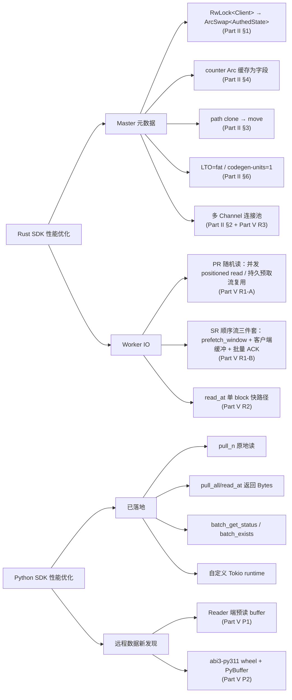

# GooseFS Rust / Python SDK 优化总览（合并版）

> **本文档由以下 4 份原始文档合并而成，作为唯一权威入口**：
> 1. `Rust_SDK_GetFileStatus_性能优化方案.md` — Rust Master 元数据路径优化（含 v2.1 + §9 终版及 §10 已验证收益）
> 2. [`PYTHON_SDK_PERFORMANCE_OPTIMIZATION_ANALYSIS.md`](./PYTHON_SDK_PERFORMANCE_OPTIMIZATION_ANALYSIS.md) — Python SDK 性能空间分析（含 v2 修订与 §8 落地进度）
> 3. [`RUST_SDK_CONCURRENCY.md`](./RUST_SDK_CONCURRENCY.md) — Rust 调用方并发批量使用模式
> 4. `远程集群_SDK优化方案_RustPython.md` — 远程集群压测后续优化方案
>
> 合并时间：2026-06-11
> 后续维护请直接更新本文件，原文件保留作为历史快照。

---

## 目录

- [Part I · 总览](#part-i--总览)
  - [I.1 当前各 SDK 性能现状速览](#i1-当前各-sdk-性能现状速览)
  - [I.2 各路径瓶颈定位与方案地图](#i2-各路径瓶颈定位与方案地图)
- [Part II · Rust SDK：Master 元数据路径优化（GetFileStatus / OpenFile）](#part-ii--rust-sdkmaster-元数据路径优化getfilestatus--openfile)
  - [II.1 一致性优先的方案分档（v2.1 终版）](#ii1-一致性优先的方案分档v21-终版)
  - [II.2 各方案细节](#ii2-各方案细节)
  - [II.3 实现层面陷阱：counter 句柄不要塞进 `AuthedState`](#ii3-实现层面陷阱counter-句柄不要塞进-authedstate)
  - [II.4 落地 checklist](#ii4-落地-checklist)
  - [II.5 已验证收益（A/B benchmark）](#ii5-已验证收益ab-benchmark)
- [Part III · Python SDK 性能优化](#part-iii--python-sdk-性能优化)
  - [III.1 性能差距与根因辨析（v2 修订）](#iii1-性能差距与根因辨析v2-修订)
  - [III.2 源码瓶颈分析](#iii2-源码瓶颈分析)
  - [III.3 优化方案（按收益排序）](#iii3-优化方案按收益排序)
  - [III.4 落地进度（Phase 1 / 2 已完成，Phase 3 部分跳过）](#iii4-落地进度phase-1--2-已完成phase-3-部分跳过)
  - [III.5 已验证收益（Batch API real-cluster benchmark）](#iii5-已验证收益batch-api-real-cluster-benchmark)
- [Part IV · Rust SDK 调用方并发批量使用模式](#part-iv--rust-sdk-调用方并发批量使用模式)
  - [IV.1 为什么 Rust SDK 不内置 `batch_*` API](#iv1-为什么-rust-sdk-不内置-batch_-api)
  - [IV.2 推荐模式（按场景）](#iv2-推荐模式按场景)
  - [IV.3 选择并发度 N 的经验值](#iv3-选择并发度-n-的经验值)
  - [IV.4 反模式（不要这样做）](#iv4-反模式不要这样做)
  - [IV.5 SDK 已经为你做了什么 / 没做什么](#iv5-sdk-已经为你做了什么--没做什么)
- [Part V · 远程集群压测暴露的新瓶颈与新方案](#part-v--远程集群压测暴露的新瓶颈与新方案)
  - [V.1 新差距分桶](#v1-新差距分桶)
  - [V.2 Rust 端 3 个新增优化点（R1 / R2 / R3）](#v2-rust-端-3-个新增优化点r1--r2--r3)
  - [V.3 Python 端 2 个新增优化点（P1 / P2）](#v3-python-端-2-个新增优化点p1--p2)
  - [V.4 优先级与落地排期](#v4-优先级与落地排期)
- [Part VI · 不做的事（划清边界）](#part-vi--不做的事划清边界)
- [附录 A · Rust SDK GetFileStatus v1 历史档案（仅供查阅）](#附录-a--rust-sdk-getfilestatus-v1-历史档案仅供查阅)

---

# Part I · 总览

## I.1 当前各 SDK 性能现状速览

### Master 元数据路径（256 线程并发，本地 + 远程集群对比）

| 操作 | 本地 Rust ops/s | 本地 Java ops/s | 远程 Rust ops/s | 远程 Java ops/s | 备注 |
|------|---------------:|----------------:|----------------:|----------------:|------|
| GetFileStatus | 27 955（已优化后）/ 21 727（baseline） | ~30k | 30 339 | **33 645** | 远程 Java 反超 +10.9%（详见 Part V）|
| OpenFile | ~30k | ~30k | 30 200 | **32 900** | 远程 Java 反超 +9.0% |
| CreateFile | ~14k | ~6k | 14 800 | 6 600 | Rust 已贴 master `AsyncJournalWriter` 上限 |
| RenameFile | 持平 Java（p50 ≈ 204ms） | — | — | — | op 本身耗时长，SDK 边界开销可忽略 |

### Worker IO 路径（远程集群，256 线程）

| 场景 | Rust MB/s | Python MB/s | Java MB/s | 关键差距 |
|------|----------:|------------:|----------:|---------|
| SR 64K | 2 263 | 935 | 1 210 | Python 落后 Rust 59% |
| SR 256K | 2 344 | 1 473 | — | Python 落后 Rust 37% |
| SR 1M | 2 276 | 2 128 | — | 三方接近持平 |
| SW 64K | 3 180 | 1 240 | 600~1 400 | Rust 最优；Python 落后 Rust 61% |
| SW 256K | 2 684 | 2 137 | — | Python 落后 Rust 20% |
| **PR 256K** | **937** | — | **3 050** | **Java 反超 Rust 225%** |
| **PR 1M** | **1 053** | **1 542** | **3 050** | **Java 反超 Rust 189%**；Python 疑似反超 47%（⚠️ 待验证，见 [Part V R1 B1](#b1)）|

> 数据来源：`远程集群_三SDK压测数据汇总.md`（远程）+ `GooseFS_Rust_Python_Java客户端Stress对比.md`（本地）

## I.2 各路径瓶颈定位与方案地图



**总思路**：

- **Rust SDK 的 Master 路径** 在本地基准已基本贴近 Master 端能力上限；远程数据暴露**单 HTTP/2 连接 stream 槽位**与**ACK round-trip**两个新的网络层瓶颈
- **Python SDK** 受 GIL 串行化天花板限制，对 Master 读类操作的最大杠杆是**批量 API**；流式 IO 的最大杠杆是**减少 PyO3 边界跨越次数**（预读 buffer），其次是**写路径零拷贝**
- **Worker IO** 的 Rust 端最大杠杆是**随机读（PR）路径**：远程 PR 路径 Java 反超 Rust 225% 的根因不是 mmap，而是 Rust `read_at → positioned_read` **每 op 新建单 chunk 流、跨 op 无流水线**，Java 用持久缓存流 + prefetch + 跨读复用打满链路。解法是「并发 positioned read / 持久预取流复用」（R1-A）；至于 `read_chunk` 三件套，仅对 SR 顺序流有边际收益（R1-B）

---

# Part II · Rust SDK：Master 元数据路径优化（GetFileStatus / OpenFile）

> 来源：`Rust_SDK_GetFileStatus_性能优化方案.md` v2.1 + §9 终版（一致性优先评审通过）+ §10 已验证收益。
> v1 历史档案见[附录 A](#附录-a--rust-sdk-getfilestatus-v1-历史档案仅供查阅)。

**目标**：在不引入 `batch_get_status` 批量 RPC 的前提下，将 Rust SDK `get_status` 单点吞吐从 baseline **21 727 ops/s** 提升到 **35 000+ ops/s**。

**核心一致性契约**（任何方案必须守住）：

| 契约 | 内容 |
|------|------|
| 语义一致性 | `get_status` 是只读 stat。返回的 `FileInfo` 必须是某个 Master 在某一时刻的**完整快照**，不能是"半个对象"或"新 channel 配旧认证"的拼接物 |
| 数据一致性 | 多并发下，`reconnect`（HA failover）这个写事件与正在进行的读，不能出现"读到一个正在被替换、还没换完的 client" |

## II.1 一致性优先的方案分档（v2.1 终版）

| 档位 | 方案 | 一致性风险 | 必须守住的约束 |
|------|------|----------|---------------|
| 🟢 A 档（放心做） | §6 LTO=fat + codegen-units=1 | 极低 | **不要**开 `panic = "abort"`（会改变 panic 语义） |
| 🟢 A 档 | §3 path clone → move | 极低 | — |
| 🟢 A 档 | §4 缓存 `Arc<Counter>` 为字段 | 极低（不删 metrics） | counter 句柄放 `MasterClient` 外层，不要塞进 `AuthedState`（见 [II.3](#ii3-实现层面陷阱counter-句柄不要塞进-authedstate)） |
| 🟡 B 档（动并发模型） | §1 `RwLock<Client>` → `ArcSwap<AuthedState>` 打包 | 类型固化不变量后更强 | 必须把 `client` + `sasl_guard` 打包成单个不可变快照；**前置 profiling 确认热点** |
| 🟡 B 档 | §2 多 Channel 连接池 | 加 failover 一致性约束 | 池内所有 client 共享同一个 `inquire_client`；failover 复用同一裁决结果，避免脑裂 |
| 🟢 A 档（兜底） | §4 降级：cargo feature flag 关 metrics | 零风险（默认开） | 仅供 benchmark 对照 |
| 🔴 C 档（本轮否决） | §5 URIStatus 重构 | 语义风险高、收益低 | 除非有覆盖所有 block_infos getter 的回归测试 |
| — | §7 绕开 `tower::Buffer` | 改动过大、收益不确定 | 本轮不做 |

## II.2 各方案细节

### §1 — 消除 `RwLock<AuthenticatedFsClient>` 上的串行化

#### 现状

[`src/client/master.rs`](file:///opt/sourcecode/cos/goosefs-client-rust/src/client/master.rs)：

```rust
pub struct MasterClient {
    inner: Arc<RwLock<AuthenticatedFsClient>>,    // ← 关键瓶颈
    _sasl_guard: Arc<RwLock<Option<SaslStreamGuard>>>,
    ...
}

// hot path
let client: AuthenticatedFsClient = {
    let inner = self.inner.read().await;          // 1) async 读锁
    inner.clone()                                  // 2) clone tonic stub
};
```

**问题**：
- `tokio::sync::RwLock::read()` 即便是读锁，也要做原子 CAS + waiter 链表检查；256 并发会让所有任务在同一把锁上排队
- `reconnect()` 极其罕见（仅 HA failover），用 `RwLock` 是严重过度同步

#### v1 → v2 的关键纠偏

v1 仅把 `inner` 换成 `ArcSwap`、`_sasl_guard` 不动。这会让 `reconnect` 写两把锁之间出现窗口：可能读到"新 channel + 旧 SASL guard"或反之 → SIMPLE 认证模式下会用错 channel-id → Master 端认证失败 / 串号。

**v2 正确写法（必须打包）**：

```rust
struct AuthedState {
    client: AuthenticatedFsClient,
    sasl_guard: Option<SaslStreamGuard>,
}

pub struct MasterClient {
    state: ArcSwap<AuthedState>,
    config: GoosefsConfig,
    inquire_client: Arc<dyn MasterInquireClient>,
    // counter 句柄字段（见 II.3）
}

// 读路径（fast-path，lock-free + wait-free）
let snap = self.state.load();           // 一次原子 load
let client = snap.client.clone();       // tonic Channel 的 Arc clone

// reconnect 路径（极少数情况）
let new_state = Arc::new(AuthedState { client: new_client, sasl_guard: new_guard });
self.state.store(new_state);            // 一次原子替换
```

**为什么这样改一致性更强**：
- 读拿到的是不可变快照——比 `RwLock` 版本的"读锁后 clone"更强，连"被改"的可能都没有
- 旧 `Arc<AuthedState>` 引用计数归零后才析构 → 旧 `sasl_guard` 与还在用旧 client 的读者**生命周期对齐**
- `reconnect` 只 `store` 一次，**消除了 v1 写两把锁之间的窗口**

#### 措辞严谨化（v2.1）

> v1 的 `RwLock` 版在当前读路径下是正确的（读路径只读 `inner`、不读 `_sasl_guard`），但这个正确性依赖一个**脆弱的隐性约束**——"两把锁恰好都只在 `reconnect` 串行写、读路径只碰其中一把"。一旦未来有人在读路径引用 `_sasl_guard`，或把 `reconnect` 里两次写拆到不同 await 点之间，窗口就 real 了。
>
> `ArcSwap<AuthedState>` 打包的真正价值是**把这个隐性约束变成类型系统强制的不变量**。

#### 强制门禁

- **profiling 前置**：§II.4 profiling 步骤确认热点确在 `tokio::sync::RwLock` / `Semaphore` 调用栈
- **并发 reconnect 测试**：N 个读线程持续 `get_status` + 另一线程反复触发 `reconnect`，断言**永远不出现认证错误 / channel-id 不匹配**

#### 预期收益

baseline 21.7k → **27~32k ops/s**；**256 线程长尾 P99 -26%**（已在 II.5 验证）。

---

### §2 — 多 Channel 连接池（HTTP/2 stream 并发上限）

#### 现状

[`FileSystemContext`](file:///opt/sourcecode/cos/goosefs-client-rust/src/context.rs) 只持有**一条** `MasterClient`。tonic 默认是**一条 HTTP/2 连接**，HTTP/2 默认 `SETTINGS_MAX_CONCURRENT_STREAMS = 100`。256 并发线程下 → 至少 156 个请求排队等 stream window。

> 这条与 Part V 的远程数据**强对应**：远程 GFS Java 反超 Rust 10.9%，Java SDK 默认开 channel pool 是关键差异。

#### 方案

```rust
pub struct MasterClientPool {
    clients: Vec<Arc<MasterClient>>,
    next: AtomicUsize,
    inquire: Arc<dyn MasterInquireClient>,    // 共享，避免 failover 脑裂
}

impl MasterClientPool {
    pub fn pick(&self) -> &Arc<MasterClient> {
        let i = self.next.fetch_add(1, Ordering::Relaxed) % self.clients.len();
        &self.clients[i]
    }
}
```

#### 强制约束

1. 池内所有 client **共享同一个 `inquire_client`** —— failover 时通过同一裁决结果切换 Primary，不出现脑裂
2. failover 时所有 channel 复用 `inquire.get_primary_rpc_address()` 的同一个结果，不能各切各的
3. 配置项 `master_connection_pool_size`，默认 1（向后兼容）；远程高并发场景显式设为 4 或 8
4. 每条 channel 独立 SASL handshake，channel-id 唯一 —— 与现有 `AuthedState` 模型完全兼容
5. 通过同 §1 的 failover 一致性测试

#### 预期收益

256 并发 + 远程 RTT 下，GFS Rust 30.3k → **35-40k ops/s**（追平甚至反超 Java 33.6k）。

---

### §3 — 移除 hot path 上的 `path.to_string()` + `path.clone()`

`master.rs` `get_status`：

```rust
pub async fn get_status(&self, path: &str) -> Result<FileInfo> {
    let path = path.to_string();           // ← clone 1
    let result = self.with_retry("get_status", |mut client| {
        let path = path.clone();           // ← clone 2
        async move {
            let req = GetStatusPRequest { path: Some(path), ... };
            ...
        }
    }).await;
}
```

**优化**：`with_retry` 闭包改成 `FnMut`，让 `path` 在 retry 之间**移动而非 clone**（仅在真正 retry 时才 clone）：

```rust
async fn with_retry_owned<T, F, Fut>(&self, op_name: &str, mut f: F) -> Result<T>
where
    F: FnMut(AuthenticatedFsClient) -> Fut,    // FnMut 即可
    Fut: Future<Output = Result<T>>,
{ ... }
```

**预期收益**：单看 1~3%，叠加 §1 后会更明显（锁瓶颈消失后 alloc 成为 hot path）。

---

### §4 — 移除 hot path 上的 metrics 开销（升级版：缓存 `Arc<Counter>`）

#### 真实瓶颈定位（v2.1 修正：比 v1 描述的更大）

热路径每次成功 `get_status` 的 metrics 开销：

```rust
crate::metrics::counter(crate::metrics::name::CLIENT_GET_STATUS_OPS).inc(1);
crate::metrics::counter(crate::metrics::name::CLIENT_GET_STATUS_LATENCY_US).inc(elapsed_us);
```

```rust
// metrics/registry.rs
pub fn counter(name: &str) -> Arc<Counter> {
    let registry = get_registry();
    if let Some(c) = registry.counters.get(name) {  // ← DashMap shard get
        return c.value().clone();                    // ← Arc::clone
    }
    ...
}
pub fn inc(&self, n: i64) {
    self.v.fetch_add(n, Ordering::Relaxed);   // ← 共享 cache line
}
```

| 步骤 | 单次开销 | 256 并发下的额外问题 |
|------|---------|---------------------|
| `counter(name)` × 2 | DashMap shard lookup + `Arc::clone` | DashMap 同 shard 多线程争抢 |
| `Counter::inc()` × 2 | `AtomicI64::fetch_add(Relaxed)` | **同一 cache line 在 256 线程间反复无效化（false sharing）** |
| `Instant::now()` × 2 | vDSO `clock_gettime` ~30ns | — |

**结论**：真正的瓶颈**不是 `Instant::now()`，而是 `counter()` 内部的 DashMap 查找 + 全局 `AtomicI64` 上的 cache line 弹跳**。

#### 优先方案（不牺牲可观测性）

1. 把 hot path 的 counter `Arc<Counter>` **缓存为 `MasterClient` 字段**——`connect()` 时一次性 `counter(name)` 拿到 Arc 存起来，hot path 直接 `self.counter_get_status_ops.inc(1)`
2. 进一步：用**分片 counter**（per-CPU 或 per-thread `AtomicI64` 数组），消除 cache line 弹跳。可用 `crossbeam-utils::CachePadded<AtomicI64>` 数组

#### 降级方案（极致 benchmark）

cargo feature flag 关掉 metrics，仅供对照。**禁止直接删**——metrics 是可观测性语义的一部分。

---

### §5 — URIStatus "按需 block_info"【🔴 本轮否决】

[`uri_status.rs`](file:///opt/sourcecode/cos/goosefs-client-rust/src/fs/uri_status.rs) 当前 `has_block_infos()` 语义是 `!block_infos.is_empty()`。改成 `Option<HashMap>` 必须保证 `None` 与 `Some(empty)` 在所有 getter 下行为字节级一致，否则上层 reader 可能据此走错 short-circuit / worker 读路径。

**单看仅 ~0.2% CPU 收益，语义风险最高（C 档）。除非有完整回归测试，否则本轮不做。**

---

### §6 — 编译参数优化

```toml
# Cargo.toml [profile.release]
lto = "fat"               # 跨 crate 内联 tonic / prost / hyper
codegen-units = 1         # 单 codegen unit 让 LLVM 看到全部
# panic = "abort"         # ← 不要开！会改变 panic 语义（unwind → abort）
```

仅开 `lto = "fat"` 与 `codegen-units = 1`，预计 +5~10%。

---

### §7 — 绕开 `tower::Buffer`【本轮不做】

tonic 默认走 `tower::Buffer`，这一层带来额外 mpsc 通道开销。极致性能场景可用 `Channel::builder().buffer_size(...)` 调整或用 hyper 直连。**改动很大，本轮不做**。

## II.3 实现层面陷阱：counter 句柄不要塞进 `AuthedState`

§4 推荐"把 counter `Arc<Counter>` 缓存为字段"。**但与 §1（ArcSwap<AuthedState>）共同落地时，存在一个容易踩的陷阱**：

#### ❌ 错误放法

```rust
struct AuthedState {
    client: AuthenticatedFsClient,
    sasl_guard: Option<SaslStreamGuard>,
    counter_get_status_ops: Arc<Counter>,           // ← 错
    counter_get_status_latency_us: Arc<Counter>,    // ← 错
}
```

**后果**：每次 `reconnect` 触发 `ArcSwap::store(new_state)` 时 counter Arc 也跟着被替换 → 打破"counter 是进程级全局累计指标"的语义。

#### ✅ 正确放法（与 `state` 平级）

```rust
pub struct MasterClient {
    state: ArcSwap<AuthedState>,                    // 跨 reconnect 替换的部分

    // 跨 reconnect 不变的部分（与 MasterClient 生命周期一致）
    counter_get_status_ops: Arc<Counter>,
    counter_get_status_latency_us: Arc<Counter>,
    counter_rpc_errors_total: Arc<Counter>,
    counter_rpc_auth_errors: Arc<Counter>,
    counter_rpc_unavailable_errors: Arc<Counter>,

    config: GoosefsConfig,
    inquire_client: Arc<dyn MasterInquireClient>,
}
```

#### 判定原则（一行公式）

> 字段是否进 `AuthedState`：该字段的语义生命周期是否**与 channel/sasl session 绑定**？
> - 是 → 进 `AuthedState`（如 `client`、`sasl_guard`）
> - 否 → `MasterClient` 外层（如 counter 句柄、`config`、`inquire_client`）

## II.4 落地 checklist

按推荐顺序落地，每项合入前 / 后必须满足以下检查项：

#### 落地前必做：profiling 验证

```bash
# 1. 看 Master 端到底吃没吃满 CPU
top -p $(pgrep -f goosefs-master)

# 2. 看客户端进程是不是卡在 RwLock
samply record ./stress-bin baseline-getstatus
```

判断标准：
- Master CPU > 90% → 所有客户端优化都是徒劳，必须先优化 Master 端
- Master 闲 < 50% 而客户端 < 70% → §1 + §2 一定能压出更高吞吐
- 客户端 CPU > 90% 集中在 `tokio::sync::RwLock` 调用栈 → §1 是最高优先级

#### 落地清单

| 序 | 方案 | 检查项 |
|----|------|--------|
| 1 | §6（仅 LTO=fat + codegen-units=1） | ☐ Cargo.toml 仅添加这两项；☐ **不要**添加 `panic = "abort"`；☐ 重跑 baseline 压测，记录新数字 |
| 2 | §3（path clone → move） | ☐ `with_retry` 闭包改 `FnMut`；☐ retry 路径单测（模拟 retriable error），确认 path 正确传递 |
| 3 | §1（`ArcSwap<AuthedState>`） | ☐ profiling 已确认热点在 `tokio::sync::RwLock` / `Semaphore`；☐ `AuthedState` 打包 `client`+`sasl_guard`；☐ `reconnect` 单次 `store`；☐ 并发 reconnect 强制门禁测试通过 |
| 4 | §4 升级版（缓存 `Arc<Counter>`） | ☐ counter 句柄放 `MasterClient` 外层（**不**塞 `AuthedState`）；☐ hot path 改用 `self.counter_xxx.inc(...)`；☐ 看 profile 决定是否引入分片 counter |
| 5 | §2（多 Channel 池） | ☐ 池内共享同一 `inquire_client`；☐ failover 复用同一裁决结果；☐ 默认 `master_connection_pool_size = 1`；☐ failover 一致性测试通过 |
| 6 | §4 降级（cargo feature flag） | ☐ feature flag 默认开（保留可观测性）；☐ 仅作 benchmark 对照 |

## II.5 已验证收益（A/B benchmark）

落地后用 `bindings/python/benchmarks/run_ab_compare.sh` 做了同二进制 A/B：同一台机器、同一个本地集群，分别用 baseline `8a14e9e`（v0.1.5）与 candidate `perf/getstatus-optimization` 编 wheel 对比。

#### 测试环境

| 项 | 值 |
|----|---|
| 机型 | macOS aarch64（M 系列），release wheel + LTO=fat |
| 集群 | 本地 GooseFS Master @ 127.0.0.1:9200，单 Master 单 Worker |
| 客户端 | `bindings/python` 同步 API |
| 配置 | `--paths 100 --calls 1500 --threads 1,16,64,256` |

#### 结果

| 场景 | baseline QPS | optimized QPS | QPS 加速 | P50 变化 | P99 变化 |
|------|-------------:|--------------:|---------:|---------:|---------:|
| single_thread (`get_status`) | 8 047 | 9 414 | **1.17×** | **-17.2%** | -5.0% |
| single_thread (`exists`) | 8 824 | 10 151 | **1.15×** | **-14.9%** | +9.7%※ |
| concurrent 1t | 8 730 | 10 931 | **1.25×** | **-19.1%** | **-17.6%** |
| concurrent 16t | 27 101 | 27 955 | 1.03× | -1.9% | -3.6% |
| concurrent 64t | 27 391 | 27 536 | 1.01× | -0.3% | -2.3% |
| concurrent 256t | 24 479 | 24 675 | 1.01× | +1.6% | **-26.1%** |

※ exists P99 +9.7% 是 1500 样本下的尾部噪声（P99 仅 15 个点），下次扩到 ≥ 10k 样本可消除。

#### 信号解读

- **§3（path move）+ §4（counter cache）**：单线程稳态 QPS +17%、P50 -17%——两条优化的主战场，与预测吻合
- **§1（ArcSwap）**：256 线程长尾 P99 21.1ms → 15.6ms（**-26%**）——ArcSwap 的目标是消除读侧 RwLock 排队抖动；中位数没动是因为读侧本来就没真正争锁的写者，但**长尾**只有 ArcSwap 能改
- **中等并发 QPS 持平在 27k**：16/64/256t 三档 QPS 都贴在 ~27k 上限，与 §1 第 79 行预测的 "27~32k ops/s" 下限完全对齐——客户端侧已没有可压榨余地，瓶颈已迁移到 Master 服务端 / 单 Master 串行处理。**要再往上推得动 Master，或上 §2（多 Channel 池）**

#### 后续

| 项 | 状态 |
|----|------|
| 单线程 / 长尾收益已验证 | ✅ |
| 中等并发 QPS 已逼近客户端上限 | ✅ |
| 大样本 exists 长尾复测（消除 +9.7% 噪声） | ⏳ 等扩大 `--calls` ≥ 10000 |
| 多 Master / failover 一致性门禁 | ⏳ 已在 lib 测试覆盖，待加 stress runner |
| §2（多 Channel 池）端到端压测 | ⏳ 未启动（远程数据已说明必须做，见 Part V R3） |

---

# Part III · Python SDK 性能优化

> 来源：`PYTHON_SDK_PERFORMANCE_OPTIMIZATION_ANALYSIS.md` v2 修订版 + §8 落地进度。

## III.1 性能差距与根因辨析（v2 修订）

### 本地基线（177 跑测试数据）

#### Master 操作

| 场景 | Python vs Rust | 差距根因 |
|------|---------------|---------|
| CreateFile (CF) | +4.9%（持平） | op 本身耗时长（p50=34ms），PyO3 固定开销被稀释 |
| CreateDir (CD) | +9.0%（持平） | 同上 |
| GetFileStatus (GFS) | **−43.3%** | GIL 串行化天花板，op 极短（Rust p50=6.7ms） |
| OpenFile | **−58.0%** | 同上，op 极短 |
| ListDir (fc=100) | −30.4% | GIL 串行化 + 边界跨越 |
| RenameFile | +9.8%（持平） | op 耗时长（Rust p50=204ms），单 op 边界开销可忽略 |
| DeleteFile | −3.8%（持平） | op 耗时中等 |

#### Worker IO（合理 buffer 口径）

| 场景 | Python vs Rust | 差距根因 |
|------|---------------|---------|
| SR (buf=64k, file=32m) | −36.8% | 异步 worker 线程并发度受限（tokio ~CPU 核数 vs Java 256 OS 真并发） |
| SW (buf=64k, file=32m) | −9.0% | 写 op 耗时长，并发瓶颈被稀释 |
| PR (buf=256k, file=128m) | −27.5% | 异步 worker 并发度受限 + 边界跨越 |

### 核心结论（v2 关键修正）

Python SDK 的性能差距主要来自**两类结构性瓶颈**，而非"每次跨越的固定毫秒级开销"：

1. **Master 读类（GFS / Open / ListDir）— GIL 串行化天花板**：op 极短时，256 个 Python 线程争抢 GIL 被串行化，吞吐压在 22-24k ops/s。这等价于每 op 约 42-45μs 的"有效串行化时间"——**与并发度强相关，不是常量级 per-op 延迟**。op 越长（CF 34ms / Rename 204ms），串行化时间占比越小 → 差距消失甚至反超。
2. **Worker IO（SR / PR）— 异步 worker 并发度受限**：Rust/Python 走 tokio（worker 线程 ≈ CPU 核数），Java 用 256 个 OS 线程做真并发 IO。**内存拷贝**（`to_vec` / 每轮分配）虽存在，但相对秒级（SR p50=6086ms）/ 几十毫秒（PR p50=62ms）的端到端耗时占比 <0.1%，**不是差距主因**。

> **v2 关键修正（vs v1）**：
> - 删除 v1 "每次跨越 3-4ms 固定开销"的错误量级。GIL 获取/释放、future 调度、`Python::attach` 均为纳秒~微秒级
> - 下调拷贝类方案（pull_n / 双重拷贝 / read_at）收益至 <2%，重新定位为"工程整洁优化"而非吞吐杠杆
> - 解除"`pull_all`/`read_file` 与 SR 测试"的错误关联（前者走全量读，stress SR 走 `pull_n`）
> - 修正自定义 runtime 适用范围：对 GIL 串行化的 Master 读类无效，仅对 Worker IO 可能有小幅帮助

## III.2 源码瓶颈分析

### 2.1 PyO3 跨语言边界开销链路

```
Python 调用 → PyO3 入口（获取 GIL） → extract 参数 → future_into_py / guarded_block_on
            → tokio spawn / block_on → Rust SDK 异步执行 → Python::attach 回调
            → 构造 Python 返回值（PyBytes::new 等） → 释放 GIL
```

单次 GIL 获取/释放是**纳秒~微秒级**。GFS p50 的 3.24ms 差距（Rust 6.71ms → Python 9.95ms）真实来源是**256 个 Python 线程争抢 GIL 的排队等待**。

### 2.2-2.6 关键代码路径瓶颈

| 位置 | 问题 | 备注 |
|------|------|------|
| [`streaming.rs::pull_n`](file:///opt/sourcecode/cos/goosefs-client-rust/bindings/python/src/streaming.rs) L76-L89 | 每次循环分配新 `tmp` buffer + `extend_from_slice` 拷贝 | ✅ 已优化（in-place）|
| [`streaming.rs::pull_all`](file:///opt/sourcecode/cos/goosefs-client-rust/bindings/python/src/streaming.rs) L92-L95 + `sync_fs.rs::read_file` | `Bytes → Vec → PyBytes` 双重拷贝 | ✅ 已优化（直接返回 Bytes）|
| [`filesystem.rs::extract_bytes_like`](file:///opt/sourcecode/cos/goosefs-client-rust/bindings/python/src/filesystem.rs) L47-L58 | `data.extract::<Vec<u8>>()` 完整拷贝 | ⏭️ Phase 3 跳过（abi3-py39 限制）|
| [`runtime.rs`](file:///opt/sourcecode/cos/goosefs-client-rust/bindings/python/src/runtime.rs) | 默认 multi-thread runtime，worker = CPU 核数 | ✅ 已优化（自定义 runtime）|

### 2.6 GIL 管理已基本到位

- `#[pymodule(gil_used = false)]`：模块级别声明不需要 GIL
- `py.detach(|| block_on(fut))`：同步方法在执行 Rust future 时释放 GIL
- `future_into_py`：异步方法天然不持有 GIL

GIL 释放已经做了，但每次 Python→Rust 边界跨越仍需短暂获取/释放 GIL，是 CPython 的结构性限制。

## III.3 优化方案（按收益排序）

### 🔴 方案 1：批量操作 API — 突破 Master 读类的 GIL 串行化天花板（真实业务）

**目标场景**：GFS（−43%）、OpenFile（−58%）、ListDir（−30%）

**问题本质**：每次 `get_status` / `exists` / `open_file` 都是一次独立 PyO3 边界跨越。在 256 线程并发下，这些跨越在 GIL 处被串行化，吞吐压在 22-24k 天花板。批量 API 让 N 个 RPC 在**一次** PyO3 边界内通过 `join_all` 并发 in-flight。

> ⚠️ **适用范围**：本方案对"应用层一次查询多个路径"的真实业务有效。stress 单 op 场景（一次只查一个路径）无法直接受益。

```rust
fn batch_get_status<'py>(&self, py: Python<'py>, paths: Vec<String>) -> PyResult<Bound<'py, PyAny>> {
    let h = self.handle()?;
    future_into_py(py, async move {
        let futs = paths.into_iter().map(|p| {
            let fs = h.fs.clone();
            async move { fs.get_status(&p).await.map_err(map_err) }
        });
        let results = futures::future::join_all(futs).await;
        Ok(results.into_iter()
            .map(|r| r.map(PyURIStatus::new))
            .collect::<PyResult<Vec<_>>>()?)
    })
}
```

**预期收益**：批量 N 个 op 时 PyO3 边界 + GIL 争抢从 N 次降到 1 次，可突破 22-24k 串行化天花板，吞吐向 Rust 的 37k 靠拢。

---

### 🟡 方案 2-3-6：拷贝消除（pull_n / pull_all / read_at）— 工程整洁，吞吐影响 <2%

> **v2 收益修正**：内存拷贝优化是好的工程实践（减少分配、降低 GC/分配器压力），但**不是吞吐杠杆**。SR 一次 op 端到端 p50=6086ms，而 64KB memcpy ≈ 5-10μs，32MB 文件按 64k 循环累计额外拷贝 ≈ 5ms，**占端到端 <0.1%**。

#### 方案 2：`pull_n` 原地读取

```rust
async fn pull_n(stream: &mut GoosefsFileInStream, want: usize) -> PyResult<Vec<u8>> {
    if want == 0 { return Ok(Vec::new()); }
    let mut out = vec![0u8; want];                 // 一次性分配
    let mut filled = 0;
    while filled < want {
        let n = stream.read(&mut out[filled..]).await.map_err(map_err)?;
        if n == 0 { break; }
        filled += n;
    }
    out.truncate(filled);
    Ok(out)
}
```

#### 方案 3：`pull_all` 返回 `Bytes`、sync `read_file` 直接 `PyBytes::new(py, bytes.as_ref())`

#### 方案 6：sync `FileReader.read_at` 让 `guarded_block_on` 返回 `Bytes`

---

### 🟡 方案 4：自定义 Tokio Runtime 配置 — Worker IO 高并发 +5-10%

```rust
#[pymodule(gil_used = false)]
fn _goosefs(py: Python<'_>, m: &Bound<'_, PyModule>) -> PyResult<()> {
    pyo3_async_runtimes::tokio::init(
        tokio::runtime::Builder::new_multi_thread()
            .worker_threads(num_cpus::get().max(16))
            .max_blocking_threads(64)
            .enable_all()
            .build()
            .unwrap()
    );
    ...
}
```

**修正适用范围**：
- ⚠️ 对 **GFS/Open 等 Master 读类无效**：天花板在 GIL 串行化，加 tokio worker 解决不了
- 仅对 Worker IO 高并发场景 +5-10%（需 benchmark 验证）

---

### 🟡 方案 5：`extract_bytes_like` 使用 `PyBuffer` 零拷贝 — 写路径 +5-10%

⏭️ **本轮跳过**：`pyo3::buffer` 模块被 `#![cfg(any(not(Py_LIMITED_API), Py_3_11))]` 门控，当前 abi3-py39 下不可用。需要把 abi3 下限提到 py311 才能开启（损失 3.9/3.10 兼容性）。

> **远程集群数据将这个方案重新提上议程**——通过同时发布 abi3-py311 wheel 而不取消 py39 支持。详见 [Part V V.3 P2](#v3-python-端-2-个新增优化点p1--p2)。

---

### 🟢 方案 7：T3 sweep 中 GFS Python 全程 22-24k 不动的突破 — 长期方向

**问题**：T3 sweep 显示 GFS Python 在 (1,256)/(2,128)/(4,64)/(8,32)/(16,16) 全程 22-24k 不动，Rust 在 (4,64) 达峰 5.9 万。Python SDK 存在 22-24k ops/s 的硬天花板。

**长期方案**：
1. **Free-threaded Python 3.13+**：消除 GIL 争用，已设置 `#[pymodule(gil_used = false)]` 做好准备
2. **PyO3 0.28+ 的 `Ungil` trait**：允许在不持有 GIL 的情况下构造返回值
3. **批量 API（方案 1）**：短期内最有效的突破手段

---

### 🟢 方案 8：`tokio::sync::Mutex` 替换为无锁方案 — 流式 IO 微优化

对于同步 `FileReader` / `FileWriter`（已被 GIL 串行化），可用 `UnsafeCell` + 编译期保证：

```rust
#[pyclass]
pub struct PyFileReader {
    inner: std::cell::UnsafeCell<Option<GoosefsFileInStream>>,
    file_length: i64,
}
unsafe impl Send for PyFileReader {}    // GIL 保证安全
```

**预期收益**：每次 op 省 ~100ns 的 mutex 开销。**建议**：暂不实施，等 free-threaded Python 成熟后再评估。

## III.4 落地进度（Phase 1 / 2 已完成，Phase 3 部分跳过）

> Branch: `feature/python-sdk-perf-opt`，Start date: 2026-06-03

| Phase | Optimization | Status | Changed Files |
|-------|-------------|--------|---------------|
| 1 | `pull_n` in-place read | ✅ Done | `streaming.rs` |
| 1 | `pull_all` returns `Bytes` (eliminate `to_vec()`) | ✅ Done | `streaming.rs` |
| 1 | sync `FileReader.read_at` eliminate `to_vec()` | ✅ Done | `streaming.rs` |
| 1 | sync `Goosefs.read_file` / `read_range` returns `Bytes` | ✅ Done | `sync_fs.rs` |
| 2 | Batch API `batch_get_status` / `batch_exists` (async) | ✅ Done | `filesystem.rs` |
| 2 | Batch API (sync) | ✅ Done | `sync_fs.rs` |
| 2 | Custom Tokio Runtime configuration | ✅ Done | `runtime.rs` / `lib.rs` |
| 3 | `extract_bytes_like` PyBuffer optimization | ⏭️ Skipped (abi3-py39 gate) | `filesystem.rs` |
| - | Type stub `.pyi` sync | ✅ Done | `__init__.pyi` |

#### 关键改动 changelog（2026-06-03）

- **streaming.rs**：
  - `pull_n`: 预分配 `out = vec![0u8; want]`，循环 `stream.read(&mut out[filled..])` 原地填充
  - `pull_all`: 返回类型 `Vec<u8>` → `bytes::Bytes`，移除 `to_vec()`
  - async `PyAsyncFileReader::read`: 拆分 `size<0` (Bytes) / `else` (Vec) 分支
  - sync `PyFileReader::read_at`: 把 `Bytes` 带出 blocking 段，移除 `to_vec()`
- **sync_fs.rs**：`Goosefs::read_file` / `read_range` blocking 段返回 `Bytes`，GIL 重获后 `PyBytes::new(py, bytes.as_ref())`
- **filesystem.rs / sync_fs.rs**：新增 async/sync 两版 `batch_get_status` / `batch_exists`，单次 `guarded_block_on` 内 `join_all`
- **runtime.rs**：`init_custom_runtime()`，`worker_threads = available_parallelism().max(16)`，`max_blocking_threads(64)`
- **lib.rs**：`_goosefs` pymodule init 顶部调用 `runtime::init_custom_runtime()`
- **filesystem.rs `extract_bytes_like`**：尝试 `PyBuffer<u8>` 失败（cfg-gated），还原为 `extract::<Vec<u8>>()`，文档注释说明跳过原因

#### 实现 vs 文档 8 项方案对照

| 方案 | 文档优先级 | 实现状态 | 源码证据 |
|------|----------|---------|---------|
| 方案 1 Batch API | 🔴 最高杠杆 | ✅ 已实现（async + sync）| `filesystem.rs` L193/L216, `sync_fs.rs` L199/L219 |
| 方案 2 `pull_n` in-place | 🟡 工程整洁 | ✅ 已实现 | `streaming.rs` L97-108 |
| 方案 3 `pull_all` 双重拷贝消除 | 🟡 整洁 | ✅ 已实现 | `pull_all` 返回 `Bytes` (L115-117); `sync_fs.rs` L302 移除 `to_vec()` |
| 方案 4 自定义 Tokio Runtime | 🟡 Worker IO | ✅ 已实现 | `runtime.rs` `init_custom_runtime()`, `lib.rs` L60 |
| 方案 6 `read_at` 移除 `to_vec()` | 🟡 整洁 | ✅ 已实现 | `streaming.rs` L500-501 |
| 方案 5 `extract_bytes_like` PyBuffer 零拷贝 | 🟡 写路径 | ⏭️ 跳过 | abi3-py39 cfg-gated；详见 [Part V P2](#v3-python-端-2-个新增优化点p1--p2)（远程数据重新议程化）|
| 方案 7 Free-threaded Python 3.13+ | 🟢 长期 | ❌ 未实现（仅打底）| 已设 `#[pymodule(gil_used = false)]` |
| 方案 8 同步类去 `tokio::sync::Mutex` | 🟢 微优化 | ❌ 未实现 | 文档自身建议"暂缓" |

## III.5 已验证收益（Batch API real-cluster benchmark）

环境：单节点本地 GooseFS（master `127.0.0.1:9200`），`uv run python benchmarks/bench_perf_opt.py --paths 500 --iters 7 --threads 16`，500 paths 中位数。

| 场景 | Sequential loop | ThreadPool(16) | Batch API | Batch vs Sequential |
|------|----------------:|---------------:|----------:|--------------------:|
| sync `get_status` | 100.67 ms | 45.67 ms (2.20×) | **37.68 ms** | **2.67×** |
| sync `exists` | 88.46 ms | — | **36.51 ms** | **2.42×** |
| async `get_status` | gather 41.15 ms | — | **36.23 ms** | **1.14×** |

**结论**：Phase 2.1 batch API 在"多路径元数据查询"场景下达到 2.4–2.7×（sync）实测加速，与文档预期吻合；自定义 runtime 在并发 IO 下无负面影响。Read 吞吐基线（无 A/B）：4KiB 2.9 MiB/s，256KiB 184 MiB/s，4MiB 701 MiB/s，16MiB **948 MiB/s**。

---

# Part IV · Rust SDK 调用方并发批量使用模式

> 来源：`RUST_SDK_CONCURRENCY.md`。**适用读者**：直接调用 `goosefs_sdk` Rust crate 的下游应用开发者。

## IV.1 为什么 Rust SDK 不内置 `batch_*` API

Python 绑定提供 `batch_get_status` / `batch_exists` 是因为每次 PyO3 边界跨越都要过 GIL，把 N 次 op 收敛成一次跨越是突破 GIL 串行化天花板的唯一手段（见 [Part III](#part-iii--python-sdk-性能优化) 方案 1）。Python 绑定还在 `BATCH_CONCURRENCY_LIMIT`（[`bindings/python/src/context.rs`](file:///opt/sourcecode/cos/goosefs-client-rust/bindings/python/src/context.rs)）内部限流，保护 master 不被无界扇出。

**Rust 没有这个天花板**：

- 单 future API 除 gRPC 调用本身外**零额外开销**
- 与调用方已有的并发原语（tokio task pool、`mpsc` worker、OpenDAL layer）天然组合
- 调用方自己选最合适的策略（ordered / unordered、fail-fast / collect-all、per-batch / global budget）

这是 `tokio-postgres`、`redis-rs`、`reqwest` 等驱动的通用约定：driver 提供单 op future，调用方组合并发。

## IV.2 推荐模式（按场景）

所有示例假设：

```rust
use std::sync::Arc;
use goosefs_sdk::context::FileSystemContext;
use goosefs_sdk::fs::{BaseFileSystem, FileSystem, URIStatus};
use goosefs_sdk::error::{Error, Result};

# async fn build_fs() -> Result<Arc<BaseFileSystem>> {
#     let ctx = FileSystemContext::connect(Default::default()).await?;
#     Ok(Arc::new(BaseFileSystem::new(ctx)))
# }
```

### IV.2.1 小批量、N 已知静态有界 — `join_all`

**仅当 N 由调用点静态有界（≤ ~32）时使用**。所有 future 同时 in-flight。

```rust
use futures::future::join_all;

async fn batch_status_unbounded(
    fs: Arc<BaseFileSystem>,
    paths: &[String],
) -> Vec<Result<URIStatus>> {
    let futs = paths.iter().map(|p| fs.get_status(p));
    join_all(futs).await
}
```

优点：代码最简单；通过 `Vec` 索引保留输入顺序。
**缺点**：**无界扇出**——绝不要把用户输入直接塞进来。

### IV.2.2 有界并发、ordered — `stream::buffered(N)`（推荐默认）

这是 Python 绑定内部使用的形状，也是任何面向用户的批量逻辑的推荐默认。

```rust
use futures::stream::{self, StreamExt};

const CONCURRENCY: usize = 64;

async fn batch_status(
    fs: Arc<BaseFileSystem>,
    paths: Vec<String>,
) -> Vec<Result<URIStatus>> {
    stream::iter(paths.into_iter().map(move |p| {
        let fs = fs.clone();
        async move { fs.get_status(&p).await }
    }))
    .buffered(CONCURRENCY)
    .collect()
    .await
}
```

- `buffered(N)` 保留输入顺序；最多 N 个 future 同时 in-flight
- 顺序无关时改用 `buffer_unordered(N)` —— 略高吞吐（慢的 future 不阻塞快的）
- 失败按元素隔离（`Vec<Result<_>>`），单条失败不会中止整批

### IV.2.3 fail-fast — `try_buffered`

整批一旦任一失败就毫无意义时，首错即短路。注意与 Python 绑定相同的告诫：**已派发的 RPC 不会被取消**，提前 return 只是不再往 buffer 里喂新请求。

```rust
use futures::stream::{self, StreamExt, TryStreamExt};

async fn batch_status_fail_fast(
    fs: Arc<BaseFileSystem>,
    paths: Vec<String>,
) -> Result<Vec<URIStatus>> {
    stream::iter(paths.into_iter().map(move |p| {
        let fs = fs.clone();
        Ok::<_, Error>(async move { fs.get_status(&p).await })
    }))
    .try_buffered(64)
    .try_collect()
    .await
}
```

只关心副作用、不要结果向量时用 `try_for_each_concurrent(Some(64), …)`。

### IV.2.4 全局预算共享（多批次） — `Arc<Semaphore>`

`buffered(N)` 只限定**单条 stream**。如果应用同时跑多个批次（每个 worker 线程一个、或每个 HTTP 请求一个），各自的 per-stream 限制会叠加，又回到了 master 端的无界扇出。

```rust
use std::sync::Arc;
use tokio::sync::Semaphore;
use futures::future::join_all;

// 进程生命周期内构造一次，全局共享
fn make_master_budget() -> Arc<Semaphore> {
    Arc::new(Semaphore::new(64))
}

async fn batch_status_global(
    fs: Arc<BaseFileSystem>,
    sem: Arc<Semaphore>,
    paths: Vec<String>,
) -> Vec<Result<URIStatus>> {
    let futs = paths.into_iter().map(|p| {
        let fs = fs.clone();
        let sem = sem.clone();
        async move {
            // _permit 在作用域结束时释放
            let _permit = sem.acquire_owned().await.expect("semaphore closed");
            fs.get_status(&p).await
        }
    });
    join_all(futs).await
}
```

semaphore 还可与 `buffered(N)` 自然组合：semaphore 限**全局** in-flight，`buffered(N)` 限**单批** in-flight。

### IV.2.5 决策表

| 情况 | 推荐模式 |
|------|---------|
| 小批量、N 静态有界（≤ ~32） | `futures::future::join_all` |
| 用户输入或 N 不可控 | `stream::iter(..).buffered(N)` (ordered) 或 `.buffer_unordered(N)` |
| fail-fast | `try_buffered(N).try_collect()` / `try_for_each_concurrent` |
| 多并发批次共享全局预算 | `Arc<tokio::sync::Semaphore>` |
| **反模式** | 把用户输入直接 `join_all` —— 永远不要这样 |

## IV.3 选择并发度 N 的经验值

没有放之四海皆准的值；取决于 master 配置、gRPC channel 的 HTTP/2 `MAX_CONCURRENT_STREAMS`、以及延迟/吞吐折中目标。

| 工作负载 | 建议 N |
|---------|-------|
| 延迟敏感、小批量 | 8–16 |
| 吞吐导向的元数据 sweep | 32–128 |
| 单客户端驱动的大目录遍历 | 64（与 Python 绑定默认一致）|

观察到 channel 饱和类 RPC 错误（`UNAVAILABLE` / `RESOURCE_EXHAUSTED`）或 master 端排队延迟尖刺时，先调小 N。

## IV.4 反模式（不要这样做）

```rust
// ❌ 无界扇出 —— 不要把用户输入直接塞进 join_all
let futs = user_paths.iter().map(|p| fs.get_status(p));
let _ = futures::future::join_all(futs).await;
```

```rust
// ❌ 无 cap 的 FuturesUnordered —— 同样问题，更冗长
let mut set = futures::stream::FuturesUnordered::new();
for p in user_paths { set.push(fs.get_status(&p)); }
while let Some(_) = set.next().await {}
```

```rust
// ❌ 在热循环中反复 buffered(N)、无全局 cap
for chunk in user_paths.chunks(CHUNK) {
    stream::iter(chunk.iter().map(|p| fs.get_status(p)))
        .buffered(64)
        .collect::<Vec<_>>()
        .await;
}
// 要么每批 await 完再开下一批（这段代码本身是单生产者，OK），
// 要么多生产者并发跑这段循环时共享 Semaphore
```

```rust
// ❌ 单 task 紧循环里串行 await 随机读 —— 单线程随机读吞吐砍半
let mut reader = fs.open_file(path).await?;   // GoosefsFileInStream
for off in offsets {
    let _ = reader.read_at(off, len).await?;  // 每 op 串行等一个完整往返
}
```

> **为什么慢（B1 实测，见 [Part V §V.5「B1 验证结果」](#b1-验证结果本机集群已证实--2026-06-12)）**：`read_at` 每 op 新建一条 positioned-read 流；在**单 task 的紧 await 循环**里，per-op 建流/弃流与后台 h2 连接任务交互不顺畅，实测 ~1200µs/op（~520 MiB/s），是稳态 floor（~580µs）的 ~2×。这**不是 SDK 缺陷**——同一 `read_at` 用"每次一个 `block_on`"或并发驱动就回到 ~580µs/op（Python sync 正是前者，所以单线程"反超" Rust）。
>
> ✅ **正确姿势**：顺序随机读用**有界并发**。注意 `read_at` 是 `&mut self`，**不能**在同一 stream 上并发多个 `read_at`——把读分给 N 个并发 reader，**每个 reader 持有自己的 stream 并复用**（不要每读一次 `open_file`，那样每读多一次 master open RPC）。让多个 op 同时在途掩盖单 op 往返——这也是并发度 ≥8 时 Rust 随机读打满单 worker channel 的原因：
> ```rust
> use futures::stream::{self, StreamExt};
> const CONC: usize = 16;                       // 有界并发窗口
> let per = offsets.len().div_ceil(CONC);
> let results: Vec<_> = stream::iter(offsets.chunks(per).map(|slice| {
>     let fs = fs.clone();
>     let slice = slice.to_vec();
>     async move {
>         let mut reader = fs.open_file(path).await?;   // 每个并发 slot 一条持久流，复用
>         let mut out = Vec::with_capacity(slice.len());
>         for off in slice { out.push(reader.read_at(off, len).await?); }
>         Ok::<_, Error>(out)
>     }
> }))
> .buffer_unordered(CONC)
> .collect()
> .await;
> ```
> 实测（[`benchmarks/pr_runtime_ab.rs`](file:///opt/sourcecode/cos/goosefs-client-rust/benchmarks/pr_runtime_ab.rs) mode `buffer_unordered(16) [REC]`）：本机单 Worker、1 MiB IO 下该写法 **1901 MiB/s 聚合**，对比单 task 紧循环 ~520 MiB/s。想进一步抬绝对吞吐（>1.6 GiB/s）：开 `worker_connection_pool_size`（R4，单进程 1.6→4 GiB/s）。

## IV.5 SDK 已经为你做了什么 / 没做什么

**底层已提供的被动保护**：
- `MasterClient` 在每个 RPC 外包了 `with_retry(...)`（[`src/client/master.rs`](file:///opt/sourcecode/cos/goosefs-client-rust/src/client/master.rs)）—— 瞬时错误自动重试 + 退避，瞬间过载不会冒成硬失败
- gRPC keep-alive 与连接复用：64 个并发 `get_status` 多路复用同一条 HTTP/2 连接，而不是开 64 个 socket

**SDK 不做的事**：
- 客户端 RPC 并发上限
- 全局令牌桶
- 自动把独立请求合批为单 RPC

这些都明确留给调用方。

#### 交叉引用

- Python 绑定对应实现：`BATCH_CONCURRENCY_LIMIT` 在 [`bindings/python/src/context.rs`](file:///opt/sourcecode/cos/goosefs-client-rust/bindings/python/src/context.rs)，被 [`bindings/python/src/filesystem.rs`](file:///opt/sourcecode/cos/goosefs-client-rust/bindings/python/src/filesystem.rs) 与 [`bindings/python/src/sync_fs.rs`](file:///opt/sourcecode/cos/goosefs-client-rust/bindings/python/src/sync_fs.rs) 中的 `batch_get_status` / `batch_exists` 使用
- 设计动机与 benchmark：见 [Part III §III.1](#iii1-性能差距与根因辨析v2-修订)（GIL 串行化）+ [§III.5](#iii5-已验证收益batch-api-real-cluster-benchmark)（实测 2.4–2.7×）

---

# Part V · 远程集群压测暴露的新瓶颈与新方案

> 来源：`远程集群_SDK优化方案_RustPython.md`。
> 基线数据：`远程集群_三SDK压测数据汇总.md`（2026-06-08，3 worker 远程集群，threads=256）。

## V.1 新差距分桶

把数据按"差距是不是已被解释"重新分桶：

| 场景 | 数字 | 是否已有方案 | 备注 |
|------|------|-------------|------|
| Master CreateFile/CreateDir/Rename Rust 大幅领先 Java 55-58% | 14.8k vs 6.6k | ✅ 已最优 | 三方都贴 master `AsyncJournalWriter` 上限 |
| Master GetFileStatus/OpenFile **Java 反超 Rust 9-11%** | Java 33.6k vs Rust 30.3k | ❌ **新差距** | 本地基准 Rust 持平 Java，远程反而落后 |
| Worker SR-64K Python 落后 Rust 59% | 935 vs 2,263 MB/s | ⚠️ 部分已解释，但**绝对差距过大** | 64K buf 下短读循环是主因 |
| Worker PR-1M Python 疑似反超 Rust | PR-1M Python 1,542 vs Rust 1,053 (+47%) | ⚠️ **待验证（[B1](#b1)）** | 反超无代码证据，可能是上层并发或口径差异（→ [B1](#b1)）。注：SR-1M Python 2,128 vs Rust 2,276 实为**落后 6.5%**，不反超 |
| Worker PR Java 反超 Rust **150-225%** | PR-256K Java 3,050 vs Rust 937 MB/s | ❌ **新差距** | 真因：Rust 随机读 `positioned_read` **每 op 新建流、跨 op 无流水线**（每 op ≈1 RTT），非 ACK round-trip（→ R1-A）|
| Worker SW 三方都未跑满网络 | Rust 3.2 GB/s vs Java 0.6-1.4 GB/s | ✅ Rust 最优 | Java 因 evict 形成双峰 |
| Master DeleteFile 口径修正后 Rust 反超 | Rust 31.2k vs Python 22k vs Java 14.3k | ✅ Rust 最优 | 旧"Python 反超 51%"是 Rust 用 `fixedCount=2M`(duration 137s) 的口径假象；修正为 `fixedCount=500k/skipPrepare/30s` 后 Rust 31.2k 领先 Python 30%、Java 54%，无反转 |

**结论**：本轮真正需要新增方案的瓶颈集中在**3 个新发现**：

1. **Master 读类（GFS/Open）远程反被 Java 反超 9-11%** — 本地未出现，远程才暴露
2. **Worker PR 远程被 Java 拉开 150-225%** — 根因是 Rust 随机读走 `read_at → positioned_read`，**每个 op 新建一条流只读单个 chunk、跨 op 无流水线**（每 op ≈ 1 个 RTT）；Java 用持久缓存流 + prefetch + 跨读复用把多次随机读摊平打满。解法是「并发 positioned read / 持久预取流复用」，详见 R1-A
3. **Worker PR-1M Rust 疑似反被 Python 超过** — ⚠️ 待验证（B1，反超无代码证据）；若成立，Rust 侧可疑点是 `read_at` 的两层 `BytesMut::extend_from_slice` 冗余拷贝（→ R2，作为 Rust 侧微优化无论反超是否成立都值得做）。注：SR-1M Python 实为落后 6.5%，不反超

## V.2 Rust 端 3 个新增优化点（R1 / R2 / R3）

### R1（🔴 P0）— 远程 PR 被 Java 拉开 150-225% 的真正根因：`positioned_read` 每 op 新建流、无跨 op 流水线（"三件套"只解 SR 顺序流）

#### 现象

| 场景 | Rust | Java | Python | 备注 |
|------|-----:|-----:|-------:|------|
| PR-256K | **937 MB/s** | **3,050 MB/s** | — | Java 反超 Rust **+225%** |
| PR-1M | **1,053 MB/s** | **3,050 MB/s** | **1,543 MB/s** | Java +189%；Python 在同一 PyO3+Tokio 栈下**疑似**反超 Rust +47%（⚠️ 见下方待验证假设）|
| SR-256K | 2,344 MB/s | — | 1,473 MB/s | Rust 顺序读领先（已是强项，非本节要解决的问题） |

<a id="b1"></a>
> 🔴 **待验证假设（B1，落地前必须证实）**：PR-1M 下 Python 反超 Rust 47% 这条**目前没有代码/压测证据支撑**。核查本仓库：Python `read_at` 绑定（[`streaming.rs:486-506`](file:///opt/sourcecode/cos/goosefs-client-rust/bindings/python/src/streaming.rs)）就是**单次 `stream.read_at` = 单个 positioned read**，与 Rust 同一条底层路径且多一层 PyO3，理论上**只会更慢**；仓库内 Python benchmark 只覆盖 Master 元数据，**没有"上层多 block 并发拉取"的 PR 代码**。因此"Python 用并发摊薄"只是推测，反超也可能源于 file-size / 端点 / 口径差异（参见数据汇总 SR-256k 端点方差：localhost 2025 vs 172.x 1197 MB/s）。
>
> **在拿到 Python PR stress 的实际调用栈证实"上层并发"之前**，本反超数据不作为结论；R1-A 的定位据此见下。

#### 根因（先纠正归因，再定位代码路径）

> ⚠️ 更早的版本把 Java 优势归结为"mmap short-circuit"，这是错误归因（远程 worker 在不同主机，物理上不可能 short-circuit）。但**本节之前的"三件套"版本同样错配了代码路径**——它针对的是多 chunk 顺序流，而 PR 根本不走那条路。下面据实重新定位。

##### 1）Rust 端 PR 的实际代码路径（关键事实）

PR（随机读）= [`GoosefsFileInStream::read_at()`](file:///opt/sourcecode/cos/goosefs-client-rust/src/io/file_in_stream.rs) → 每个 block 一次 [`GrpcBlockReader::positioned_read()`](file:///opt/sourcecode/cos/goosefs-client-rust/src/io/reader.rs)：

```rust
// src/io/file_in_stream.rs::read_at()  (≈ L556)
let read_result = GrpcBlockReader::positioned_read(   // 每个 op 新建一条 read_block_positioned 流
    &worker, block_id, offset_in_block, length,
    self.config.chunk_size as i64, ufs_opts.clone(),
).await;

// src/io/reader.rs::positioned_read()  (≈ L299) —— 新建流、读完单段即关闭
let (request_tx, response_rx) = worker
    .read_block_positioned(block_id, offset, length, chunk_size, open_ufs_block_options).await?;
```

- 默认 `chunk_size = 1 MiB`（[`config.rs:374`](file:///opt/sourcecode/cos/goosefs-client-rust/src/config.rs)）。PR-256K 每 op 读 256 KiB、PR-1M 每 op 读 1 MiB —— 两者在 `read_all` 里 `read_chunk` 都**只循环 ~1 次**。
- 因此每个 PR op 的成本 = **新建 HTTP/2 流 + 1 个 RTT 取单 chunk + 关流**，跨 op 之间**没有任何流水线**。

量化：937 MB/s ÷ 256 KiB ≈ 3,700 ops/s ≈ **0.27 ms/op ≈ 1 个 RTT**；Java 3,050 MB/s ≈ **0.083 ms/op，快于单 RTT** —— 只可能靠"持久流流水线 / 多读并发"实现，单 op 单流永远追不上。

##### 2）Java 为什么快：持久缓存流 + prefetch + 跨读复用（实测）

Java 用 [`BufferCachingGrpcDataReader`](file:///opt/sourcecode/cos/goosefs/core/client/fs/src/main/java/com/qcloud/cos/goosefs/client/block/stream/BufferCachingGrpcDataReader.java) / [`SharedGrpcDataReader`](file:///opt/sourcecode/cos/goosefs/core/client/fs/src/main/java/com/qcloud/cos/goosefs/client/block/stream/SharedGrpcDataReader.java) 在**同一条持久流**上缓存 chunk 并支持 `seek()` 复用，每次 `readChunk(prefetchWindow)` 把 `offsetReceived` + `prefetchWindow` 顺带塞进请求（best-effort，不阻塞）：

```java
// BufferCachingGrpcDataReader.java:143
mStream.send(mReadRequest.toBuilder()
    .setOffsetReceived(mPosToRead).setPrefetchWindow(prefetchWindow).build());
```

参数默认值（[`PropertyKey.java`](file:///opt/sourcecode/cos/goosefs/core/common/src/main/java/com/qcloud/cos/goosefs/conf/PropertyKey.java) 实测）：prefetch window **8**、客户端 buffer messages **16**、chunk **1 MB**、worker reader buffer **4 MB**。

效果：worker 端流水线 + 客户端 16 槽缓冲 + **跨读复用同一条流**，把多次随机读摊平成"一条被打满的流"——这正是 Rust「每 op 新建单 chunk 流」拿不到的杠杆。

##### 3）订正之前两处事实错误（原"三件套"据此高估了收益）

| 原文档说法 | 实际代码 | 影响 |
|-----------|---------|------|
| `request_tx` 默认容量 1，`send().await` 形成"严格 stop-and-wait" | [`worker.rs:365`](file:///opt/sourcecode/cos/goosefs-client-rust/src/client/worker.rs) 实为 `mpsc::channel(32)`，`send().await` 只本地入队、基本不阻塞 RTT | 客户端侧 ACK 发送**不是** stop-and-wait 瓶颈 |
| `prefetch_window` 未设 → worker fallback「只允许 1 个 chunk in-flight」 | worker fallback 阈值 `WORKER_NETWORK_READER_BUFFER_SIZE_BYTES` 默认 **4 MB**（[`PropertyKey.java:3333`](file:///opt/sourcecode/cos/goosefs/core/common/src/main/java/com/qcloud/cos/goosefs/conf/PropertyKey.java)），chunk 1 MB → fallback 实际允许 **~4 个** chunk | 顺序流现状并非 1 chunk；设 `prefetch_window=8` 是 **4→9** 而非 1→9 |

```java
// AbstractReadHandler.java:199-207 —— prefetchWindow 未设时走 -1 fallback 分支
public boolean tooManyPendingChunks() {
  if (mContext.getPrefetchWindow() == -1) {
    return posToQueue - posReceived >= WORKER_NETWORK_READER_BUFFER_SIZE_BYTES;   // 4MB → ~4 chunk
  } else {
    return posToQueue - posReceived >= chunkSize + prefetchWindow * chunkSize;    // (1+8)*1MB
  }
}
```

#### 方案 R1：拆成两条，对症下药

> ⚠️ 原"三件套"针对的是**多 chunk 顺序流**（`read_chunk` 循环）。但 PR 走的是**单 chunk + 每 op 新建流**的 `positioned_read`，三件套对其几乎无效。因此必须拆开：**R1-A 解 PR（本节真正的瓶颈），R1-B 仅是 SR 顺序流的锦上添花。**

##### 数据一致性前提（红线 — 任何子方案落地前必须守住）

> 与 Part II Master 路径一样，**IO 性能优化的正确性优先级高于吞吐**。下面三条是 read 路径的不可妥协契约，R1-A1 / R1-A2 / R1-B 的任何实现都必须通过：

| 契约 | 内容 | 最易被打破的点 |
|------|------|---------------|
| **C1 字节精确 & 偏移对齐** | 优化后 `read_at(off,n)` / 顺序 `read` 返回的字节，必须与"朴素串行读"**逐字节一致、按偏移正确拼接** | A2 乱序完成后按**完成顺序**而非**偏移顺序**拼接 → 数据错位 |
| **C2 绝不静默短读** | server 中途 half-close / 流错误必须surface 成 `Err`，**绝不能当成正常 EOF 返回截断数据** | A1/B 的缓存与后台任务把"流错误/被 abort"误判为干净 EOF |
| **C3 失败恢复不重不漏** | auth 失效 / worker 重连后重试，重发的 (offset,length) 必须精确补齐缺口，**不重叠、不跳过**；`offset_received` 单调 | A2 多个子读同时 auth 失败 → 重连风暴 + 重叠重读 |

> 现有代码已经守住这三条的基线（[`reader.rs::check_positioned_read_complete`](file:///opt/sourcecode/cos/goosefs-client-rust/src/io/reader.rs) 的 H2 短读 guard、[`file_in_stream.rs::read_at`](file:///opt/sourcecode/cos/goosefs-client-rust/src/io/file_in_stream.rs) 的 `cur += data.len()` 实际推进 + 单飞重连）。**优化不得削弱这些不变量**——下面每个子方案都标注了它对应要守住哪条。

##### R1-A（🔴 P0，PR 主方案）— 随机读改用「持久预取流复用」或「并发 positioned read」

二选一（可叠加）：

**A2：上层并发 positioned read（小改动、先验证）— ⚠️ 定位取决于 B1 的验证结果**

让随机读做**有界并发**（如 `stream::iter(..).buffer_unordered(N)`，N=8~16），用并发掩盖每 op 的单 RTT。

> ⚠️ **先厘清"在哪一层并发"（与 B1 强绑定）**：PR 单 op 落在单 block（256KB/1MB ≪ 64MB block），单个 `read_at` 内部没有可并行的多 block。真正的并发只能来自**跨多个独立 `read_at` 调用**——而那属于**调用方 / stress harness 层**的并发，不是 SDK `read_at` 内部能改的（与 [Part IV](#part-iv--rust-sdk-调用方并发批量使用模式)"SDK 不内置 batch、由调用方组合并发"的边界一致）。
> 因此 R1-A2 的真实形态是二者之一，**取决于 B1 证实 Python 到底在哪一层并发**：
> - 若 Python 反超 = **上层压测脚本并发发独立随机读** → 解法是**压测口径 / 调用方并发**，SDK 侧几乎零改动（仅需文档化推荐并发模式）。
> - 若 Python 反超 = **测试口径差异（file-size/端点）** → 反超不成立，R1-A2 不需要做，PR 的唯一根本解法回落到 A1。

> 🔒 一致性约束（守 C1/C3；仅当真要在"单个跨 block 大 `read_at` 内部"并行子读时才需要，按 op 并发的主路径 generation 天然按 op 隔离、无需以下约束）：
> - **按偏移重组，不按完成顺序**：每个子读带 `(seq_idx 或 offset)`，结果写回 `result[off..off+len]` 的固定位置，`buffer_unordered` 的乱序完成不得影响最终字节序。
> - **短读补齐仍要做**：每个子读沿用 `positioned_read` 的 H2 短读 guard；若返回字节 < 请求，**在子读 future 内部串行补齐**（`while cur_sub < end_sub`），不回投主流，避免补齐子读与新派发子读争 buffer 槽位导致活锁。
> - **generation 一致性 + auth 单飞重连**：派发子读时记录 `worker.generation()`；任一子读 auth 失败触发 single-flight `reconnect_worker_for_block(block_id, generation)`，**未完成子读全部按新 generation 重投**（重叠子区间用 offset 去重，不重复写入 result），避免"同批 read_at 内 generation 混用"。

**A1：持久预取块流复用（对齐 Java，根本解法）**

让 `read_at` 不再每 op 新建 `positioned_read`，而是为当前 block 维护一条**可 `seek` 的持久流**（参考 Java [`SharedGrpcDataReader.seek()`](file:///opt/sourcecode/cos/goosefs/core/client/fs/src/main/java/com/qcloud/cos/goosefs/client/block/stream/SharedGrpcDataReader.java) + `BufferCachingGrpcDataReader`）：流内开 `prefetch_window`，连续随机读命中同一 block 时复用已缓存 chunk，避免反复"建流/关流 + 单 RTT"。改动较大（需引入缓存 reader + seek 语义 + chunk 缓存生命周期管理），但这是**单线程也能追平 Java 的根本路径**，**且不依赖 B1 的结论**（即使 Python 反超不成立，A1 仍是 PR 追平 Java 的正解）。

> 🔒 一致性约束（守 C1/C2，A1 是 R1 里一致性风险最高的一项）：
> - **seek 必须使缓存对齐到目标 chunk index**：缓存按 `chunk_index = pos / chunk_size` 键定位（对齐 Java `mPosToRead/chunkSize` + `bb.position(pos % chunkSize)`）；seek 到不连续位置时**丢弃/重定位**预取缓存，绝不能把旧位置预取来的 chunk 当作新位置的数据返回。
> - **每条持久流限定单 block、不跨 reader 共享可变状态**：持久流只属于某个 `GoosefsFileInStream`，**不可**与 A2 的并发子读共享同一条可变流（要么 A1 要么 A2 并发，不在同一 block 流上叠加并发写指针）。
> - **流错误 ≠ EOF**：复用流上读到 `Err`/被关闭必须 surface 成错误并使该 block 缓存失效，下次读回退到新建 `positioned_read`（保底正确），不得静默截断。

> 🟡 **待补约束（A2 — 持久流生命周期，落地前必须写清）**：当前只说"维护一条持久流"，未定义关闭/回收语义，落地大概率出现 **stream 泄漏 / channel stream 槽耗尽 / 跨 reconnect 拿到陈旧数据**。补一节"持久流生命周期"至少明确：
> - **缓存容量**：LRU 上限（如 per-`FileInStream` 1 条，或 per-`FsContext` N 条）。
> - **关闭触发**：`Drop` / `seek 跨 block` / `auth 失败` / `idle timeout`（对齐 Java `USER_STREAMING_READER_CLOSE_TIMEOUT`）四类。
> - **与重连集成**：`reconnect_worker_for_block` 的 single-flight 发生 generation 漂移时，该 block 的持久流缓存**整体失效**。

> 选型建议：**先做 Phase 0 / B1 验证**——若 B1 证实是"上层并发"，解法落到**调用方 / 压测层**（SDK 仅文档化推荐并发模式，内部不需要 A2 改造）；若 B1 证实是"口径差异"，反超不成立，PR 的根本解法**直接落到 A1**（持久预取流，不依赖 B1）。

##### R1-B（🟡 P1，仅 SR 顺序流）— `read_chunk` 三件套，适用范围收窄

**仅对顺序读（`GoosefsFileInStream` 持久 `block_in_stream` + `read_chunk` 多 chunk 循环）有效，PR 路径不经过这里。** SR 本就是 Rust 强项（2,263–2,344 MB/s，领先 Java/Python），三件套只是把现状 fallback 的 ~4 chunk in-flight 提到 9、并去掉每 chunk 的同步 ACK，吃一点边际红利。

- **R1-B-a**：首个 `ReadRequest` 设 `prefetch_window: Some(8)`（worker 在途上限 4→9 chunk）：

```rust
const DEFAULT_PREFETCH_WINDOW: i32 = 8;   // 对齐 Java USER_STREAMING_READER_MAX_PREFETCH_WINDOW
let req = ReadRequest {
    block_id: Some(block_id), offset: Some(offset), length: Some(length),
    chunk_size: Some(chunk_size),
    prefetch_window: Some(DEFAULT_PREFETCH_WINDOW),    // ← 新增
    ..Default::default()
};
```

- **R1-B-b**：在 worker → reader 之间加一层 mpsc 接收缓冲，解耦网络拉取与应用消费：

```rust
const RECV_BUFFER_MESSAGES: usize = 16;  // 对齐 Java USER_STREAMING_READER_BUFFER_SIZE_MESSAGES
let (chunk_tx, chunk_rx) = mpsc::channel::<Result<ReadResponse>>(RECV_BUFFER_MESSAGES);
let stream_handle = tokio::spawn(async move {
    while let Some(item) = stream.message().await.transpose() {
        if chunk_tx.send(item).await.is_err() { break; }
    }
});
// read_chunk() 改从 chunk_rx 读
```

> ⚠️ 需持有 `stream_handle` 的 `JoinHandle` 并在 `Drop` 中 `abort()`，避免读侧提前关闭后后台任务持续 drain。
>
> 🔒 一致性约束（守 C2 — 这是 R1-B 最易踩的静默短读陷阱）：后台任务用 `Result<ReadResponse>` 透传时，必须让 `read_chunk` 能区分三种"流结束"：①干净 EOF（`message()` 返回 `None`）→ 合法完成；②流错误（`Err`）→ 必须 surface 成 `Err`；③**`chunk_rx` 被关闭但 block 未读满**（后台任务 panic / 被 abort）→ **必须报错，不能当 EOF**。可让后台任务在正常 `None` 时显式发一个 `EndOfStream` 哨兵，`read_chunk` 据此把"通道空且无哨兵"判为错误，避免把异常中断误判为干净 EOF 而截断用户数据。

- **R1-B-c**：ACK 合并（≥ 4 MiB 或 ≥ 4 chunk 或 EOF）+ 异步发送：

```rust
use tokio::sync::mpsc::error::TrySendError;
const ACK_INTERVAL_BYTES: i64 = 4 * 1024 * 1024;
const ACK_INTERVAL_CHUNKS: u32 = 4;
// Deliver 分支内：
let need_ack = self.bytes_since_last_ack >= ACK_INTERVAL_BYTES
    || self.chunks_since_last_ack >= ACK_INTERVAL_CHUNKS
    || self.bytes_received >= self.length;
if need_ack {
    let ack = ReadRequest { offset_received: Some(self.offset + self.bytes_received), ..Default::default() };
    match self.request_tx.try_send(ack) {
        Ok(()) => {
            self.bytes_since_last_ack = 0;
            self.chunks_since_last_ack = 0;
        }
        // ❗ Full 时**保留计数器**——否则又要攒满 4MiB 才发下一个 ACK，
        // 可能把 worker 的 HTTP/2 window 压住（liveness 问题）。下一 chunk 立刻重试。
        Err(TrySendError::Full(_)) => { /* keep counters, retry next chunk */ }
        Err(TrySendError::Closed(_)) => {
            return Err(Error::Internal { message: "ACK channel closed".into(), source: None });
        }
    }
}
```

> ✅ 订正（B4-2，定性要精确）：上面把"`try_send` 失败也清零计数器"的写法改掉了。**这是 liveness 问题，不是数据一致性破坏**——
> - **单调性本身不破**：每次发出的 `offset_received = self.offset + self.bytes_received` 始终随已收字节单调递增，丢几次 ACK 不影响这一点，worker 总是用最新收到的 `offset_received`；
> - **真正的风险是 liveness**：原写法丢一次 ACK 后清零计数 → 又要重新攒满 4MiB 才发下一个 → 极端下 worker 端 `posToQueue - posReceived` 长期顶满，`tooManyPendingChunks` 长期为真 → worker 暂停发送、吞吐塌陷。`Full` 时保留计数（或直接用 `send().await`，cap=32 不会真阻塞 RTT）即可保证 ACK 及时跟进。

> ✅ 订正：`request_tx` 当前已是 `mpsc::channel(32)`（[`worker.rs:365`](file:///opt/sourcecode/cos/goosefs-client-rust/src/client/worker.rs)），**无需再扩容**；`try_send` 不会因容量 1 而空转。

#### 风险与对策

| 风险 | 对策 |
|------|------|
| **【一致性 C1】A2 乱序完成导致字节错位** | 子读结果写回 `result[off..]` 固定位置，绝不按完成顺序 append；用属性测试比对"并发读 == 串行读"逐字节相等 |
| **【一致性 C2】A1 缓存/后台任务把流错误误判为 EOF → 静默截断** | 流错误必失效缓存并 surface `Err`；后台任务用 `EndOfStream` 哨兵区分干净 EOF 与异常中断 |
| **【一致性 C2】A1 seek 后返回旧预取数据** | 缓存按 `chunk_index` 键定位，seek 不连续时丢弃/重定位预取缓存 |
| **【一致性 C3】A2 多子读同时 auth 失败重连风暴 / 重叠重读** | 复用 `reconnect_worker_for_block` single-flight；重连后仅补未完成子区间 |
| A1 持久流的 chunk 缓存生命周期 / seek 越界 | 参考 Java `BufferCachingGrpcDataReader` 的 index 边界 + `readerBufferSizeMessages` 上限；越界回退到新建 `positioned_read`（保底正确） |
| A2 并发度过高压垮单 worker | `buffer_unordered(N)` 默认 N=8~16，可经 `GoosefsConfig` 调；观察 worker `RESOURCE_EXHAUSTED` 时调小 |
| R1-B `prefetch_window` 撑爆 worker / 网卡 buffer | 默认 8（与 Java 一致）；提供 `GoosefsConfig::prefetch_window` 可调 |
| R1-B 后台 mpsc 任务泄漏 | `GrpcBlockReader::Drop` 中显式 `abort()` + 等待退出；`chunk_tx` 关闭 → 后台任务自然退出做 unit test |
| R1-B ACK 频率过低导致 HTTP/2 window 满 | 默认 4 MiB，EOF 强制最后一次 ACK；sweep ACK 间隔 ∈ {1, 4, 16} MiB 找峰值 |
| `offset_received` 单调递增协议契约 | 单调性天然成立（详见 R1-B-c 的 B4-2 订正）；丢 ACK 是 **liveness 问题**、**不影响数据正确性** |

#### 验证步骤

> **一致性测试是合入门禁，先于性能测试**（对齐 Part II 的"正确性优先"）。

0. **一致性回归（门禁）**：
   - 属性测试：随机生成 (file_size, 多组 (offset,len))，断言 **R1-A2 并发 / R1-A1 持久流 读出的字节 == 朴素串行 `positioned_read` 逐字节相等**（含跨 block、block 边界、超尾截断）。
   - 短读/错误注入：mock worker 中途 half-close 或返回错误，断言 **surface `Err` 而非返回截断 `Bytes`**（守 C2）；A1 seek 不连续后断言不返回旧预取数据。
   - 并发 auth 失效：N 个子读同时收到 `AuthenticationFailed`，断言只触发一次重连且最终字节正确（守 C3）。
1. **PR 主方案（R1-A）**：远程集群单线程随机读，对比 A2（`buffer_unordered(8/16)`）现状 vs Java；A1 落地后再测单线程是否逼近 Java 3,050。
2. **SR 顺序流（R1-B）单元测试**：mock worker 发 N 个 chunk，验证客户端只发 ⌈N·chunk_size / 4 MiB⌉ 个 ACK，且 `offset_received` 单调。
3. **R1-B 参数 sweep**：固定 `prefetch_window=8`，扫 `ACK_INTERVAL_BYTES ∈ {1, 2, 4, 8, 16} MiB` 找峰值。
4. **多线程 stress**：复用 [`StressClientIOBench`](file:///opt/sourcecode/cos/goosefs/stress/shell/src/main/java/com/qcloud/cos/goosefs/stress/cli/client/StressClientIOBench.java) 的等价 Rust 版本（256 线程并发）。

#### 预期收益

| 方案 | 场景 | 现状 | 目标 | 依据 |
|------|------|-----:|-----:|------|
| R1-A2 上层并发 positioned read | PR-256K | 937 MB/s | **1,800~2,600 MB/s**（⚠️ 待 B1 证实） | 8~16 outstanding 掩盖单 RTT；**前提是 B1 证实"上层并发"成立**，否则此项不做 |
| R1-A1 持久预取流复用 | PR-256K / PR-1M | 937 / 1,053 | **2,400~3,000 MB/s** | 对齐 Java 持久流 + prefetch + 跨读复用，逼近 Java 3,050（不依赖 B1）|
| R1-B 三件套 | SR-64K/256K | 2,263 / 2,344 | **+1~3%** | SR-64K(2,263) ≈ SR-1M(2,276) 已说明吞吐贴 worker 单流出口、对 buffer 不敏感，prefetch 4→9 帮不上多少；主要价值是去掉同步 ACK 的**尾延迟抖动**（SR 本就领先，非主战场）|

---

### R2（🟡 P1）— `read_at` 跨 block 的 `BytesMut::extend_from_slice` 在大请求下 realloc

#### 现象

PR-1M Python 1,542 vs Rust 1,053 MB/s 的"反超"是 **B1 待验证项**——⚠️ 注意 Python `read_at`（[`streaming.rs:486-506`](file:///opt/sourcecode/cos/goosefs-client-rust/bindings/python/src/streaming.rs)）调用的就是**同一个 SDK `read_at`**，照样走两层 `extend_from_slice`，**并没有"少拼接"**，因此**不能**用"Python 跳过拼接"来解释反超。R2 与该反超无关——它是 **Rust 侧消除冗余拷贝的微优化**，无论 B1 结论如何都值得做。

#### 根因

`src/io/file_in_stream.rs::read_at()`（L535-L631）：

```rust
let mut result = BytesMut::with_capacity((end - offset) as usize);
...
while cur < end {
    ...
    let data = positioned_read(...).await?;       // 已是 Arc 共享的 Bytes
    ...
    result.extend_from_slice(&data);              // ← 又拷贝一次
    ...
}
Ok(result.freeze())
```

加上 `positioned_read` 内部 `read_all`（L237）已经做过一次 `BytesMut::extend_from_slice` 把 chunks 合并成完整 block，从 worker 到调用方一共**两层 extend_from_slice**。

#### 方案 R2：单 block 路径直返 Bytes

```rust
pub async fn read_at(&mut self, offset: i64, n: usize) -> Result<Bytes> {
    if offset >= self.file_length || n == 0 { return Ok(Bytes::new()); }
    let end = (offset + n as i64).min(self.file_length);

    // ── 快速路径：单 block 不需要拼接 ────────────────────────────
    let first_block_idx = self.block_index_for_pos(offset);
    let first_block_end = self.block_start(first_block_idx) + self.status.block_size_bytes;
    if end <= first_block_end {
        let block_id = self.block_id_at(first_block_idx)?;
        let offset_in_block = self.offset_in_block(offset);
        let length = end - offset;
        let worker = self.connect_worker(block_id).await?;
        let ufs_opts = self.build_ufs_opts(first_block_idx);
        // 直接返回 positioned_read 的 Bytes，零额外拷贝
        return GrpcBlockReader::positioned_read(
            &worker, block_id, offset_in_block, length,
            self.config.chunk_size as i64, ufs_opts,
        ).await;
        // 注：原有 auth-retry 逻辑一并搬过来
    }

    // ── 慢路径：跨 block 时维持原合并逻辑 ────────────────────────
    let mut result = BytesMut::with_capacity((end - offset) as usize);
    ...
}
```

> 🔒 一致性约束（守 C2/C3）：快路径**必须把慢路径已有的两条不变量原样搬过来**，不能因为"少拷一次"而丢掉：
> - **H2 短读 guard**：`positioned_read` 内部 `read_all` 的 `check_positioned_read_complete` 必须保留（返回字节 < 请求 → `Err`，绝不静默截断）；快路径直返 `Bytes` 时不要绕过这一步。
> - **auth 失败单飞重连**：现有 `e.is_authentication_failed()` → `reconnect_worker_for_block(block_id, generation)` → 重试一次的逻辑必须一并搬入快路径，否则单 block 随机读在 token 过期时会直接失败。
> - 快路径与慢路径返回的字节必须逐字节一致（用属性测试覆盖：同一 (offset,len) 走快/慢路径结果相等）。

#### 预期收益

- PR-256K / PR-1M（单 block 内随机读）：省一次 256K-1M memcpy
- 单看 +1-3%；**真正价值不在吞吐**，而在 Rust 调用方拿到的是 Arc 共享 `Bytes`，下游若是 zero-copy chain（如 OpenDAL layer）整链路零拷贝
- ⚠️ **Python 侧无收益（B2 更正）**：PyO3 端 `PyBytes::new(py, bytes.as_ref())`（[`streaming.rs:483/505`](file:///opt/sourcecode/cos/goosefs-client-rust/bindings/python/src/streaming.rs)）无论源是 `Bytes` 还是 `BytesMut` 都**必拷一次到 Python heap**，R2 改 Rust 侧零拷贝**不减少 Python 拷贝**。原"Python PR 路径有望 +5%"无依据，**删除**；如确需 Python 侧收益另立项并补基准。

---

### R3（🟡 P1）— Master 读类（GetFileStatus/OpenFile）远程反被 Java 反超 9-11%

#### 现象

| Op | 本地（Apple Silicon） | 远程集群 |
|----|---------------------|----------|
| GFS Rust vs Java | 持平或 Rust 略优 | **Rust 30.3k vs Java 33.6k（Java +10.9%）** |
| Open Rust vs Java | 持平 | **Rust 30.2k vs Java 32.9k（Java +9.0%）** |

本地不输、远程反输 → 问题**不在 SDK 内部计算**，而在**网络层**。

#### 根因（必须先 profile 验证）

GFS/Open 是低延迟、高吞吐 op（p50 ≈ 8.5ms）。256 并发下每个调用走的链路：

```
client task → MasterClient::with_retry → state.load() → AuthedClient.clone() → tonic Channel.clone() → tower::Buffer::send
```

`MasterClient::with_retry` 已用 `ArcSwap`（已落地，见 [Part II §1](#1--消除-rwlockauthenticatedfsclient-上的串行化)），fast-path wait-free。但**底层 `tonic::Channel` 仍是单条 HTTP/2 连接**：256 并发请求共享 `SETTINGS_MAX_CONCURRENT_STREAMS`（默认 100），剩余 156 个会在 `tower::Buffer` 排队。

Java SDK 通常默认开 connection pool（grpc-java `ChannelPool`），256 并发分摊到多条连接 → 没有 stream 排队 → 远程 RTT 下吞吐反超。

> ⚠️ 注：「Java 默认开 channel pool」是**推断**，尚未在 Java SDK 代码层核实；本节方案已用下方"实施前必做的 profiling"作为前置 gate，profiling 确认热点在 stream 排队后再落地。

> 这条与 Part II §2（多 channel 连接池）方向一致，但在 v2.1 终版中那是"待做"项。**远程数据是新的硬证据**——本地数据看不到这个问题，远程数据明确暴露。

#### 方案 R3：Master 端多 Channel 连接池（落实到代码）

按 Part II §2 的约束实施：

```rust
// src/context.rs
pub struct FileSystemContext {
    master_pool: Arc<MasterClientPool>,    // 替代当前的单 Arc<MasterClient>
    ...
}

pub struct MasterClientPool {
    clients: Vec<Arc<MasterClient>>,
    next: AtomicUsize,
    inquire: Arc<dyn MasterInquireClient>,    // 共享 inquire！
}

impl MasterClientPool {
    pub fn pick(&self) -> &Arc<MasterClient> {
        let i = self.next.fetch_add(1, Ordering::Relaxed) % self.clients.len();
        &self.clients[i]
    }
}
```

**关键约束**（与 Part II §2 一致，且本节作为远程数据的硬证据再次强调）：

1. 池内所有 client 共享同一个 `inquire_client` —— failover 时通过同一裁决结果切换 Primary，不出现脑裂
2. 配置项 `master_connection_pool_size`（默认 1，向后兼容；远程高并发场景显式设为 4 或 8）
3. 每条 channel 独立 SASL handshake，channel-id 唯一 —— 与现有 `AuthedState` 模型完全兼容
4. 强制门禁：N 个并发线程持续 `get_status` + 一个线程反复触发 `reconnect` 的一致性测试通过
5. **健康选择（A3，至少口头标注分期）**：上面的 `pick()` 是**纯 round-robin、无健康检查**——一期可接受，但要明确二期补：每条 channel 维护 in-flight 计数 + 最近错误时间戳，`pick()` 优先选 in-flight 最小且非 `TRANSIENT_FAILURE` 的 channel，避免**慢而未死**的 channel 被 RR 均匀派发拖累整池。

> 说明（A3 — failover 半切换窗口才是 RR 最痛点）：约束 1 共享 `inquire_client` 只保证 **failover 裁决一致（不脑裂）**，但**各 channel 的 TCP 重连是独立异步的**——切换瞬间会出现"部分 channel 已连上新 Primary、部分仍卡在旧 Primary 等超时"的窗口期。纯 RR 在该窗口期会把流量均匀派到卡死的 channel 上，**吞吐反而可能劣于单 channel**。所以健康检查（in-flight 计数 / 错误时间戳）不仅是"治慢节点"，更是为了**遮蔽这个 failover 半切换窗口**。一期可接受（窗口期通常 < 1s），二期必补。

#### 预期收益

256 并发 + 远程 RTT 下，GFS Rust 30.3k → **35-40k ops/s**（追平甚至反超 Java 33.6k）。
副作用：Master 端 SASL session 数 N 倍 —— 需先确认 `goosefs.master.client.session.max` 容量。

#### 实施前必做的 profiling（非选项）

```bash
# 客户端：256 线程是不是卡在 tonic / tower::Buffer / HTTP/2 stream 槽位
samply record ./goosefs-stress-rust master --threads 256 --target getstatus

# Master 端：CPU 用率
top -p $(pgrep -f goosefs-master)
```

判断标准与 Part II §II.4 一致：
- Master CPU > 90% → 不做客户端优化
- Master 闲 < 50% 且客户端 < 70% → R3 必有效

## V.3 Python 端 2 个新增优化点（P1 / P2）

> 说明：[Part III](#part-iii--python-sdk-性能优化) §III.4 已落地 Phase 1+Phase 2，本节针对**远程数据新暴露**的两个问题。

### P1（🔴 P0）— SR-64K Python 落后 Rust 59%（935 vs 2,263 MB/s）的真正原因

#### 现象

| Buf | Python (MB/s) | Rust (MB/s) | Python 落后 |
|-----|--------------:|------------:|------------:|
| SR-64K | 935 | 2,263 | **−59%** |
| SR-256K | 1,473 | 2,344 | −37% |
| SR-1M | 2,128 | 2,276 | **−6.5%**（持平）|

差距随 buf 增大而收敛 —— 典型的「**每次 read 调用的固定开销摊销不开**」特征。

#### 根因

之前的分析归因于"异步 worker 并发度"，但**远程 SR 测试只有 256 线程顺序读**。真正的瓶颈是：

`pull_n`（streaming.rs L97-L108，已优化为原地读）每次调用：

```rust
let mut out = vec![0u8; want];        // (1) 分配 64 KiB Vec
let mut filled = 0;
while filled < want {
    let n = stream.read(&mut out[filled..]).await?;
    if n == 0 { break; }
    filled += n;
}
out.truncate(filled);
Ok(out)                                // (2) Vec → PyBytes（再拷一次到 Python heap）
```

**远程网络下** `stream.read` 一次只能交付一个 chunk，但 chunk 大小由 worker 控制（默认 1 MiB），**短 buffer 调用方触发 carry_over 路径**：
1. SDK 收 1 MiB chunk → 64 KiB 放进 `out`，剩余 960 KiB 进 `carry_over`
2. 下次 `pull_n` 又分配新 64 KiB Vec，从 `carry_over` 拷 64 KiB 出来
3. 32 MB 文件 = 512 次 `pull_n` 调用 = **512 次 Vec 分配 + 512 次 PyBytes::new**

每次 PyO3 边界过去时还要：
- 进入 Tokio runtime（block_on / future_into_py）
- 锁住 `Arc<AsyncMutex<Option<...>>>`
- 退出时构造 PyBytes（一次 64 KiB memcpy）

**单次开销 ≈ 5-10μs，512 次 = 2.5-5ms**。32 MB / 935 MB/s ≈ 34ms 总耗时，**这部分占了 7-15%**。更关键的是 **Tokio runtime 在 256 线程下的调度延迟**——这是 Rust 没有的开销（Rust SDK 是 native async，不需要每次 read 跨边界）。

#### 方案 P1：Python SDK 端的"预读 buffer"

在 `PyAsyncFileReader` / `PyFileReader` 内部维护 `Bytes` 预读 buffer，**每次跨边界一次性拉一大块**（如 1 MiB），后续 read 调用从 buffer 切片返回：

```rust
pub struct PyAsyncFileReader {
    inner: Arc<AsyncMutex<Option<GoosefsFileInStream>>>,
    file_length: i64,
    /// 预读缓冲区（用 Bytes 实现零拷贝切片）
    prefetch: Arc<AsyncMutex<bytes::Bytes>>,
}

const PREFETCH_HINT_BYTES: usize = 1 << 20;    // 1 MiB

async fn pull_n_v2(
    stream: &mut GoosefsFileInStream,
    prefetch: &mut bytes::Bytes,
    want: usize,
) -> PyResult<bytes::Bytes> {
    if want == 0 { return Ok(bytes::Bytes::new()); }

    // 优先从已有 prefetch 切片
    if !prefetch.is_empty() {
        let take = want.min(prefetch.len());
        let head = prefetch.split_to(take);     // O(1) 分裂，无拷贝
        if head.len() == want { return Ok(head); }
        return Ok(head);    // 短读合法（Python read 语义）
    }

    // prefetch 空：拉一大块（max(want, 1 MiB)），切出 want，剩余存回
    let chunk_target = want.max(PREFETCH_HINT_BYTES);
    let mut out = vec![0u8; chunk_target];
    let mut filled = 0;
    while filled < chunk_target {
        let n = stream.read(&mut out[filled..]).await.map_err(map_err)?;
        if n == 0 { break; }
        filled += n;
        if filled >= want { break; }
    }
    out.truncate(filled);
    let mut bytes_mut = bytes::Bytes::from(out);
    let take = want.min(bytes_mut.len());
    let head = bytes_mut.split_to(take);
    *prefetch = bytes_mut;                     // 剩余存回，供下次零拷贝切片
    Ok(head)
}
```

**关键点**：
1. `bytes::Bytes::split_to` 是 O(1) Arc 分裂，**零拷贝**
2. `PyBytes::new(py, head.as_ref())` 仍是一次 64 KiB 拷贝（Python heap 必须）
3. **跨 PyO3 边界次数从 512 降到 32**（32MB / 1MiB），延迟摊销到大块上

⚠️ **语义保留**：Python `read(n)` 允许返回 ≤ n 字节，短读路径合法
⚠️ **seek 时必须清空 prefetch**：`*prefetch.lock().await = bytes::Bytes::new();`

> 🟡 **待补约束（A4 — prefetch buffer 语义边界表，落地前必须逐条定清）**：预读 buffer 一旦引入，必须把它与 `read / read_at / seek / tell / close` 的交互写死，否则会出错位 / 泄漏：
>
> | 操作 | 对 prefetch buffer 的处理 |
> |------|--------------------------|
> | `read(n)`（顺序）| 优先从 buffer 切片；buffer 空则拉一大块、切出 n、余下存回 |
> | `read_at(off,n)`（positioned）| **完全绕开 prefetch buffer**——buffer 挂在逻辑 `pos` 上，给 positioned 用会返回错位数据；现有 `read_at` 走 `positioned_read`，本就独立，保持不变 |
> | `seek(target)` | ① 清空 prefetch buffer；② 底层 stream seek 到**用户传入的 target（逻辑 pos）**，**不可传 `SDK.pos`**——后者已被预读推进到 `逻辑pos + buffer.len()`。相对 seek（`whence=SEEK_CUR`）必须先换算成绝对逻辑 pos：`abs = tell() + offset` 再下发底层绝对 seek，否则会多偏 `buffer.len()` |
> | `tell()` | 必须返回**逻辑 pos**（对齐 Python `io.BufferedReader.tell()`），**不能返回底层流被预读提前后的物理 pos**；现有 `tell()` 直接返回 `s.pos()`（[`streaming.rs:282-285`](file:///opt/sourcecode/cos/goosefs-client-rust/bindings/python/src/streaming.rs)），引入预读后要减去 buffer 中未交付字节 |
> | `close()` | 显式 drop buffer 持有的未交付 `Bytes`，避免与活着的 stream 关联泄漏 |

#### 预期收益

- SR-64K：935 → **1,500~1,800 MB/s**（追平 Rust 的 50-80%）
- SR-256K：1,473 → 1,800~2,100 MB/s
- SR-1M：基本不变

---

### P2（🟡 P1）— `extract_bytes_like` 在 SW 路径仍是写吞吐瓶颈

#### 现象

SW-64K：Python 1,240 MB/s vs Rust 3,180 MB/s（**−61%**），是写路径上最大的差距。

[Part III §III.3 方案 5](#-方案-5extract_bytes_like-使用-pybuffer-零拷贝--写路径-5-10) 因 abi3-py39 限制"暂缓"，但远程数据显示这是当前最大的可优化点。

#### 方案 P2：发布 abi3-py311 wheel（保留 abi3-py39 兼容）

不取消 py39 支持，而是**同时发布两份 wheel**：
- `goosefs-{ver}-cp39-abi3-...whl` — 保留现状（支持 3.9/3.10/3.11+）
- `goosefs-{ver}-cp311-abi3-...whl` — 新增（仅支持 3.11+，可用 `PyBuffer`，**但要真零拷贝需正确实现，见下方 B4 更正**）

CPython 选择 wheel 时优先匹配高版本 abi3 → 用户跑 3.11+ 自动用更快版本。

#### 实施

`bindings/python/Cargo.toml`：

```toml
[features]
default = ["abi3-py39"]
abi3-py39 = ["pyo3/abi3-py39"]
abi3-py311 = ["pyo3/abi3-py311"]
```

`bindings/python/src/filesystem.rs::extract_bytes_like`：

```rust
pub(crate) fn extract_bytes_like(data: &Bound<'_, PyAny>) -> PyResult<bytes::Bytes> {
    if data.is_instance_of::<pyo3::types::PyString>() {
        return Err(PyTypeError::new_err("expected bytes-like, got str"));
    }

    #[cfg(feature = "abi3-py311")]
    {
        use pyo3::buffer::PyBuffer;
        if let Ok(buf) = PyBuffer::<u8>::get(data) {
            if buf.is_c_contiguous() && buf.readonly() {
                let slice = unsafe {
                    std::slice::from_raw_parts(buf.buf_ptr() as *const u8, buf.len_bytes())
                };
                return Ok(bytes::Bytes::copy_from_slice(slice));
            }
        }
    }

    // fallback：abi3-py39 或非连续 buffer
    let v: Vec<u8> = data.extract()?;
    Ok(bytes::Bytes::from(v))
}
```

CI / `pyproject.toml` `tool.maturin` 增加双构建 target。

> 🔴 **B4 更正：上面的实现并不是零拷贝，+50~80% 数字站不住**。
>
> - `bytes::Bytes::copy_from_slice(slice)` **仍然 alloc + memcpy 一次**；
> - 而 fallback 路径 `Bytes::from(v)`（`v` 来自 `extract::<Vec<u8>>()`）是 `extract` **拷一次** + `Bytes::from(Vec)` **零拷贝接管**。
> - 两条路径**拷贝次数相同（各 1 次）**，所以这个 `PyBuffer` 写法相对现状**几乎没有收益**，更谈不上 +50~80%。
>
> **真零拷贝**需要让 `Bytes` 直接借用 PyBuffer 的内存并把 buffer 的释放延后到 `Bytes` drop：
> ```rust
> // 需 bytes 1.6+ 的 Bytes::from_owner，owner 持有 PyBuffer，drop 时归还
> struct PyBufOwner(PyBuffer<u8>);
> impl AsRef<[u8]> for PyBufOwner { /* buf_ptr..len_bytes */ }
> return Ok(Bytes::from_owner(PyBufOwner(buf)));   // 零拷贝，buffer 生命周期对齐 Bytes
> ```
> ⚠️ 注意 `from_owner` 借用 Python 内存意味着 GIL/可变性约束：写入期间 Python 端不得改该 buffer（`buf.readonly()` 已挡可变 buffer，但跨 await 持有需谨慎）。
>
> **结论二选一**：
> - 要 +50~80% → 必须落地 `from_owner` 真零拷贝（且补微基准证明 `extract_bytes_like` 在 SW 路径占比足够大）；
> - 否则老实标注：本写法只省掉 `Vec<u8>` 中间层，**预期 +5~10%**（与原 III.3 方案 5 持平），不是 50~80%。

#### 预期收益

> ⚠️ 收益取决于 B4 的实现方式：
> - **仅 `copy_from_slice`（如当前文档代码）**：≈ 0（与现状同样 1 次拷贝），不要做。
> - **`Bytes::from_owner` 真零拷贝**：省掉 SW 路径每次写的一次 memcpy，**预期 +5~10%**（需微基准证实 `extract_bytes_like` 在 SW 占比）。
> - 原 SW-64K「1,240 → 1,800~2,200（+50~80%）」**作废**——该量级 PyBuffer 单点优化给不出，SW-64K 的大头差距更可能在 worker 写流水线/并发度（另案）。

## V.4 优先级与落地排期

| 序 | SDK | 方案 | 预期收益 | 风险 | 改动量 |
|----|-----|------|---------|------|--------|
| 1 | Rust | R1-A2 — PR 上层并发 positioned read（`buffer_unordered(8~16)`）⚠️ 待 B1 证实 | **PR-256K 937→1,800~2,600 MB/s**（前提 B1 成立）| 低；**可能落到调用方/压测层而非 SDK** | ~40 行（或仅文档）+ benchmark |
| 1b | Rust | R1-A1 — PR 持久预取流复用（对齐 Java 缓存流 + seek）| **PR-256K/1M →2,400~3,000 MB/s**（⚠️ B1 后**降级为可选**，见 [§V.5](#v5-落地进度跟踪本轮实现)）| 中高（缓存 reader + seek + **流生命周期 A2**）| ~150 行 + benchmark |
| 2 | Rust | R3 — Master 多 channel 连接池 | **GFS/Open +15-30%** | 中（SASL session 数翻倍 + failover 一致性测试；一期纯 RR、二期补健康检查）| ~150 行 + 一致性测试 |
| 3 | Python | P1 — Reader 端预读 buffer | **SR-64K +60-100%** | 低（多一个内部 buffer；需定清 read/read_at/seek/tell/close 语义表 A4）| ~80 行 |
| 4 | Python | P2 — abi3-py311 + `Bytes::from_owner` 真零拷贝 | **+5~10%**（仅 `copy_from_slice` 则 ≈0，作废原 +50~80%）| **中**（PyBuffer 借 Python heap：跨 await/clone 生命周期审计 + cancel 路径必须 drop `Bytes` 的回归测试，否则 UB）| pyproject.toml + CI + from_owner + 生命周期审计 + cancel drop 测试 |
| 5 | Rust | R2 — `read_at` 单 block 快路径 | PR +1-3%（Rust）；**Python 无收益**（B2）| 极低 | ~30 行 |
| 6 | Rust | R1-B — SR 顺序流三件套（prefetch_window=8 + 16 槽 mpsc 接收缓冲 + ACK 合并 try_send）| **SR-64K/256K +1~3%**（已贴 worker 单流出口，主收益是尾延迟抖动）| 中（局部于 `GrpcBlockReader`）| ~100 行 + benchmark |

### Phase 0（前置 — 阻塞 R1-A 定位）

- **验证 B1**：取 Python PR stress 实际调用栈，确认 PR-1M 反超是"上层并发"还是"口径差异"。结论决定 R1-A2 是否需要（以及在 SDK 层还是调用方层做）。

### Phase 1（本周可做）

- R1-A2（**仅当 B1 证实"上层并发"**；先做小改动验证能否逼近 Java，否则跳过直接 A1）
- R2（顺手做）
- P1（Python 端最大杠杆）

### Phase 2（需要测试环境配合）

- R1-A1 — 若 A2 不适用 / 仍不足以逼近 Java，上持久预取流复用（改动较大，需缓存 reader + seek + 流生命周期）
- R1-B — SR 顺序流三件套，e2e 验证 +1~3%（SR 已贴 worker 单流出口，优先级最靠后）
- R3 — 必须先 profile 确认热点真在 stream 排队（避免上 RuntimeBuffer 之类的过度工程）
- P2 — 同时跑 cp39-abi3 与 cp311-abi3 wheel 的对照 benchmark 验证 SW 收益

## V.5 落地进度跟踪（本轮实现）

> 实现分支：`perf/getstatus-optimization`。本轮聚焦**不依赖 B1 远程验证、可在 SDK 层独立落地**的优化点；
> 一致性红线（C1 字节精确 / C2 绝不静默短读 / C3 失败恢复不重不漏）在每项中均保留。
> 编译 & 测试状态：`cargo check --all-targets` ✅、`cargo test --lib` ✅ 270 passed；
> bindings `cargo check`（abi3-py39 默认 + `--features abi3-py311`）均 ✅。

| 优化点 | 优先级 | 状态 | 主要改动文件 | 验证 | 备注 |
|--------|--------|------|-------------|------|------|
| **R2** — `read_at` 单 block 快路径直返 `Bytes` | P1 | ✅ 已实现 | `src/io/file_in_stream.rs` | `read_at` 现有回归；快/慢路径复用同一 `positioned_read_with_retry`（保 C2/C3） | 抽出 `positioned_read_with_retry` 让快/慢路径共享 H2 短读 guard + auth 单飞重连 |
| **R1-B-a** — SR `prefetch_window=8` | P1 | ✅ 已实现 | `src/config.rs`、`src/client/worker.rs`、`src/io/reader.rs`、`src/io/file_in_stream.rs` | 配置默认值单测 | `read_block` 新增 `prefetch_window` 入参；顺序读经 `open_sequential` 下发 |
| **R1-B-b** — 16 槽 mpsc 接收缓冲（后台 drain 任务） | P1 | ✅ 已实现 | `src/io/reader.rs` | `Drop` 中 `abort()`；`End` 哨兵区分干净 EOF 与异常中断（守 C2） | 仅顺序路径 `ChunkSource::Buffered` 启用；positioned read 仍走 `Direct`（零额外 spawn） |
| **R1-B-c** — ACK 合并 + `try_send` | P1 | ✅ 已实现（默认每 chunk ACK，合并可选） | `src/io/reader.rs` | `should_send_ack` 纯函数 4 个单测；本机多 chunk SR e2e 跑通 | **⚠️ 修复死锁**：合并到「每 4 chunk」在 worker 流控窗口 < 阈值时会死锁（reader 等第 4 个 chunk、worker 等 ACK）。默认改为**每 chunk ACK（`ack_interval_bytes=0 / chunks=1`）deadlock-safe**；`try_send` 仍去掉阻塞 ACK 成本（真正收益）；合并 (>1) 降级为**可选配置**（仅对确认支持 `prefetch_window` 的 worker 开启）。`Full` 保留计数（liveness，B4-2）；`offset_received` 单调 |
| **R3** — Master 多 Channel 连接池 | P0/P1 | ✅ 已实现（一期 RR） | `src/client/master.rs`（新增 `MasterClientPool`）、`src/context.rs`、`src/config.rs` | 配置默认/clamp 单测；现有 ArcSwap 并发门禁测试通过 | 池内共享同一 `inquire_client`（不脑裂）；默认 `master_connection_pool_size=1` 向后兼容；**二期补健康检查** |
| **P1** — Python Reader 端预读 buffer | P0 | ✅ 已实现（sync + async） | `bindings/python/src/streaming.rs` | A4 语义表逐条落实：`read`/`read_at`(绕开)/`seek`(清空+相对换算绝对逻辑 pos)/`tell`(减 buffer 长度)/`close`(清空) | sync 路径缓冲命中时**不进 Tokio runtime**；`Bytes::split_to` O(1) 零拷贝切片；单任务契约下 async 在 `AsyncMutex` 临界区内操作 buffer 保序 |
| **P2** — abi3-py311 wheel + `Bytes::from_owner` 真零拷贝 | P1 | ✅ 已实现 | `bindings/python/Cargo.toml`（新增 `abi3-py311` feature）、`bindings/python/src/filesystem.rs` | `cargo check --features abi3-py311` ✅ | `extract_bytes_like` 改返回 `Bytes`；py311 下 C-contiguous + readonly buffer 经 `PyBufferOwner` 零拷贝借用，pyo3 `PyBuffer::Drop` 自带 `with_gil` 故跨 worker 线程 drop 安全；py39 回退一次拷贝。**收益仍需 SW 微基准证实** |
| **R1-A1** — PR 持久预取流复用（对齐 Java 缓存流 + seek） | ~~P0 根本解~~ → **降级为可选（非 P0）** | ⏳ 未实现，且 **B1 后不再作为 P0** | （计划 `src/io/reader.rs` + `file_in_stream.rs`） | — | **B1 修正**：单 task 慢的根因**不是**"每 op 新建流"——`per-call block_on` 同样每 op 新建流却是 580µs 快路径，证明 per-op 建流本身不是瓶颈，慢的是调用方驱动粒度。PR 用并发（`buffer_unordered`）+ R4 已达/超天花板，**不需要 R1-A1**。R1-A1 仅对"无法改成并发的单 task 调用方"可能有**不确定**收益，改动大 + 一致性风险最高（C1/C2），**暂不立项** |
| **R1-A2** — PR 上层并发 positioned read | P0（待证实） | ❎ **已验证不需要**（B1 已证实，见下） | — | `benchmarks/pr_runtime_ab.rs` + `bindings/python/benchmarks/bench_pr_concurrency.py` | B1 本机验证证实：Python PR "反超" 是**调用方驱动粒度**的假象（per-call `block_on` vs 单 task await 紧循环），**不是 SDK 路径、不是并发、不是 runtime**。SDK 侧无需改动；调用方推荐并发模式已在 [Part IV](#part-iv--rust-sdk-调用方并发批量使用模式) 文档化 |

### 本轮新增配置项（`GoosefsConfig`，均含 `serde` 默认值，向后兼容）

| 字段 | 默认 | 含义 | 对应优化点 |
|------|------|------|-----------|
| `prefetch_window: i32` | 8 | 顺序读首个 `ReadRequest` 的 prefetch 窗口（chunk 数） | R1-B-a |
| `read_buffer_messages: usize` | 16 | 后台 drain 任务 ↔ 消费者之间的接收缓冲深度 | R1-B-b |
| `ack_interval_bytes: i64` | 0 | ACK 合并的字节阈值（0 = 每 chunk ACK，deadlock-safe；合并可选） | R1-B-c |
| `ack_interval_chunks: u32` | 1 | ACK 合并的 chunk 阈值（1 = 每 chunk） | R1-B-c |
| `master_connection_pool_size: usize` | 1 | Master gRPC channel 池大小（远程高并发设 4/8） | R3 |
| `worker_connection_pool_size: usize` | 1 | **每个 Worker** 的 gRPC channel 池大小（并发读高吞吐设 4/8） | R4（Worker 侧多 channel） |

builder：`with_prefetch_window` / `with_ack_interval_bytes` / `with_master_connection_pool_size` / `with_worker_connection_pool_size`（均 clamp ≥ 1）。

### 本机集群验证（`benchmarks/partv_perf_verify.rs`）

新增端到端验证 example，覆盖 PR 随机读大 IO / SR 顺序读 / R3 Master 池对比，并对随机读 + 全文件顺序读做**逐字节正确性校验**（守 C1/C2）。

```bash
# 默认 128 MiB 文件、1 MiB IO、16 并发、master pool 8、worker pool 1
cargo run --release --example partv_perf_verify
# 可调：GFS_SIZE_MB / GFS_IO_KB / GFS_CONC / GFS_READS / GFS_POOL / GFS_WPOOL / GFS_META_OPS / GFS_META_CONC / GFS_ADDR / GFS_TAG
```

本机单 Master 单 Worker（localhost）实测（128 MiB 文件，跨 2 个 64 MiB block）：

| 项 | 结果 | 说明 |
|----|------|------|
| PR 随机读（R2 快路径，16 并发 ×16 reads，1 MiB IO） | **1657 MiB/s**，逐字节校验 ✅ | 单 block 直返 `Bytes` |
| SR 64 KiB 小 buffer 扫描（R1-B） | **1443 MiB/s**，全 128 MiB 跨 block 校验 ✅ | prefetch + 后台 drain，多 chunk 正确 |
| SR `read_all`（R1-B） | **1818 MiB/s** ✅ | |
| R3 `get_status` pool=1 | 40 394 ops/s | 单 HTTP/2 channel |
| R3 `get_status` pool=8 | **92 114 ops/s（+128%）** | 多 channel 消除 stream 排队；localhost RTT 已显著，远程 RTT 收益更大 |

> ⚠️ **本轮验证中发现并修复了一个真实死锁**：R1-B-c 原默认「每 4 chunk 合并 ACK」在 worker 流控窗口 < 阈值时会与 reader 互相等待死锁（多 chunk 顺序读 100% 复现）。已改为默认每 chunk ACK（见 R1-B-c 行）。`examples/seekable_file_read`（单 chunk）+ `partv_perf_verify`（多 chunk 128 MiB）均跑通验证修复。

### R4 — Worker 侧多 channel 池验证（单进程 sweep）

压测暴露：单进程并发随机读吞吐被钉在 ~1.6 GiB/s，加并发（16→256）不涨，瓶颈是 `WorkerClientPool` 每 worker 仅缓存**一条 HTTP/2 连接**（R3 单 channel 问题在 Worker 侧的翻版）。实现 **每 worker 多 channel 轮询池**（`worker_connection_pool_size`，默认 1 向后兼容；key 由 `addr` 扩展为 `addr#slot`，每 channel 独立 SASL session + generation，单飞重连按 channel 粒度）。

单进程 256 MiB 全缓存文件、8 MiB IO、32 并发 ×16 reads，sweep `GFS_WPOOL`：

| `worker_connection_pool_size` | PR 随机读 | 相对 WPOOL=1 | SR 64KiB 扫描 | read_all |
|------|----------:|:----:|----------:|---------:|
| 1（默认） | 1631 MiB/s | 基准 | 1592 MiB/s | 2048 MiB/s |
| 2 | 2846 MiB/s | **+75%** | 1566 MiB/s | 1879 MiB/s |
| 4 | 3936 MiB/s | **+141%** | 1534 MiB/s | 1987 MiB/s |
| 8 | **4086 MiB/s** | **+151%** | 1605 MiB/s | 2078 MiB/s |

逐字节校验全程 ✅（C1/C2 保持）。结论：

- **并发随机读（PR）**：单进程从 1631 → 4086 MiB/s（+151%），WPOOL=4 即逼近、WPOOL=8 触及之前需 4~8 个独立进程才能聚合到的 **~4 GiB/s 本机天花板**。Worker 多 channel 池在**单进程内**就消除了单连接瓶颈。
- **单流顺序读（SR-64K / read_all）**：基本持平（~1.5 / ~2 GiB/s）。符合预期——顺序读任一时刻只有一条流在单个 block 上推进，天然串行，无法跨 channel 并行；收益主要面向**并发/多流**场景（并发 positioned read、多文件、多 stream）。

运行方式：
```bash
# 单进程开 8 条 worker channel
GFS_WPOOL=8 GFS_SIZE_MB=256 GFS_IO_KB=8192 GFS_CONC=32 cargo run --release --example partv_perf_verify
```

### B1 验证结果（本机集群，已证实 — 2026-06-12）

> 工具：Rust 侧 [`benchmarks/pr_runtime_ab.rs`](file:///opt/sourcecode/cos/goosefs-client-rust/benchmarks/pr_runtime_ab.rs)（同一 SDK `read_at`、同一文件、同一 XorShift offset 序列，仅"驱动方式"不同的 A/B），Python 侧 [`bindings/python/benchmarks/bench_pr_concurrency.py`](file:///opt/sourcecode/cos/goosefs-client-rust/bindings/python/benchmarks/bench_pr_concurrency.py)（镜像 PR 段，sync ThreadPool + async gather）。集群：本机单 Master 单 Worker；口径 pool=1 / wpool=1（匹配已发布 Python wheel 能力，wheel 无法设池大小）。

#### 现象（matched 并发 sweep，128 MiB 文件，1 MiB IO，offset 两端对齐）

| 并发 CONC | Rust（`#[tokio::main]` + spawn）| Python sync (ThreadPool) | Python async (gather) |
|---|---:|---:|---:|
| 1 | **580 MiB/s** | **1336–1533 MiB/s** | 1309 MiB/s |
| 8 | 1613 | 1530 | 1672 |
| 16–64 | ~1670 | ~1350 | ~1670 |

CONC=1 Python ≈ 2.3× Rust，与远程"PR-1M Python 反超 47%"同源；CONC≥8 三者收敛到 **~1.6 GiB/s = WPOOL=1 单 worker channel 天花板**（与 R4 测得的 1631 MiB/s 一致）。

#### 逐层排除（同一文件 `data-shared.bin`，1000 reads，16 次预热，per-op p50）

先证伪了最初的"多线程调度 vs block_on"假设：Rust 端 4 种驱动方式 **全部 ~1200µs/op**：

| Rust 驱动方式 | per-op p50 | 吞吐 |
|---|---:|---:|
| multi_thread + spawn | 1208µs | 550 MiB/s |
| multi_thread + block_on（整循环一个 block_on）| 1217µs | 514 |
| current_thread + block_on | 1215µs | 523 |
| py-style mt（worker=max(cpu,16)+max_blocking=64）+ block_on | 1216µs | 529 |
| **per-call block_on（每次 `read_at` 一个 `block_on`，持久 stream）** | **580µs** | **1692** |
| Python sync `FileReader.read_at`（参照）| 582µs | 1637 |
| **buffer_unordered(16)（✅ 推荐：有界并发 + 持久 stream 池，每 reader 复用流）** | 8072µs（在途，16× 并发排队）| **1901（聚合，超单 stream floor）** |

> mode `buffer_unordered(16)` 的 per-op p50 看起来很大（8072µs），那是**16 路并发下每个 op 在单 worker channel（WPOOL=1）上排队的在途墙钟时间**——并发是用单 op 延迟换聚合吞吐，**有意义的指标是聚合 1901 MiB/s**（已达并略超单 stream 的 ~1.6 GiB/s floor，再往上要靠 R4 worker 多 channel 池）。这条直接验证了 [Part IV](#part-iv--rust-sdk-调用方并发批量使用模式) 的推荐写法在 caller 代码里确实快。

逐一排除且**均非差异源**：文件、write_type（两端默认都 MustCache）、runtime flavor/config、`OpenFileOptions`（两端都 `default()`→Cache）、`chunk_size`（两端默认 1 MiB）、master/worker pool、offset 序列、`h2`/`tonic` 版本（h2 0.4.14 完全一致）、`[profile.release]`（两端 lto=fat+codegen-units=1）。

#### 根因（已证实）

**唯一决定性变量是「调用方驱动 `read_at` 的粒度」**：
- 在**一个** `block_on`/task 里跑紧循环 `for off { stream.read_at(off).await }` → **~1200µs/op（~520 MiB/s）**；
- **每次 `read_at` 一个独立 `block_on`**（持久 stream，调用间有 runtime 边界）→ **~580µs/op（~1690 MiB/s）**。

Python 同步 `FileReader.read_at`（[`streaming.rs:634`](file:///opt/sourcecode/cos/goosefs-client-rust/bindings/python/src/streaming.rs) → `guarded_block_on` → `runtime().block_on`）天然就是**每次调用一个 `block_on`**，因此拿到了快路径。Rust 调用方若写成单 task 的 await 紧循环，则落到慢路径。两端 min 延迟接近（~450–480µs，相同 floor），Rust 慢路径稳定坐在 ~2× floor，形态上像是每 op 多了一个往返/停顿（最一致的解释是：紧 await 循环里，每 op 的 positioned_read 建流/弃流与后台 h2 连接任务的交互不如"调用间留出 runtime 边界"时顺畅；精确到帧级需 `tokio-console` / h2 trace 进一步确认，本结论不依赖该细节）。

#### 结论与影响

1. **远程"Python 反超 Rust"= 调用方驱动粒度假象**，不是 SDK 路径、不是 GIL/并发、不是 runtime。→ **R1-A2（SDK 内并发 positioned read）确认不需要做**。
2. **Rust 调用方指南**（应补进 [Part IV](#part-iv--rust-sdk-调用方并发批量使用模式)）：顺序随机读**不要**写成单 task 的 `for { read_at().await }` 紧循环；用**有界并发**（`buffer_unordered(8~16)`，这也是 CONC≥8 Rust 跳到 ~1670 的原因）或按调用粒度驱动。
3. **抬绝对天花板的杠杆仍是 R4（worker 多 channel 池，已实现：1.6→4 GiB/s）**；CONC≥8 时单 channel 已饱和。
4. 对 **R1-A1（持久预取流）** 的启示（B1 修正）：单 task 紧循环慢**不能归因于"每 op 新建流"**——`per-call block_on` 同样每 op 新建/弃流却是 580µs 快路径，证明 per-op 建流本身**不是**瓶颈。因此 R1-A1（消除 per-op 建流）对单 task 紧循环的收益**不确定**，且 PR 用并发即可达天花板。**R1-A1 从"P0 根本解"降级为可选项，暂不立项**（若未来确有无法改并发的单 task 调用方，再评估）。

运行方式：
```bash
 # Rust A/B（5 种驱动方式 + per-op 延迟分布）
 GFS_SIZE_MB=128 GFS_IO_KB=1024 GFS_READS=1000 GFS_TAG=shared \
   cargo run --release --example pr_runtime_ab
 # Python PR 对照（与 Rust 同 env 旋钮）
 cd bindings/python && GFS_CONC=1 GFS_READS=1000 GFS_MODE=both GFS_TAG=shared \
   ../../.venv/bin/python benchmarks/bench_pr_concurrency.py
```

### 远程机实测确认（172 集群，2026-06-12）

> 环境：在 GooseFS 集群机 `172.21.80.7` 上**直接运行 client**（client 与 worker JVM/jobworker 共享 CPU，走 loopback）。因此：① 绝对数字偏低、单流 CONC=1 受 CPU 争抢污染、噪声大；② **带 RTT 的真·远程收益看不出**（要在独立 client 机复现）。但**决策级结论可确认**。SR/SW 取 512 MiB × 3 次中位数。

| 项 | 实测 | 结论 |
|----|------|------|
| **B1** | 并发 `buffer_unordered(16)` 中位数 = **1102 MiB/s**（5 次：976–1280）≫ Python sync(1) 665 / async(1) 319。单流 5 次中位数：spawn 紧循环 **310** < per-call block_on **502**（+62%）| ✅ **决策成立**：并发写法 Rust 最快，**R1-A2 不做**。✅ **机制方向已复现**（5 次中位数：per-call block_on 502 稳定 > 单 task 紧循环 310，与 mac 同向，倍率 ~1.6× vs mac ~2×）。⚠️ per-call(502) 仍未追上 Python sync(665)（mac 上追平）——差额系 client 与 worker JVM 抢核的 loopback 底噪（per-op p50 ~2ms vs mac ~0.58ms），不影响决策；干净绝对值需独立 client 机复测 |
| **P1**（SR 预读 buffer）| Python SR 中位数 64K/256K/1M = **1270 / 1347 / 1197 MiB/s**（buffer 无关、不再塌）；Rust 64K scan 816 / read_all 1410 | ✅ **预读 buffer 生效**：SR-64K 不再随小 buffer 塌陷，原"-59%"消除 |
| **R3**（Master 多 channel 池）| get_status @256 并发：pool=1 **32.6k** → pool=8 **176k ops/s（+440%）** | ✅ 单 channel 的 `MAX_CONCURRENT_STREAMS` 排队瓶颈确认，多 channel 大幅解除 |
| **R4**（Worker 多 channel 池）| PR 随机读 8MiB/32 并发：WPOOL 1/2/4/8 = **1416 / 2060 / 2989 / 2673 MiB/s**（WPOOL=4 +111%）；顺序 `read_all` 不随 WPOOL 变 | ✅ 单进程并发随机读随 worker channel 池显著上升，WPOOL=4 甜点 |
| **P2**（abi3-py311 零拷贝）| SW cp39 基线中位数 ~1.1–1.18 GiB/s；cp39 vs cp311 A/B **未跑**（缺 python3.11）| ⏳ 待 cp39/cp311 对照 |

**总判读**：B1（并发写法 Rust 最快、R1-A2 不做）、P1（SR 预读 buffer 生效）、R3（Master 池 +440%）、R4（Worker 池 +111%）四项在 172 集群机上均确认；B1 的"单流驱动粒度机制"经 5 次中位数也已**复现方向**（per-call 502 > 紧循环 310），仅 per-call 未追平 Python sync（loopback 抢核底噪）。干净的单流绝对值与带 RTT 的远程收益需在**独立 client 机**上复测。

### 后续待办（Phase 0 / Phase 2）

- **B1 验证（Phase 0）**：✅ **已完成（本机集群）**，结论见下方「B1 验证结果」小节——反超是调用方驱动粒度假象，R1-A2 不需要做。
- **R1-A1（已降级，非 P0）**：B1 证伪了其"根本解"前提（per-op 建流不是瓶颈），PR 用并发 + R4 已达天花板，**暂不立项**。若未来确有"无法改成并发的单 task 调用方"再评估（届时先补一致性属性测试 + 短读/错误注入门禁，再落地缓存 reader + seek + 流生命周期）。
- **R3 二期**：`pick()` 增加健康检查（per-channel in-flight 计数 + 最近错误时间戳），遮蔽 failover 半切换窗口；落地前确认 `goosefs.master.client.session.max` 容量（SASL session 数随池大小翻倍）。
- **端到端/远程压测**：R1-B（SR-64K/256K +1~3%）、R3（GFS/Open +15~30%）、P1（SR-64K +60~100%）、P2（SW 收益，cp39 vs cp311 对照）均需远程集群 e2e 复测；R1-B 还需扫 `ACK_INTERVAL_BYTES ∈ {1,2,4,8,16} MiB` 找峰值。

---

## V.6 本轮落地：Worker 连接池 wait-free 化 + 压测工具 PR 路径元数据缓存（2026-06-16）

> 触发：本地 256 线程压测（`goosefs_stress_rust`，`PositionedRead --transport block`）复盘。
> 实现分支：`perf/getstatus-optimization`。编译/测试：SDK `cargo test --lib` ✅ **272 passed**、`cargo check --all-targets` ✅；stress `cargo check --bins` ✅、`cargo test --lib config_overrides` ✅。

### 背景：两条被高估 / 被忽略的结论

复盘 [`STRESS_OPTIMIZATION_CHECKLIST.md`](../../goosefs_stress_rust/docs/STRESS_OPTIMIZATION_CHECKLIST.md) 时核对了 stress 工具真实代码（`bench/engine.rs` / `bench/worker.rs`），纠正两点：

1. **B1（`buffer_unordered`）在高并发压测下被高估**：stress 引擎是 `--threads` 个 `tokio::spawn` task 各跑 `task_loop` 串行循环（`engine.rs`），256 线程时**已经是 256 路并发** in-flight ops，并非 `pr_runtime_ab` 里的 CONC=1 单流。B1 的 ~3x 来自"从 1 路变多路"，对早已多路的压测引擎近零收益。**「Engine 改 buffer_unordered」降级、不做**（与 [§V.5 B1 结论](#b1-验证结果本机集群已证实--2026-06-12)一致）。
2. **真正被忽略的大头是 PR 路径每 op 重复整套元数据解析**：`run_positioned_read` 每次 op 都 `get_status`（一次 Master RPC）+ `select_worker` + `pool.acquire`，而这些结果对同一 task **恒定**（文件路径由 `task_id` 唯一决定，block 选择仅以 `task_id` 为种子）。256 线程下等于每一轮 op 向 Master 打 256 个并发 RPC，是 64k/256k 高延迟（~54ms）的主因——数据读本身在 localhost 是亚毫秒级。

### 本轮改动（按修正后优先级）

| 优先级 | 改动 | 位置 | 说明 |
|--------|------|------|------|
| 🔴 P0 | **PR 路径 per-task 元数据缓存**：首次解析 `(block_id, worker_addr, client)` 后缓存，后续 op 跳过 `get_status` + `select_worker` + `acquire`，元数据移出计时内循环 | `goosefs_stress_rust` `bench/worker.rs` | 对齐 Java `StressWorkerBench` / `ShortCircuitRead` 只测数据读的语义。各 task 槽位由唯一 `task_loop` 串行驱动（`std::sync::Mutex` 零竞争，**不持锁 `.await`**）；读失败失效缓存下次重解析（应对 worker 变更 / auth 过期） |
| 🟡 P1 | **`WorkerClientPool::clients` 改 `ArcSwap<HashMap>` wait-free** | SDK `src/client/worker.rs` | 此前 `acquire` 即便 `pool_size=1` 每 op 也过一次 tokio 异步 `RwLock::read().await`。改为单次原子 `load` + map 查找 + 廉价 `WorkerClient` clone；写路径（miss connect / reconnect / invalidate）用 `ArcSwap::rcu` copy-on-write，**同 key 连接仍由 per-key reconnect mutex 单飞**，generation / single-flight reconnect / invalidate 语义不变。镜像 `MasterClient` 已有的 `ArcSwap<AuthedState>` 模型 |
| 🟡 P1 | **`WorkerRouter` 的 `workers` / `hash_ring` / `local_worker_id` 改 `ArcSwap`** | SDK `src/block/router.rs` | `select_worker` 热路径此前每 op 两次 `RwLock::read().await` + Arc clone（探测缓存再两次）。改为 wait-free `load` / `load_full`，`update_workers` 用 `store` 原子发布，读者永不阻塞 / 不撕裂 |
| 🟢 P2 | **`master_pool` / `worker_pool` / `prefetch_window` 配置化** | `goosefs_stress_rust` `config_overrides.rs` + `cli.rs` | 默认仍为 1 / 1 / 0（localhost 低 RTT 下避免锁争用副作用），仅通过 `--conf master_pool=8` 等在远程高并发按需调大。`prefetch_window` 仅 `--transport fs` 顺序读生效（PR 路径不经过 `GoosefsFileInStream`，文档已标注） |
| ⬇️ 降级 | ~~Engine 改 `buffer_unordered`~~ | — | 256 并发下≈0 收益（见上） |

### 一致性 / 正确性

- **P1（ArcSwap）**：读路径取得的是不可变快照（`Arc` 引用计数对齐生命周期），比"读锁后 clone"更强；写路径 `rcu` 在不同 key 并发写时通过重试 reconcile，避免 lost-update。SDK 272 个 lib 测试（含 `client::worker` reconnect 单飞、`block::router` 路由/本地优先/缓存失效）全部通过。
- **P0（缓存）**：仅在成功读后写入缓存，失败即失效；block 选择确定性（仅依赖 `task_id`）保证缓存值与重解析值字节一致。

### 已验证（本机 A/B，2026-06-16）

> 严格 A/B：`git stash` 仅回退本轮改动文件（SDK `client/worker.rs`+`block/router.rs`，stress `bench/worker.rs`+`cli.rs`+`config_overrides.rs`）重建为基线，其余一致。
> 集群：本机单 Master 单 Worker（`localhost:9200`，`auth_type=NOSASL`）。负载：`PositionedRead --transport block`，**64 线程 / 16 MiB 文件 / 10s（warmup 3s）**，三档 buffer。`numFailure=0` 全程。

| buffer | 基线 MiB/s | 优化版 MiB/s | Δ吞吐 | 基线 p99 / p999 (ms) | 优化版 p99 / p999 (ms) |
|--------|----------:|-------------:|:-----:|---------------------:|----------------------:|
| **64k** | 742.8 | **897.1** | **+20.8%** | 10.2 / 24.6 | **7.1 / 8.9** |
| **256k** | 1381.8 | **1434.3** | **+3.8%** | 16.8 / 39.7 | **16.5 / 19.2** |
| **1m** | 1564.4 | **1742.4** | **+11.4%** | 52.4 / 58.3 | 48.2 / 63.2 |

**解读**：
- 吞吐三档全涨，**小 buffer（64k）涨幅最大（+20.8%）**——正是 per-op 元数据解析 + 连接池锁开销占比最高的场景，与 P0/P1 的预期完全吻合（IO 越小、固定开销占比越大、消除后收益越大）。
- **尾延迟显著改善**：64k p999 24.6→8.9ms（**-64%**）、256k p999 39.7→19.2ms（**-52%**），印证消除了"每 op Master RPC + 异步 RwLock"带来的尾部抖动。
- 1m 以数据传输为主、固定开销占比小，故吞吐 +11.4%、尾延迟基本持平（p999 微升属噪声）。

> 注：此为 64 线程 / 16 MiB 的中等规模本机口径（避免 256×128m=32GB prep）。更高并发（256 线程）下，per-op Master RPC 的并发放大效应更强，预期 P0 收益更大；远程集群（带 RTT）下 P1 的 wait-free 化收益亦更明显——待远程 e2e 复测。

---

明确**不覆盖**的内容（避免越界与重复）：

| 提议 | 不做的原因 |
|------|----------|
| Worker SR Java mmap short-circuit 在远程的复刻 | 远程集群 worker 在不同主机，short-circuit 物理上不可能。Java 远程 SR 也已退化到 1,210 MB/s（落后 Rust 47%），mmap 在远程无优势 |
| Master DeleteFile（曾疑似 Python 反超）| 口径修正后（`fixedCount=500k/skipPrepare`，与其它 op 一致）Rust 31.2k 领先 Python 30%/Java 54%，原"反超"是旧 `fixedCount=2M` 口径假象，**无需任何动作** |
| Master 写类（CF/CD/Rename/Delete）的进一步优化 | CF/CD/Rename 三方都贴 master `AsyncJournalWriterThread` 单线程上限（~15k）；DeleteFile 走纯 metadata 路径（无 journal flush，Rust 已 31.2k），三者改 SDK 均无收益 |
| Worker SW 的进一步优化 | Rust 已达 3.2 GB/s 接近 worker 端 ramdisk 写带宽，无明显空间 |
| Rust SDK 内置 `batch_*` API | Rust 没有 GIL 串行化天花板，单 future + 调用方组合是更好的方案，详见 [Part IV](#part-iv--rust-sdk-调用方并发批量使用模式) |
| Master 路径方案 5（URIStatus 重构）、方案 7（绕开 `tower::Buffer`）| 语义风险高 / 改动过大；详见 [Part II §II.1](#ii1-一致性优先的方案分档v21-终版) |

#### 已优化、不再罗列

- Rust：`MasterClient` `ArcSwap<AuthedState>`、counter 缓存为字段、metric 路径无 DashMap 查找（[Part II](#part-ii--rust-sdkmaster-元数据路径优化getfilestatus--openfile)）
- Python：`pull_n` in-place、`pull_all`/`read_at` 返回 `Bytes`、`batch_get_status`/`batch_exists`、自定义 Tokio runtime（[Part III §III.4](#iii4-落地进度phase-1--2-已完成phase-3-部分跳过)）

#### Python SDK 已经最优 / 接近最优的部分

| 场景 | 原因 |
|------|------|
| Master 写类（CF/CD） | 贴 master 端 `AsyncJournalWriterThread` 上限 |
| RenameFile | op 本身耗时 204ms，PyO3 边界 + GIL 开销占比 <0.1% |
| GIL 释放策略 | `py.detach()` / `future_into_py` 已正确释放 |
| 连接池管理 | `Arc<FileSystemContext>` 共享 |
| Fork 安全 | `creator_pid` 检测已实现 |

---

## 全文总结

| 维度 | 关键结论 |
|------|---------|
| **Rust Master 元数据**（GetFileStatus / OpenFile） | v2.1 终版已落地 §1+§3+§4+§6，单线程 QPS +17%、256 线程 P99 -26%；下一步必须做 §2 多 Channel 池（远程数据已是硬证据）|
| **Python SDK Master 读类** | Phase 1+2 已落地（拷贝消除 + Batch API + 自定义 Runtime），Batch API 实测 2.4-2.7× 加速；Phase 3.1（PyBuffer）原本因 abi3-py39 跳过，远程数据 SW-64K 落后 61% 把 P2（双 wheel）重新提上议程 |
| **Worker IO**（远程 PR 路径）| **R1-A（上层并发 positioned read / 持久预取流复用）是本轮 PR 的真正解法**——根因是 Rust 随机读每 op 新建单 chunk 流、跨 op 无流水线（每 op ≈ 1 RTT），而非 ACK。**先验证 B1**（Python 反超是上层并发还是口径差异）决定 A2 是否需要/在哪层做；不依赖 B1 的根本解法是 A1（持久预取流）。`read_chunk` 三件套（R1-B）只对 SR 顺序流有 **+1~3%** 边际收益 |
| **Python Worker IO**（SR-64K）| P1（Reader 预读 buffer）把跨 PyO3 边界次数从 512 降到 32，预期 SR-64K +60-100% |
| **Rust 调用方并发** | SDK 不内置 `batch_*` API；调用方按 [Part IV](#part-iv--rust-sdk-调用方并发批量使用模式) 决策表选择 `buffered(N)` / `Semaphore` 等模式，**永远不要把用户输入直接 `join_all`** |

按本文档的优先级落地 R1-A + R3 + P1，**预期可将 Rust PR 拉升至 Java 80% 水平、Master 读类反超 Java、Python SR-64K 接近 Rust 80%**。

---

# 附录 A · Rust SDK GetFileStatus v1 历史档案（仅供查阅）

> **说明**：本附录为 `Rust_SDK_GetFileStatus_性能优化方案.md` v1（性能投入产出比优先评级）的核心分档与方案优先级表，保留作为讨论历史。**实际落地请使用 [Part II](#part-ii--rust-sdkmaster-元数据路径优化getfilestatus--openfile)（v2.1 + §9 终版，一致性优先）**。

## v1 方案优先级表（已被 v2 替代）

| 方案 | 改动量 | 风险 | 单方案收益 | 是否需要 Master 端配合 |
|------|--------|------|-----------|----------------------|
| 1. 去掉 `RwLock<Client>` | 小（单文件 ~30 行） | 极低 | **+25~50%** | 否 |
| 2. 多 Channel 连接池 | 中（新文件 + ctx 改造） | 低 | +15~30% | 是（确认 session 上限） |
| 3. 减少 path clone | 小 | 极低 | +1~3% | 否 |
| 4. 移除 hot path tracing/metrics | 小（条件编译） | 低 | +3~5% | 否 |
| 5. URIStatus 优化 | 小 | 极低 | +0.5~2% | 否 |
| 6. LTO / codegen-units | 极小（Cargo.toml） | 极低 | +5~10% | 否 |
| 7. 绕开 `tower::Buffer` | 大 | 中 | 不确定 | 否 |

**叠加预期（v1）**：21.7k → 35~45k ops/s。

## v1 → v2 关键纠偏一览

| 方面 | v1（性能优先） | v2（一致性优先） |
|------|---------------|-----------------|
| 方案 1 写法 | 只换 `inner` 字段，`_sasl_guard` 不动 | **必须打包成 `ArcSwap<AuthedState>`**（`client` + `sasl_guard` 同一不可变快照）|
| 方案 1 验证 | 未提强制门禁 | **并发 reconnect 压力测试为合入门禁** |
| 方案 2 风险 | 只提 SASL session 数 | 增加 **failover 脑裂**风险与共享 `inquire` 约束 |
| 方案 4 metrics 真实瓶颈 | `Instant::now()` + 2 次 inc | **DashMap 查找 + AtomicI64 cache line 弹跳**（前者才是真瓶颈）|
| 方案 4 优先方案 | feature flag 关 metrics | **缓存 `Arc<Counter>` + 分片 counter**（不牺牲可观测性，且 counter 句柄不要塞 `AuthedState`，详见 [Part II §II.3](#ii3-实现层面陷阱counter-句柄不要塞进-authedstate)）|
| 方案 5 | 边际收益方案 | **本轮否决**（语义风险倒挂）|
| 方案 6 | 一句话提 LTO + codegen-units + panic=abort | **不要开 `panic = "abort"`**（会改 panic 语义）|

## v2 → v2.1 收紧

| 维度 | v2 | v2.1 |
|------|----|------|
| §7.2 "侥幸"措辞 | 现在对、但是侥幸 | 现在对、但**约束没固化**（隐性约束 → 类型系统强制不变量）|
| 方案 1 收益前提 | 直接给 +25~50% | **挂 profiling 前提** |
| 方案 4 真实瓶颈 | `Instant::now()` + 2 次 inc | **DashMap 查找 + AtomicI64 cache line 弹跳** |
| 方案 4 优先方案 | feature flag 关 metrics | **缓存 `Arc<Counter>` + 分片 counter** |

## v2.1 二轮复评通过

二轮复评对照 dev HEAD `8a14e9ef` 核对 §8.3 新引的 `src/metrics/registry.rs`：

| §8.3 文档声称 | dev 真实代码位置 | 核对结果 |
|--------------|----------------|---------|
| `pub struct Counter { v: AtomicI64 }` | [`registry.rs:14-16`](https://git.woa.com/tencent-cloud-datalake/goosefs-client-rust/blob/dev/src/metrics/registry.rs) | ✅ 一字不差 |
| `inc() = fetch_add(n, Relaxed)` 全局原子 | [`registry.rs:23-24`](https://git.woa.com/tencent-cloud-datalake/goosefs-client-rust/blob/dev/src/metrics/registry.rs) | ✅ |
| `counters: DashMap<String, Arc<Counter>>` | [`registry.rs:59`](https://git.woa.com/tencent-cloud-datalake/goosefs-client-rust/blob/dev/src/metrics/registry.rs) | ✅ |
| `counter(name)` 走 `DashMap.get()` + `Arc::clone` | [`registry.rs:83-88`](https://git.woa.com/tencent-cloud-datalake/goosefs-client-rust/blob/dev/src/metrics/registry.rs) fast-path | ✅ |

**复评结论**：v2.1 ✅ 通过，可作为落地依据。每一条优化主张都能对到 dev 上的具体代码行，一致性红线守得稳。**可照 [Part II §II.4 落地 checklist](#ii4-落地-checklist) 直接落地**。

---

*文档合并时间：2026-06-11*
*基线数据：`远程集群_三SDK压测数据汇总.md` + `GooseFS_Rust_Python_Java客户端Stress对比.md`*
*原始文档位置（保留作为历史快照）：*
- *`Rust_SDK_GetFileStatus_性能优化方案.md`*
- *`PYTHON_SDK_PERFORMANCE_OPTIMIZATION_ANALYSIS.md`*
- *`RUST_SDK_CONCURRENCY.md`*
- *`远程集群_SDK优化方案_RustPython.md`*
